# Artificial Intelligence

## Uninformed Search

The typical search algorithm has 5 ingredients being:

- **States**: Represent the states of the machine
- **Actions**: Define the possible actions the machine can take.
- **Initial state**: the starting point
- **Goal Formulation**: Define which world states have desired properties.
- **Search costs**: What moving a certain way will cost.

### Graphs

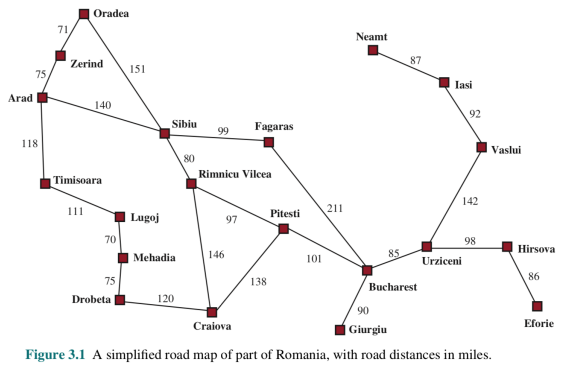

Very convenient way to view search problems as graph search problems.

- States -> Nodes
- Actions -> Successors
- Initial State -> Starting node
- Goal Formulation -> specify which nodes in the graph are a solution
- Specification of the search costs -> cost of the path as the sum of the costs of the traversed arcs

### Important concepts

- **Node expansion**: Generating all successor nodes considering the available actions
- **explored nodes**: nodes that have already been expanded
- **Frontier/fringe**: set of all nodes available for expansion
- **Search strategy**: defines which node is expanded next 

**A complete search algorithm will return a solution if there is one.**

### Depth-First Search (DFS)

- **Time complexity**
  - It is possible that the algorithm has to go through the entire tree to get to the solution so $O(b^m)$
- **Space complexity**-how much space does the fringe take
  - Only has siblings on path to root, so $O(b.m)$

- **Is it complete?**
  - m could infinite so only if we prevent cycles
- **Is it optimal?**
  - No, it find the leftmost solution which isn't necessarily the best solution

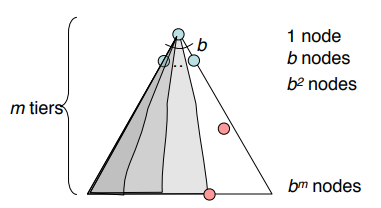

### Breadth-First Search (BFS)

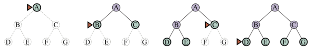

- **Time Complexity**
  - Processes all nodes above the shallowest solution so $O(b^s)$, $s$ = depth of shallowest solution
- **Space Complexity**
  - Roughly the last tier it is on so $O(b^s)$
- **Complete?**
  - Yes
- **Optimal?**
  - Yes

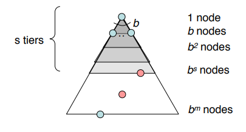

### BFS vs DFS

**BFS** is useful when

- space is not a problem since $O(b^s)$
- you want a solution containing the fewest arcs (in other words, the best solution)

**DFS** is useful when

- space is restricted since $O(b.m)$
- many solution exist, solutions are long
- you can order solutions so that you do not enter long or infinite paths.

But can we do better? Yes

### Iterative Deepening

Get **DFS's** space advantage with **BFS's** time/ shallow-solution advantages.

So how does it work?

We run the DFS algorithm but with a depth limit which we will increment when we find no solution and then run the DFS algorithm again.

**Isn't that redundant?**

Generally most work happens in the lowest level searched, so not so bad!

What we get is an algorithm that gives us the best solution like DFS but without the huge fringe because the fringe is discarded after every iteration.

https://www.youtube.com/watch?v=Y85ECk_H3h4

- **Time Complexity**
  - Same as BFS so $O(b^s)$
- **Space Complexity**
  - The same as DFS (but only to the level of the first solution), thus $O(b.s)$
- **Complete?**
  - Yes
- **Optimal?**
  - Yes

Iterative deepening combines the advantages of BDS with those of DFS

- Memory efficient (**DFS**)
- Complete, optimal and time complexity of **BFS**

### Bi-Directional Search

 Bi-directional search is a algorithm that starts working from the start state and at the goal state at the same time, working it's way to each other. The algorithm stops when both searches meet in the middle. Can lead to finding a solution more quickly.

Bi-directional search itself uses BDS for both sides.

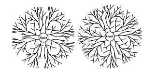

- **Time Complexity**

  - $2\times O(b^{s/2})$ 

- **Space Complexity**

  - $2\times O(b^{s/2})$ 

- **Complete?**

  - Yes

- **Optimal?**

  - Yes

  

### Cost-Sensitive Search

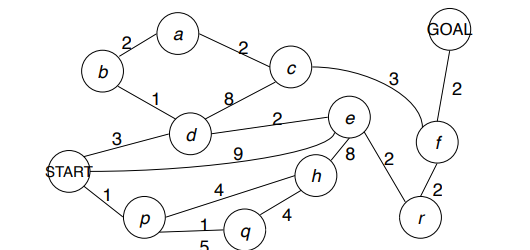

#### Uniform Cost Search (UCS)

This algorithm works by going through the graph and taking the shortest path first. It remembers where it has been and which paths are currently active. When it start at the root it will go to the node with the shortest path and will then check again what the shortest path is to take, it might have to backtrack because the first path it took plus paths that start at that node are larger then second path from the root. This will continue on until it reaches the goal and all other paths are larger than the path already found..

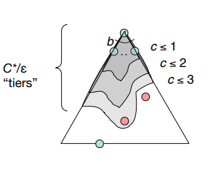

**Time Complexity:**

- $O(b^{C*/e})$ 
  - With C* being the cost of the solution
  - and the costs of the arcs being at least $e$

**Space Complexity**

- $O(b^{C*/e})$ 

**Complete?**

- Yes

**Optimal?**

- Yes

**Downsides?**

- Explores options in every direction
- No information about goal location

### Summary

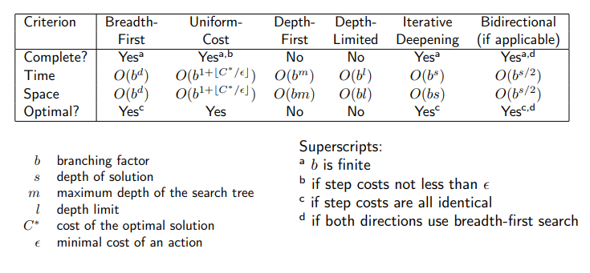

## Informed Search

**Example:** Heuristic function

Assign a value to each oath and try taking the shortest path each time.

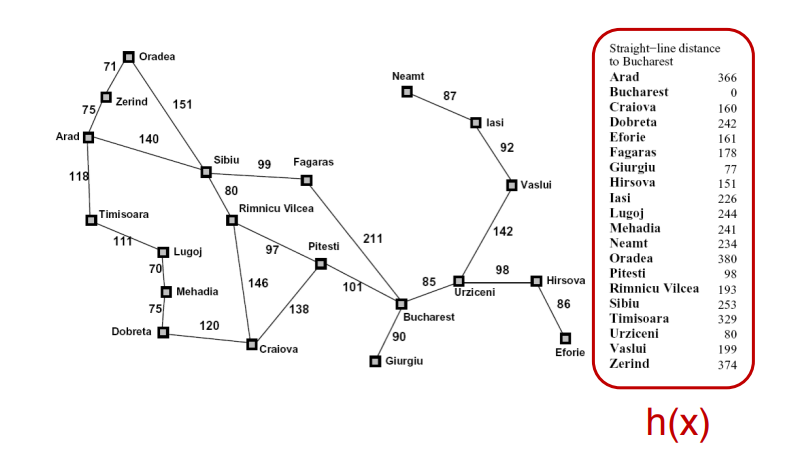

### Greedy Search

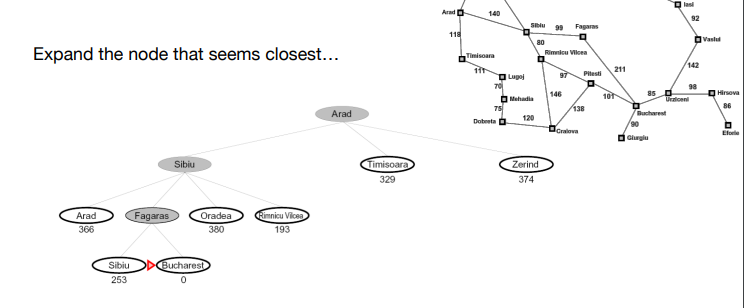

This algorithm always take the path is the most optimal at the time and not necessarily in general. This will allow it to find a solution fast but the solution might not be optimal.

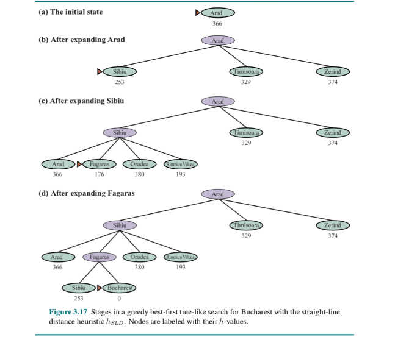

The algorithm works with a priority queue in its fringe, ordered by heuristic, that estimates distance to nearest goal for each state.

### Beam Search

Variant of greedy search and breadth first. Works just like breadth-first search but after every level, keep only the k best paths, prune away the others. Like greedy search, keep paths in an ordered priority queue but throw away bad paths. Still not optimal but more optimal

**Time Complexity**

If solution found $O(k.b.s)$, otherwise $O(k.b.m)$

**Space Complexity**

Queue always size k but expansion requires size $O(k.b)$

**Complete?**

no

**Optimal?**

no

## Advanced Informed Search

### Combining UCS and Greedy/A*

**Uniform-cost** orders by path cost, or backward cost **g(n)**

**Greedy** orders by goal proximity, or forward cost **h(n)**

This algorithm uses both. It orders the sum of: f(n) = g(n) + h(n). 

**Admissible heuristics (optimistic)**: heuristics that underestimate the actual cost

UCS + G is optimal and we can prove it but I'm not going to write that down.

UCS + greedy = A* without redundant path elimination

**Time Complexity**

Very dependent on heuristic but worst case h = 0 thus just like UCS

**Memory Complexity**

Worst case is when h=0, then like UCS

**Optimal?**

Yes

**Complete?**

yes

### A* with redundant path elimination

The change we made here is that we keep a set containing all the nodes we have already visited, if we get a node we have already seen, we simply skip this and take a different path. The problem we can get though is that we scrap a node while that path to the goal is through that node or a more optimal node was also using that node. This is because of a bad heuristic. If we have consistent heuristics then it would be safe to prune the new paths.

### Consistency of heuristics

**Main idea:**

estimated heuristic costs ≤ actual costs

h(A) ≤ actual cost from A to G

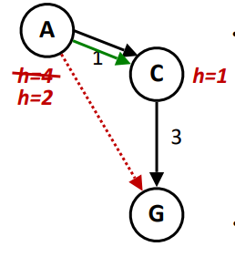

**Monotonicity:** The f value along a path never decreases

 h(A) ≤ cost(A to C) + h(C)

### Optimality

- Without redundant path elimination
  - UCS + Greedy is optimal if heuristic is admissible
- With redundant path elimination - CLOSED
  - A* is optimal if heuristic is consistent
- With redundant path elimination - Path Deletion
  - A* optimal if heuristic is admissible and solution cost C* is finite

### Iterative deepening A\*/IDA*

This works just like A* algorithm but with iterative deepening which means it will check each depth tier and restart the algorithm if it finds nothing but then goes 1 tier deeper.

**Time Complexity:**

$O(N^2)$

**Space Complexity:**

$O(b.(C*/e))$

**Complete?**

Yes

**Optimal?**

Yes

## Constraint Satisfaction Problems

### Constraint graphs

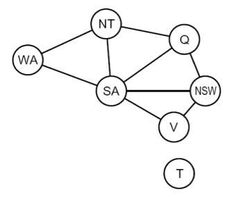

Binary CSP: each constraint relates (at most) two variables

- nodes are variables
- arcs show constraints

The rest of the chapter is pretty much useless

#### Forward Checking

Cross off values that violate a constraint when added to the existing assignment

#### Arc Consistency

A simple form of propagation makes sure all arcs are consistent.

## Version Spaces

Say we want to make a generalisation of when you have an allergy. In the table below are some example of when you did and when you didn't. Under which circumstances do I get an allergic reaction.

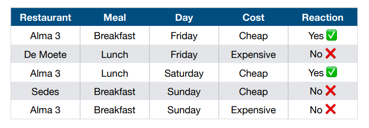

We could take the obvious and pick exactly the two positive ones. This is a bad choice because this does not generalise anything.

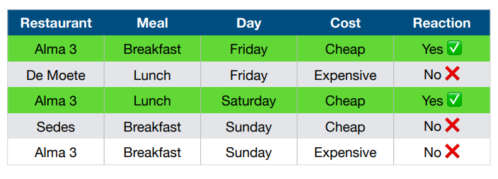

Just as bad would be saying anything except the negative ones

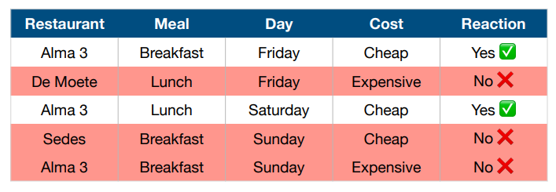

### Solution: Fix a language of hypothesis

We introduce a fixed language of concept descriptions

**= hypothesis space**

Every hypothesis is a 4-tuple:

- Most general hypothesis: [?,?,?,?]
- Maximally specific: example: [Sedes,Lunch, Monday, Cheap]
- Combinations of ? and values are allowed:
  - [De Moete, ?, ?, Expensive]

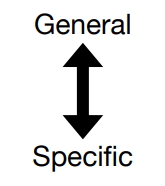

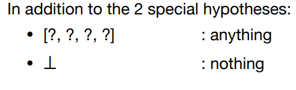

### Strings

- Each example is a string over an alphabet {a,b}
- Each hypothesis is a string
- hypothesis $h$ covers example $e$ if and only if $h$ is a substring of example $e$
- hypothesis $h_1$ is more general than $h_2$ if and only if $h_1$ is a substring of $h_2$ 

### Version spaces: the idea

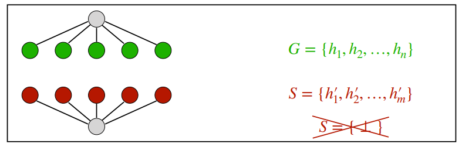

Replace the top hypothesis by all minimal specializations that do not cover the negative example

Replace the bottom hypothesis by all minimal specializations that do cover the positive example

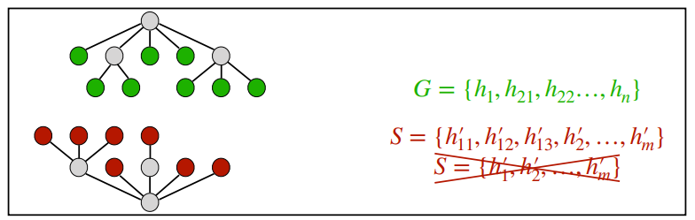

Replace all hypotheses in G that cover a next negative example by all minimal specializations that do not cover the negative example.

Replace all hypotheses in S that do not cover a next positive example by all minimal generalizations that do cover the example.

## Pattern Mining

**What?**

- Looking for "interesting" patterns in data
- data typically need not be divided into positive and negative class
- different types of data and patterns

 Powerpoint is actually useless

**TODO**

## Automated Reasoning

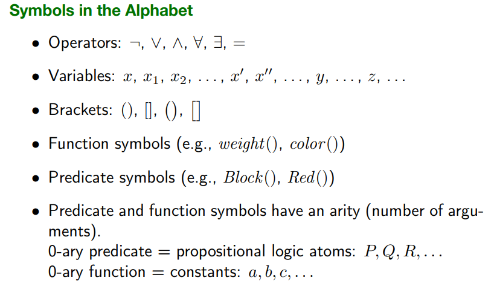