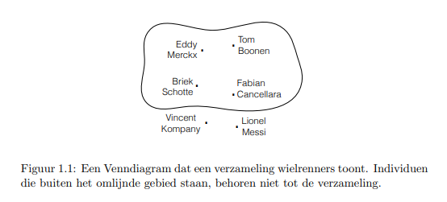
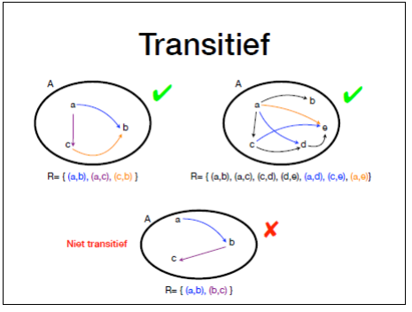

# Bewijzen en Redeneren Samenvatting

## Hfst 1: Verzamelingen

### 1.1 Verzameling

Een verzameling is een object dat een groep individuen als geheel aanduidt. De individuen die deel uitmaken van een verzameling worden de elementen van die verzameling genoemd ->

**Voorbeeld:**

- {Eddy Merckx, Briek Schotte, Tom Boonen} is een verzameling bekende Belgische wielrenners
- {1, 2, 3, 4, 5} is de verzameling gehele getallen tussen 1 en 5.

#### 1.1.2 Omschrijving

In plaats van alle elementen op te sommen, kunnen we ze ook omschrijven.

**Voorbeeld:**

- De verzameling klinkers uit ons alfabet.
- De verzameling getallen tussen 1 en 100.

Dit kunnen we ook doen op  een wiskundige manier:

​	*{x | x is een geheel getal tussen 1 en 100}*

#### 1.1.3 Venn-diagrammen

#### 1.1.4 Formele notatie

### 1.2 Enkele speciale gevallen

#### 1.2.1 Lege verzameling

De verzameling die geen enkel element bevat. We gebruiken het symbool ∅ om die speciale verzameling aan te duiden.

#### 1.2.2 Singletons en paren

Een verzameling met 1 element wordt een singleton genoemd. Een paar is een verzameling met 2 elementen.

**Voorbeeld 1.2:** De bewering 3 $\in$ {3} is waar. 3 $\in$ 3 daarentegen heeft geen betekenis. De bewering $2\times3=6$ is waar, maar $2\times{3}$ is niet gedefinieerd.

#### 1.2.3 Oneindige verzamelingen

Sommige verzamelingen hebben de eigenschap dat, als je alle elementen een na een zou opsommen, er geen einde komt aan die opsomming.

**Voorbeeld:** Iemand vraagt om alle natuurlijke getallen op te sommen: 1, 2, 3, 4, 5, . . . , 35081, 35082, . . . , 672448196739134293, . . . Het is duidelijk dat er nooit een einde komt aan die opsomming: er bestaat immers geen “laatste getal”, een getal waarbij je kunt zeggen “en nu ben ik klaar, er bestaan geen grotere getallen meer”. 

#### 1.2.4 Andere bijzondere verzamelingen

$\N$ = {0,1,2,3,4,...} **(Natuurlijke getallen)**

$\Z$ = {0,1,-1,2,-2,3,-3} **Gehele getallen**

$\Q$ = {$\frac{x}y|x,y \in \Z,y\ne0$}. **Rationale getallen**

$\R$ = alle reële getallen

### 1.3 Deelverzameling

**Definitie:** Een verzameling A is een deelverzameling van een verzameling B als en slechts als elk element van A ook voorkomt in B.

De bewering “A is een deelverzameling van B” noteren we kort als **A ⊆ B.**

Als we uitdrukkelijk willen aangeven dat A een deelverzameling is van B, maar niet eraan gelijk, dan zeggen we dat A een strikte deelverzameling van B is. Dat noteren we als **A ⊂ B**.

### 1.4 Operaties op verzamelingen

#### 1.4.1 Doorsnede

Zij A en B twee verzamelingen. De doorsnede van A en B is de verzameling die alle elementen bevat die zowel in A als in B zitten, en geen andere. Met andere woorden, het is de verzameling die alle elementen bevat die zowel in A als in B zitten, en geen andere. Met andere woorden, het is de verzameling **{x|x$\in$ A en x $\in $ B}**. We noteren die als $A ∩ B$

--> Triviaal

Wanneer de doorsnede van twee verzamelingen leeg is, worden de 

#### 1.4.2 Unie of Vereniging

De unie of vereniging van twee verzamelingen A en B is de verzameling die alle elementen van A bevat, alle elementen van B, en geen andere.

**A ∪ B**

--> triviaal

#### 1.4.3 Verschil

Het verschil van twee verzamelingen A en B, is de verzameling van alle elementen van A die niet in B voorkomen. De bewerking die het berekenen van het verschil voorstelt, noteren we als \\. We schrijven **A\B** om het verschil van A en B voor te stellen. We spreken dit ook uit als "A zonder B".

#### 1.4.4 Symmetrisch verschil

Het symmetrisch verschil van twee verzamelingen A en B is de verzameling van alle elementen die in de ene verzameling maar niet in de andere voorkomen. De verzameling bevat dus alle elementen in **A\B**, maar ook die in **B\A**. We noteren dit als A ∆ B.

A∆B = (A \ B) ∪ (B \ A)

#### 1.4.5 Complement

Het complement van een verzameling van A, genoteerd **A^c^**, is de verzameling van alle individuen die geen element zijn van A.

#### 1.4.6 Venn-diagrammen

#### 1.4.7 Samenvatting

### 1.5 Complexe uitdrukkingen

Operaties op meer dan twee verzamelingen.

Volgorden van bewerkingen:

- Haakjes
- Complement-operator
- Doorsnede, unie en (symmetrisch) verschil, van links naar rechts

**Equivalent (⇔)** = uitdrukkingen die hetzelfde resultaat geven.

### 1.6 Enkele Rekenregels

#### 1.6.8 De wetten van de Morgan

Het complement van de unie is de doorsnede van de complementen:

​				$(𝐴 ∪ 𝐵)^𝑐 = 𝐴^𝑐 ∩ 𝐵^𝑐$

Het complement van de doorsnede is de unie van de complementen:

​				 $(𝐴 ∩ 𝐵)^𝑐 = 𝐴^𝑐 ∪ 𝐵^𝑐$

#### 1.6.9 Meerdere keren dezelfde verzameling

- $(𝐴 ∪ 𝐵) ∪ 𝐵 = A ∪ B$
- $(𝐴 ∩ 𝐵) ∩ 𝐵 = A ∩ 𝐵$
- $(𝐴 ∖ 𝐵) ∖ 𝐵 = 𝐴 ∖ 𝐵$

### 2 Precieze Uitspraken Formuleren

Aangezien het soms moeilijk is om iets in het nederlands duidelijk uit te drukken, wordt er in de wiskunde gewerkt met symbolen. De betekenis van elk symbool wordt op voorhand vastgelegd

#### 2.2 Beweringen

Een bewering of propositie is een uitspraak die waar of onwaar kan zijn.

- Die fles is leeg			Hangt af van de situatie -> Niet precies genoeg
- Er zijn geen even priemgetallen			Onwaar

P en Q worden vaak gebruikt als algemene naam. Indien er symbolen worden gebruikt, dan worden de uitdrukking logische formules genoemd.

#### 2.3 Conjunctie

$P∧ B $

#### 2.4 Disjunctie

$P ∨ Q$

#### 2.5 Ontkenning

$¬P$

#### 2.6 Implicatie

$P ⇒ 𝑄$

**Modus ponens:** Als $P$ waar is, en $P ⇒ Q$ is waar, dan is $Q$ waar

**Modus tollens:** Als $Q$ onwaar is, en $P ⇒ Q$ is waar, dan is $P$ onwaar.

#### 2.7 Equivalentie

Zij P en Q twee beweringen. De bewering "P is equivalent met Q" is waar als en slechts als het zo is dat, wanneer P waar is, Q ook waar is, en wanneer P niet waar is, ook Q niet waar; of nog P en Q steeds tegelijk waar of niet waar.

$P ⇔ Q$

#### 2.8 Complexe beweringen

Volgorde van operatoren: 

- Haakjes
-  ¬ 
- ∧ 
- ∨ 
-  ⇒,⇔

#### 2.9 Waarheidstabellen

Een **tautologie** is een formule waarvoor de waarheidstabel op elke lijn "waar" bevat

Een **Contradictie** is een formule die logisch equivalent is met "onwaar"

#### 2.10.3 Precies 1 element

$∃! x ∈ 𝑆 : P$

#### 2.10.4 Geen enkel element

- $∄𝑥 ∈ 𝑆 : P$
- $¬(∃𝑥 ∈ 𝑆 :𝑃)$
- $∀𝑥 ∈ 𝑆 : ¬𝑃$

#### 2.10.5 Meerdere kwantificaties

#### 2.13 Samenvatting notatie

#### 2.14 Logische Rekenregels

## 4 Bewijstechnieken

### 4.2 Bewijzen door vaststelling

#### 4.2.1 Bewijs door vaststelling

In sommige gevallen kunnen we de correctheid van een bewering simpelweg vaststellen, zonder een redering op te zetten. Bijvoorbeeld: we kunnen bewijzen dat twee formules logisch equivalent zijn door gewoon hun waarheidstabellen op te stellen, en vast te stellen dat ze gelijk zijn. Volgende de definitie van logisch equivalentie betekent dat dan dat de formules logisch equivalent zijn.

=> Waarheidstabel maken en gebruiken

#### 4.2.2 Bewijs door constructie

Bewijs door middel van een voorbeeld. Bijvoorbeeld:

**Stelling:** Er bestaat een getal dat deelbaar is door 5 en door 2.

Bewijs. 10 is zo'n getal: het is gelijk aan $5\times2$, dus deelbaar door 5 en deelbaar door 2.

#### 4.2.3 Bewijs door tekening

Bij een bewijs door tekening wordt het bestaan van een bepaald soort object, de equivalentie van 2 beweringen, of een andere eigenschap via een tekening vastgesteld. Dit kan door middel van een Venn-diagram

#### 4.3.1 Bewijs door middel van substitutie

Soms kan een deel van een uidrukking vervangen worden door iets anders, zonder dat dit de waarde van de uitdrukking verandert. Dit noemen we substitutie.

**Regel 1:** Een universeel gekwantificeerde variabele vervangen door een uitdrukking. 

**Voorbeeld:** We weten dat $(X \cup Y )^c = X^c ∩ Y^c  $. Stel dat $X = A^c$ en $Y = B^c$, voor verzamelingen A en B. Als we dat invullen krijgen we $ (A^c ∪ B^c )^ c = (A^c ) ^c ∩ (B^c ) ^c$ en omdat  $(A^c ) ^c = A $ en $ (B^c )^ c = B$ bekomen we $(A^c ∪ B^c )^ c = A ∩ B$.

**Regel 2: Een uitdrukking vervangen door een equivalente uitdrukking**

Wanneer uitdrukking X equivalent is met uitdrukking Y, dan kunnen we in eender welk uitdrukking Z waarin X voorkomt, X vervangen door Y zonder dat dit de waarde van Z verandert.

**Voorbeeld met regel 1 en 2:**

#### 4.3.3 Modus ponens

**Modus ponens**: Als P waar is, en P ⇒ Q is waar, dan is Q waar.

**Voorbeeld:**

Alle mensen zijn sterfelijk. Socrates is een mens. Dus Socrates is sterfelijk

### 4.4 Bewijsstrategieën

#### 4.4.1 Ketens van (on)gelijkheden, implicaties, equivalenties

#### 4.4.2 Wederzijdse implicatie

Merk op: als P ⇒ Q en Q ⇒ P, dan geldt P ⇔ Q, en vice versa. Anders gezegd: P ⇔ Q is logisch equivalent met (P ⇒ Q) ∧ (Q ⇒ P).

#### Samenvatting rekenregels

#### 4.4.3 Inclusie en gelijkheid van verzamelingen

Soms moeten we bewijzen dat een verzameling een deelverzameling is van een andere verzameling. Dit kunnen we doen door een willekeurig element van A te kiezen en een logische redenering te vormen die uitkomt bij de conclusie dat x$\in$B. Als die redenering geldt voor eender welk, willekeurig gekozen, element van A, geldt ze voor alle elementen van A.+

#### 4.4.4 Herhaalde gevolgtrekking

We beginnen met iets waarvan we al weten dat het waar is. In de volgende stap combineren we die met iets waarvan we weten dat het waar is. In een redenering zetten we vaak meerdere afleidingsstappen na elkaar. Bij elke stap is het belangrijk om die te verantwoorden, d.w.z om duidelijk te maken waarom die stap gemaakt kan worden.

### 4.5 Gevalsonderscheid

Soms is het moeilijk om een bewijs te vinden dat onder alle omstandigheden werkt. In zo'n geval splitsen we het probleem op in kleinere delen die we apart behandelen.

### 4.6 Implicaties bewijzen

Stel we moeten bewijzen dat P ⇒ Q.

### 4.7 Bewijs uit het ongerijmde

Een bewijs uit het ongerijmde wordt ook wel een bewijs door contradictie genoemd. Om te bewijzen dat P waar is, gaan we uit van de tegengestelde bewering: "P is niet waar", ¬P. Daarvan leiden we nieuwe beweringen af tot we tot een bewering komen die evident onmogelijk is (een contradictie).

### 4.8 Bewijs door inductie

## 5 Relaties

### 5.1 Koppels en Tupels 

**Definitie 5.1**. Gegeven n objecten 𝑥~1~, 𝑥~2~, … , 𝑥~𝑛~, is “het tupel met als componenten 𝑥~1~, 𝑥~2~, … , 𝑥~𝑛~” een nieuw object, dat genoteerd wordt als (𝑥~1~, 𝑥~2~, … , 𝑥~𝑛~ ). Een tupel met twee componenten wordt gewoonlijk een koppel genoemd.

### 5.2 Cartesisch Product van Twee verzamelingen

**Definitie 5.3.** Het Cartesisch product of productverzameling van twee verzamelingen A en B, genoteerd

​					$A × 𝐵$, is $A × 𝐵 = \{(x, y) | x ∈ 𝐴 ∧ 𝑦 ∈ 𝐵\} $ 

### 5.3 Relaties

#### 5.3.1 Relatie

Het concept "relatie" wordt gebruikt om een verband tussen twee of meer dingen aan te geven.

**Voorbeeld:**

- Een fiets heeft twee wielen -> Relatie: "... heeft ... wielen"
- (fiets,2),(auto,4),...

**Defintie 5.6** Een relatie tussen A en B is een deelverzameling van $A\times B$

#### 5.3.2 Grafisch

### 5.4 Inverse relatie

**Definitie 5.8** Zij R een binaire relatie. De inverse relatie van R, genoteerd R^-1^, is gedefinieerd als volgt:		$𝑅^{−1} = \{(x, y) | (y, x) ∈ 𝑅\}.$

### 5.5 Samengestelde Relatie

Beschouw de volgende twee relaties tussen de natuurlijke getallen $\N$ en zichzelf:

Dan is hun samengestelde relatie

## 6 Functies

#### 6.1 Functies

**Definitie 6.1** Een relatie $R ⊆ A × B$ is een functie van A naar B als en slechts als voor elke $ x ∈ A$ hoogstens 1 $(x,y) \in R$ bestaat. y wordt het beeld van x onder de functie genoemd. A wordt de bronverzameling (soms domein) genoemd en B de doelverzameling (soms co-domein) van de functie

​							$∀𝑥 ∈ 𝐴: (𝑥, 𝑦) ∈ 𝑅 ∧ (𝑥, 𝑦 ′ ) ∈ 𝑅 ⇒ 𝑦 = y'$

#### 6.2 Afbeeldingen en bijecties

**Definitie 6.3** Een functie f:A->B is een afbeelding van A naar B als en slechts als voor elke $x \in A$ precies 1 $(x,y) \in f$ bestaat.

**Definitie 6.4** Een afbeelding f:A -> B is een surjectie als en slechts als elke $y\in B$ het beeld is van een $x \in A$.

**Definitie 6.5** Een afbeelding f:A -> B is een injectie als en slechts als elke $x\in A$ op een verschillende $y\in B$ afgebeeld wordt. Met andere woorden: $x ≠ 𝑥 ′ ⇒ 𝑓(𝑥) ≠ 𝑓(𝑥 ′ ).$

#### Samenvatting

**Definitie 6.7** Een functie f:A -> A is een transformatie als en slechts als elke $x \in A$ een beeld heeft onder f.

**Definitie 6.8** Een functie f:A -> A is een permutatie als en slechts als elke $x \in A$ een beeld heeft onder f, en ook precies 1 keer het beeld is van een x onder f.

### 6.3 Functies met meerdere argumenten

n f(x) wordt x het argument van de functie genoemd. Binaire relaties geven aanleiding tot functies met één argument. We kunnen ook functies met meerdere argumenten definiëren, op basis van ternaire of, algemener, n-aire relaties.

## 7 Equivalente en Orderelaties

### 7.1 Binaire relaties over dezelfde verzameling

In deze sectie focussen we op binaire relaties over 1 en dezelfde verzameling

#### 7.1.1 Reflexiviteit

**Definitie 7.1** Een relatie $R ⊆ 𝐴 × A$ is **reflexief** als en slechts als 

​									$∀𝑥 ∈ 𝐴 : (𝑥, 𝑥) ∈ R$

**Definitie 7.2** Een relatie $R ⊆ 𝐴 × A$ is **anti-reflexief** als en slechts als

​									$∀𝑥 ∈ 𝐴 : (𝑥, 𝑥) ∉ R$

#### 7.1.2 Symmetrie

**Definitie 7.3** Een relatie $R ⊆ 𝐴 × A$ is symmetrisch als en slechts als

​									$∀𝑥, y ∈ 𝐴 : (𝑥, 𝑦) ∈ 𝑅 ⇔ (𝑦, 𝑥) ∈ R$

Als (x,y) in de relatie zit dan zit (y,x) er ook in en omgekeerd.

**Definitie 7.4** Een relatie $R ⊆ 𝐴 × 𝐴$ is **antisymmetrisch** als en slechts als

​									$∀𝑥, y ∈ 𝐴: (𝑥, 𝑦) ∈ 𝑅 ∧ (𝑦, 𝑥) ∈ 𝑅 ⇒ 𝑥 = y$

Als een relatie antisymmetrisch is, betekent dit dat ofwel (x,y) in de relatie kan zitten, ofwel (y,x)

Merk op dat het perfect mogelijk is om een relatie te hebben die niet symmetrisch en ook niet antisymmetrisch is.

#### 7.1.3 Transitiviteit

**Definitie 7.5** Een relatie $R ⊆ 𝐴 × 𝐴$ is transitief als en slecht als

​										$∀𝑥, y, z ∈ 𝐴 : (𝑥, 𝑦) ∈ 𝑅 ∧ (𝑦, 𝑧) ∈ 𝑅 ⇒ (𝑥, 𝑧) ∈ R$

### 7.2 Equivalentierelaties

**Definitie 7.6** Een equivalentierelatie is een relatie die **reflexief, symmetrisch en transitief** is.

**Voorbeeld:** 

- =
- ⇔

Een partitie van een verzameling A is een opdeling van A in niet-lege deelverzamelingen, zo dat elk element in A in precies 1 van die deelverzamelingen zit.

**Voorbeeld**

- Zij A = {a,b,c,d,e,f,g,h,i,j}
  - {{a,b,c},{d,e},{f,g,h,i,k}} is een partitie van A
  - {{a,b}} is geen partitie van A

Met elke partitie van een verzameling A komt een equivalentierelatie overeen, en met elke equivalentierelatie een partitie.

### 7.3 Orderelaties

#### 7.3.1 Partiële en Totale ordes

**Definitie 7.10** Een orderelatie is een relatie die **reflexief, antisymmetrisch en transitief** is.

**Notatie:** 𝑥 ⪯ y. Uitgesproken als "x komt voor of is gelijk aan y"

**Definitie 7.11** Een totale orde is een orderelatie waarvoor geldt dat $∀𝑥, 𝑦 ∶ 𝑥 ⪯ 𝑦 ∨ 𝑦 ⪯ x$

**Partiële orde** = een orderelatie die niet totaal is.

#### 7.3.2 Boven-en Ondergrenzen

**Definitie 7.12** We noemen a $\in$ A een **bovengrens** voor X als en slechts als $∀𝑥 ∈ 𝑋 ∶ 𝑥 ⪯ a$, en een **ondergrens** voor X als en slechts als $∀𝑥 ∈ 𝑋 ∶ 𝑎 ⪯ 𝑥$.

**Definitie 7.13** Zij X een deelverzameling van een geordende verzameling 𝐴, ⪯. Als er een bovengrens b van X bestaat zodat 𝑏 ⪯ 𝑏 ′ voor alle bovengrenzen b' van X, dan zeggen we dat b het supremum van x is.

Met andere woorden: het **supremum** van x is de **kleinste bovengrens** voor X, als die bestaat. Het supremum is steeds uniek.

**Definitie 7.14** Zij X een deelverzameling van een geordende verzameling 𝐴, ⪯. Als er een ondergrens o van X bestaat zodat 𝑜 ′ ⪯ o voor alle ondergrenzen o' van X, dan zeggen we dat o het **infimum** van X is.

Met andere woorden: het **infimum** van X is de **grootste ondergrens** voor X, als die bestaat. Het infimum is steeds uniek.

#### 7.3.3 Tralies

**Definitie 7.15** Een **complete tralie** is een geordende verzameling 𝐴, ⪯ met de eigenschap dat elke eindige verzameling **𝑋 ⊆ A** een supremum en infimum in A heeft.

**Stelling 7.4** Voor eender welke verzameling U geldt:  𝒫(𝑈), ⊆ is een complete tralie.

### 7.4 Quasi-ordes

**Definitie 7.16** Een **quasi-orde** is een relatie die reflexief en transitief is.

## 8 Kardinaliteit

### 8.1 Kardinaliteit van een verzameling

**Definitie 8.1** De kardinaliteit van een verzameling is het aantal elementen dat de verzameling bevat. De kardinaliteit van S wordt genoteerd als |S| of #S

De kardinaliteit van een verzameling is gewoon het aantal elementen in de verzameling.

**Voorbeeld:**

Kardinaalgetaal voor $\N$:  ℵ~0~

**Axioma 8.1.** Zij A en B twee verzamelingen

- |𝐴| ≤ |𝐵| als en slechts als er een injectie van A naar B bestaat. 
- |𝐴| = |𝐵| als en slechts als er een bijectie tussen A en B bestaat.

### 8.2 Telproblemen

Het volgende is enkel van toepassing op eindige verzamelingen

#### 8.2.1 Kardinaliteit van de unie

Als 2 verzamelingen disjunct zijn dan is hun doorsnede de lege verzameling.

**Stelling 8.1** Als A en B disjunct zijn, geldt $|𝐴 ∪ 𝐵| = |𝐴| + |𝐵|$

**Stelling 8.2** $|𝐴 ∪ 𝐵| = |𝐴| + |𝐵| − |𝐴 ∩ 𝐵| .$

**Stelling 8.3** $ |𝐴 ∪ 𝐵 ∪ 𝐶| = |𝐴| + |𝐵| + |𝐶| − |𝐴 ∩ 𝐵| − |𝐴 ∩ 𝐶| − |𝐵 ∩ 𝐶| + |𝐴 ∩ 𝐵 ∩ 𝐶|$

#### 8.2.2. Kardinaliteit van het Cartesisch Product

**Stelling 8.4** $|𝐴 × 𝐵| = |𝐴| ~ . |𝐵|$ 

M.a.w. De kardinaliteit van de productverzameling is het product van de kardinaliteiten.

**Stelling 8.5** $. |𝐴1| × |𝐴2| × … × |𝐴𝑘 | = |𝐴1 | ⋅ |𝐴2 | ⋅ … ⋅ |𝐴𝑘 |$

**Gevolg 8.1** $|𝐴^𝑘 | = |𝐴|^ 𝑘$

#### 8.2.3 Kardinaliteit van de machtsverzameling

**Stelling 8.6** $|𝒫(𝐴)| = 2^{|𝐴|}$

Dit is de reden waarom de notatie 2^A^ wordt gebruikt

#### 8.2.4 Aantal afbeeldingen van A naar B

**Stelling 8.7.** $|𝐵^𝐴| = |𝐵|^{|𝐴|}$

#### 8.2.5 Aantal injecties van A naar B

**Stelling 8.8** Zij A en B twee verzamelingen met kardinaliteit m en n, en  𝑚 ≤ n. Het aantal injecties van A naar B gelijk aan n.(n-1).(n-2)...(n-m+1), of , korter geschreven $\frac{n!}{(n-m)!}$

#### 8.2.6 Aantal bijecties tussen A en B

Als A en B niet evenveel elementen hebben -> geen bijectie -> kardinaliteit 0.

**Stelling 8.9** Zij A en B twee verzamelingen met kardinaliteit n. Dan is het aantal bijecties tussen A en B gelijk aan n!

#### 8.2.7 Aantal volgordes waarin de elementen van een verzameling opgelijst kunnen worden.

Het aantal volgordes waarin de elementen van een verzameling opgelijst kunnen worden, wordt ook wel het aantal **permutaties** van de verzameling genoemd -> = n!

#### 8.2.8 Aantal deelverzamelingen van grootte m van een verzameling met kardinaliteit n

**Definitie 8.3** Een combinatie van m elementen uit een verzameling A is een deelverzameling van A met m elementen.

**Stelling 8.10** Zij A een verzameling met kardinaliteit n. Dan is het aantal combinaties van m elementen uit A gelijk aan $\frac{n!}{m!(n-m)!}$

**Definitie 8.4** De binomiaalcoefficient ($n \atop m$ ) wordt gedefinieerd als ($n \atop m$) = $\frac{n!}{m!(n-m)!}$ = $C^m_n$

### 8.3 Kardinaliteit van oneindige verzamelingen

#### 8.3.1 Kardinaliteit van $\N$

Zoals eerder gezegd:  |$\N$| = ℵ~0~

#### 8.3.2 Kardinaliteit van $\Z$

**Stelling 8.12**:  |$\Z$| = ℵ~0~

#### 8.3.2 Kardinaliteit van $\Q$

**Stelling 8.13:  |$\Q$| = ℵ~0~

#### 8.3.2 Kardinaliteit van $\R$

**Stelling 8.14**: Er bestaat geen bijectie tussen $\R$ en $\N$

-> $|\R| \ne ℵ_0$

#### 8.3.5 Rekenen met oneindige kardinaalgetallen

$A^c\cup B=\left(A\setminus B\right)^c                        A\setminus B=A\cap B^c =\left(A\cap B^c\right)^c                                De Morgan =A^c\cup\left(B^c\right)^c                                \left(A^c\right)^c=A =A^c\cup B $