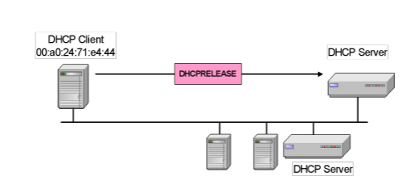

# Computer Networks

Quick refresher

## Chapter 1 Application Layer

### RFC

RFC (Request for comments) is a memo published by the **IETF** (Internet Engineering Task Force). Not really a request for comments but a politically correct way of publishing.

### Telnet

telnet is a command line interface for communication with a remote device or server. Telnet stands for teletype network. 

Telnet can be used to

- Connect to a remote server or device and give commands just like you would be physically sitting in front of the computer
- Manage and configure network devices such a routers and switches
- Check if ports are open and closed on a server.

Telnet is sent in clear text so there is no encryption, if would use it today anyone could grab your data your sending. It should not be used over the public internet. Telnet itself runs on port 23

### File Transfer Protocol (FTP)

Designed to transfer files and navigate directory listings.

Used two TCP port:

- 21 for control
- 20 for data transfers

Control port uses Telnet protocol to negotiate session

### Architectural View of the WWW

**Quick refresher for some important parts:**

- Clients use web browsers and **HTTP** to retrieve **HTML** files or web pages that are stored on servers at a specified URI.
- Caches improve performance by locally storing the results of client requests. the cache will serve repeat request rather than downloading material again from the servers.

### Uniform Resource Identifiers (URIs)

Web resources need a human-readable identifier in order to support easy retrieval -> **URI**

Most popular form of a **URI** is the **Uniform Resource Locator (URL):**

### HyperText Markup Language (HTML)

- HyperText Markup Language is a subset of Standardized General Markup Language (SGML)
- Documents use elements to “mark up” or identify sections of text for different purposes or display characteristics.
- Mark up elements are not seen by the user when page is rendered by the web browser.

### Hypertext Transfer Protocol (HTTP)

- The **Hyper Text Transfer Protocol (HTTP)** supports client-server communication using a simple request/response protocol
- It is an application-layer protocol, that operates over **TCP on port 80**
- The protocol is connectionless or stateless and has no notion of session.

#### **HTTP 1.0/1.1 Commands**

PUT -> create new resource or overwrite it

POST -> update existing resource

#### **Inefficiency in HTTP 1.0**

- Each web page contains an average of 40 embedded object(images, audio, video).
- Opening a TCP connection for each object is inefficient, requiring 1 round trip per object
- **TCP** congestion algorithm slowly increases speed, so transfer rate is slower on new connections.

#### **HTTP 1.1 VS HTTP 1.0**

#### Pipelining in HTTP1.1

### Simple Mail Transfer Protocol (SMTP)

Email as we know it today separates email exchange into two parts:

- **Mail submission and delivery protocols**, which allow clients to connect to the mail server
- **Mail transfer protocol** which allows mail servers to communicate

$\xrightarrow{}$ This specialization allows us flexible access to email, while ensuring standard communication

#### The Architecture Of Email

#### Message Format

#### Interaction in command/response mode

**Three phases:**

1. Handshaking
2. Transfer of messages
3. Closure

### Post Office Protocol (POP)

- A mechanism used by mail clients to talk to mail servers
- A simple **unsynchronized** protocol, difficult to manage on multiple machines.

### Internet Message Access Protocol (IMAP)

- Another mechanism for mail clients to communicate with mail servers.
- All folders (inbox, outbox, drafts, etc...) are **synchronized** on the client and the server.
- Better suited because we use a lot of different devices but higher overhead.

### Web-mail Over HTTP

- In this case the web browser is the mail client
- No need for **synchronization** as all files are stored on the server.
- **Lightweight** and allows use on multiple devices, but **requires a consistent Internet connection**

### Dynamic Host Configuration Protocol (DHCP)

**Provides automated assignment of IP addresses:**

- IP addresses are assigned on-demand
- Avoid manual IP configuration
- Supports the mobility of a lot of smaller devices

**USES UDP** 

**HA MEMES**

#### Verschil tussen UDP en TCP

Als ge u afvroeg wat het verschil is tussen het virgin UDP protocol en het CHAD TCP protocol kijk dan hieronder.

![L'histoire de GigaChad, l'ultra-masculin mi-mème, mi-légende urbaine](data:image/jpeg;base64,/9j/4AAQSkZJRgABAQAAAQABAAD/2wCEAAkGBxIPEA8PDw0PDw8PDw8PDw8NDw8QDxAOFREWFhURFRUYHSggGBolGxUVITEhJSkrLi4uFx81ODMsNygtLisBCgoKBQUFDgUFDisZExkrKysrKysrKysrKysrKysrKysrKysrKysrKysrKysrKysrKysrKysrKysrKysrKysrK//AABEIAKgBKwMBIgACEQEDEQH/xAAcAAADAAMBAQEAAAAAAAAAAAAAAQIDBQYHBAj/xAA7EAACAgEDAQQIAgkDBQAAAAAAAQIRAwQSITEFQVFhBhMiMnGBkaEHsRQjQlJicsHh8BUk0TOCkrLx/8QAFAEBAAAAAAAAAAAAAAAAAAAAAP/EABQRAQAAAAAAAAAAAAAAAAAAAAD/2gAMAwEAAhEDEQA/ANkOh0OgIAqgoBUIuhUBKQ6KodASBVBQE0BVBQEUMqgoBJDodAAFJBRaQE0UkNIugJSKURpFUBNBRVDUQJodFbSqAhIe0tRHQEKI6KoraBj2ioy7Q2gQohRaQ9oGPaLaZdonEDFtDaZKCgNYBdCAihobQUAhUVQgAB0FAICgoCQKCgJGkMdAaztvtNaaG6lKcrUYt0vOTfgjhv0/U58jlPVSjHujjlKMfDiKrx/ubT001O2edyhKSjDFihtdVa3ybfcvbivkjmuw9TLO3jwwgpwTmrqmop307+n0A6/Sz1GHH67FqXmUbcsWW3GUe9J9zOm7H7Sx6rEsuN+UovrCffF/U4PsDtzNmuGST2p7diwxSa6NPlS+i4Og9FsXqtZqcab2zxQyJPxjKrfnU6vyQHV0UgSKSASRSQ0igJSHQ6KSAlIaRdDSAlIdFUOgI2jougoCaCikhgTQ6KoKAihNGSg2gY6CjJtCgNQxUMAFQDABNCooKAVBQwAW0KKoKAmh0OgoCUilEdFJAcN6e6dv1m1qtuKco+PE039Ix+nkcb6PdpY9NNzUbyO7u0tu1qMb55t307juvxHwNYo5U2ltlje3rfWvPjd/jPMtHl9XfEZNPpKClx3NWmvsB2WDtxRz4s08W2EqUnF7lGbXffVX3pfI3fZGvjk1ProY5K/U441Tlsc3vb8Y1t+3gcP2nro5YY36hLLCO6WR44Q9lO6Sikn3HQ/hrqHPUKFbtuNuUv3EopL/ADyYHpyRSQJFJACQ6GkVQCSGkNIpIBUNIaGkAqGkNIaAEgoYUAqCiqHQE0Oh0OgJoKKoNoE0FFbQ2gaQBpDAmhUVQUBNAVQUBNFUFDAVBQ6AAAdDoCSkgSKSA+DtrsuOrwzwTbjupxkkrjJdGvv9WeLdpaeWn3YpKpRltckntml0a8OD3fLkjCLlOSjGKttnmPpLKMcrzU/VZr+SndMDioZZzWxJu+D0X0Lx/osVUbbW7I11cq6fCvyOL0uRQXDtvi66rxOv7G1PspcW1fzQHfYu08T/AG9r8Jpqv6H14s0J+7OMv5ZJnB6vI5SqDW5xXCfl4EYNXJSpuNxaVSu78vAD0VIdHNaf0k2SWKUHOVJqTlSr4v3jdYu0U+sJL4U0B9tAGOakri7RdAJIYDoBDQ0h0Ah0NIdAJIdDoEgFQ6GMBUFDoKAVBRVABoQKFQCAdBQCAdBQCQ6GCAKCigAVAOhpAJHx9rdpw0uNzly3xCN1b/4RXanaWPS43lyypLol70n4JHm/pV23+kyhKKaW11BvhR7r8WwPh9IfSXNqZ1GTfgopqMee5f1Fr9V/t8WF3OUYJSa5/wAZ8+nyNYpKkm5N2kk6pcfmYU9itt23+QHyZIyhse11Kvk+9G9x48ihGeGauuYytNfA+PW5k9jS73dd7rjgnT6x01fyA3Wg1U4++rb7/GzPqXz6yPP7y7/ijU6fUtm70/tJdU/FdQM2mz71Fru5Un+R0Wj7QVR5VNcq/kcjqMTx3KFOvej4+a8H5FYu0OGk/Br/AD7/ADA9C0+qUWpJ8cbl1tG5R57odc2ut+H0O27I1W+EYvicYr5x8QPtodFJAkAh0Oh0AhpAOgEOh0OgFQUWkFATQ0iqCgJoodABzwUMYEsBgAgHQUAqKAKAEh0A0AJDoEikBwXp/PdLGm/ZU7l4NJdDhMue25Pq3fh1Ot9LMryX/DkbfwfC/NHOdnaHfOcpe7iipNeMm6S+z+gGFPhXf/Jgy+073Mza2Vyf2PmXPeBWpvbG6dPu6hifHX5E5/d4btUY066gbDTSp9X8jedn5+VfwOZx5aNjoNcunnXXn6eAHU6+HrMb2+8l7L6NP496OS0eaWW3CLdK5Jd1/wDw3SzylGSjfuu2ua46mh9Gc7hOKTpyUo/Nd32YG/7I1u18ro6f9zt9Dq21GUXzHldPp8Dz2Ot3ZJ7Y1ufKSNp2N2q1LZLu4A9a0+RTjGa6SV/DyMhrfRzJuwvm6nJefKT/AKs2lAKgoqh0BNDoqgoBUNIaGkAqHQ6HQCQUVQ6AlIe0pIdAc0AkUkAqChjAmh0OgoBDHQAA0gQwAAGkB5r6W4fV558XCSa+Ku+PNM1XY+Zb54m1+sinH+KUb4+jb+RfpnrJvU5Un7KduL6eFnNPK37SbUou+Hyq715gbDteGyTXSz4Io+/Bqf0ySjlivWQjcZrjel4xXf8AD6HyahcuKq7ql3+doD5tRPik+fIxY8zXWN/MzPFtdPr5MxwSXdfPeBmxzb52/c+vBBtrhK+9vhD0mlhkdJ1xx3G07NxKpR2xlXs7pe4v7gZMDUYSSytuukE/uzmMWTZkdPpPcvjZ1ebG8SSUlsl0UI02/wDgj0W9Fv8AUMmeKl6vbjlNZGrSy/sJ+V9fJMDV6XN+tbVVdq+9PnvNp6u2sseOVup919TQajHPBkliyRcMuObhOElypLu/zyOh7HyuUKe1p8e7Tr5AejehGovfC+sVJfJ0/wA0dWkec+hGp26iEG/3oOvFp196PSAEMdDQEpDodDSASQx0MBUMdDoBJDSKSCgFQ6Gh0By6Q0IaAGCGAAAAA0MSGADQhoAoaGgA8o9Muz3HWZIte+t0PNPk5CS2S6eTR6x6eaNTenyV+1LHa68p192eW6ziTUrTTfP9AJ7Llt1OFq/+oo8eEvZ/r9ja67FtzTbj70edq/aT4f36l+gXZ71GvwXHdHHJTk+5Rgm/zSXzMva+eOPVzjdxanCD602+H/QDn8kpN+635+KMMU22qrxs+6eRbuXyuOpgzSW66+982B9+g7Py2nGpX05NjpMElJ75ptS9nHG/al5vwNbodfKMl3UqXmbbQTi5O17XKcrdrnp5cgZe0puKXPXq49HLpXwSPVPRDsVaPTQhS9ZNLJlf8bXu/BdPr4nB9m9lrPq9Ljl7kcm6S/hgnPb89vPxPVwOF/FvQ4HonnlDGtSsmHHiyVWSScvahfetm90/A4PsRbXG03Got+Uq5N7+MOrlPVabTW9mPB67b3OeSco38lj+7NB2ZKo2urdNeAG97Gzf7qMFxKWWCUvjJUz1+jy/0U0ccmtwSa6Nzfxgm1+SPUkgFQ0ikhAADoYCSGkNIpICUhpFBQCGh0ABQ6GAHKDQigAAGgEOh0AAA0FAFFUCGkAJFUCGB8Pa+j9dhlFe9Gpwvpvjyl8+nzPEe3sH6xtJuEuU+9eK+N8Hvh5/6U+ikoetyYkp4Zylk217WGb5f/a/HuA8/wDRbV5MOs07xy2v1u2/KScXa7+GzJ2k09R7XTerv4nx58MseRUpRmppwr96/ZaffzRtu0tH+snJtb6i26qLk43dfzJgfJr4xjNqMYrnwu0zDkltlxtVpdCNbNNp8u4p9a53cr5GDct9d3Hf3UwN7pdVFqTaXEXTrm6MvY+RKn0bf2vhmowSjtfHW657/wDKK0ie6Kcqvr/KvAD1X0Iw+t1Dyp3HDjaXP7c+F9tx3Z5H6N9ofouRPH3dY2/1kH1i/p8meqaTW48yTx5Iy9mMnFNboqXTdHquj6+AHi34qSf+qZbfCxafZXdD1a4/8t31Nf2bne6P8PD8Gn1RsvxVp9q5KT9nBp9/x2t/k4mq7Jhbvxav4WB6f+HunvLly90I7V195/2s71Gh9DdH6rSwtVLJeSXjz0+yX1N9EBgCHQCQ0h0NIASGkAwAB0OgFQ6GMBJDCgA5NFIQ0AUMAAAAAGhoAQDKJKApAAAA0IaA4z0y7DwYlHVRjtrInKCS2XTluX7r9np08jgc+rjKcZxakpQcXT6UuOvid5+Juu24YYopuTuTpXSaaXHjw/8AGeS0uu1+bjJqviBlz6edpKE+ibe1pK33t8LoYlppN3KeONrhPJFuq8I2zIslxmvWPakpO5N2ulcvzR8sMiUuX3Vck2/oB9mSow950ra/Zt/Pn7H1QyOLTxwxq4x9+Tk7rl9V3mrnJO0t3P7TjX3Z9nZmNbJ3y1KNVtuuj68d6+oG7wbpr2tRT8Ma2/8AtZ2H4d5I49W1Fyk8+PbclT9hSlRx+ij0UcTv97LG6fwNhptbl07ebFkjDLDHkcW0tu7Y4pff7Aaz0t7QWp7T12T9ne8UX19nEljv5uLfzN36E9lfpGoxwfML3z/ki7f1pL5nI6DFdNttytbru+U2348ntf4e9lLDpvXte3ndrxWJPhfN2/oB1kVSSSpJUkuiRSQIaAaKQhgBVCGAFCRQBQwRQCSAYAIRTADkhoAAYAAANAADBDABjAAKAAABoAA8i/EPU5Xrcqk1shGOOCj+7tUrfncn9TlYzhJ+2qf7ybUl8+8AAy6XSe1Lc04y2RjKuacr8OvCIzYIp3Dvb95q+rfcAAY4Yd3XHF+e4yXsdw44apuMouL4cWvAAA+rBqp/xRjS49Za+Sa6fM2WN+sTgoycppwbtOlLi17bv6AAGDsPs95JQhbtz2ez1btLj7H6C02njihDHBVGEVCK61FKkgADKigABoYAA0MAAqJQAA0hgABQ0AADQUIAP//Z)

Dit is Tim nadat hij een TCP packet naar uw mama heeft gestuurd.

#### Address Leases

- **DHCP** is not for permanent address allocation
- Addresses are leased for a specific period depending on the environment
  - Shorter leases more efficiently allocate space.
  - –Longer leases lower load on the DHCP server.

#### DHCP Message Format

Don't think this is important since there are more than 100 options defined.

#### DHCP Discovery

#### Renewing a Lease

#### Releasing an Address

#### Duplicate Address Detection

After assignment of an IP address, hosts will perform **duplicate address detection**

$\xrightarrow{}$ if the clients detects a duplicate address, it refuses the offered IP address with a **DHCPDECLINE** message.

We use **ARP** for this.

### Domain Name System (DNS)

**A few notes**

#### Hierarchical Domain Addresses

We use hierarchy to manage the complexity of DNS lookup and to enable distribution.

Consider a domain name:

**nix.cs.kuleuven.ac.be**

$\xrightarrow{}$ Hierarchy is embedded in the name from biggest on right(country), to smallest on left(machine).

#### Top Level Domains

3 groups of Top Level Domains

- 2-letter country codes ex. BE, FR, NL
- generic names (similar organisations)
  - com - commercial organisations
  - org - non commerical organisations
- names of organisations within USA
  - edu - universities
  - gov - US government
  - mil - US army

$\xrightarrow{}$ administration for the next level down is delegated to registrars to manage complexity

#### Benefits of Hierarchy

- We build on the hierarchy of the name-space when storing DNS data, avoiding bottle-necks
- We reduce management complexity by delegating responsibility
- We allow for appropriate regional controls of this global resource

#### Side note for Recursive and Iterative DNS

When the DNS lookup is **iterative**, the resolver or Local DNS server will itself make every request to the different DNS servers in the hierarchy. As you can see above. $\uparrow{}$ 

When the DNS lookup is **recursive**, each server along the route will make the request itself to the next server in the hierarchy. As you can see above. $\uparrow{}$ 

**Recursive**: the local name-server does not return partial information

**Iterative**: The root name server only returns partial information

**Note:** NS other than the local NS may operate recursively, but it is rare due to overhead.

#### Non-Overlapping Zones

We divide the name-space into non-overlapping zones.

Each zone's administrator is responsible for drawing the boundaries of internal zones:

- Load balancing
- managing overhead of many servers
- May follow organizational boundaries

#### **DNS Messages**

### Discovery Protocols (Napster, Gnutella)

Quick example:

#### **Napster**

- Was one of the earliest P2P applications

- Napster was able to implement a large-scale music download service without paying for (many) servers and high bandwidth connections.

- The infrastructure was provided largely for free by the users

  

Steps in **Napster**

1. Ask server for list of locations of files
2. List of peers offering the files
3. Request file from certain peer
4. File delivery
5. Index update

#### The P2P Application Pattern

Peer to peer is nice because it barely requires any servers. The incentive is that you can download files for free from peers while in exchange other peers can do the same from you.

##### P2P App $\ne$ P2P Network

- A P2P application re-uses edge resources to provide a service. It may, or may not use a P2P network
- Centralization limits scalability
- If you know about data, you may be responsible for it
- What happens to the services when the server fails?

##### Important Note

While application-level networks provide a conceptual routing substrate, each application-level hop may map to several hops at the network layer. Thus it is critical that we keep the amount of application-level hops to a minimum.

#### Gnutella 0.4

- Gnutella supports peer-to-peer resource discovery.
- Gnutella builds an **unstructured decentralised overlay network** on top of **TCP/IP**

$\xrightarrow{}$ Gnutella does the same job as Napster without any servers:

- No single point of failure, or attack
- No need to provision powerful indexing servers.

Legally speaking, there is no single **Gnutella** entity to target so there is no one to sue.

Privacy: Limited anonymity is provided as each user only has the details of its neighbours.

##### Gnutella Messages

There are 3 phases to the Gnutella cycle

- Connection
- Search
- File Transfer

##### Connecting a New Peer:

**Short explanation for connecting to the Gnutella network**

So in short, A new-arriving peer connects to an initial peer by initiating TCP connections to that host. This peer will then broadcast a PING message which 'floods the netwerk'

Available peers that receive a ping should respond with a PONG, which contains the network address and port on which the sending peer is listening for Gnutella connections. The Pong message is forwarded back along the path of the incoming PING

Broadcast messages are tagged with a TTL. Peers decrement the TTL, discarding where TTL = 0

Incoming peers will establish eight connections.

##### Searching for a file

**Short explanation for searching for a file in the Gnutella network**

Peers listen for incoming QUERY messages, and contribute to their broadcast across the network by flooding them to each of their neighbours, while decrementing their TTL value.

If a peer has the requested file from the QUERY, it responds by sending a QUERYHIT message back along the path of the incoming QUERY.

QUERYHIT messages contain the network address and port on which the responding peer is listening for HTTP file-transfer connections.

##### File Transfer from peer to peer

**Short explanation for the file transfer**

When requesting peer receives a QUERYHIT message, it can attempt to initiate a direct download, from the target peer (whose port and IP address were specified in the QUERYHIT message) via HTTP.

However, if the target peer is behind a firewall, the requesting peer can instead send PUSH message to the target, containing details of the file request.

On receiving a PUSH, the target peer establishes the HTTP connection and pushes the file.

##### Shortages of Gnutella 0.4

- The flat network structure of Gnutella results in high load due to broadcast.
- Nodes are heterogeneous. Should my phone do the same share of work as my server?

#### Gnutella 0.6

##### Upgrade of Gnutella 0.6

- Only ultra-peers participate in peer discovery. Leaf-nodes always connect to an ultra-peer
- When a leaf node connects to an ultra-peer it uploads a complete list of its resources
- File discovery messages are only sent to leaf-nodes where they host a matching file.

$\xrightarrow{}$ This way **leaf nodes** do not participate in discovery, reducing their load.

##### Requirements for Ultrapeers:

- No firewall
- Sufficient Bandwidth
- Sufficient Uptime
- Sufficient RAM and CPU

Gnutella 0.6 improves on the scalability of Gnutella 0.4

- By exploiting the resources available on strong nodes
- conserving the resources available on weak nodes

### File Transfer Protocols (Bittorrent)

BitTorrent is thet most popular P2P network today, accouting for up to 35% of Internet traffic

- Gnutella is designed for resource discovery
- BitTorrent is designed for **efficient content distribution**

#### **The Complete File Sharing Problem**

##### **Q1: How to discover the location of files to download**

A1: Each torrent provides connection details of 'trackers' that know addresses of peers downloading this file: **the swarm**. Each file is broken into many small chunks. Each chunk is identified by an SHA-1 hash key. On connection, addresses of the swarm are transferred from the tracker

##### Q2: How to optimally replicate content to peers

A2: Peers should both download and upload chunks. Peers with all chunks are seeders. Peers share lists of chunks and download the rarest first, optimizing availability.

##### Q3: How to encourage users to upload

BitTorrent tackles the problem of Free-riding by implementing a 'tit-for-tat' trading scheme. Peers measure download performance. Trading continues only with peers offering high download speed. Over time this matches peers with similar speeds. Free-riders are cute off, or "choked"

### Secure Shell (SSH)

**SSH** solves two key problems:

- Telnet does not offer server authentication
- transmits the user credentials in the open

#### SSH Connection

1. Open up a TCP connection between the two machines (doesn't need to be TCP but needs to be reliable)
2. Packet is made with the packetlength, paddingamount, payload, padding and message authentication code(To see the packet hasn't been changed).
3. Packet is encrypted except for the packetlength and the message authentication code.

#### Public Key Cryptography

#### SSH Authentication

#### Anonymity

- Anonymity in P2P protects the user from censorship
- On the other hand, it provides a cover for illicit behaviour

$\xrightarrow{}$ Let us look at an anonymous P2P system

### Onion Routing Technique

In onion routing, messages are encrypted as they travel along each point in a circuit of nodes called onion routers

Each router removes one layer of encryption to reveal next-hop routing instructions and routes the message along its way.

Intermediate nodes do not know the origin, destination or content; only the next hop. Like an onion we have **many layers of privacy**

### TOR: General Approach

TOR client obtains a lot of TOR routers from the directory server

TOR client picks a random path through the TOR network, terminating at an exit node.

- All links are encrypted except for the outgoing link from the exit node.

When the client downloads a different file, they create a whole new path.

#### Security

- Cannot prevent a **Sybil attack**, but is designed to make this difficult. 

A **Sybil attack** is one where an attacker pretends to be so many people at the same time. It is one of the biggest issues when connecting to a P2P network. It manipulates the network and controls the whole network by creating multiple fake identities. To a single view, these different identities look like regular users, but behind the scenes, a single entity is called an unknown attacker who controls all these fake entities at once. 

- An adversary can:
  - Generate, modify, delay and delete traffic
  - Operate onion routers
  - Compromise many onion routers
- TOR protects against traffic analysis attacks and thus is resistant to monitoring and censorship

#### TOR Architecture

- All connections between nodes are TLS secured
- Each client node runs **Onion Proxy(OP)**:
  - Offers a **SOCKS** interface to applications
  - Discover routers by querying servers
  - Establishes circuits on the overlay
- A client != an **Onion Router(OR)**

#### Onion Routers

Each router maintains a set of keys that are used to sign descriptors of the router for the directory

Onion routers may act as an exit point, or a forwarding point along a circuit (as dictated by the Onion Proxy client)

TOR security is based on public key cryptography

#### TOR Cells

- Traffic is encapsulated in fixed-size cells, with header containing:
  - Circuit ID header (circID) to determine which circuit the cell refers to.
  - Descriptor of cell's payload type
- Control cells are interpreted by the receiving node
- Relay cells carry end-to-end data and an 2nd header containing necessary meta-data

#### Important Commands

#### TOR Circuits

1. We begin by establishing a connection to known OR using 'relay begin'
2. We then extend as necessary with relay extend
3. Once established, we can tunnel our traffic to the exit router

#### Establishing a TCP Connection

## Chapter 2 The Transport Layer

### The Transport Layer

- Provides end-to-end delivery of data encapsulated in segments using virtual circuits
- Strives for efficiency, relatiability and cost effectiveness
- Transport layer is implemented by libraries running on hosts

#### Connectionless Transport

Connectionless transport just wants to be fast and simple, no extra stuff and that shows in the limited error control and flow control.

#### Connection-oriented Transport

- Focused upon providing reliable communication. Handles lower-layer errors
- Minimizes complexity and ensures a good separation of concerns
- Three phases of interaction

**Connection-oriented transport** is different because it focuses on providing reliable communication and does handle errors. Also tries to minimize complexity

**Three** phases of interaction:

- **Establishment** (connection setup)
- **Data Transfer** (application interaction)
- **Release** (connection tear-down)

#### Segment Encapsulation

- units of transmission at the transport layer => segments
- **Segments** at the transport layer are contained in **packets** at the network layer, which are in turn contained in **frames** at the data link layer

#### Generalized Transport Primitives

### Berkeley Sockets (BS)

Just a normal socket uwu

#### BS State Machine

### Compare to the Data Link Layer

The Transport Layer provides many similar services to the Data Link Layer such as error control, flow control and sequencing

The key difference is:

- The Data Link Layer provides communication between two hosts on the same physical link, while...
- hosts at the Transport Layer may be separated by a whole network

### Elements of Transport Layer Protocols

We will look at four critical elements of transport layer protocols

1. Addressing
2. Connection Management
3. Error Control
4. Flow Control

#### Addressing

##### Transport Service Access Points

- Transport Service Access Points (TSAPs) define an end-point for transport layer traffic.
- IP addresses are not enough because multiple processes running on the same host may concurrently exchange data.
- Ports are an example of a TSAP

##### 

##### Network Service Access Points

- Network Service Acces Points (NSAPs) define an end-point for network layer traffic
- IP addresses are an example of NSAP
- Transport Service Access Points (TSAPs) define an end-point for transport layer traffic.

