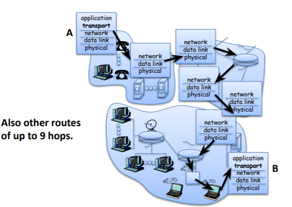
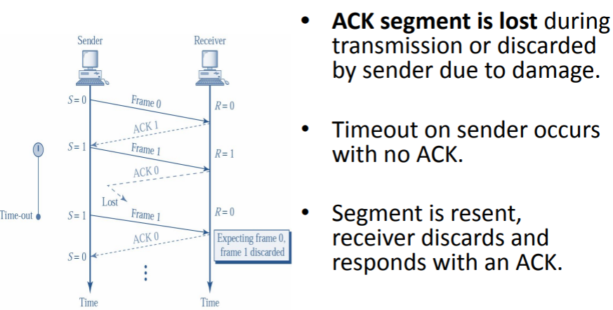
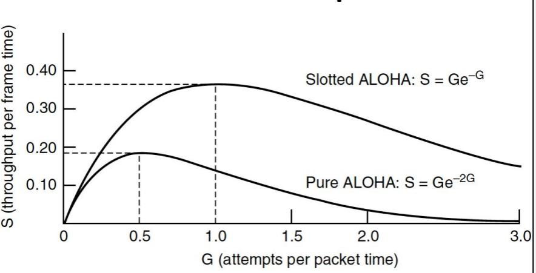
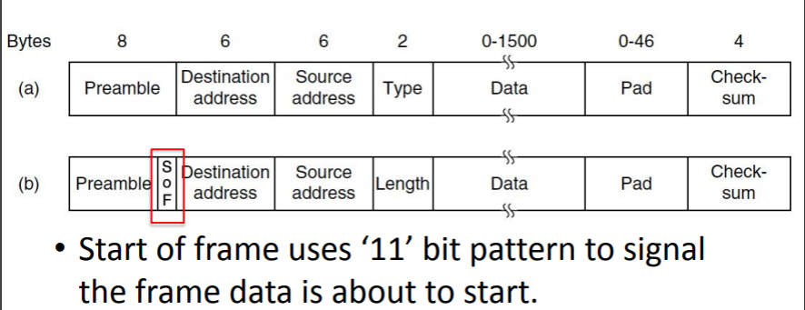
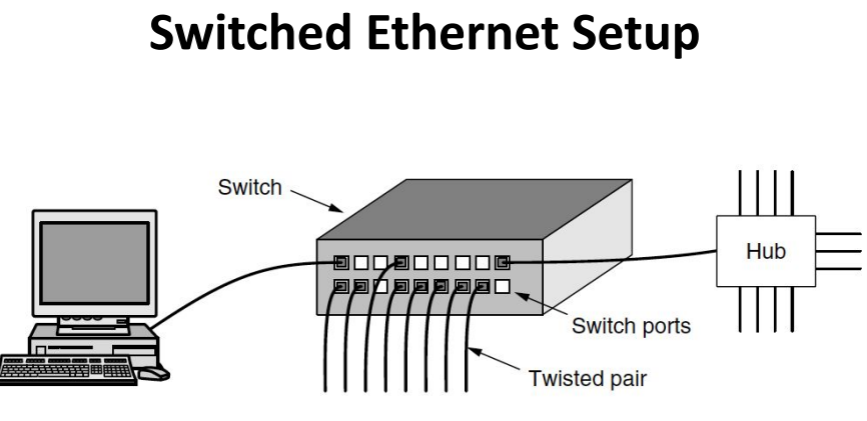

# Computer Networks

## Quick refresher

All People Seem To Need Data Processing

but we will use the **Tanenbaum Model**

### Layer 1: The Physical Layer

- Data unit is **bits**
- Controls transmission mode: simplex, half-duplex, & full duplex
- Determines how bits are represented
- 

### Layer 2: The Data Link Layer

- Data unit is **frames**, a structure of bits sent across the physical network
- Provides connection for upper layer protocols
- Provides **Medium Access Control (MAC)** for shared communication medium
- Based on flat and fixed physical address space (e.g. MAC addresses)

### Layer 3: The Network Layer

- The data unit is **packets** - frames containing extra information that is required for routing.
- Creates logicals paths and determines how pockets are routed end-to-end
- Higher layers are shielded from medium-specific complexities through the network layer
- Provides a hierarchical, logical address space (e.g. IPv4 or IPv6 addresses)

### Layer 4: The Transport Layer

- The data unit is the **segment**, which contains reliability flow and state data.
- Provides '**ports**', allowing multiple services to interact on the same machines
- May be connection-oriented or connectionsless
  - Connectionless sessions rely on the upper layer protocols for error control (e.g. **UDP**).
  - – Connection-oriented sessions use acknowledgement and retransmission to achieve reliable connections (e.g. **TCP**).

### Layer 7: The Application Layer

- Data unit: **custom data formats**
- Provides communication services for specific applications
- Unlike lower layers these are not generic
- 

## Chapter 1 Application Layer

### RFC

RFC (Request for comments) is a memo published by the **IETF** (Internet Engineering Task Force). Not really a request for comments but a politically correct way of publishing.

### Telnet

telnet is a command line interface for communication with a remote device or server. Telnet stands for teletype network. 

Telnet can be used to

- Connect to a remote server or device and give commands just like you would be physically sitting in front of the computer
- Manage and configure network devices such a routers and switches
- Check if ports are open and closed on a server.

Telnet is sent in clear text so there is no encryption, if you would use it today anyone could grab your data your sending. It should not be used over the public internet. Telnet itself runs on port 23

Telnet is een command line interface om te connecteren met servers, routers, etc. Als je connecteert met telnet met 1 van deze machines is het alsof je voor de machine zou zitten en rechtstreeks commands ingeeft. Telnet gebruikt TCP maar er is helaas geen security dus dit over het internet gebruiken is gevaarlijk. Telnet runt op port 23. 

**NVT (network virtual terminal)** is een virtuele terminal in TELNET dat een fundamentele structuure deelt met veel verschillende andere echte terminals. Dit is hoe het werkt

De telnet client converteert de characters van de locale terminal naar NVT formaat en verstuurt deze over het netwerk. De telnet server converteert de data naar een formaat dat de remote computer can verstaan.

### File Transfer Protocol (FTP)

Designed to transfer files and navigate directory listings.

Used two TCP port:

- 21 for control
- 20 for data transfers

Control port uses Telnet protocol to negotiate session

FTP (File transfer protocol) is het protocol dat gebruikt wordt om files te downloaden of uploaden, je kan dit ook gebruiken om over directories te gaan. FTP werkt met 2 ports, 21 voor controle en 20 voor data transfer. De control port gebruikt Telnet om sessies te maken.

### Architectural View of the WWW

**Quick refresher for some important parts:**

- Clients use web browsers and **HTTP** to retrieve **HTML** files or web pages that are stored on servers at a specified URI.
- Caches improve performance by locally storing the results of client requests. the cache will serve repeat request rather than downloading material again from the servers.

### Uniform Resource Identifiers (URIs)

Web resources need a human-readable identifier in order to support easy retrieval -> **URI**

Most popular form of a **URI** is the **Uniform Resource Locator (URL):**

### Hypertext Markup Language (HTML)

- HyperText Markup Language is a subset of Standardized General Markup Language (SGML)
- Documents use elements to “mark up” or identify sections of text for different purposes or display characteristics.
- Mark up elements are not seen by the user when page is rendered by the web browser.

### Hypertext Transfer Protocol (HTTP)

- The **Hyper Text Transfer Protocol (HTTP)** supports client-server communication using a simple request/response protocol
- It is an application-layer protocol, that operates over **TCP on port 80**
- The protocol is connectionless or stateless and has no notion of session.

#### **HTTP 1.0/1.1 Commands**

PUT -> create new resource or overwrite it

POST -> update existing resource

#### **Inefficiency in HTTP 1.0**

- Each web page contains an average of 40 embedded object(images, audio, video).
- Opening a TCP connection for each object is inefficient, requiring 1 round trip per object
- **TCP** congestion algorithm slowly increases speed, so transfer rate is slower on new connections.

#### **HTTP 1.1 VS HTTP 1.0**

#### Pipelining in HTTP1.1

**HTTP(Hypertext Transfer Protocol)** is een protocol dat resources zoals HTML documenten ophaalt bij servers door middel van **URLs(uniform resource locators)**. Deze werkt met TCP op port 80. Het probleem van TCP is dat het voor elke resource op een webpagina een nieuw TCP connection gaat openen, dus voor elke image, video, etc.. Dit kan snel oplopen en zorgen voor congestion. Dit is enkel een probleem bij HTTP1.0 want vanaf HTTP 1.1 zorgen we voor persistentie in de connectie. Er gaat dus niet voor elk request een nieuwe TCP connection geopend worden. Er wordt ook pipelining toegevoegd. Wat in essentie betekent dat meerdere resources tegelijk kunnen opgehaalt worden. Dus je gaat een nieuwe request sturen voor dat er een response is gekomen voor de vorige. Een probleem dat kan opduiken bij persistentie is. Wanneer sluiten we de connectie? We hebben gekozen voor een idle tijd van 60 seconden.

### Simple Mail Transfer Protocol (SMTP)

Email as we know it today separates email exchange into two parts:

- **Mail submission and delivery protocols**, which allow clients to connect to the mail server
- **Mail transfer protocol** which allows mail servers to communicate

$\xrightarrow{}$ This specialization allows us flexible access to email, while ensuring standard communication

**SMTP of Simple Mail Transfer Protocol** is het protocol dat tussen mail servers werkt. Het werkt in 3 fases. 1. Handshaking 2. versturen van messages. 3. afsluiten van de connectie

#### The Architecture Of Email

#### Message Format

#### Interaction in command/response mode

**Three phases:**

1. Handshaking
2. Transfer of messages
3. Closure

### Post Office Protocol (POP)

- A mechanism used by mail clients to talk to mail servers
- A simple **unsynchronized** protocol, difficult to manage on multiple machines.

**POP of Post Office Protocol** is een protocol dat de mails ophaalt bij de mail server. Het nadeel van dit protocol is dat het niet gesychronizeerd is. Dus veranderingen die je maakt op je client worden niet gedaan op de server.

### Internet Message Access Protocol (IMAP)

- Another mechanism for mail clients to communicate with mail servers.
- All folders (inbox, outbox, drafts, etc...) are **synchronized** on the client and the server.
- Better suited because we use a lot of different devices but higher overhead.

**IMAP of internet message protocol** is ook een protocol dat mails ophaalt maar deze is wel gesychronizeerd. Dit betekent dat wnr er mails worden gedelete of andere bewerkingen, dat dit ook wordt gedaan op de server. Het is ook meer secure dan POP.

### Web-mail Over HTTP

- In this case the web browser is the mail client
- No need for **synchronization** as all files are stored on the server.
- **Lightweight** and allows use on multiple devices, but **requires a consistent Internet connection**

**Web-mail Over HTTP** is eigenlijk wat wij nu gebruiken, de mail client wordt geaccessed via een browser. Er moet geen synchronisatie gedaan worden want het is een rechtstreekse verbinding met de mail server.

### Dynamic Host Configuration Protocol (DHCP)

**Provides automated assignment of IP addresses:**

- IP addresses are assigned on-demand
- Avoid manual IP configuration
- Supports the mobility of a lot of smaller devices

**USES UDP** 

**HA MEMES**

#### Verschil tussen UDP en TCP

Als ge u afvroeg wat het verschil is tussen het virgin UDP protocol en het CHAD TCP protocol kijk dan hieronder.

![L'histoire de GigaChad, l'ultra-masculin mi-mème, mi-légende urbaine](data:image/jpeg;base64,/9j/4AAQSkZJRgABAQAAAQABAAD/2wCEAAkGBxIPEA8PDw0PDw8PDw8PDw8NDw8QDxAOFREWFhURFRUYHSggGBolGxUVITEhJSkrLi4uFx81ODMsNygtLisBCgoKBQUFDgUFDisZExkrKysrKysrKysrKysrKysrKysrKysrKysrKysrKysrKysrKysrKysrKysrKysrKysrK//AABEIAKgBKwMBIgACEQEDEQH/xAAcAAADAAMBAQEAAAAAAAAAAAAAAQIDBQYHBAj/xAA7EAACAgEDAQQIAgkDBQAAAAAAAQIRAwQSITEFQVFhBhMiMnGBkaEHsRQjQlJicsHh8BUk0TOCkrLx/8QAFAEBAAAAAAAAAAAAAAAAAAAAAP/EABQRAQAAAAAAAAAAAAAAAAAAAAD/2gAMAwEAAhEDEQA/ANkOh0OgIAqgoBUIuhUBKQ6KodASBVBQE0BVBQEUMqgoBJDodAAFJBRaQE0UkNIugJSKURpFUBNBRVDUQJodFbSqAhIe0tRHQEKI6KoraBj2ioy7Q2gQohRaQ9oGPaLaZdonEDFtDaZKCgNYBdCAihobQUAhUVQgAB0FAICgoCQKCgJGkMdAaztvtNaaG6lKcrUYt0vOTfgjhv0/U58jlPVSjHujjlKMfDiKrx/ubT001O2edyhKSjDFihtdVa3ybfcvbivkjmuw9TLO3jwwgpwTmrqmop307+n0A6/Sz1GHH67FqXmUbcsWW3GUe9J9zOm7H7Sx6rEsuN+UovrCffF/U4PsDtzNmuGST2p7diwxSa6NPlS+i4Og9FsXqtZqcab2zxQyJPxjKrfnU6vyQHV0UgSKSASRSQ0igJSHQ6KSAlIaRdDSAlIdFUOgI2jougoCaCikhgTQ6KoKAihNGSg2gY6CjJtCgNQxUMAFQDABNCooKAVBQwAW0KKoKAmh0OgoCUilEdFJAcN6e6dv1m1qtuKco+PE039Ix+nkcb6PdpY9NNzUbyO7u0tu1qMb55t307juvxHwNYo5U2ltlje3rfWvPjd/jPMtHl9XfEZNPpKClx3NWmvsB2WDtxRz4s08W2EqUnF7lGbXffVX3pfI3fZGvjk1ProY5K/U441Tlsc3vb8Y1t+3gcP2nro5YY36hLLCO6WR44Q9lO6Sikn3HQ/hrqHPUKFbtuNuUv3EopL/ADyYHpyRSQJFJACQ6GkVQCSGkNIpIBUNIaGkAqGkNIaAEgoYUAqCiqHQE0Oh0OgJoKKoNoE0FFbQ2gaQBpDAmhUVQUBNAVQUBNFUFDAVBQ6AAAdDoCSkgSKSA+DtrsuOrwzwTbjupxkkrjJdGvv9WeLdpaeWn3YpKpRltckntml0a8OD3fLkjCLlOSjGKttnmPpLKMcrzU/VZr+SndMDioZZzWxJu+D0X0Lx/osVUbbW7I11cq6fCvyOL0uRQXDtvi66rxOv7G1PspcW1fzQHfYu08T/AG9r8Jpqv6H14s0J+7OMv5ZJnB6vI5SqDW5xXCfl4EYNXJSpuNxaVSu78vAD0VIdHNaf0k2SWKUHOVJqTlSr4v3jdYu0U+sJL4U0B9tAGOakri7RdAJIYDoBDQ0h0Ah0NIdAJIdDoEgFQ6GMBUFDoKAVBRVABoQKFQCAdBQCAdBQCQ6GCAKCigAVAOhpAJHx9rdpw0uNzly3xCN1b/4RXanaWPS43lyypLol70n4JHm/pV23+kyhKKaW11BvhR7r8WwPh9IfSXNqZ1GTfgopqMee5f1Fr9V/t8WF3OUYJSa5/wAZ8+nyNYpKkm5N2kk6pcfmYU9itt23+QHyZIyhse11Kvk+9G9x48ihGeGauuYytNfA+PW5k9jS73dd7rjgnT6x01fyA3Wg1U4++rb7/GzPqXz6yPP7y7/ijU6fUtm70/tJdU/FdQM2mz71Fru5Un+R0Wj7QVR5VNcq/kcjqMTx3KFOvej4+a8H5FYu0OGk/Br/AD7/ADA9C0+qUWpJ8cbl1tG5R57odc2ut+H0O27I1W+EYvicYr5x8QPtodFJAkAh0Oh0AhpAOgEOh0OgFQUWkFATQ0iqCgJoodABzwUMYEsBgAgHQUAqKAKAEh0A0AJDoEikBwXp/PdLGm/ZU7l4NJdDhMue25Pq3fh1Ot9LMryX/DkbfwfC/NHOdnaHfOcpe7iipNeMm6S+z+gGFPhXf/Jgy+073Mza2Vyf2PmXPeBWpvbG6dPu6hifHX5E5/d4btUY066gbDTSp9X8jedn5+VfwOZx5aNjoNcunnXXn6eAHU6+HrMb2+8l7L6NP496OS0eaWW3CLdK5Jd1/wDw3SzylGSjfuu2ua46mh9Gc7hOKTpyUo/Nd32YG/7I1u18ro6f9zt9Dq21GUXzHldPp8Dz2Ot3ZJ7Y1ufKSNp2N2q1LZLu4A9a0+RTjGa6SV/DyMhrfRzJuwvm6nJefKT/AKs2lAKgoqh0BNDoqgoBUNIaGkAqHQ6HQCQUVQ6AlIe0pIdAc0AkUkAqChjAmh0OgoBDHQAA0gQwAAGkB5r6W4fV558XCSa+Ku+PNM1XY+Zb54m1+sinH+KUb4+jb+RfpnrJvU5Un7KduL6eFnNPK37SbUou+Hyq715gbDteGyTXSz4Io+/Bqf0ySjlivWQjcZrjel4xXf8AD6HyahcuKq7ql3+doD5tRPik+fIxY8zXWN/MzPFtdPr5MxwSXdfPeBmxzb52/c+vBBtrhK+9vhD0mlhkdJ1xx3G07NxKpR2xlXs7pe4v7gZMDUYSSytuukE/uzmMWTZkdPpPcvjZ1ebG8SSUlsl0UI02/wDgj0W9Fv8AUMmeKl6vbjlNZGrSy/sJ+V9fJMDV6XN+tbVVdq+9PnvNp6u2sseOVup919TQajHPBkliyRcMuObhOElypLu/zyOh7HyuUKe1p8e7Tr5AejehGovfC+sVJfJ0/wA0dWkec+hGp26iEG/3oOvFp196PSAEMdDQEpDodDSASQx0MBUMdDoBJDSKSCgFQ6Gh0By6Q0IaAGCGAAAAA0MSGADQhoAoaGgA8o9Muz3HWZIte+t0PNPk5CS2S6eTR6x6eaNTenyV+1LHa68p192eW6ziTUrTTfP9AJ7Llt1OFq/+oo8eEvZ/r9ja67FtzTbj70edq/aT4f36l+gXZ71GvwXHdHHJTk+5Rgm/zSXzMva+eOPVzjdxanCD602+H/QDn8kpN+635+KMMU22qrxs+6eRbuXyuOpgzSW66+982B9+g7Py2nGpX05NjpMElJ75ptS9nHG/al5vwNbodfKMl3UqXmbbQTi5O17XKcrdrnp5cgZe0puKXPXq49HLpXwSPVPRDsVaPTQhS9ZNLJlf8bXu/BdPr4nB9m9lrPq9Ljl7kcm6S/hgnPb89vPxPVwOF/FvQ4HonnlDGtSsmHHiyVWSScvahfetm90/A4PsRbXG03Got+Uq5N7+MOrlPVabTW9mPB67b3OeSco38lj+7NB2ZKo2urdNeAG97Gzf7qMFxKWWCUvjJUz1+jy/0U0ccmtwSa6Nzfxgm1+SPUkgFQ0ikhAADoYCSGkNIpICUhpFBQCGh0ABQ6GAHKDQigAAGgEOh0AAA0FAFFUCGkAJFUCGB8Pa+j9dhlFe9Gpwvpvjyl8+nzPEe3sH6xtJuEuU+9eK+N8Hvh5/6U+ikoetyYkp4Zylk217WGb5f/a/HuA8/wDRbV5MOs07xy2v1u2/KScXa7+GzJ2k09R7XTerv4nx58MseRUpRmppwr96/ZaffzRtu0tH+snJtb6i26qLk43dfzJgfJr4xjNqMYrnwu0zDkltlxtVpdCNbNNp8u4p9a53cr5GDct9d3Hf3UwN7pdVFqTaXEXTrm6MvY+RKn0bf2vhmowSjtfHW657/wDKK0ie6Kcqvr/KvAD1X0Iw+t1Dyp3HDjaXP7c+F9tx3Z5H6N9ofouRPH3dY2/1kH1i/p8meqaTW48yTx5Iy9mMnFNboqXTdHquj6+AHi34qSf+qZbfCxafZXdD1a4/8t31Nf2bne6P8PD8Gn1RsvxVp9q5KT9nBp9/x2t/k4mq7Jhbvxav4WB6f+HunvLly90I7V195/2s71Gh9DdH6rSwtVLJeSXjz0+yX1N9EBgCHQCQ0h0NIASGkAwAB0OgFQ6GMBJDCgA5NFIQ0AUMAAAAAGhoAQDKJKApAAAA0IaA4z0y7DwYlHVRjtrInKCS2XTluX7r9np08jgc+rjKcZxakpQcXT6UuOvid5+Juu24YYopuTuTpXSaaXHjw/8AGeS0uu1+bjJqviBlz6edpKE+ibe1pK33t8LoYlppN3KeONrhPJFuq8I2zIslxmvWPakpO5N2ulcvzR8sMiUuX3Vck2/oB9mSow950ra/Zt/Pn7H1QyOLTxwxq4x9+Tk7rl9V3mrnJO0t3P7TjX3Z9nZmNbJ3y1KNVtuuj68d6+oG7wbpr2tRT8Ma2/8AtZ2H4d5I49W1Fyk8+PbclT9hSlRx+ij0UcTv97LG6fwNhptbl07ebFkjDLDHkcW0tu7Y4pff7Aaz0t7QWp7T12T9ne8UX19nEljv5uLfzN36E9lfpGoxwfML3z/ki7f1pL5nI6DFdNttytbru+U2348ntf4e9lLDpvXte3ndrxWJPhfN2/oB1kVSSSpJUkuiRSQIaAaKQhgBVCGAFCRQBQwRQCSAYAIRTADkhoAAYAAANAADBDABjAAKAAABoAA8i/EPU5Xrcqk1shGOOCj+7tUrfncn9TlYzhJ+2qf7ybUl8+8AAy6XSe1Lc04y2RjKuacr8OvCIzYIp3Dvb95q+rfcAAY4Yd3XHF+e4yXsdw44apuMouL4cWvAAA+rBqp/xRjS49Za+Sa6fM2WN+sTgoycppwbtOlLi17bv6AAGDsPs95JQhbtz2ez1btLj7H6C02njihDHBVGEVCK61FKkgADKigABoYAA0MAAqJQAA0hgABQ0AADQUIAP//Z)

Dit is Tim nadat hij een TCP packet naar uw mama heeft gestuurd.

#### Address Leases

- **DHCP** is not for permanent address allocation
- Addresses are leased for a specific period depending on the environment
  - Shorter leases more efficiently allocate space.
  - –Longer leases lower load on the DHCP server.

#### DHCP Message Format

Don't think this is important since there are more than 100 options defined.

#### DHCP Discovery

#### Renewing a Lease

#### Releasing an Address

#### Duplicate Address Detection

After assignment of an IP address, hosts will perform **duplicate address detection**

$\xrightarrow{}$ if the clients detects a duplicate address, it refuses the offered IP address with a **DHCPDECLINE** message.

We use **ARP** for this.

**DHCP of Dynamic Host Configuration Protocol** is eigenlijk heel simpel. Je hebt een client die een IP-adres wil en een **DHCP**-server die je er eentje kan geven. Wanneer een client verbindt met het netwerk gaat deze een **DHCPDISCOVER** message sturen over het netwerk, dit is een broadcast over UDP. De DHCP-server gaat dan een **DHCPOFFER** terugsturen met een IP-adres in. De DHCP-server weet waar die het packet naartoe moet sturen door het **ethernet-adres** van de client dat in het DHCPDISCOVER packet zit. Omwille van het feit dat dit IP-adres een lease en dus moet worden teruggeven na een verloop van tijd gaat de client wanneer er 50% van de TTL expired is, een **DHCPREQUEST** sturen naar de server en deze stuurt dan een **DHCPACK** terug. Als de server antwoordt met een **DHCPNACK** dan is de lease niet gerenewed. Nadat een client een IP-adres heeft gekregen gaat deze over ARP checken of er geen andere hosts zijn met hetzelfde IP-adres. Als dit het geval gaat de host een **DHCPDECLINE** message sturen naar de server.

### Domain Name System (DNS)

**A few notes**

#### Hierarchical Domain Addresses

We use hierarchy to manage the complexity of DNS lookup and to enable distribution.

Consider a domain name:

**nix.cs.kuleuven.ac.be**

$\xrightarrow{}$ Hierarchy is embedded in the name from biggest on right(country), to smallest on left(machine).

#### Top Level Domains

3 groups of Top Level Domains

- 2-letter country codes ex. BE, FR, NL
- generic names (similar organisations)
  - com - commercial organisations
  - org - non commerical organisations
- names of organisations within USA
  - edu - universities
  - gov - US government
  - mil - US army

$\xrightarrow{}$ administration for the next level down is delegated to registrars to manage complexity

#### Benefits of Hierarchy

- We build on the hierarchy of the name-space when storing DNS data, avoiding bottle-necks
- We reduce management complexity by delegating responsibility
- We allow for appropriate regional controls of this global resource

#### Side note for Recursive and Iterative DNS

When the DNS lookup is **iterative**, the resolver or Local DNS server will itself make every request to the different DNS servers in the hierarchy. As you can see above. $\uparrow{}$ 

When the DNS lookup is **recursive**, each server along the route will make the request itself to the next server in the hierarchy. As you can see above. $\uparrow{}$ 

**Recursive**: the local name-server does not return partial information

**Iterative**: The root name server only returns partial information

**Note:** NS other than the local NS may operate recursively, but it is rare due to overhead.

#### Non-Overlapping Zones

We divide the name-space into non-overlapping zones.

Each zone's administrator is responsible for drawing the boundaries of internal zones:

- Load balancing
- managing overhead of many servers
- May follow organizational boundaries

#### **DNS Messages**

Anycast is used to provide redundancy and protection from attacks. Wat is nu Anycast? Wel anycast heb je wanneer er meerdere servers op verschillende plekkenhetzelfde ip-adres delen. Routers gaat dan packetjes naar de dichstbijzijnde server met dat ip-adres sturen ipv naar de andere kant van de wereld.

**DNS of Domain Name System** werkt dus door middel van verschillende servers in een hierachy nl. De root server, de TLD-servers en de authoritative servers. Whenever you enter a certain website in your search bar, your computer sends a request for the ip-address to your local dns server. If the ip-address is not in the cache a request will be made to the root server who knows where the TLD-servers are who know where the authoritative servers who have the ip-address of your requested site.

### Discovery Protocols (Napster, Gnutella)

Quick example:

#### **Napster**

- Was one of the earliest P2P applications

- Napster was able to implement a large-scale music download service without paying for (many) servers and high bandwidth connections.

- The infrastructure was provided largely for free by the users

  

Steps in **Napster**

1. Ask server for list of locations of files
2. List of peers offering the files
3. Request file from certain peer
4. File delivery
5. Index update

**Napster** is een P2P applicatie voor de distributie van muziek. Napster werkte in 5 stappen.

1. Host vraagt de locatie van client met de file die de host wilt.
2. Server geeft een lijst met de locaties van peers met de gewilde file
3. Een request voor de file wordt gestuurd naar een peer
4. De file wordt geleverd
5. De index wordt geupdate op de server

#### The P2P Application Pattern

Peer to peer is nice because it barely requires any servers. The incentive is that you can download files for free from peers while in exchange other peers can do the same from you.

##### P2P App $\ne$ P2P Network

- A P2P application re-uses edge resources to provide a service. It may, or may not use a P2P network
- Centralization limits scalability
- If you know about data, you may be responsible for it
- What happens to the services when the server fails?

##### Important Note

While application-level networks provide a conceptual routing substrate, each application-level hop may map to several hops at the network layer. Thus it is critical that we keep the amount of application-level hops to a minimum.

**Belangrijke opmerking:**

Applicatie levels protocollen geven ons een netwerk substraat zoals de afbeeldingen hier een beetje boven. Het kans goed zijn dat op netwerk niveau 1 hop op applicatie level kan gelijk staan aan meerdere hops. Dus moeten we dit zoveel mogelijk vermijden.

#### Gnutella 0.4

- Gnutella supports peer-to-peer resource discovery.
- Gnutella builds an **unstructured decentralised overlay network** on top of **TCP/IP**

$\xrightarrow{}$ Gnutella does the same job as Napster without any servers:

- No single point of failure, or attack
- No need to provision powerful indexing servers.

Legally speaking, there is no single **Gnutella** entity to target so there is no one to sue.

Privacy: Limited anonymity is provided as each user only has the details of its neighbours.

##### Gnutella Messages

There are 3 phases to the Gnutella cycle

- Connection
- Search
- File Transfer

##### Connecting a New Peer:

**Short explanation for connecting to the Gnutella network**

So in short, A new-arriving peer connects to an initial peer by initiating TCP connections to that host. This peer will then broadcast a PING message which 'floods the netwerk'

Available peers that receive a ping should respond with a PONG, which contains the network address and port on which the sending peer is listening for Gnutella connections. The Pong message is forwarded back along the path of the incoming PING

Broadcast messages are tagged with a TTL. Peers decrement the TTL, discarding where TTL = 0

Incoming peers will establish eight connections.

**Connecteren aan een gnutella 0.4 netwerk:**

De host die wilt deelnemen aan het netwerk connecteert via TCP aan een wel bekende node. De host gaat dan een PING message sturen naar deze peer, deze peer gaat dan op zijn beurt deze PING doorsturen en we gaan zo verder tot de TTL op 0 staat. Alle beschikbare peers die de PING message hebben gekregen gaan dan een PONG terugsturen met hun informatie. Onze host gaat dan 8 connecties aangaan met peers die een pong hebben teruggestuurd.

##### Searching for a file

**Short explanation for searching for a file in the Gnutella network**

Peers listen for incoming QUERY messages, and contribute to their broadcast across the network by flooding them to each of their neighbours, while decrementing their TTL value.

If a peer has the requested file from the QUERY, it responds by sending a QUERYHIT message back along the path of the incoming QUERY.

QUERYHIT messages contain the network address and port on which the responding peer is listening for HTTP file-transfer connections.

**Een file zoeken in Gnutella 0.4:**

Onze initiele peer gaat een QUERY sturen naar zijn peers en deze peers gaan weer op hun beurt deze query doorsturen tot er een queryhit is of tot de TTL op 0 staat. Als een peer een queryhit heeft dan gaat deze zijn verbindingsinformatie sturen met een QUERYHIT message via de weg van de query. De initiele peer gaat dan een directe verbinding proberen aan te gaan. Als dit niet lukt omdat de 2de peer achter een firewall zit dan stuurt de initiele peer een PUSH message met de verbindingsinformatie zodat de 2de peer de connectie kan starten. 

##### File Transfer from peer to peer

**Short explanation for the file transfer**

When requesting peer receives a QUERYHIT message, it can attempt to initiate a direct download, from the target peer (whose port and IP address were specified in the QUERYHIT message) via HTTP.

However, if the target peer is behind a firewall, the requesting peer can instead send PUSH message to the target, containing details of the file request.

On receiving a PUSH, the target peer establishes the HTTP connection and pushes the file.

##### Shortages of Gnutella 0.4

- The flat network structure of Gnutella results in high load due to broadcast.
- Nodes are heterogeneous. Should my phone do the same share of work as my server?

**Gnutella** heeft een paar problemen, namelijk the search horizon. Broadcast search scaled niet wat er dus voor zorgt dat wnr elke peer een message stuurt naar elke peer enzo verder dat er enorm veel data verstuurd wordt in totaal. Daarom hebben hebben we een TTL toegevoegd zodat het niet te ver gaat. Dan hebben we ook nog last van het feit dat alle nodes heterogenous zijn. Elke node wordt dus gelijk behandelt maar moet een gsm even veel werk doen als een server. Lijkt niet helemaal fair.

#### Gnutella 0.6

##### Upgrade of Gnutella 0.6

- Only ultra-peers participate in peer discovery. Leaf-nodes always connect to an ultra-peer
- When a leaf node connects to an ultra-peer it uploads a complete list of its resources
- File discovery messages are only sent to leaf-nodes where they host a matching file.

$\xrightarrow{}$ This way **leaf nodes** do not participate in discovery, reducing their load.

##### Requirements for Ultrapeers:

- No firewall
- Sufficient Bandwidth
- Sufficient Uptime
- Sufficient RAM and CPU

Gnutella 0.6 improves on the scalability of Gnutella 0.4

- By exploiting the resources available on strong nodes
- conserving the resources available on weak nodes

**Gnutella 0.6** lost de problemen van zijn voorganger op doormiddel van ultra-peers en leaf-nodes. Leaf nodes verbinden altijd met ultra peers en sturen een lijst door van alle files die ze hebben. Om een ultra-peer te zijn moet je voldoen aan een paar voorwaarden nl:

- voldoende optijd
- voldoende ram en CPU
- geen firewall
- voldoende bandbreedte

Er is ook een verschil tussen gnutella en FTP's zoals bittorents namelijk dat gnutella een resource discovery app is en bittorent een content distribution app

### File Transfer Protocols (Bittorrent)

BitTorrent is thet most popular P2P network today, accouting for up to 35% of Internet traffic

- Gnutella is designed for resource discovery
- BitTorrent is designed for **efficient content distribution**

#### **The Complete File Sharing Problem**

##### **Q1: How to discover the location of files to download**

A1: Each torrent provides connection details of 'trackers' that know addresses of peers downloading this file: **the swarm**. Each file is broken into many small chunks. Each chunk is identified by an SHA-1 hash key. On connection, addresses of the swarm are transferred from the tracker

##### Q2: How to optimally replicate content to peers

A2: Peers should both download and upload chunks. Peers with all chunks are seeders. Peers share lists of chunks and download the rarest first, optimizing availability.

##### Q3: How to encourage users to upload

BitTorrent tackles the problem of Free-riding by implementing a 'tit-for-tat' trading scheme. Peers measure download performance. Trading continues only with peers offering high download speed. Over time this matches peers with similar speeds. Free-riders are cute off, or "choked"

### Secure Shell (SSH)

**SSH** solves two key problems:

- Telnet does not offer server authentication
- transmits the user credentials in the open

#### SSH Connection

1. Open up a TCP connection between the two machines (doesn't need to be TCP but needs to be reliable)
2. Packet is made with the packetlength, paddingamount, payload, padding and message authentication code(To see the packet hasn't been changed).
3. Packet is encrypted except for the packetlength and the message authentication code.

**SSH of Secure Shell** is ter vervanging van Telnet omdat telnet geen authenticatie gebruikt en user credentials niet encrypteert. SSH maakt een TCP connectie(Het moet geen TCP zijn maar wel reliable). Er wordt een packet gemaakt en dan geencrypteerd buiten de packetlength en de message authentication code.

#### Public Key Cryptography

#### SSH Authentication

#### Anonymity

- Anonymity in P2P protects the user from censorship
- On the other hand, it provides a cover for illicit behaviour

$\xrightarrow{}$ Let us look at an anonymous P2P system

### Onion Routing Technique

In onion routing, messages are encrypted as they travel along each point in a circuit of nodes called onion routers

Each router removes one layer of encryption to reveal next-hop routing instructions and routes the message along its way.

Intermediate nodes do not know the origin, destination or content; only the next hop. Like an onion we have **many layers of privacy**

### TOR: General Approach

TOR client obtains a lot of TOR routers from the directory server

TOR client picks a random path through the TOR network, terminating at an exit node.

- All links are encrypted except for the outgoing link from the exit node.

When the client downloads a different file, they create a whole new path.

**TOR of The Onion Router** is protocol dat zorgt voor een anoniem P2P systeem. Het werkt dus zo. Een TOR client vraagt aan de directory server een lijst van alle TOR routers. De TOR-client kiest een random pad door het TOR netwerk, eindigend aan de bestemming. Elke router op de weg doet een laag encryptie weg om de volgende hop te weten en stuurt deze dan verder naar de juiste volgende TOR router. Intermediare nodes weten de start, de bestemming noch de inhoud van het packet, enkel de volgende hop.

#### Security

- Cannot prevent a **Sybil attack**, but is designed to make this difficult. 

A **Sybil attack** is one where an attacker pretends to be so many people at the same time. It is one of the biggest issues when connecting to a P2P network. It manipulates the network and controls the whole network by creating multiple fake identities. To a single view, these different identities look like regular users, but behind the scenes, a single entity is called an unknown attacker who controls all these fake entities at once. 

- An adversary can:
  - Generate, modify, delay and delete traffic
  - Operate onion routers
  - Compromise many onion routers
- TOR protects against traffic analysis attacks and thus is resistant to monitoring and censorship

#### TOR Architecture

- All connections between nodes are TLS secured
- Each client node runs **Onion Proxy(OP)**:
  - Offers a **SOCKS** interface to applications
  - Discover routers by querying servers
  - Establishes circuits on the overlay
- A client != an **Onion Router(OR)**

#### Onion Routers

Each router maintains a set of keys that are used to sign descriptors of the router for the directory

Onion routers may act as an exit point, or a forwarding point along a circuit (as dictated by the Onion Proxy client)

TOR security is based on public key cryptography

#### TOR Cells

- Traffic is encapsulated in fixed-size cells, with header containing:
  - Circuit ID header (circID) to determine which circuit the cell refers to.
  - Descriptor of cell's payload type
- Control cells are interpreted by the receiving node
- Relay cells carry end-to-end data and an 2nd header containing necessary meta-data

#### Important Commands

#### TOR Circuits

1. We begin by establishing a connection to known OR using 'relay begin'
2. We then extend as necessary with relay extend
3. Once established, we can tunnel our traffic to the exit router

#### Establishing a TCP Connection

## Chapter 2 The Transport Layer

### The Transport Layer

- Provides end-to-end delivery of data encapsulated in segments using virtual circuits
- Strives for efficiency, relatiability and cost effectiveness
- Transport layer is implemented by libraries running on hosts

#### Connectionless Transport

Connectionless transport just wants to be fast and simple, no extra stuff and that shows in the limited error control and flow control.

#### Connection-oriented Transport

- Focused upon providing reliable communication. Handles lower-layer errors
- Minimizes complexity and ensures a good separation of concerns
- Three phases of interaction

**Connection-oriented transport** is different because it focuses on providing reliable communication and does handle errors. Also tries to minimize complexity

**Three** phases of interaction:

- **Establishment** (connection setup)
- **Data Transfer** (application interaction)
- **Release** (connection tear-down)

**Connection oriented vs Connectionless**

Connectionless focust gewoon op snel en simpele communicatie. Er is geen setup nodig. Er is geen error control of flow control. Enkel een simpele checksum. Connection oriented daarentegen heeft wel een setup, behandelt errors en focust op vertrouwbare communicatie

#### Segment Encapsulation

- units of transmission at the transport layer => segments
- **Segments** at the transport layer are contained in **packets** at the network layer, which are in turn contained in **frames** at the data link layer

#### Generalized Transport Primitives

### Berkeley Sockets (BS)

Socket is 1 kant van 2-zijdige communicatie link tussen 2 programmas op het netwerk. Een socket is gebonden aan een port zodat de TCP laag the applicatie kan herkennen waarvoor de data bestemt is.

#### BS State Machine

### Compare to the Data Link Layer

The Transport Layer provides many similar services to the Data Link Layer such as error control, flow control and sequencing

The key difference is:

- The Data Link Layer provides communication between two hosts on the same physical link, while...
- Hosts at the Transport Layer may be separated by a whole network

#### Transport vs Data Link Layer

De transport laag zorgt voor veel gelijkaardige dingen als de data link laag. Zoals error control, flow control etc.. Het grote verschil tussen de twee is dat bij de transport laag er nog heel netwerk kan liggen tussen 2 hosts terwijl de data link laag zorgt voor de communicatie tussen 2 hosts die fysiek verbonden zijn.

### Elements of Transport Layer Protocols

We will look at four critical elements of transport layer protocols

1. Addressing
2. Connection Management
3. Error Control
4. Flow Control

#### Addressing

##### Transport Service Access Points i.e PORTS

- Transport Service Access Points (TSAPs) define an end-point for transport layer traffic.
- IP addresses are not enough because multiple processes running on the same host may concurrently exchange data.
- Ports are an example of a TSAP

##### Network Service Access Points i.e IP-addresses

##### Network Service Access Points (NSAPs) define an end-point for network layer traffic

- IP addresses are an example of NSAP
- Transport Service Access Points (TSAPs) define an end-point for transport layer traffic.

##### 

The explanations for this is quite simple. Across our network we identify routers and clients by their IP-address but once we reach the destination of the IP we are still left wondering for which application the message is. Then we use the port to identify where the message has to go next as can be seen on the image.

##### TSAP Address Assignment

- Some ports are well known and permanently assigned:
  - HTTP, SMTP, Telnet, SSH

##### Initial Connection Protocol  

Some servers may only operate sporadically. So why run them all the time?

$\xrightarrow{}$ Initial Connection Protocol (ICP) conserves resources:

- Process Server listens for connections on well known TSAP addresses
- When a connection is received, the server process is started and passed the TSAP address.

Basically, why keep servers constantly running if they're not constantly needed. That's why we use the Initial Connection Protocol. 

So if a host has the ICP service enabled and it receives a connection for a well known port, then the host wakes up the correct server process and passes the connection to the now running correct server process. 

**ICP of Initial Connection Protocol** is een heel handig protocol om resources te besparen. We starten met een Process server die voor alle andere servers staat. Wanneer er een dan een connectie binnenkomt voor een bepaalde server process gaat deze Process server het juiste process opstarten en de connectie het juiste TSAP address geven.

##### Multiplexing Using TSAPs 

Multiplexing using TSAPs is very simple. We are going to bundle all of our TSAPs(ports) together and send them to where they have go under the same NSAP(IP-address).

#### Connection Management

##### Problems of Connection Management

- Transport Layer protocols operate over a network with significant storage potential.
- Some packets may travel slower or longer routes than others

##### Out of Order Packets

All the things above can cause the packets to arrive out of order, be lost entirely or duplicated.

$\xrightarrow{}$ A big problem - consider a bank transfer

We send a deposit to an un-trusted party. The packets take the scenic route and we assume they are lost. We resend the packets. The slow packets then arrive resulting in two transfers.

We can solve this by adding a life-time to the packet so that we can reject delayed or duplicated packets. This is now widely used in TCP.

- Bounded Packet Lifetime

Each packet carries a **sequence number** that will not be re-used within **T** seconds (in reality some multiple of packet lifetime)

The standard Internet packet lifetime is 120s. Sequence numbers wrap around to 0. If a machine should crash it would lose the sequence numbers. We solve this by using a real time lock to provide initial sequence numbers during connection. Thus after a crash, hosts continue with a higher sequence number than before.

##### The Two Generals Problem

We have two allied armies on two different hill tops and one enemy army in the valley in between. If only 1 allied army attacks, it will lose. So the general from one of the armies sends a message to the general on the other hill letting him know when he will attack. The problem is that the only to that army is through the valley which is dangerous and the messenger might be captured. This would cause the 1st army to attack without the second and lose. So the second army sends a confirmation of the first message. But this one also may not arrive. So now we have our problem, we can never be 100% the other general got the message. How many messengers and confirmation messengers we might send.

We have a partial solution. This problem cannot be cleanly solved by the transport layer alone. Higher-level protocols must be designed in such a way that they can tolerate abrupt disconnection. Where this is unacceptable, we must explore probabilistic approaches.

#### Error Control

##### End-to-End Checksums

Checksums are fixed-size code created by a hash function. These hash function will always give us the same output if input the same thing. This allows use to check if after receiving the data our data hasn't been changed in transit. We do this by re-computing the hash and checking if it is the same. It is highly unlikely that a packet could be corrupted and still match the provided checksum.

These checksum are also used by the datalink layer after each hop. protecting all hops between routers.

Each individual link is secure, so why isn't our end-to-end connection secure? Because packets can be corrupted within a malfunctioning router.

##### Acknowledgements

Reliable packets require an acknowledgement so we must retransmit packets until an acknowledgement **(ACK)** is received.

If the receiver loses a sequence number, they may negatively acknowledge **(NACK)**, requesting resend.

This requires that the sender stores old messages until they have all been acknowledged

### 

#### Flow Control

##### Sliding Windows !Important!

- Sliding window protocols tackle both error and flow control
- Senders and receivers each maintain a window of messages for which no ACKs have been received.
- The window is a sequence of message IDs, with a lower and upper bound.
- By configuring the window size we can control the flow of packets into the network.

### Sliding Window Protocol

#### Window Size

- Sliding window protocols may use a fixed window size, or adapt a window size.
- The simplest approach is window of fixed size 1, or **'stop and wait'**
  - Send one segment and wait until it is acknowledged
  - A one-bit sequence number is used to detect duplicates

#### Stop-and-Wait Operation

- Sender keeps last segment until it receives ACK
- Both data and ACKs are numbered alternately 0 and 1
- Sender stores (**S**) with number of the last segment sent
- Receiver stores (**R**) with number of next segment expected
- Sender starts timer on segment send. If an ACK is not received before expiry, send assumes loss or damage and resends.
- Receiver sends ACK with number of next segment when segment is intact. 

**In the following images frame should be segment because we are in the transport layer**

##### Summary of Stop-and-Wait

- The simplest sliding window protocol to implement
- Uses very few resources (i,e buffer space is 1 on sender, 0 on receiver)
- But it is inefficient if we have high RTT compared to speed

**Stop-and-wait sliding window protocol** is heel simpel. Onze window van hoeveelheid messages dat we kunnen sturen zonder ACK is exact 1. We sturen ons segment en als deze aankomt krijgen we een ACK terug van de andere host. Als we geen ACK krijgen dan sturen we na een bepaalde tijd opnieuw onze frame. Als de andere host de message wel had gekregen maar het de ACK was die verloren was gegaan, in andere woorden het nummer van het verwachte segment kwam niet overeen met wat we kregen dan sturen we opnieuw een ACK. We hebben ook nog een simpele toevoeging om de optimalisatie te verbeteren namelijk, piggyback optimization. Dit houdt in dat we onze ACK samen sturen met een segment dat ook naar die host moest. Helaas is dit heel traag als onze **RTT(Round Trip Time)** hoog is.

#### Go-Back-N

##### Principles

- Segments have a larger range of sequence numbers, that wrap around to 0
- We send **W** segments before requiring an **ACK**
- Keep a copy of the segments until **ACKs** arrive
- This requires extended data structures and more variables than stop-and-wait

##### Sender Window

##### Receiver Window

##### Acknowledgement

##### Normal Operation

##### Segment Loss

quick vid:https://www.youtube.com/watch?v=9BuaeEjIeQI

So how does it actually work? Our sender can send an amount of segments indicated by the N in Go-Back-N. It will transmit that amount of segments before waiting for an **ACK** from the receiver. The receiver will only send one ACK at the time. Should a segment be lost or the ACK be lost then our sender will wait till a time-out and then resend all the segments in the current sliding window. If the sender receives an ACK for a segment it will slide the window to the right.

**Go-Back-N sliding window protocol** werkt gelijkaardig aan **stop and wait** maar er zijn een paar verschillen. De window van onze sender heeft nu grootte N. Onze sender gaat nu die hoeveelheid segments kunnen versturen voor dat die moet op wachten op een ACK van onze receiver. Als de sender een ack krijgt voor de segment dan gaat deze eentje opschuiven. De sender gaat onthouden welke segments al zijn aangekomen. Als de receiver een out-of-order of corrupted segment krijgt dan gaat die deze gewoon weggooien. De sender gaat dan al de segment in de window opnieuw versturen. Het nadeel van dit protocol is duidelijk dat er veel bandbreedte gebruikt wordt waarvan weinig uiteindelijk nuttig gebruikt wordt.

#### Selective Repeat

##### Principles

- **Go-Back-N** is bandwidth inefficient and slows down the transmission due to the repeated transmission of received packets
- **Selective Repeat** eliminates wasted retransmission of received packets. This is bandwidth efficient but
  -  Requires buffers at both send and receiver
  - Requires new variables and book-keeping
- A **Negative ACK (NAK)** reports the sequence number of a damaged or out-of-order segment.

##### Sender and Receiver Windows

##### Lost Segments

##### Lost ACKs

- If an ACK is lost then the segment timer will time out
- This causes the segment to be individually retransmitted

##### Window Size Restriction

- **Note:** window size must be equal to or less than half the size of our sequence numbers. If it is larger, then the receiver could erroneously accept duplicate segments. 

**Selective repeat sliding window protocol** lijkt weer best hard op de voorgaande protocollen maar met 1 grote verschil. Nu heeft onze receiver ook een window dat groter is dan 1. We hebben ook een NACK toegevoegd. Onze sender gaat weer zonder te moeten wachten op een ACK een N hoeveelheid segments kunnen sturen. De receiver gaat deze aannemen en antwoorden met een ACK maar het voordeel nu is dat de receiver segments die out-of-orde zijn niet gaat weggooien maar gaat aanvaarden (zolang hun sequence nummer in zijn window ligt). Onze receiver gaat ook segments blijven accepteren na een error en gaat het segment met het laagste nummer dat die nog niet heeft gekregen onthouden en stuurt dan een NACK met die nummer. Als een segment een time out krijgt langs de kant van sender dan wordt deze individueel teruggestuurd ipv heel de window. Het is ook belangrijk dat de window van de receiver gelijk is aan of minder is dan helft van de grootte van onze sequence numbers. Als dit groter is dan zou receiver segments kunnen accepteren als terwijl dat niet de juiste versie is van dat segment.

### Congestion Control

#### What is Congestion?

If we send too many packets too quickly into the network it becomes congested. Controlling congestion is the combined responsibility of the **Transport Layer** and **Network Layer**.

- Congestion occurs at routers, so the Network Layer should signal it, yet Transport Layer controls dispatching of packets.

#### Desirable Bandwidth Allocation

- What is the optimal state we are aiming for?
  - We should use all available bandwidth
  - We should avoid congestion
  - We should be fair across Transport entities
  - We should respond quickly to changing usage

$\xrightarrow{}$ Use all available bandwidth

- Two refinements:
  - Use a little less than all of the **bandwidth** due to 'bursty' traffic
  - We should worry about '**goodput**' not **throughput**

As we approach our **bandwidth limits**, bursts of higher traffic cause losses in network buffers. These losses cause more retransmissions initiating congestion collapse.

As the network approaches congestion, delay rises at an **increasing** rate (due to buffering). Packets are **lost** after the **maximum** **buffering** **delay** is exceeded.

**Avoid Congestion Collapse**

#### Min-Max Fairness

- Definition: an allocation of bandwidth is **min-max fair** if the bandwidth given to one flow cannot be increased without decreasing bandwidth for another flow
- Fairness is complicated but precise fairness is less important than preventing **starvation and congestion**

#### Convergence

Connections are not static. They come and go. Any approach to fair allocation must converge quickly to the ideal operating point.

**Ideal Convergence**

#### Types of Congestion

We have 2 two types of congestion:

1. We are dealing with a low capacity receiver which cannot follow the stream of data
2. We are dealing with a congested router in-between

#### Managing Send Rate

In the case of a low capacity receiver, we need to resize our flow control buffer - **Transport Layer Solution**

In the case of a network congestion, we need to lower our send rate in the Transport layer based upon a signal from the **Network Layer**

**TCP** does both!

#### AIMD (Additive Increase, Multiple Decrease)

By increasing in additive fashion, but decreasing by multiples, we converge in saw-tooth fashion around the optimal.

- It's easy to drive the network into congestion and difficult to recover. So our increase in rate should be gentle and our decrease should be aggressive.

Quick recap of things you should know:

- **TCP** will start by using the slow start algorithm. This means that it will start by sending one packet, should you receive an ACK then you will **double** the amount of packets send. This will keep on doubling until you reach the **threshold**.
- If you reach the threshold, TCP will use the the  **AIMD** algorithm. This means it will keep on adding an extra packet to the max of the packets it can send out instead of doubling it as long as the **ACKs** keep on being received.
- If the ACK is lost or timed out then that **Multiple decrease** will kick in and divide the amount of packets the sender can send at one time in half. Reducing the **amount** **of packets** on the network by a lot and probably solve the **congestion** at the router.

### User Datagram Protocol (UDP)

- Connectionless protocol
- Allows for the sending of segments between host with no connection overhead
- Provides no: flow control, ordering, congestion control
- Does provide: ports and checksum

#### Structure

- UDP gives us **TSAP addresses** and a simple checksum service for end-to-end error checking.

#### Checksum

- The UDP checksum is calculated based upon a simple hash of the UDP header and the IP pseudo-header.

#### Benefits

1. Connectionless, so works well with **anycast (e.g. DNS)**, **broadcast(e.g. DHCP, Wake on LAN)** and multicast.
2. Low overhead in comparison to TCP, so it can be implemented on **tiny devices**

### Real Time Protocol (RTP)

- Multimedia applications tend to need the same kinds of services.
- Real-time Transport Protocol (RTP) is common approach to addressing these concerns

 Real time data consists of several related data stream: meta-data, video, audio, These must be sychronized.

#### RTP in the stack

#### How does it work?

- The sending RTP library takes in multimedia stream (audio, text, video) and multiplexes them.
- Data is encoded in **RTP** packets and transmitted over **UDP**.
- Receiving RTP library receives, decodes and plays multimedia

#### Why use UDP for RTP

We don't need every bit of data of a stream, our eyes most of the time can't see the missing frames in a video. We can also interpolate (i.e guess at the contents based upon the previous and following frames.)

Multicast is a critical tool for efficient media distribution.

#### Features

- We still need to know if packets went missing, but the action we take could be different: **interpolate**, **ignore**, etc.

- RTP packets carry linearly increasing sequence number 1 higher than its predecessor. 
- RTP also supports extension headers for more advanced functionality.

### Real Time Control Protocol (RTCP)

- Real Time Control Protocol (RTCP) controls RTP streams.
- Providing feedback and control on delay, variation in delay, jitter, bandwidth and congestion
- Provides synchronization of streams.

#### Jitter

Packets take a variable amount of time to travel between hosts. This causes out of order arrival and thus results in variable delay between sender and receiver. This variability in delay is knows as **jitter**. 

#### Modifying Playback Point

- The playback point determines how long to wait at the receiver before playing incoming RTP packets
- We must select it correctly, or end up with either (a.) unnecessary delay or (b.) high loss.

### Transmission Control Protocol (TCP)

- TCP provides a reliable end-to-end byte-stream over an unreliable internetwork
- More than 90% of Internet traffic is TCP

**The TCP Transport Entity**

- The Transport Entity is the software process that **implements** the **TCP** protocol.
- The transport entity is responsible for:
  - Splitting byte streams into segments
  - Reliable transmission
  - Reconstructing byte streams
  - Efficiently using bandwidth and avoiding congestion

**Addressing by Ports**

- TCP implements TSAP using ports
- Ports below 1024 are reserved for well known applications

**TCP Connections**

- TCP connections are full duplex, support simultaneous bi-directional communication
- TCP connections map to exactly two sockets
- The writing of data to TCP element is decoupled from reading of that data
  - Imagine you write four 512KB blocks. They may be divided into eight 256KB blocks or two 1024KB blocks. The transport entity is responsible. 

**Sequence Numbers and Segmentation**

- Every byet has it own 32-bit sequence number.
- TCP packets have limited size:
  - Header limits packet size to **64K**

#### The TCP Header

##### Source and Destination Ports

- Source port = **TSAP** address from which segment was sent
- Destination port = **TSAP** address to which the segment is sent
- **Note**: a connection is implicitly identified by source TSAP + source NASP + dest. TSAP + dest NSAP + procotol

##### TCP Header Length

- TCP headers are variable length due to the use of **option fields**

##### One-Bit Flags

##### Window size

- TCP implements a variable-sized sliding window
- Specifies how many bytes may be sent starting at the byte acknowledged
- Window size of 0 indicates that bytes up to ACK number have been received, but the receiver requires time to process them.

##### Checksum

- Identical to UDP, calculated from the TCP header and the IP pseudo-header. **Compulsory**

**Urgent pointer**

-  if urgent flag is set, this pointer gives the byte offset where urgent data is located.

##### Options

- Just a place for optional headers.

##### Data

- The remainder of our packet is used for data. 
  - Max payload = 65535 – IP Header – TCP Header. 
  - Max payload = 65535 – 20 – 20 = 65495. 

THIS IS OPTIONAL

#### 3-Way Handshake

- Connections are established and released using the 3-way handshake
- One or both sides passively listen for incoming connections **SYN(SEQ=X).**
- If no application handler, they respond with **RST**
- If they are willing to accept, they respond with **SYN(SEQ=Y,ACK=X+1)**.
- If not willing to accept, no ACK is sent.

- Disconnecting is best thought of as operating on two simplex connections.
  - Either party sends a FIN segment.
  - When FIN is ACK'd, connection is shut down for new data. It may still flow in other direction.
- To avoid the **two-generals problem**, timers start on FIN transmission (twice packet lifetime) and connections are closed after this time.

#### TCP as a State Machine

- TCP can be represented as a state machine with **11 states**
- In each state, legal events cause a transition to a new state.

#### TCP Sliding Window

**Sliding window TCP** gaat volledig voer hoeveel data we kunnen sturen. Onze sender verstuurt wat data naar onze receiver, onze receiver bevestigd dit en gaat meegeven hoeveel plek er nog is in onze buffer. De sender gaat opnieuw een data sturen en onze receiver gaat die opnieuw bevestigen maar gaat deze keer zeggen dat de buffer vol is. Als de buffer vol is gaat de sender wachten tot deze een message krijgt van de receiver dat er terug plek. Als we deze message dat er terug plek is zouden verliezen dan komen we in een deadlock terecht. Gelukkig is er een oplossing, namelijk een probing timer die begint bij de sender wnr deze een WIN = 0 krijgt. Als deze timer gedaan is gaat deze zelf checken over terug plek is.

#### Receiver Control of Transmission

When receiver window is 0, no transmission can occur with two exceptions

1. **Urgent traffic**
2. **Window probe**

#### Tinygram Syndrome

This is basically, TCP can be such a waste of resources because it's possible we send several segments with headers and such for just one byte of data.

$\xrightarrow{}$ Solution: **Delayed acknowledgements** are a simple approach to addressing Tinygram Syndrome

- Until timeout, wait for data to be transmitted. 
  - If data is transmitted before time-out, piggyback acknowledgement in data. 
  - If timeout occurs, send acknowledgement

**Tinygram syndrome** is het probleem dat TCP veel overhead heeft om iets te kunnen versturen. Als onze payload dan bijvoorbeeld 1 character groot, dus 1 byte dan hebben 120bytes verstuurt voor 1byte aan werkelijke data. Dat is een enorme verspilling. Als oplossing hebben we ons **Nagle's Algoritme en Delayed Acknowledgements**

#### Delayed Acknowledgements

Delayed Acknowledgements is kleine aanpassing voor wat extra efficientie. Onze sender gaat wachten met zijn ACK tot net voor de timeout om te zien of er geen data verstuurt wordt waarmee de ACK kan meegestuurd worden.

#### Nagle's Algorithm

Nagle's algorithm, while there is a sent segment with no ACK, buffer output until we have a full segment, then send at once.

This would not work well for real time systems, computer games,...

**Nagle's algoritme** is nog een simpele aanpassing om **Tinygram syndrome** te vermijden. Terwijl we wachten op een ACK van onze eerste message gaan we alle data die we willen sturen bufferen tot we een vol segment hebben en gaan dan pas sturen.

#### Silly Window Syndrome

Silly Window Syndrome occurs when the sending entity receives data in large blocks however the receiving application only reads data 1-byte at a time.

#### Clarke's Algorithm

Delay window updates until the window can receive the maximum segment size, or until the buffer is half empty.

**Silly window syndrome** is wanneer onze receiver maar 1 byte aan data kan accepteren om 1 moment en onze sender dus telkens maar 1 byte aan data gaat sturen. Dit is enorm inefficient. **Clarke's Algorithm** lost dit op door te wachten met window updates voor de receiver tot er genoeg plek is voor een max size segment of de buffer tenminste voor de helft leeg is.

#### Retransmission Time Out

- Retransmission Time Out (RTO) in TCP determines how long to wait for an ACK before retransmitting a segment.
  - If an ACK is not received, we retransmit and restart the timer.
- How to select an RTO period:
  - What happens if it is too long?
  - What happens if it is too short?
- TCP **dynamically adapts** the RTO period

**Retransmission Time Out** is gewoon hoelang we wachten op een **ACK** voor we opnieuw onze segment sturen. Maar hoe kiezen we deze?

#### Estimating Round Trip Time

For each connection maintain Smoothed Round Trip Time (SRTT), the best estimate for current round-trip time.

#### Estimating Variance in Delay

The first approaches to setting RTO used a fixed multiplier of RTT, but this has a problem: 

- Recall that when load approaches capacity, delay becomes large and highly variable.

#### Putting it All Together

We combine our measurement of RTT and RTTVAR in a simple weighted sum to calculate RTO

Om nu alles samen te zetten, we vroegen ons af hoelang dat we onze **retransmission time out **nu moeste maken. We kunnen dit doen door een SRTT, een smoothed round trip time wat kan werken maar vanaf we wat congestion krijgen kan deze delay enorm groot en zeer variabel dus doen we er nog een schatting van de variatie van delay bij. Dit geeft onze een mooie retransmission time out.

#### The 'Persistence' Timer

- This timer is used to determine when to send window probes
  - The timer starts when a window of size 0 is reported
  - If a non-zero window size update is received, the persistence time is cancelled.
  - If the timer expires, a window probe is issued.

#### The 'Keep Alive' Timer

- The Keep Alive Timer is restarted whenever a message is received from a remote host.
- If the timer expires, the remote host is probed to ensure that it has not crashed.
- If no response is received, the connection is terminated
- This is optional

#### Congestion Control

Congestion Control is a key feature of TCP

The network layer detects congestion and takes action (e.g. dropping packets).

- Congestion notification is explicit or implicit
- Notifications may be precise or imprecise.

TCP packet loss is not explicit or precise

#### TCP and AIMD

- The same as was previously explained.

#### The Congestion Window

Congestion Window defines the bytes a sender may have in transmission at any time.

**Note**: the congestion window is maintained separately to the flow control window.

We now have **two windows** that limit how fast we can transmit packets into the network. 

1. The flow control window matches **host capacity**. 
2. The congestion window matches network capacity

TCP uses **whichever window size is smaller** at any given time. This ensures that neither hosts nor routers are overwhelmed.

**Het congestion window** is een nieuwe toevoeging, deze definieert hoeveel bytes de sender in transmissie mag hebben op een punt in de tijd. De flow control window wordt apart behouden. flow control window gaat over the capaciteit van de host terwijl de congestion window gaat over de capaciteit van het netwerk. Maar naar welke kijken we nu? Die met de kleinste window volgen we.

#### Packet loss as Congestion Signal

Is packet loss is a good signal of congestion? 

- Wired routers will always drop packets when congested and seldom otherwise. 
- Wireless devices may drop packets unpredictably, so here it is a poor signal (more later).

If we base our congestion control on loss, we need a good retransmission timer.

$\xrightarrow{}$ Even if we can infer congestion from loss, we cannot send packets into the network in large bursts.

We must match the timing of segment transmission to match the speed at which they are transmitted across the slowest link. Otherwise our bursty traffic periodically blocks these low-bandwidth links. We can discover this rate by sending a small bursts of traffic.

We inject new traffic into the network only as fast as we can receive ACKs. This smoothes out our traffic flow and eliminates bursts that could cause congestion. Thus we avoid overwhelming slow links with bursts of traffic.

#### A Short coming of AIMD

The additive increase of AIMD can be slow for high capacity connections, so first we use the TCP 'slow start' algorithm as mentioned earlier.

If we keep up Slow Start without stopping, congestion will occur soon so we need a threshold to keep slow-start in check. What would be a good initial value for the threshold? Flow Control Window Size. When the threshold is breached, it is re-set to half of the congestion window. TCP then switches to additive increase until packet loss occurs, when slow start re-starts.

**TCP slow start** werkt door middel van thresholds en AIMD(Additive increase, multiplicative decrease). Wanneer onze sender begint de sender begint te sturen gaan we beginnen met 1 segments. Als we dan een ACK terugkrijgen gaan we 2 segments sturen en gaan zo expontentieel verder tot we de threshold bereiken, deze threshhold is de grootte van de flow control window. Dan switchen we naar additive increase tot er een packetloss gebeurt. We kunnen wel maar 1 packet loss goedmaken. Wanneer er packetloss gebeurt veranderen we de threshold naar de helft van de grootte van de congestion window en starten we terug van 1 met hoeveel packets we doorsturen.

#### Fast recovery

So instead of completely restarting the amount of packets we're sending, We wait until the number of packets in the network falls to the new threshold (about 1/2 RTT). Once we have fallen below the thresh, we begin AIMD again.

**Note:** We can only recover from one packet loss.

**Fast recovery** gaat onze **slow start TCP** nog iets sneller doen recoveren omdat ipv terug van 1 packet door te sturen gaan we nu maar gaan tot de grootte van de congestion window. En gaan vandaar verder met AIMD.

#### Selective ACK

Selective Acknowledgements (**SACK**) allows fast recovery after multiple loss, this is achieved by providing extra information within acknowledgements. SACKs allow a **receiver** to acknowledge **non-consecutive** data, so that the sender can **retransmit** only what is **missing** at the receivers end. This is particularly helpful on paths with a large bandwidth-delay product.

**Note**: SACK is now widely deployed.

#### Explicit Congestion Notification (ECN)

ECN allows end-to-end notification of [network congestion](https://en.wikipedia.org/wiki/Network_congestion) without dropping packets. Both the sending and receiving host must support ECN. 

- A **flag** in the IP header specifies if the encapsulated TCP segment uses **ECN**
- When congestion is approaching, routers will set the ECN congestion flag in transit.

Unfortunately not very widely deployed.

## Chapter 3 The Network Layer

#### **Terminology**

- Autonomous Systems (AS): operated by different organizations – a collection of prefixes identified by a 32-bit ASN.
- Intra-domain routing: within an AS, using an interior gateway protocol
- Inter-domain: between AS, using an exterior gateway protocol.
- Internet eXchange Points (IXPs) connect autonomous systems.

### Role of the Network Layer

The network layer is the lowest layer concerned with end-to-end delivery.

End-to-end transmission requires many individual hops: 

- Network offers alternative routes 
- select to minimize overloading and idle routers.

The Transport Layer should be shielded from this complexity

#### Store and Forward Packet Switching

Very basic

Routers store a packet until it is fully transmitted and verified by checksum. It is then relayed to the next router on the path to the destination.

#### Services to Transport Layer

Common goals:

- Service should be independent of router technologies
- Transport Layer should be shielded from number, type and topology of routers
- A uniform addressing scheme should be exposed to the Transport Layer

**Connectionless Protocols:**

- Argues that the network is inherently unreliable
- Transport Layer handles reliability, no ordering, error-detection or correction.

**Connection-oriented Protocols:**

- Argues that end-to-end **QoS (Quality of service)** is needed at Layer 3
- Network Layer provides specific quality of service support for transport-layer flows

### Connectionless

#### Principles

- Packets are injected into the network individually:
  - Each packet is routed independently
  - No connection setup is necessary
  - Each packet carries the end address
- We refer to units of transmission at the Network layer as 'Datagrams'.

#### **Example**

Packets 1,2 and 3 are routed from H1 to H2 via {A,C,E,F}. Packet 4 is routed via {A,B,D,E,F}

**IP** is the best example of a connectionless Network Layer protocol

### Connection-oriented

#### Principles

Based upon "Virtual Circuits":

- Circuits are calculated at connection setup.
- Packets follow the same circuit
- Circuits terminate along with connections

Each packet carries its circuit identifier rather than its end address

#### Example

$\xrightarrow{}$ **Label Switching**

**MPLS** is a good example of a connection-oriented protocol used on the Internet. 

**Multiprotocol Label Switching of MPLS:** is een netwerktechniek waarmee data via een optimale pad verstuurd wordt dat op voorhand wordt vastgelegd. De route van het packet wordt dus niet bepaald door tussenliggende hops. Elke packetje heeft de identifier van zijn virtual circuit en dus geen eind adres.

### Connection-oriented vs Connectionless

### Routing Algorithms

Routing Algorithms choose routes through the network, determining how a packet should be forwarded. In Virtual Circuit approaches this occurs once, is an ongoing process in Datagram networks.

#### Desirable Properties

- **Correctness**: algorithm finds routes to all destinations.
- **Simplicity**: algorithm executes quickly enough for Internet-scale routing.
- **Robustness**: must be resilient to lower-level hardware and software faults.
- **Stability**: should converge towards a common set of optimal paths
- **Fairness**: all parties using the network for communication should receive a 'fair' bandwidth allocation
- **Efficiency**: The routing algorithm should optimally exploit network resources.

#### 2 Kinds of Algorithms

- **Non-adaptive Algorithms**: Do not consider current network topology or traffic
- **Adaptive Algorithms**: Change their routing decision to reflect changing topology and current traffic conditions.

#### The Sink Tree

The set of optimal routes from all sources to destination (D) form a sink tree routed at (D). Routing algorithms aim to discover and use the sink tree for all routers.

#### Shortest Path Definitions

Two common definitions:

- **Fewest Hop:** minimize the number of hops traveled between all pairs.
- **Lowest Cost:** minimize other cost factors on each path (distance, delay)

#### Dijkstra's Algorithm

Not gonna explain this one, should know it by now

http://www.youtube.com/watch?v=8Ls1RqHCOPw

#### Distance Vector Routing

Distance vector routing is a routing algorithm used to always find the shortest path in a networks with a changing topology. Each router holds a table with an entry for each destination and the best link to get us there. Tables are exchanged with neighbours so that every node gradually learns the best route.

**Distance vector routing** is een routing algoritme dat we gebruiken om het kortste pad te vinden in een netwerk met een constant veranderende topologie. Elke router heeft een table met een entry voor elke bestemming en de beste link om ons daar te krijgen. Elke router stuurt om de zoveel tijd zijn tabel door naar alle andere nodes zodat na verloop van tijd iedereen de beste route leert voor alles.

#### Bellman-Ford Algorithm

- Used in ARPANET and in the Internet as RIP
- Each router measures distance to each neighbor which is measured using special ECHO datagrams.
- Each router periodically exchanges its routing tables with all neighbors
- Upon receiving routing tables, current tables are discarded and new entries are created for each router based upon:
  - The lowest distance estimate received
  - The distance to the router providing that estimate

##### Example

The yellow table is made by using the previous table and the information given in the question.

##### Count to Infinity problem

- Bellman-Ford uses only local knowledge. **Good news travel fast:**

- Imagine A is down. B-E have distances for A of infinity. A then comes online. After 4 exchanges, everyone has the new path to A.

- **Bad new travels slowly**. What if A goes down?

  

- **Note:** path length can only increase by 1 each round
- **Core problem** no router is aware if **itself** is included in a path

**Bellman Ford Algorithm** is een distance vector routing algoritme. Deze heeft alle voordelen hiervan. Elke router meet de afstand tot elke neighbour wat gemeten wordt in speciale **ECHO** datagrams. Elke router gaat om de zoveel tijd de routing tables exchangen met zijn buren. Wanneer deze de nieuwe routing tables krijgt gaat die zijn eigen tables yeeten en er nieuwe maken op basis van de nieuwe tables. Het enige nadeel van dit algoritme en ook de reden waarom het niet meer gebruikt wordt is omdat het heel lang duurt voor dat het duidelijk wordt aan alle nodes dat een bepaalde link niet meer bestaat. Voorbeeld: We hebben een node A,B en C. A is verbonden met B en B is verbonden met C. De tabellen zijn ook al aware van elkaar. Wanneer A dan zou wegvallen dan gaat B niet kunnen sturen naar A dus gaat B sturen naar C voor A omdat deze niet weet dat de route van C door B gaat. Na elke exchange gaat de hoeveelheid stappen dat er nodig zijn voor naar A te geraken telkens omhoog gaan met 1 maar dit is dus heel traag voor dat het duidelijk wordt dat A niet meer available is. 

#### Link State Routing

**Link State Routing is the replacement of Distance Vector Routing**

##### Link state routing has 5 steps:

1. Discover its neighbours network addresses
2. Setting Link Cost
3. Construct a packet with all learned
4. Send this packet to all other routers
5. Compute shortest path to all other routers using **Dijkstra's Algorithm**

**Step 1: Learn About Neighbours**

1. On boot, each **router** sends a **HELLO** packet on each point-to-point line.
2. All routers receiving a **HELLO** respond with a datagram containing its address.
3. Broadcast media (e.g. Ethernet) provides connectivity between all connected routers.

**Step 2: Setting Link Cost**

We can use many link costs: **distance, financial cost or signal strength**. For internet most common choice is to use a measure inversely proportional to bandwidth or delay.

**Step 3: Constructing Datagrams**

A packet is built containing:

- address of sender
- sequence number
- age
- a vector of all costs to each neighbour

**Step 4: Distributing Datagrams**

Datagrams are distributed using flooding. The problem with flooding is huge amount of overhead, without any limitations packets could go on infinitely. So we use 32bit Seq. numbers to allow routers to identify already seen packets and discard them. To recover from crashes, age of packets is also included. Packets older than some threshold are discarded **(TTL)**.

**Step 5: Computing New Routers**

Once all link state packets have been received the router can reconstruct the whole graph. Dijkstra's algorithm is run on the graph to find the shortest path to each remote router

##### Comparison to Distance Vector

Link state routing avoids the count-to-infinity problem but requires routers to do much more computation and store more data. It thus becomes critical to limit the size of our routing tables. How could we do this?

**-> Hierarchical Routing**

#### Hierarchical Routing

##### Principles

- Larger routing tables consume more resources
- At Internet scales it is not feasible for every router to have an entry for every other.
- The Hierarchy Solution:
  - Each router is assigned a region, it knows the internal structure of its own region
  - but only the entry point for remote regions

##### Example

**Hierarchical routing** is very nice because it reduces the size of our table. The only disadvantages we have is that it can increase path length because your packet might not be sent to the most optimal router for a certain destination. But those are manageable. Hierachical routing also has several different delivery models e.g. unicast, broadcast, multicast.

### 

### Delivery Models

- **Unicast**: from a single address to a single address (common case considered previously)

- **Multicast**: one device on the network to many, but not all devices on the network

- **Broadcast**: from one device on the network to all devices on the network

  

  

  

#### Naïve broadcast

Unicast all messages from the sender to every receiver

- Very wasteful of bandwidth as router often see the same packet twice
- Requires the sender to know the addresses of all end-points

**Naive broadcast** stuurt een message van de sender naar elke receiver met unicast. Het probleem is dat dit heel veel bandbreedte vraagt en dat je alle end-addresses kent.

#### Multi-destination Broadcast Routing

Sends a single message that contains a list of all destinations. Each router checks the list of destinations and determines the output lines needed, generating a new copy on each line based on its routing tables.

- Lots of work for the routers
- Requires the sender to know the addresses of end-points

**Multi-destination Broadcast Routing** gaat 1 packetje maken waarin alle adressen staan. De router gaat dit packetje krijgen en deze dan copieren en op de juiste links zetten. Dit vraagt veel werk van de router en dat je alle end-addressen kent.

#### Flooding Broadcast

Send a single message that should be re-transmitted by all routers. Message contains a **Time-to-Live(TTL)** which is decremented at each host and a **sequence number ID**. Hosts forward all incoming messages on all links except the one they arrived on, discarding where TTL=0 or sequence number is in the cache

- Still not the most efficient bandwidth use.

**Flooding Broadcast** gaat een packetje een 32bit sequence number geven en een TTL. Het packetje gaat dan doorgestuurd worden door de router maar gaat deze discarden als hij de seq number als is tegengekomen of als de TTL = 0.

#### Reverse Path Broadcast

- Exploits the sink tree seen previously
- If a router receives a datagram on the link used to route to the send, it probably followed the shortest path and is first to arrive.
- If the datagram arrives on any other link, discard it as a duplicate

**Reverse path broadcast** is best simpel. Je gebruikt de **sink tree**. Als de router een packetje krijgt dan gaat deze kijken wat het source address is. Als het korste pad naar dit source address via de link is van waar het packetje komt dan heeft deze wss het korste pad gevolgt en is dit het eerste packetje dat aankomt. De router gaat deze message dan verder de sink tree sturen. Als er een packetje komt van een andere plek ga je deze discarden.

#### Spanning Tree Broadcast

- A spanning tree is a subset of the network that includes all routers and no loops, as with the sink tree.
- Each router knows if it is in the spanning tree and will forward the packet on all spanning tree lines except the one it arrived on.
- Generates the minimum possible number of packets but is only possible where router have global knowledge, e.g. not possible with Distance Vector Routing approaches.

**Spanning Tree Broadcast** gebruikt een spanning tree om de packetjes door te geven. De router weet dat deze in een spanning tree zit. Dit zorgt ervoor dat er exact 1 actief pad is dus 2 nodes van het netwerk. Wanneer er dan een message wordt gebroadcast is het niet mogelijk dat die van ergens anders kan aankomen.

### Open Shortest Path First (OSPF)

extension to Link State Routing

1. Discover its neighbours network addresses. 

2. Set the distance to all neighbours. 
3. Construct a packet with all learned. 
4. Send this packet to all other routers.
5. Compute shortest path to all other routers using Dijkstra’s Algorithm

**Note**: every link is represented twice, once for each direction as costs may be asymmetric

#### Load Balancing

- **Equal Cost MultiPath (ECMP)** routing:
  - Remembers sets of all equal length paths
  - Splits packets across them
- This allows for a simple kind of load balancing

**Equal Cost Multipath** is niet zo moeilijk. Het is gewoon een protocol dat packetjes gaat verdelen over de paden die dezelfde kost hebben zodat er niet altijd 1 gebruikt wordt en er dus minder congestie kan zijn.

#### OSPF Packets

- All OSPF messages are sent as standard IP packets.

### **Border Gateway Protocol (BGP)**

- Border Gateway Protocol focuses on supporting flexible routing policies
- AS care about more than shortest path
  - Do not carry commercial traffic on EDU network.
  - Never send Pentagon traffic through China.
  - Do not use AT&T due to bad performance.

#### Operation of BGP

- BGP is a form of distance vector protocol. However, it operates on paths not routers
- A path consists of the destination, the first hop router and then the sequence of AS
- Internal details of AS are obfuscated. They may use different routing protocols.

#### Internal BGP

- BGP routes are **not** propagated across AS using OSPF or other internal protocols
- Internal BGP (**IBGP**) requires boundary routers to learn routes of all other boundary routers
- Prefixes for external AS are stored at each boundary router and discovered internally using OSPF.

**BGP of border gateway protocol**

### Mobile Connectivity

- The problem of keeping mobile hosts connected as they change location:
  - Truly mobile devices, e.g. cell phone
  - Nomadic devices, e.g. laptop computer
- We tackle this problem by providing a fixed home address for mobile devices
- This is better than re-computing routes, which at large scale ties too many care resources

### Client Mobility

- Whenever you got to a new location, DHCP acquires you an address and DNS allows you to reach remote services

$\xrightarrow{}$ This does not allow remote clients to remain connected to you

#### Why Network-level Mobility

- While application-level mobility is a neat solution, not everything uses domain names.
- If we want to be a full part of the Internet on a mobile host we need **network-layer mobility**

#### Network-Layer Mobility

- The home agent provides a single consistent address for mobile nodes.
- When a host acquires a new local address **(care-of-address)**, it report this to the home agent.
- When the home agent receives a datagram for the mobile host it is **encapsulated** with a new header and tunnelled to the care-of address
- Upon receiving a message from it home agent, the mobile host de-encapsulates it and responds directly
- Subsequent datagrams may be **tunnelled directly** between the remote host and the mobile host
- We refer to this as triangle routing. **Lets take a look at why..**

 

- Security if a big problem for this approach:
  - If I can imitate your mobile host, all of your traffic will be directed to me.

**Mobile connectivity works in a very cool way. ** Because its hard to keep mobile hosts connected as they change location and it would be wasteful to recalculate the routes every time it moves so we use a **home agent with a home address**. We someone wants to reach our mobile user it will first be sent to the home agent who will tunnel it through to the **mobile host at the care of address** user with information of the sender. The mobile user will then respond directly to the sender and communication will go between the two from then on.

### Ad-Hoc Networks

Ad-hoc networks are infrastructure-less. All nodes are both routers and hosts. This frequently occurs in V**ehicular Ad-hoc Networks (VANETs)** and **multi-hop Internet of Things Networks (IoT)**

All elements of the network may move at any time this static reasoning over topology is meaningless

#### IoT Concerns

- **Resource** **constrained**: tiny memory, tiny storage
- **Energy conservation**: motes must run on a single charge for long periods
- **Unreliable**: mote failure due to damage, power failure, etc. is common

#### Ad-hoc On Demand Vector Routing

- **Ad-Hoc On Demand Vector Routing (AODV)** is closely related to distance vector routing.
- Routes are only discovered when someone wants to send a datagram -> **better for highly dynamic networks**

##### AODV: Route discovery

- Our network medium is broadcast. Each node has a range
- Neighbours determined by range + location. We assume an ideal circular range (unlikely)
- When **AODV** is asked to route a message to an unknown destination, it floods **ROUTE_REQUEST** message
- A **ROUTE_REQUEST** message contains a SEQ. Number and TTL to control flooding.
- Discovered node sends **ROUTE_REPLY** back along the path of incoming **ROUTE_REQUEST**
- A hop counter in ROUTE_REPLY is incremented at each intermediate hop and intermediate nodes add the route to their tables

As route discovery leads to high broadcast overhead. To minimize this… **ROUTE_REQUESTS** are initially sent with TTL=1 if this fails after a **time-out**, it this is incrementally increased until the route is found. 

**AODV of Ad-hoc on demand vector routing** is bedoelt voor IoT devices met een kleine batterylife dus moet het protocol lightweight zijn en weinig energie gebruiken. Ons netwerk medium is flooding. Een node gaat een message willen sturen naar een dus nog onbekende bestemming en gaat die doen door een ROUTE_REQUESTS te sturen naar de nodes in zijn buurt. Deze nodes gaan een ROUTE_REPLY terugsturen en elke node die een ROUTE_REPLY ontvangen gaan deze incrementeren en gaan de route toevoegen aan hun tabellen. Onze eerste node gaat een ROUTE_REQUEST sturen met een TTL=1 om te beginnen en gaat telkens met 1 meer beginnen als er een time-out is op de vorige en dit gaat doorgaan tot er een route is gevonden. Bij deze vector routing gaat het infinity problem niet voorkomen maar NO_ROUTE exceptions hebben een zeer lange time-out waardoor het serieus kan vertraagt worden. Als een node detecteert dat een actieve neighbour heeft gefailed. Alle entries met deze node worden gepurged en laat dit weten aan zijn buren.

### Structure of the internet

- **Tier-1:** provide the backbone, pays no transit fees
- **Tier-2:** ISPs and regional networks are attached tot his backbone. These networks peer with other Tier-2 networks or pay transit fees.
- **Tier-3:** Edge networks are connected to Tier-2 networks. **Purchase all transit** from other networks.

#### The Internet Protocol (IP):

#### IPv4 Overview

- **Version** of the IP protocol
  - IPv4 is dominant today
  - IPv6 is being used but not dominant
  - IPv5 was an experimental streaming protocol
- **IHL - IP Header Length**
- **Differentiated services:** used to mark a packets priority and discard class.
  - Four priority classes: gold, silver, bronze, normal.
  - Three discard classes: low, medium, high.
- **Total Length**: header + body = max 64kb
- **Identification:**
  - Provides a unique packet ID for each fragment to aid in re-assembly
- **DF/MF and Fragment Offset**
  - **DF**= don't fragment, used in MTU discovery.
  - **MF** = more fragments, used to indicate that more fragments of a packet are on their way
- **Fragment offset:**
  - Where in the current fragment this packet belongs
- **TTL**
- **Protocol**
  - Used to indicate transport layer protocol (UDP,TCP,RTP,..)
- **Header Checksum:** verifies that the header is transmitted correctly. recalculated every hop
- **Source address: 32bit IPv4 address**
- **Destination address: 32bit IPv4 address**
- **Optional Headers**

#### Expedited Forwarding

There are two classis of traffic: **regular** and **expedited**. Most of it is regular. A lot of hosts this to mark VoIP traffic. Ingress router can police expedited volumes

#### Network Service Access Point (NSAP)

A NSAP provides a network layer address, IP addresses are an example

#### CIDR

CIDR is a set of Internet Protocol standards that is used to create unique identifies for networks and individual services. 

**CIDR** is een manier om IP-adressen te verdelen en noteren om een netwerk en een specifieke host  te kunnen herkennen. **Voorbeeld:** 192.24.16.1/24. 

De 24 zegt dat het netwerk adres gaat tot de 24ste bits. De 24ste bit is de laatste bit waarmee we de 16 uitdrukken. Daarna beginnen de nummers waarmee we de hosts identificeren. In dit geval dus een simpele 1. 

We hebben helaas niet veel IPv4 addressen dus we gebruiken iets dat we eerder hebben gezien om het aantal in gebruik te verminderen nl. DHCP. Helaas is nog niet genoeg. We gaan dus elke huis of netwerk 1 IP-address geven terwijl er dan intern een ander IP-address gebruikt wordt. Dit doen we door middel van **NAT**.

#### Network Address Translation (NAT)

A NAT box has one externally routable IP. **Internal private addresses** appear to be sent from the **public** IP of the NAT box. Incoming messages are **translated** to the private address - their ' real' destination

##### Nat Use of TSAPs

- On **exit**, a packet has:
  - Its private source address replaced with the public address
  - Its source TSAP address replaced with an index in the lookup tables of the NAT box
- On **entry**, a packet has:
  - The fake TSAP is used to look up the hosts details
  - The IP address and source port are modified based on the table entry.

**NAT of Network Address Translation** is doos die tussen jou en je router zit. Omwille van het feit dat we IPv4 adressen willen sparen gaan we in prive netwerken andere IP-adressen gebruiken dan jou publiek IP. Je router heeft 1 IP-adres terwijl je in je netwerk meerdere devices met andere IP's kan hebben. Dus hoe werkt NAT, Als je een packet stuurt gaat uw prive IP omgezet worden naar het public IP en gaat je TSAP adres in een table gezet worden met een index. Deze index wordt dan meegeven met het packet. Wnr er dan een packetje terugkomt wordt de fake TSAP(de index) opgezocht in de tabel en vinden we daar ons origineel IP en TSAP. Dan wordt verder gestuurd.

#### IPv6 Overview

##### Features

- 128bits address space: 64bit hierarchical routing, 64 bits for addressing
- Simple fixed-length headers:
  - 40 bytes in each IPv6 packet
  - Extra information is placed in extension headers.
- **Stateless auto-configuration**: allows nodes to obtain an IP address and routing information
- **End-to-end security** at the network layer
- **Quality of Service** support by traffic class and data flow
- Simplified fragmentation of messages
- Support for mobility through mobile IPv6
- Mandatory support for **multicast** messages that replace broadcast
- Support for **anycast** messages that allow for load balancing

##### Writing IPv6 Addresses

How to represent IPv6 addresses:

- Make groups of 4 bits
- For each group assign a hexadecimal digit
- Use ":" to separate group of four hex digits:
  - • From: “0010 0000 0000 0001 0000 1101 1011 1000 0000 0000 0000 0000 0000 0000 0000 0000 0011 1110 0000 0111 0101 0100 1111 1111 1111 1110 0111 0100 1010 1011 1100 1101”
  - To: “2001:0db8:0000:0000:3e07:54ff:fe74:abcd”

We can shorten these address with two rules

1. Remove consecutive groups of all 0's and replace with a doube colon:
   - – 2001:db8::3e07:54ff:fe74:abcd
2. Remove leading 0's of each 4 digit group
   - 2001:db8:0:0:3e07:54ff:fe74:abcd

**Step 1 can only be done once**

##### Address Types

1. Unicast: Each address identifies an unique interface
2. Multicast: 
   - Each address identifies multiple interfaces
   - Information reaches every interface.
3. Anycast:
   - Each address identifies multiple interfaces
   - Information reaches one interface

##### Unicast Addresses

Three types of uncast addresses:

1. Global Unicast Addresses
   - For servers that need to accept direct inbound connections
   - For some clients that need direct inbound connections
2. Unique Local Unicast Address
   - Provides limited routing across your private network
   - Choosing a random global prevents conflicts if the networks are later linked together
3. Link Local Unicast Address
   - Every IPv6 host must have one for each inferface
   - This address is not routable and only used locally

##### Security and Addresses

**NAT** is not used anymore because we have enough IP's and thus a firewall is needed on every node.

### Internet Control Message Protocol (ICMP)

#### Packets

**ICMP** is een protocol dat gebruikt wordt om error communicatie en reporting door te geven tussen computers, hosts en routers.

#### Traceroute

Allows a host to discover details of the full route to another IP address

### Address Resolution Protocol (ARP)

- Recall that we separate logical **IP addresses** and physical **MAC (Media Access Control) addresses.**
- Physical media routes by MAC address at each hop we need to resolve a IP to MAC addresses

- ARP maps IP addresses onto MAC addresses

#### ARP in Action

Hosts 1 checks it ARP cache for IP address of Host 2, if it has a matching MAC address it sends to this address.

If MAC not in cache, Host 1 sends a broadcast message asking who owns the target IP address

Hosts2 reponds by sending it MAC address to Host 1. Host 1 may now route to Host 2.

**Note**: this is within the same subnet. What entry would you expect for hosts on remote links?

**ARP of Address Resolution Protocol** is een protocol dat zorgt voor het ontdekken van machines hun MAC (media access control) adres via IP. Een computer gaat een broadcast doen over een netwerk met de vraag wie heeft dit IP? De computer met die IP gaat antwoorden en zijn MAC adres doorsturen. Als dit bedoelde host op een ander netwerk zit gaat de sender een packet doorsturen met het IP van de gewilde host maar met het MAC adres van de router. De router gaat zorgen dat deze uiteindelijk bij de receiver eindigt en deze gaat dan zijn MAC address sturen.

### Throttling

- Recall: throttling occurs at the Transport Layer.
  - Implemented using a congestion window in TCP
- But it must be initiated by the Network Layer via implicit or explicit signals.
- We use three mechanisms: **Choke packets, Explicit Congestion Notification (ECN)** flags and **Random Early Detection (RED)**

#### Estimating Load

Load can be estimated based upon three metrics:

- **Link utilization**: rapid feedback, but hard to account for burst traffic.
- **Packet loss:** accounts for all traffic but usually comes too late
- **Queuing delay**: rapid feedback including burstiness

### Choke Packets

Choke packets are explicit notifications provided by congested routers.

- A datagram is sent to the sender
- The packet is marked so that no further choke packets will be generated later on

Choke packet causes sending entity to throttle the rate it sends segments into the network

**Choke packets** zijn specifieke packetjes die naar de zender worden gestuurd om te zeggen dat die wat minder moet sturen.

### Explicit Congestion Notification (ECN)

ECN is used to tag packets as they travel through routers. ECN-tagged packets reach **destination host**, which messages the sender to throttle send rate.

-> In comparison to Choke Packet, ECN has **lower overhead**, but takes **longer** to enact **change**. 

**ECN of Explicit Congestion Notification** wordt gebruikt om packetjes te taggen die dan naar de receiver gaan zodat deze kan laten weten aan de sender dat die wat minder moet sturen.

### Random Early Detection

We randomly discard packets as delay is detected.

This is counter-intuitive, but has advantages:

- It makes packet loss a more reliable congestion signal.
- It reduces the delay between congestion starting and transport-layer throttling.
- Random Early Detected (RED) will drop random packets as congestion approaches.

**RED of Random Early Detection** is dat we gaan kijken naar packets die gedropt worden en afhankelijk daarvan gaan we minder sturen. Onze routers enzo gaat packetjes beginnen droppen wnr we richting de congestion gaan.

**Question:**

- Why is randomly dropping packets a good way to signal fast senders?

  A: Because fast senders tend to have many more packets in the queue… – …so randomly dropping packets tends to affect them more. – This also reduces book-keeping overhead.

## Chapter 4: Data Link Layer

### MAC layer principles (Medium Access Control)

#### The Channel Allocation Problem

- Medium Access Control (MAC) is about sharing a single broadcast channel
- This may be part of the wireless spectrum, a cable or optical fiber
- There are two basic options: static allocation and dynamic allocation

#### Static Channel Allocation

- Traditional approach to sharing network media between multiple nodes. 

- For example, FM radio channels are statically allocate to radio stations.

#### Dividing Network Media

- **Different media**: n wires from N in a cable
- **Time slicing**: n time-slots from N in a given time period.
- **Frequency division**: n channels from N in a given time period

#### Dynamic Assignment Assumptions

1. **Independent traffic** - multiple nodes generating constant traffic levels.
2. **Single channel or not** - do all nodes send and receive on the same channel?
3. **Observable collisions** - when two nodes transmit at once, the result is garbage
4. **Continuous or slotted** - are transmissions constrained to periods or free?
5. **Carrier sense or not** - can we tell if the channel is in use before sending?

### Case studies Important TakeAways

#### Slotted

As you can see on the image, a lot of times collision happen because hosts are arbitrarily sending frames. If we now use timeframes in which only certain hosts can transmit, we can reduce the amount of collisions and thus performance and can be seen below. 

#### Carrier Sense Multiple Access (CSMA)

In essence, just listen on the network and check if anyone is transmitting. If yes, do nothing. Listening all of the time is known as **persistent** CSMA.

#### non-Persistent Carrier Sense Multiple Access (CSMA)

This type of CSMA does not sample continuously. When a node has data ready, it samples the channel. If the channel is idle it transmits directly. If it is busy, it waits a random period and tries again. If a collision occurs, the node waits a random time and retransmits.

#### 1-Persistent Carrier Sense Multiple Access (CSMA)

Same thing as before but now we transmit with a probability of 1 when channel is idle.

#### p-Persistent Carrier Sense Multiple Access (CSMA)

Same thing as before but now we transmit with a probability of p when the channel is idle. If no acknowledgement it retransmits with probability Q = 1-p, and so on until transmit

**Performance Comparison**

#### Hidden and Exposed Terminals

#### IoT Challenges

RF Interference and occlusion:

- Only small chunks of the spectrum may be used without a license and are therefore highly congested
- Sporadic interference must be anticipated

Power constraints:

- The radio uses more power than any other component, so we must minimize its use (while providing ad-hoc routing)
- Remember it uses power while transmitting and listening

Node Loss:

- We may lose nodes at any time, monitoring, flood prediction, volcano monitoring.
- Or just simple dead batteries

$\xrightarrow{}$ Solution: Berkeley MAC (BMAC)

##### Berkeley MAC

- Target requirements:
  - Low-power, simple implementation, configurable, scalable, decentralized.
  - Suitable for diverse applications

Based upon a simple Carrier Sense Medium Access scheme.

As we do not know when our neighbours may transmit, we must listen continuously. How can we reduce the power cost of this?

As transmissions are infrequent, it is better to spend a little more energy when transmitting than while listening. This is the idea behind *Low Power Listening*

Nodes only turn on their radios for short sampling periods. If traffic is detected, the radio remains active and listening to receive a packet. As transmissions may occur at any time, we add a long preamble to messages to ensure that the radio detects the incoming message and is active by the time the data arrives.

**Berkeley MAC** is ontwikkelt omdat kleine IoT devices niet veel energie mogen gebruiken omwille van hun kleine batterij. Dus wat gaan we doen. Onze receiver gaat om de zoveel tijd zijn radio even aanzetten om te samplen of er iets wordt doorgestuurd. Onze sender gaat zorgen voor een lange preamble zodat de tegen de eigenlijke message aankomt dat de receiver klaar is om deze aan te nemen. Dus moeten we er voor zorgen dat onze preamble langer is dan de sampling period zodat onze receiver de message dus zeker niet mist.

##### Time Synchronized Mesh Protocol

TSMP is a MAC and Network layer protocol for WSAN.

Target requirements: 

- Reliable, low power and secure, self-organizing, self-healing, minimal management. 
- It should ‘just work’.

TSMP (Time Synchronized Mesh Protocol) is a networking protocol that forms the foundation of reliable, ultra low-power wireless sensor networking. Wireless sensor networks (WSNs) are self-organizing, multi-hop networks of wireless sensor nodes used to monitor and control physical phenomena. Typical WSN applications include industrial process automation, commercial building climate control and security alarming.

TSMP provides redundancy and fail-over in time, frequency and space to ensure very high reliability even in the most challenging radio environments. TSMP also provides the intelligence required for self-organizing, self-healing mesh routing. The result is a network that installs easily with no specialized wireless expertise, automatically adapts to unforeseen challenges, and can be extended as needed without sophisticated planning.

There are five key components of TSMP that contribute to end-to-end network reliability, simple installation and power efficiency.

- Time synchronized communication
- Frequency hopping
- Automatic node joining and network formation
- Fully-redundant mesh routing
- Secure message transfer

**Time Synchronized Mesh Protocol of TSMP**. Al node-to-node communicatie in een TSMP network in gedaan in een specifiek time-window. Wat we noemen een **Time Division Multiple Access (TDMA)**. Time Synchronization in een TDMA is heel belangrijk omdat de nodes exact moeten weten wnr ze mogen praten, luisteren of slapen. Nodes moeten dit sychronizeren met andere nodes dus moeten ze allemaal dezelfde tijd hebben. Dit houden ze bij voor hunzelf en ze wisselen offset informatie uit met buren. Deze offset values rijden mee in de standaard ACK message en vragen dus niets extra.

 Door deze tijd sychronizatie kunnen we bandbreedte preallocaten om zeer betrouwebaar transmission te verzerkeren en zodat we geen interference hebben. Transmitting nodes kunnen hun frequency elke transmissie veranderen en de andere node kan dat volgen. Wanneer een node (C) een TSMP network joint dan gaat deze de available buren ontdekken en gaat communicatie establishen met tenminste 2 nodes, we gaan deze ouders A en B noemen. Tijdens dit proces gaat node C de sychronizatie informatie en een frequency hopping sequence krijgen van zijn ouders. Dit zijn standaard 16 distincte frequencies. The hopping sequence is een pseudo-random sequence van alle beschikbare channels. Node C gaat van elke ouder een distincte start plaats krijgen van elke ouder. Op deze manier gaat elke gepaarde connecie zeker op een andere channel zijn tijdens elk timeslot.

### Ethernet

#### Frame Formats

- **Preamble**: 8 bytes containing an alternating bit pattern allows sender and receiver clocks to synchronize
- **SoF**: Start of frame use '11' but pattern to signal the frame data is about to start.
- **Destination and Source address: 48bit IEEE MAC addresses**
- **Type:** field tells higher layers what the packets contains: e.g. IPv4
- **Length: **how much data is in the frame
- **Padding** to ensure collision detection for short frames
- **Checksum:** check consistency of packet

#### DIX v IEEE 802.3

- DIX uses a type field, while 802.3 uses a length field. As can be seen above.
- Without the type field you cannot dispatch to higher layers, so an 8 byte logical link control header is added.
- Fortunately all of the type fields had values over 1500:
  - Ethernet max frame is 1500
  - <= 1500 denotes size. > 1500 denotes type

#### Min. / Max. Frame Length

Transceiver must have enough RAM for MAX frame size. RAM was expensive, so 1500 bytes was selected.

Why a minimum frame size?

- A minimum frame size of 64bytes makes it easy to distinguish valid packets from failed chunks
- On collision, Ethernet generates a 48 bit noise burst to warn other stations
- On a long cable, a small packet may be transmitted before collision is detected.

#### Ethernet applies 1-p CSMA-CD (Carrier Sense Medium Access with Collision avoidance)

- Ethernet uses 1-persistant CSMA-CD:
  - Sample channel continuously
  - If busy, wait until idle and transmit with probability 1
  - If a collision occurs wait a random time and retransmit
- Ethernet uses binary exponential back-off rather than waiting a random time.

##### Exponential Back-off

Back-off is slotted. After collision, each station waits a random number chosen in the range 0 to 2^i^-1, where i is the number of collisions. We try: 0-1, 0-3, 0-7

Range is upper bounded to 1023 slots: after 16 collisions higher layers are signaled.

Algorithm ensures lowest delay when collisions are rare and adapt to increasing collisions.

#### Security Issues

With persistent channel sampling, an Ethernet interface sees frame for all hosts on its link. Normally these frames would be thrown away. But the host is free to keep them and analyse them.

#### From a single Cable to Hubs

#### 

#### 

#### Motivation for Switch Ethernet

- Hubs do not increase capacity and eventually the LAN will saturate.
- Switched Ethernet uses a high-speed backplane to connect hosts on a single line

#### Switched Ethernet

- Switches only output frames to ports for which they are destined
- Each cable is usually full duplex, so the switch and host can talk at the same time
- Each port is thus a single collision domain that only needs to run the CSMA/CD protocol if: 
  - it has multiple hosts connected via a hub
  - the cable is half-duplex.
- Switches improve performance as all hosts can send packets at the same time, **without** **CSMA/CD**
- Capacity is improved as frames are only deliverd to hosts that they are intended for
- The impact of promiscuous mode is limited.
- As two input ports may try to deliver frames to the same output port, the switch needs buffers, making it more expensive.

#### Fast Ethernet

- IEEE reconvened the 802.3 group in 1992 to create a faster 100mbps standard.

- Two competing proposals

  - Keep the protocol the same, but run it faster
  - Add lots of features

  -> The first proposal won

- Requires twisted pair wiring

#### 1-Gigabit Ethernet

- Gigabit Ethernet was standardized in 1999:
  - Goal 1: 10 fold increase in speed
  - Goal 2: backwards compatibility
- Gigabit Ethernet does not allow interconnection by hubs
- In the case of connection to a switch on a duplex cable CSMA is not used, thus cable lengths are only limited by signal strength
- Half duplex operation requires CSMA, limiting cable lengths to 25m - this proved problematic
- Two hardware features were added:
  - Carrier extension, which pads all packets to 512 bytes
  - Frame bursting, which concatenates small frames into a single > 512 byte transmission.

#### 10-Gigabit Ethernet

- Follows the same approach as 1 gigabit Ethernet: increase speeds using the same approach.
- To eliminate length restrictions, only full-duplex operation is allowed and hubs are not used.
- Transmission over copper is difficult (4 pairs of UTP). Transmission over optical fibre is preferred.

### IEEE 802.11

Two modes of operation:

- **Infrastructure** **mode**: used by wired access points to provide access to wireless hosts.
- **Ad-hoc mode**: used to create a network on-the-fly between wireless hosts

**802.11 Architecture**

### Wireless Challenges

RF Interference:

- Only small chunks of the spectrum may be used without a license and are therefore highly congested
- Sporadic interference must be anticipated

Blocked Paths:

- 2.4GHz signals are blocked by metal, absorbed by water and scattered foliage.
- Optical signals are blocked by any opaque object.

Bandwidth Limitations:

- Low-power networking typically has an order of magnitude lower bandwidth than standard WiFi
- Maximum packet sizes may be incompatible with other communication media

Mobility:

- Nodes may move; necessitating protocols that can cope with a dynamic network topology.

Power constraints:

- Yes, even on your laptop we must conserve power.

802.11 heeft CSMA/CA. Zoals bij ethernet doen we aan channel sensing met een exponentieel back off omdat het collisions meer kosten via wifi. Voor als een sender een frame heeft dat die wilt versturen gaat die sws een random back-off wachten in een kleine range(e.g. 0-15)

### Virtual Channel Sensing

In virtual channel sensing, we use higher level information to infer if we need to check the channel again. We do this by using **Network Allocation Vectors (NAV)**. Each frame carries a **NAV** **field** that say how long the transmission sequence will take to complete. 

$\xrightarrow{}$Now everyone will wait for this sequence to finish before trying to transmit

**Virtual Channel Sensing** is een manier om af te leiden van de hogere level informatie of we de channel nog is moeten checken. Elke frame heeft een **NAV Network Allocation Vector** field dat zegt hoe lang de transmission sequence gaat duren. iedereen gaat dan wachten op deze sequence om te finishen.

#### Power Saving

**First way**

- First approach is based on **periodic broadcasts** from the AP (beacon frames)
- Used to advertise to the client that the AP has data ready for them
- In-between beacon frames the client sleeps

**Second way**

- This approach uses client transmissions for timing
- The AP buffers traffic for a client until the client transmits, then sends it immediately after the ACK
- The client can sleep until it needs to transmit

### The Data Link Layer

- Provides a well-defined software service interface to the physical media
- Handles transmission error
- Regulates the flow of data so that slow receivers are not swamped by fast senders
- Contains the Medium Access Control sub-layer.

#### Packets and Frames

#### Types of Data Link Layer

- **Unacknowledged connectionless service.** 
  - E.g. Ethernet, appropriate for media with inherently low error rates or when collisions are detectable.
- **Acknowledged connectionless service.** 
  - E.g. 802.11, appropriate for unreliable channels and when collisions are undetectable.
- **Acknowledged connection-oriented service.** 
  - E.g., Telephone or serial line, provides a reliable bit stream.

### Framing

When the datalink layer receives data from the **physical** layer it may contains **errors**. Some bits may have different values and the number of bits received may be less than, equal to, or more than the number of bits transmitted. It is up to the data link layer to detect and, if necessary, **correct** errors. The data link layer usually does this by **breaking the bit stream up into discrete frame** and compute the checksum. But this is **harder** then it seems.

4 Methods:

1. **Byte count**: appends a field to the start of the frame giving its length but it doesn't help as we don't know where the next frame starts.
2. **Flag bytes with byte stuffing**: Flag bytes are special values used to mark the start and end of each frame
   - What if the flag byte occurs in the data? We just add an escape byte just before each "accidental" flag byte in the data.
3. **Flag bits with bit stuffing**: Same thing as before, just add a a special bit pattern. What if the escape bit occurs in the data?Imagine a flag byte of 01111110. Whenever the sender detects a sequence of five ones. It stuffs a zero in to make 011111010.
4. **Physical layer coding violations**

## Select Physical Layer Topics

### Twisted Pairs

Cables must be twisted, as a single cable is essentially an antenna: radiating power and absorbing interference.

#### Category 5 Wiring (Cat5)

Category 5 wiring is an example of twisted pair. Each cable contains **fours pairs of wires** **gently twisted together**.

Full duplex links require a separate upstream and downstream wire, half duplex links do not

Offers limited bandwidth. Cat 6 and 7 add extra shielding and performance.

### Coaxial cable

Better shielding but lower bandwidth

### Optical Fiber

Three Part System: light source, transmission medium and detector.

Because of a media as thin as a few light wave-lengths act as a wave-guide allowing light to move in only one direction.

Can transmit at 100mbps over  100km without amplification.

### Wireless Communication

#### Microwave communication

Not very important

Compared to lower frequency EM radiation, they are high bandwidth, but do not travel through solid objects well. Using an omni. antenna microwaves can evenly cover an area, or coverage can made asymmetric using a directional antenna.

Microwaves are absorbed by water molecules. So practically anything standing in between ruins it. All microwave transmitters are to some extent also serving as a microwave oven for all water containing objects in-between.