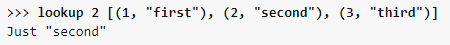
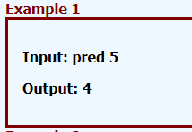
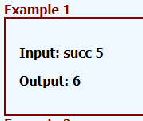
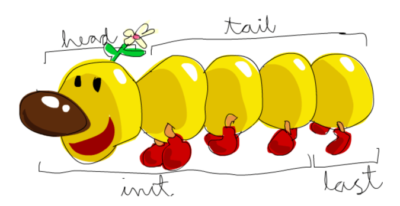

# Handy functions

## no import

**replicate n m:** copy m n times, **example**: replicate 4 x = [x,x,x,x] 

**replicateM**__: Same as replicate but used in **IO**

**length**: returns the size of the list

**lookup**: lookup key assocs looks up a key in an association list

**map**: Take a function and a list and applies that function to every element in the list.

**filter**: Takes a predicate a list and filters out all elements that to do not pass the predicate

**pred**: Returns preceding item in an enumeration (integers and characters in the following examples).

**succ**: Returns following item in an enumeration (integers and characters in the following examples).

## import Data.List (nub,intersperse)

**nub:** removes duplicates from a list

**intersperse y xs**: intersperse function takes an element and a list and puts that element between the elements of the list, **example**: intersperse ',' "abcde" = "a,b,c,d,e"

**delete**: removes the first occurrence of the specified element from its list argument

**filter:** returns the minimum value from the list

