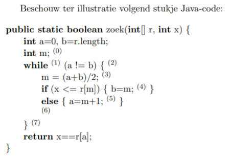
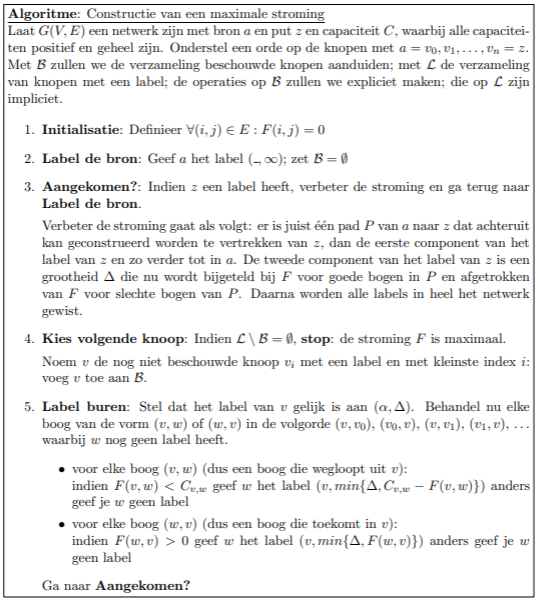
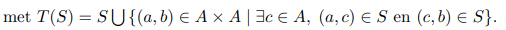

Deze tering begint pas bij hoofdstuk 3, de rest is afval.

# Hoofdstuk 3 Talen, automaten en berekenbaarheid

## 3.1 Strings en talen

### 3.1.1 Strings

**Definitie 3.1:** Een alfabet is een niet-lege, eindige verzameling. De elementen van de verzameling worden symbolen genoemd.

**Voorbeeld 3.1** De verzameling {a,b,c...,z} is een **alfabet**. 

Wanneer het er niet toe doet wat het gebruikte alfabet precies is, gebruiken we vaak het symbool Σ om naar het alfabet te verwijzen, en noteren we de elementen als σ1, σ2, . . .

**Definitie 3.2** Een **string** s over een alfabet  Σ is een eindige rij symbolen uit Σ. 

Het aantal symbolen in die rij noemen we de **lengte** van de string, genoteerd |s|.

De string die uit nul symbolen bestaat, noemen we de lege string, en noteren we λ. Elke andere string kan genoteerd worden door de symbolen waaruit de string bestaat achter elkaar op te schrijven. 

De verzameling van **alle** strings over een alfabet Σ noteren we **Σ***.

**Voorbeeld 3.2** Met een alfabet Σ = {0,1} zijn 001101,1111,1101, en λ allemaal strings, met lengte 6,4,4 en 0. Met Σ = {A,B,C,...,Z,a,b,c,...,z} zijn goedemiddag en Leuven strings over Σ, maar 120 niet.

Een string heeft steeds een eindige lengte (zie de definitie). Een string met oneindig veel symbolen bestaat dus niet. De verzameling van alle strings is dan wel oneindig, omdat er geen maximale lengte aan de strings opgelegd wordt.  Bijvoorbeeld: de verzameling van alle strings over het alfabet Σ = {a} is de verzameling {λ, a, aa, aaa, aaaa, aaaaa, . . .}.

### 3.1.2 Talen

**Definitie 3.3** Een taal over een alfabet **Σ**  is een verzameling strings over **Σ**. (Of nog: een taal over Σ is een deelverzameling van Σ*)

**Voorbeeld 3.3** De verzameling van alle Nederlandse woorden is een taal over Σ = {A,B,C,...,Z,a,b,c,...,z}. De verzameling van alle grammaticaal correcte Nederlandse zinnen en teksten is een taal over een alfabet dat bestaat uit letters, cijfers, leesteken, en de spatie. 

Indien we een alfabet **Σ** vast kiezen, dan kunnen we de volgende bewerkingen uitvoeren op de strings uit Σ*:

- **De concatenatie of samenstelling. **
  Indien x = σ~1~ ,σ~2~  · · · σ~n~ ∈ Σ* en y = µ~1~,µ~2~ · · · µ~m~ ∈ Σ* dan is hun samenstelling 
  		xy = σ~1~,σ~2~ · · · σ~n~µ~1~µ~2~ · · · µ~m~ ∈ Σ*

  In het bijzonder hebben we ook voor elke x ∈ Σ* dat
  λx = xλ = x en λλ = λ. 

- Voor x ∈ Σ* definieren we 
  x^0^ = λ 
  ∀n ∈ N : x^n+1^ = xx^n^

  

**Voorbeeld 3.6** Als x = abba en y = abcd, dan is xy = abbaabcd. Indien x = abb, is x^3^ = abbabbabb.

We kunnen dezelfde bewerkingen uitbreiden tot talen. Zij A, B ⊆ Σ*, dan is 

- AB = {ab | a ∈ A, b ∈ B} 
- A^0^ = {λ}
- ∀n ∈ N(verzameling van natuurlijke getallen) : A^n+1^ = AA^n^ 

Verder definieren we 

- A* = A~0~ ∪ A~1~ ∪ A~2~ ∪ A~3~ ∪ · · · =  

  A^*^ wordt de Kleenesluiting van A genoemd

- A+ = A~1~ ∪ A~2~ ∪ A~3~ ∪ · · · =

### 3.1.3 Reguliere talen.

**Definitie 3.4 (Reguliere Taal)** (kan worden gedefinieerd door een reguliere uitdrukking) Indien Σ een alfabet is, dan wordt de klasse van R van alle reguliere talen over Σ inductief als volgt gedefinieerd:

1. $∅ ∈ R, \{λ\} ∈ R$ en $∀σ ∈ Σ : \{σ\} ∈ R.$
2. Indien $A, B ∈ R$, dan ook $AB ∈ R, A ∪ B ∈ R$ en $A^∗ ∈ R$

Elke taal uit $R$ wordt een **reguliere taal** genoemd

**Voorbeeld 3.9** De taal L~3~ = {11,101,1001,10001,100001,...} op Σ = {0,1} is een reguliere taal, want

1. {1} en {0} zijn reguliere talen
2. {0}* is een reguliere taal
3. {1}{0}* is een reguliere taal
4. L~3~ = {1}{0}*{1} is een reguliere taal

### 3.1.4 Reguliere uitdrukkingen

Ook wel regular expression genoemd voor de duidelijkheid, is dus niks nieuws. Ze proberen natuurlijk weer speciaal te doen door het te vertalen naar het nederlands. godverdommse taalpuristen.

**Voorbeeld 3.10** Veronderstel dat Σ de verzameling van ASCII symbolen is, dan zijn de volgende strings reguliere uitdrukkingen over Σ:

- 123
- Hallo!
- Dag mevrouw.

**Definitie 3.5 (Reguliere uitdrukking)** Indien Σ een alfabet is, dan wordt een reguliere uitdrukking over Σ op inductieve wijze als volgt gedefinieerd:

1. ∅ is een reguliere uitdrukking
2. λ is een reguliere uitdrukking
3. Voor elke σ ∈ Σ is σ een reguliere uitdrukking
4. Indien A en B reguliere uitdrukkingen zijn, dan zijn ook (A), A∗ , A|B en AB reguliere uitdrukkingen.

Zoals hierboven aangegeven bepaalt elke reguliere uitdrukking **ω** een verzameling van strings uit Σ∗ . Deze taal wordt de reguliere verzameling bepaald door **ω** genoemd.

**Stelling 3.1** Voor een gegeven alfabet Σ geldt dat de klasse van de reguliere talen op Σ precies samenvalt met de klasse van de reguliere verzamelingen. Voor elke reguliere taal L bestaat er bijgevolg een reguliere uitdrukking ω, waarvan de bijhorende reguliere verzameling precies L is

## 3.2 Eindige automaten

### 3.2.1 Eindige automaten

Dit schema werkt door een serie van 0'en en 1'en af te gaan en te zien waar je belandt. Het schema zelf bepaalt een taal L. Als je belandt in de dubbele cirkel voldoet de serie aan de taal, als het er niet in belandt dan voldoet deze niet. 

**Beschouw het voorbeeld 11001.** We starten het schema bij de meest linkse cirkel. Omwille van de eerste 1 van de string verplaatsen we ons naar de bovenste cirkel. De tweede 1 uit de string zegt ons naar de rechter cirkel te gaan. Daarna doet de eerste nul ons naar de onderste cirkel gaan en de volgende nul en de laatste 1 doen ons telkens terugkeren naar de onderste cirkel. Op het einde bevinden we ons dus in de onderste cirkel.

Een eindige automaat is een computermodel dat door zo een schema kan worden voorgesteld. De basis-ingredienten van een eindige automaat zijn een eindig aantal toestanden (in het schema voorgesteld door cirkels) waarin de machine zich kan bevinden en vanuit elke toestand "overgangen" afhankelijk van de invoer op dat moment.

**Definitie 3.6 (Eindige automaat)** Een eindige automaat is een 5-tal A = (Q, Σ, δ, q~0~, F) met

- Q een **eindige verzameling**; we noemen de elementen van Q de toestanden van de automaat A.

- F ⊆ Q; F is de verzameling van de **aanvaardbare eindtoestanden**. (De letter F is de eerste letter van het Engelse Final).

- q~0~ ∈ Q; deze toestand wordt de **begintoestand** genoemd.

- Σ een **alfabet**

- δ een **afbeelding**, de transitieafbeelding genoemd, 

  ​									δ : Q × Σ → Q.

Deze automaat kan ook zo voorgesteld worden:

### 3.2.2 Eindige automaten en reguliere talen

Een automaat aanvaardt sommige strings wel, en andere niet. De verzameling van alle strings die aanvaard worden, vormt een taal. We noemen dit de taal bepaald door een automaat; we zeggen ook dat die taal herkend wordt door de automaat.

**Definitie 3.7** Als $A =  (Q, Σ, δ, q_0, F)$ een eindige automaat is, noemen we 
						$L(A) = {x ∈ Σ^*| δ^* (q~0~, x) ∈ F}$

de taal bepaald door de eindige automaat A. Voor een gegeven taal L ⊆ Σ^*^ zeggen we dat A de taal herkent als L = L(A)

**Stelling 3.2** De klasse van talen die herkend worden door een eindige automaat valt precies samen met de klasse van de reguliere talen.

**Stelling 3.3 (Pompstelling)** Voor elke reguliere taal L bestaat er een $n \in \N$, zodat voor elke string $s  ∈ L$ met $|s| ≥ n$, het volgende geldt: er bestaan strings $x,y,z$ zodat $s = xyz$ met $|y| > 0, |xy|≤ n,$ en $∀k ∈ N : xy^kz ∈ L$.

Deze stelling wordt in het Engels het “pumping lemma” genoemd. Ze beschrijft een belangrijke basiseigenschap van reguliere talen: Reguliere talen kunnen willekeurig lange strings bevatten, maar vanaf een zekere lengte zijn die strings noodzakelijkerwijs opgebouwd uit een beperkt aantal “bouwstenen” die eventueel meerdere keren herhaald worden. Het bovenstaande voorbeeld toont aan dat, alhoewel eindige automaten in staat zijn om reguliere talen te herkennen (d.w.z., voor elke reguliere taal bestaat er een automaat die die taal herkent), ze toch beperkt zijn: er bestaan relatief eenvoudige talen die ze niet kunnen herkennen. Ze zijn bijgevolg niet geschikt als realistisch computermodel. In een volgend onderdeel zullen we kennismaken met een krachtiger model: de Turingmachine. Maar eerst kijken we nog even naar een ander soort automaten: de niet-deterministische eindige automaten.

### 3.2.3 Niet-deterministische eindige automaten

De eindige automaten we tot nu toe gezien hebben zijn zogenaamde deterministische machines. Dit betekent dat de machine op elk moment slechts 1 (ondubbelzinnige) instructie te verwerken krijgt en deze instructie slechts op 1 manier kan uitvoeren. We laten nooit de instructie “of ” toe (Doe A of Doe B). Indien we echter aannemen dat we over twee onafhankelijke processoren zouden beschikken, dan zou een opdracht als Doe A of Doe B parallel kunnen uitgevoerd worden. De ene processor zou A kunnen uitvoeren, terwijl de andere B zou kunnen uitvoeren.

Indien we maar over 1 processor beschikken, en we willen toch opdrachten met of-statements uitvoeren, dan moet de machine dus op bepaalde momenten een keuze maken welke van de twee (of meer) mogelijke opdrachten ze zal uitvoeren. Dergelijke machines noemt men niet-deterministische machines.

**Definitie 3.8 (Niet-deterministische eindige automaat)** Een niet-deterministische eindige automaat is een 5-tal A = (Q, Σ, δ, q~0~, F) met

- Q een eindige verzameling (de toestanden van de automaat A).

- F ⊆ Q de verzameling van de aanvaardbare eindtoestanden.

- q~0~ ∈ Q de begintoestand van de automaat.

- Σ het alfabet van de automaat.

- δ een afbeelding

  ​	$δ : Q × (Σ ∪ \left\{λ\right\}) → P(Q).$

Het eerste verschil tussen een gewone eindige automaat en een niet-deterministische ligt in het feit dat de transitieafbeelding δ geen toestanden als beelden heeft, maar verzameling van toestanden. Die verzamelingen kunnen leeg zijn.

Ook niet-deterministische eindige automaten kunnen we schematisch voorstellen met cirkels en pijlen. We laten bij een niet-deterministische machine echter toe dat er vanuit een cirkel meerdere pijlen met hetzelfde label vertrekken. Het label λ mag eveneens gebruikt worden.

**weer veel gezeik, kijk gewoon dit filmpje man**

https://www.youtube.com/watch?v=W8Uu0inPmU8

**Voorbeeld 3.19**

Voor de NFA (non-deterministic finite state automaton) zijn er 3 mogelijkheden voor de string abb.

1. De machine eindigt in toestand q~0~ omdat er steeds voor de loop gekozen wordt
2. De machine eindigt in toestand q~1~ omdat er na 2 loops gekozen wordt om naar q~1~ te gaan.
3. De machine eindigt in toestand q~2~.

We zeggen dat een string aanvaard wordt door een niet-deterministische eindige automaat indien er minstens 1 opeenvolging van keuzes gemaakt kan worden, zo dat de automaat eindigt in een aanvaardbare toestand na het verwerken van de string.

**Definitie 3.9 (Taal bepaald door een niet-deterministische automaat)** Indien A = (Q, Σ, δ, q~0~, F) een niet-deterministische eindige automaat is, noemen we
						$L(A) = \{x ∈ Σ ∗ | δ ∗ (q_0, x) ∩ F \ne ∅\}$

de **taal bepaald door** A
Voor een gegeven taal L ⊆ Σ^*^ zeggen we "A herkent L" als L = L(A)

**Stelling 3.4 **Voor elke niet-deterministische eindige automaat bestaat er een deterministische die dezelfde taal herkent.

Het omgekeerde geldt natuurlijk ook, daar elke deterministische eindige automaat kan aanzien worden als een niet-deterministische automaat. Niet-deterministische eindige automaten kunnen dus niet meer talen herkennen dan deterministische; ze zijn evengoed beperkt tot de klasse van de reguliere talen. Het nut van een niet-deterministische eindige automaat ligt in het feit dat het veel eenvoudiger is om een niet-deterministische eindige automaat te ontwikkelen die een gegeven taal herkent, dan om een deterministische te vinden

## 3.3 Turingmachines

### 3.3.1 Turingmachines

Eindige automaten zijn een wiskundig model voor een zeer eenvoudig soort computers. Ze hebben geen geheugencapaciteit; de enige informatie die ze hebben over de string die ze recent doorlopen hebben, is de toestand waarin ze zich bevinden, en er is maar een eindig aantal verschillende toestanden. Daardoor zijn ze beperkt qua berekeningen: ze kunnen enkel reguliere talen herkennen.

Turingmachines vormen een ander wiskundig model voor een bepaald soort computers, ditmaal wel met een grote geheugencapaciteit. Het model is niet te ingewikkeld, zodat het mogelijk is om bepaalde eigenschappen van dergelijke machines aan te tonen en te behandelen. Aan de andere kant is de klasse van Turingmachines toch krachtig genoeg om alle rekentaken te kunnen uitvoeren die een gewone computer kan uitvoeren.

We kunnen ons een Turingmachine voorstellen als een machine die voorzien is van een magneetband die in twee richtingen kan bewegen. In verschillende fasen van de berekening bevat de band (= het geheugen van dit computermodel!) de invoer voor de berekening, de tussenresultaten, en de uitvoer. De magneetband is een oneindig lange rij van symbolen die bestaat uit een eindige string voorafgegaan en gevolgd door oneindig veel blanco karakters (zie Figuur 3.1).

De machine heeft een lees/schrijfkop en het symbool op de magneetband juist onder de kop noemen we het huidig symbool: de operatie van lezen is daarmee impliciet. De kop kan het huidig symbool overschrijven. Net als een eindige automaat heeft een Turingmachine een eindig aantal mogelijke toestanden, en op elk moment bevindt de machine zich in 1 van die toestanden. Een instructie voor de machine is een voorschrift voor de machine om, in 1 operatie, het huidig symbool te overschrijven met een nieuw symbool, de kop (of de magneetband) 1 positie naar links of naar rechts te bewegen, en naar een nieuwe toestand over te gaan. Welke instructie uitgevoerd wordt, hangt enkel af van de huidige toestand van de machine en het huidige symbool onder de leeskop. Eens gestart, blijft de machine instructies uitvoeren tot zij in een toestand komt waarbij 28 er voor het huidig gelezen symbool geen instructie meer voorhanden is. Op dat moment kan men controleren of de machine al dan niet in een aanvaardbare toestand gestopt is. We schrijven nu het bovenstaande neer in een formele definitie.

**Dit is een hele lang uitleg die ge zou kunnen begrijpen ma als ge het uzelf makkelijk wil maken, kijk dit filmpje: https://www.youtube.com/watch?v=dNRDvLACg5Q**

**Definitie 3.10 (Turingmachine)** Een Turingmachine is een 6-tal M = (Q, Σ, T, P, q~0~, F) met

- Q een eindige verzameling; we noemen de elementen van Q toestanden.

- F ⊂ Q de verzameling van aanvaardbare eindtoestanden

- q~0~ ∈ Q de begintoestand

- Σ het alfabet van de Turingmachine. Dit alfabet bevat, naast mogelijk andere symbolen, minstens een speciaal symbool, het blanco symbool of lege symbool, dat we noteren als #.

- T ⊆ Σ\\{#} is de verzameling van invoersymbolen. De elementen van Σ\\(T ∪ {#}) worden hulpsymbolen genoemd.

- P een functie (niet noodzakelijk een afbeelding)

  ​			 $P : (Q\textbackslash F) × Σ → Q × Σ × {L, R, 0}$

P wordt het programma of de instructieset van de Turingmachine genoemd. (In de verzameling {L, R, 0} staat L voor “Links”, R voor “Rechts” en 0 voor “Blijf staan”, waarmee de beweging van de schrijfkop aangegeven wordt.)

Wanneer we de machine starten bevindt deze zich in de begintoestand q~0~ en staat de leeskop boven het meest linkse, niet blanco symbool van de magneetband. De machine voert dan het programma P uit en dit moet als volgt geïnterpreteerd worden: Noem q de toestand waarin de Turingmachine zich op een bepaald moment bevindt en zij σ ∈ Σ het symbool dat op datzelfde moment door de kop gelezen wordt. Nu zijn er twee mogelijkheden 

1. Het koppel (q, σ) behoort tot het definitiegebied van de functie P. Dit betekent dat P(q, σ) bestaat en gelijk is aan een drietal $(q' , σ' , X) ∈ Q × Σ × \{L, R, 0\}$. Het effect van de uitvoering van deze instructie is dat de Turingmachine haar toestand (eventueel) zal veranderen in toestand q' , dat het huidig gescande symbool σ (eventueel) vervangen wordt door σ~0~ en dat de kop zich beweegt zoals X aangeeft, d.w.z. indien X = L, beweegt de kop zich naar links (of de band naar rechts), indien X = R beweegt de kop naar rechts en indien tenslotte X = 0 blijft de kop ter plaatse. 

2. Indien het koppel (q, σ) niet behoort tot het definitiegebied van P stopt het programma. De toestand q wordt de eindtoestand van de Turingmachine (voor die bepaalde invoer) genoemd. 

   

Indien de Turingmachine gestopt is en de eindtoestand q behoort tot F, dan zegt men dat de invoerstring aanvaard werd, in het andere geval zeggen we dat de invoerstring 29 verworpen werd. Indien een string aanvaard werd, dan beschouwen we de eindige string symbolen op de magneetband (dus zonder de twee oneindig lange uiteinden van blanco symbolen) als de uitvoer van de Turingmachine.

En dan nu een voorbeeld van de werking want deze 3 pagina's aan uitleg waren nog niet genoeg.

**Voorbeeld**

We illustreren deze begrippen aan de hand van een Turingmachine die als invoer een string van nullen en enen neemt en daarvan het meest rechtse symbool uitveegt (d.w.z. vervangt door een blanco symbool.)

De werking van een dergelijke Turingmachine zou er als volgt kunnen uitzien: 

- Bij het begin staat de leeskop op het meest linkse symbool van de string (toestand q0) 
- Daarna zoekt de machine het meest rechtse symbool van de string door de leeskop telkens een positie naar rechts te verschuiven (toestand q~1~). 
- Op het moment dat de leeskop het blanco symbool # leest, bevindt de kop zich 1 positie rechts van de string (toestand q~2~) en moet de kop weer een positie naar links bewegen. 
- Nu moet het ingescande symbool vervangen worden door het blanco symbool # en mag de machine stoppen (toestand h).

Hieronder zie je het hierboven gegeven voorbeeld grafisch voorgesteld.

### 3.3.2 Turingmachines en functies

Computers worden vaak gebruikt om berekeningen uit te voeren. Je kan denken dat de functie 'kwadraat', die van een natuurlijk getal zijn kwadraat bepaalt, berekenbaar is door middel van een computer. Nu heeft een computer geen oneindige opslagcapaciteit en is het dus onmogelijk om de waarde kwadraat(n of zelf het getal n zelf) voor elk natuurlijk getal kan opslaan in zijn geheugen. Toch zien we dit als mogelijk want we kunnen het geheugen van onze computer uitbreiden (in theorie althans). Daarom zeggen we vaak dat de functie **effectief berekenbaar is.** Algemeen noemen we elke functie die berekenbaar is op een machine met onbegrensde opslagcapaciteit effectief berekenbaar.

**Stelling 3.5 (These van Church)** Een functie is **effectief berekenbaar** als en slechts als die functie Turing-berekenbaar is.

Een functie $f: T^* \rightarrow \sum^*$ is **Turing-berekenbaar** als en slechts als er een Turingmachine $M$ bestaat zodanig dat $f = f_M$

**Voorbeeld 3.23** De constante nulfunctie f : N → N : n → 0 is Turing-berekenbaar.

We kiezen voor de unaire representatie van de natuurlijke getallen. Een TM kan de constante nulfunctie als volgt berekenen: Bij om het even wat voor een invoerstring verplaatsen we de leeskop steeds een positie naar rechts waarbij we telkens het ingescande symbool wissen, tot we deze string voorbij zijn. Daarna schrijven we als uitvoer het symbool “1”, de unaire representatie voor 0 op de magneetband.

Een formele beschrijving van deze TM M = (Q, Σ, T, P, q~0~, F) wordt als volgt gegeven: 

- Q = {q0, q1, h}, F = {h} 
- Σ = {1, #}, T = {1} 
- P wordt gegeven door:   
     - P(q~0~, 1) = (q~1~, #, R) 
     - P(q~1~, 1) = (q~1~, #, R) 
     -  P(q~1~, #) = (h, 1, 0)

**Opmerking** We merken hier op dat de bovenstaande TM niet minimaal is (in het aantal toestanden). Je hoeft namelijk niet meteen van toestand q~0~ over te gaan naar een nieuwe toestand. (We illustreren dit in het voorbeeld hieronder.)

### 3.3.3 Turingmachines en talen

Een TM kan met een bepaalde invoer een bepaalde uitvoer associëren en zo functies berekenen. Maar we kunnen een TM ook gebruiken om talen te herkennen. Als de machine eindigt in een aanvaardbare toestand dan is de invoerstring aanvaard. De taal bepaald door de TM is dan de verzameling van alle strings die aanvaard worden.

**Definitie 3.11** De taal bepaald door een Turingmachine M, genoteerd L(M), is de verzameling van alle invoerstrings waarvoor M in een aanvaardbare toestand eindigt. Gegeven een taal L, zeggen we dat L herkend wordt door M als L(M) = L.

**Definitie 3.12** Een taal L wordt Turing-herkenbaar genoemd, als er een TM bestaat die L herkent. Turing-herkenbare talen worden ook recursief opsombare talen genoemd.

**Definitie 3.13** Een TM beslist een taal, als voor elk string $s ∈ L$ de TM in een aanvaardbare toestand eindigt, en voor elke string $s \not\in L$ de TM in een onaanvaardbare toestand eindigt.

**Definitie 3.14** Een taal L wordt Turing-beslisbaar of kortweg beslisbaar genoemd, als er een TM bestaat die L beslist. Turing-beslisbare talen worden ook recursieve talen genoemd.

Merk het verschil op tussen herkennen en beslissen. Als een TM de taal L herkent, betekent dat dat de TM alle en alleen de strings in L aanvaardt. Strings buiten L kunnen verworpen worden, of onbeslist blijven (omdat de machine niet stopt). Als een TM L beslist, betekent dat dat de TM voor elke string beslist of de string in L zit of niet; dit is een strikt strenger criterium.

Ik heb dit een lange tijd niet goed begrepen maar heb eindelijk een goeie definitie gevonden.

Een machine is "**Turing-herkenbaar**" als en slechts als er een Turing Machine bestaat die

1. Wnr die een string tegenkomt in die taal, die deze string aanvaard
2. Wnr die een string tegenkomt in die taal, die deze string rejects  **en stopt of gewoon weg niet stopt.**

Een machine is "Turing-beslisbaar" als en slechts als er een Turing Machine bestaat die 

1. Wnr die een string tegenkomt in die taal, die deze string aanvaard
2. Wnr die een string tegenkomt niet in die taal, de machine deze string reject **en gewoon stopt.**

### 3.3.4 Niet-deterministische Turingmachines

Als we spreken over TMs zonder verdere uitleg, bedoelen we steeds deterministische Turingmachines. We kunnen ook hier een niet-deterministische versie definieren. Deze zullen een belangrijke rol spelen in de analyse van de complexiteit van beslissingsproblemen.

**Definitie 3.15** (Niet-deterministische Turingmachine) Een niet-deterministische Turingmachine M bestaat uit een zestal $M = (Q, Σ, T, P, q_0, F)$ dat aan precies dezelfde voorwaarden voldoet als in definitie 3.10, behalve dat P nu geen functie meer hoeft te zijn, maar slechts een relatie tussen $(Q\textbackslash F) × Σ$ en $Q × Σ × \{L, R, 0\}$.

- Een NDTM $M$ stopt met success bij invoer x (en aanvaardt x) indien $M $ bij minstens één van de mogelijke verwerkingen van $x $ in een toestand in $F $ stopt
- De taal $L(M)$ bepaald door een NDTM $M $ is de verzameling van alle strings over $T $ die door $M $ aanvaard worden.
- De NDTM beslist een taal als de NDTM voor elke invoerstring in eindige tijd beslist of de string in $L(M)$ zit of niet.

**Voorbeeld 3.27** Een NDTM die voor een invoerstring bestaande uit a's en b's nagaat of die string een even aantal a's of b's bevat.

- Toestanden van M: Q = {q~0~,p~0~,p~1~,r~0~,r~1~,h}, F = {h}

- symbolen van M: Σ = {#, a, b}, T = {a, b}

- De instructieset P bestaat uit de koppels:

  ​						

In de instructieset hierboven worden de p–toestanden gebruikt om het even of oneven zijn van het aantal a’s bij te houden, de r toestanden doen hetzelfde voor het aantal b’s. Toestand p0 (resp. r0) duidt een even aantal a’s (resp. b’s) aan, toestand p1 (resp. r1) een oneven aantal.

Er zijn twee mogelijke wegen die de NDTM M kan volgen en deze zijn samen geschetst in figuur 3.3. Zoals je ziet op de figuur heeft de NDTM bij de eerste stap de keuze tussen twee opdrachten (namelijk ((q0, a),(p0, a, 0)) of ((q0, a),(r0, a, 0))). We nemen aan dat een NDTM telkens wanneer er meerdere opdrachten mogelijk zijn, elk van deze mogelijkheden apart maar tegelijkertijd (parallel) behandelt. We zeggen dat een NDTM M met succes stopt bij een bepaalde invoer of ook nog dat de NDTM M een bepaalde string aanvaardt, indien 1 van de gevolgde wegen (en misschien ook meer) in een aanvaardbare eindtoestand stopt. De rekentijd van de NDTM komt overeen met het aantal stappen in de kortste van al die wegen.

## 3.4 Complexiteit van algoritmen

Hoeveel berekeningsstappen heeft een algoritme nodig om de uitkomst te berekenen, hoeveel geheugenruimte is er nodig? Het analyseren van een algoritme om deze vragen te beantwoorden noemen we "complexiteitsanalyse". Dergelijke vragen zijn van belang als we de keuze hebben tussen verschillende algoritmen voor het oplossen van een probleem. 

Hoe hangt de benodigde tijd of geheugenruimte af van de "grootte" of de moeilijkheidsgraad van de invoer? Om dat te beantwoorden, moeten we eerst die grootte kwantitatief kunnen uitdrukken met een of andere parameter. Het verband tussen die parameter en de benodigde rekentijd en geheugenruimte noemen we de respectievelijk de tijdscomplexiteit en de ruimtecomplexiteit van het algoritme.

### 3.4.1 tijdscomplexiteit van algoritmen

**Definitie 3.16 (Tijdscomplexiteit)** De tijdscomplexiteit van een bepaald algoritme $A$ is een functie tijd~A~($n$):  $\N → \N$ die voor een gegeven invoeromvang $n$ het maximum aantal elementaire bewerkingen aangeeft, die door het algoritme A bij een invoeromvang van grootte n zullen worden uitgevoerd.

Uit de definitie volgt onmiddelijk dat tijd~A~(n) een slechtste geval maat is. Het kan goed zijn dat het in de meeste gevallen veel minder dan tijd~A~(n) elementaire bewerkingen moet uitvoeren om tot een resultaat te komen. Dus maakt men vaak analyses van algoritmen met betrekking tot de gemiddelde complexiteit. Dit is wel wat moeilijker dus beperken wij ons tot het slechtste geval.

#### O-notatie

**Definitie 3.17 (De O-notatie)** Indien f en g functies zijn van $\N$ naar  $\R^+$, dan zeggen we "f(n) is O(g(n))" of "f is O(g)" als

​			$∃c ∈ \R^+_0, ∃N ∈ \N, ∀n ∈ \N : n ≥ N ⇒ f(n) ≤ c g(n)$

Men zegt ook wel: f is van orde g, of f wordt asymptotisch gedomineerd door g.

Merk op dat het mogelijk is dat “f is O(g)” en “g is O(f)” allebei gelden.

De O(...) is eigenlijk een upper bound. Dit betekent dus voor het geval hierboven dat f(n) geupperbound is door g(n).

**Definitie 3.18 (Asymptotische equivalentie)** Twee functies f,g: $\N \xrightarrow{} \R^+$ worden asymptotische equivalent genoemd indien
								$f$ is $O(g)$ en $g$ is $O(f)$.

We noteren deze situatie door $f$ is $Θ(g)$ (en dus ook $g$ is $Θ(f)$).

**Definitie 3.9** We schrijven f(n) ~ g(n), of f~g als geldt dat

​							$∀ ∈ \R^+_0 , ∃N ∈ \N, ∀n ≥ N : |f(n)/g(n) − 1| < \epsilon$

of, als limiet geschreven, $\lim_{n \to \infty } \frac{f(n)}{g(n)} = 1$

Het komt neer op het feit dat f(n) en g(n) nauwelijks verschillen. De betekenis van f~g is dat, voor grote n, de verhouding tussen f(n) en g(n) heel dicht bij 1 komt te liggen. Niet te verwarren met Θ. f is Θ(g) betekent dat voor grote n  f even snel is als g, op een constante factor na.

**Voorbeeld 3.29** 

Voor de functies f(n) = 3n en g(n) = 4n 

- f is Θ(g)
- f~g geldt niet 

Voor de functies f(n) = 3n en g(n) = 3n + 2 

- f  is Θ(g)
-  f~g

#### **Polynomiaal versus exponentieel**

In bepaalde gevallen is het nuttig om een grovere opdeling van complexiteit te hebben. In dat kader wordt vooral verschil gemaakt tussen algoritmen met polynomiale tijdscomplexiteit en algoritmen met exponentiële tijdscomplexiteit.

**Definitie 3.20 (Polynomiale tijd)** We noemen een algoritme van polynomiale tijd als en slechts als zijn tijdscomplexiteit $O(n^k)$ is voor een $k\in\N$

**Definitie 3.21 (Exponentiële tijd)** We noemen een algoritme van exponentiële tijd indien zijn complexiteitsfunctie $O$(exp($n^k$)) is, voor een natuurlijk getal k.

#### **Beheersbare en onbeheersbare problemen**

Als we een bepaald probleem hebben kan het zijn dat als we hier een algoritme voor schrijven dat het ons niet lukt om dit polynomiale tijd te doen. Dit kan aan ons liggen maar het kan dat er geen polynomiaal algoritme bestaat voor dit probleem. Dergelijke problemen noemen we in het engels **intractable**;dat betekent zoveel als “onbeheersbaar” of “onhandelbaar”.

Een voorbeeld waarvan men vermoedt dat het onbeheersbaar is.  Het probleem heet het Handelreizigersprobleem en wordt als volgt geformuleerd:

**Gegeven**: n steden c~1~, c~2~, . . . , c~n~. Tussen elk paar steden c~i~ en c~j~ kent men ook de afstand d~i,j~ . Probleem: De handelsreiziger vertrekt in 1 welbepaalde stad (zeg c~1~) en wil een rondreis maken zodat hij elk van de steden c~2~, c~3~, . . . , c~n~ precies 1 keer bezoekt en vervolgens naar zijn beginpunt c~1~ terugkeert (zonder nog andere steden te bezoeken). De vraag is nu: welke weg moet de handelsreiziger volgen om een zo klein mogelijke afstand af te leggen.

De huidige oplossing is niet efficiënt  want we voeren zeker meer dan een veelvoud van (n-1)! stappen in dit algoritme uit.

### 3.4.2 Het bepalen van de complexiteit in enkel concrete voorbeelden

**Voorbeeld 3.30** Wat is de tijdscomplexiteit van volgend algoritme, dat de som berekent van alle elementen van een n × n matrix a (in functie van n = a.length)?

Tijdens de uitvoering van dit programma wordt eenmaal de bewerking “som=0”, uitgevoerd. Aan de variable i wordt n (met n = a.length) keer een waarde toegekend, aan de variable j wordt n 2 keer een waarde toegekend (voor elke keer dat aan i een waarde wordt toegekend, wordt aan j na elkaar de waarden 1,2,. . . ,n toegekend. Het is ook duidelijk dat de bewerking “som+=a[i][j]”, n 2 keer zal uitgevoerd worden. Hieruit kunnen we besluiten dat de tijdscomplexiteit van dit algoritme O(n 2 ) is (op voorwaarde dat de tijdscomplexiteit van de bewerking in de lus constant is).

Het voorbeeld toont ook aan dat bij het bepalen van de tijdscomplexiteit van een geneste lus, het nodig en voldoende is om na te gaan hoe vaak de meest inwendige opdracht (of opdrachten) wordt (worden) uitgevoerd.

**Voorbeeld 3.31** Wat is de complexiteit van volgende programma-onderdeel (in functie van n)?

Het volstaat ook hier te berekenen hoeveel keer de bewerking "som++" moet uitgevoerd worden. Noem dit aan tal $T(n)$. In de praktijk blijkt het vaak handig om een verband op te stellen tussen $T(n)$ en $T(n+1)$ om zodoende meer informatie te bekomen over de functie $T(n)$ zelf.

Indien we $n$ vervangen door $n+1$ en het algoritme terug uitvoeren, dan doen we een hele tijd precies hetzelfde totdat $i$ de waarde $n+1$ aanneemt. Bij $i=n+1$ wordt de bewerking "som++", nog $(n+1)^2$ keer uitgevoerd (eenmaal voor elke waarde van j tussen 1 en $(n+1)^2$). We vinden dus dat.
						$T(n+1)=T(n)+(n+1)^2$(bovendien geldt $T(1)=1$) 

Een dergelijk verband van de vorm $T(n+1)=T(n)+f(n)$ (met $f(n)$ een willekeurige functie) wordt een recursie betrekking genoemd.

**Eigenschap 3.1** Indien een afbeelding $T:\N \rightarrow{} \R$ voldoet aan recursiebetrekking

​					$∀n ∈ \N : T(n + 1) = T(n) + f(n)$

voor een veelterm $f(n)$ van graad $k \ge 0$, dan is $T(n)$ zelf een veelterm van graad $k+1$

## 3.5 Complexiteitsklassen van beslissingsproblemen

### 3.5.1 de klassen P en NP

**Turingmachines en de klasse P**

We hebben eerder gesteld dat er een essentieel verschil is tussen **polynomiale** algoritmen, die we beheersbaar (“**tractable**”) noemen, en algoritmen waarvan de tijdscomplexiteit niet door eender welke polynoom **gedomineerd** wordt (onbeheersbaar, of “**intractable**”). Het lijkt dan logisch om die lijn door te trekken naar de complexiteit van problemen. Dat leidt tot de definitie van de klasse **P** .

**Definitie 3.22 (Polynomiale beslisbaarheid)** Een taal L wordt in polynomiale tijd beslist door een TM M, indien er een $k ∈ \N$ bestaat zodat M voor elke invoerstring $s$ beslist $s ∈ L$, in een aantal stappen dat $O(n^k)$ is, met n = |s| de lengte van de invoerstring. Een taal $L$ is **polynomiaal beslisbaar** als er een TM bestaat die de taal in polynomiale tijd beslist.

**Definitie 3.23 (De klasse P)** Men duidt met $P$ de klasse aan van alle talen waarvoor geldt dat er een TM bestaat die die taal in polynomiale tijd beslist.

**Niet-deterministische Turingmachines en de klasse NP**

We hebben eerder niet-deterministische Turingmachines gezien. Analoog aan de klasse **P** van talen die polynomiaal beslist kunnen worden door een **Turingmachine**, kunnen we ook een klasse **NP** definiëren van talen die polynomiaal beslist kunnen worden door een **NDTM**

**Definitie 3.24** *Tijdscomplexiteit van een **NDTM***
De tijdscomplexiteit tijd~M~: $\N\xrightarrow{}\R^+$ voor een NDTM M wordt gedefinieerd als

**Definitie 3.25 (NDTM van polynomiale tijd)** Een niet-deterministische Turingmachine M heet van polynomiale tijd als en slechts als tijd~M~(n) $O(n^k)$ is, voor een $k∈ \N$

**Definitie 3.26 (Niet-deterministisch polynomiaal herkenbaar)** Een taal L wordt herkend in polynomiale tijd door een NDTM M, indien M L herkent en M van polynomiale tijd is. Een taal L is niet-deterministisch polynomiaal herkenbaar als er een NDTM bestaat die L herkent in polynomiale tijd.

**definitie 3.27 (De klasse NP)** Men duidt met **NP** de klasse aan van alle talen die beslisbaar en niet-deterministisch polynomiaal herkenbaar zijn.

Aangezien elke deterministische TM ook kan aanzien worden als een niet-deterministische TM (maar dan een die toevallig telkens maar 1 mogelijkheid openlaat voor de volgende stap) hebben we onmiddelijk dat

​											$P ⊆ NP$

### Polynomiaal verifieerbaar

**Definitie:** Een taal $L$ is polynomiaal verifieerbaar als en slechts als er een TM $M$ bestaat, zo dat voor elke string $s$ een andere string $c$ bestaat, een zogenaamd certificaat, zodat geldt: $M$ aanvaardt de string $(c,s)$ in een tijd polynomiaal $|s|$ als en slechts als $s \in L$.

**(alternatieve) definitie:** Men duidt met $NP$ de klasse aan van alle polynomiaal verifieerbare talen.

Met andere woorden er bestaat een algoritme dat kan kijken of de gegeven oplossing juist is of niet in polynomiale-tijd.

**Definitie 3.31 (Polynomiale equivalentie van talen)** Twee talen $L_1$ en $L_2$ worden polynomiaal equivalent genoemd, notatie $L_1 \textasciitilde L_2$ , indien

- $L_1 ∝ L_2$ en $L_2 ∝ L_1$

**Eigenschap 3.4** De relatie ~ is een equivalentierelatie

**Definitie 3.30 (Polynomiale transformatie van een taal)** Zij gegeven twee talen $ L_1 ⊆ T_1^*$ (op een alfabet T~1~) en $ L_2 ⊆ T_2^*$ (op een alfabet T~2~). We zeggen dat L~1~ **polynomiaal transformeert** in L~2~ indien er afbeelding $f:T^*_1\xrightarrow{} T^*_2$ bestaat waarvoor de volgende twee zaken gelden:

1. $∀x ∈ T^∗_1 : x ∈ L_1 ⇔ f(x) ∈ L_2$
2. Er bestaat een (deterministische) TM die *f* in polynomiale tijd berekent

We noteren deze situatie door $L1 ∝ L2$

**Stelling 3.7** De relatie $∝$ is transitief. Met andere woorden, indien we drie talen $L_1,L_2$ en $L_3$ gegeven hebben met $L_1 ∝ L_2$ en $L_2 ∝ L_3$ dan is ook $L_1 ∝ L_3$

**Stelling 3.8** Gegeven twee talen $L_1$ en $L_2$. Indien $L_1∝L_2$ en $L_2 \in P$ dan is ook $L_1 \in P$.

### 3.5.2 De klasse NP-Compleet

Naast **P** en **NP** is nog een derde klasse erg belangrijk: de klasse van "**NP-complete**" problemen. Ruwweg kunnen we zeggen dat we de ene taal als "niet moeilijker te beslissen" beschouwen dan een andere, als er een polynomiaal algoritme bestaat om eender welk woord uit de eerste taal te vertalen in een woord uit de tweede taal. 

**Definitie 3.32 (De klasse NPC)** Een taal $L$ is **NP**-compleet als en slechts als

1. $L \in NP$ 
2. Voor elke andere taal $L' \in NP$ geldt dat $L'∝L $.

De klasse van alle **NP**-complete talen duiden we aan door **NPC**

**Stelling 3.9**

1. **NPC** is een equivalentieklasse voor de relatie $ \textasciitilde $
2. Indien **NPC** $\cap$ **P** $\ne \empty$ dan is **NP = P**

De vorige stelling toont dus aan dat indien er 1 **NPC**-probleem is dat behoort tot de klasse van de problemen die oplosbaar zijn in polynomiale tijd, alle problemen binnen de klasse **NP** in polynomiale tijd oplosbaar zijn. Alles wijst er echter op dat de klasse **NP** niet samenvalt met de klasse **P**. 

**Stelling 3.10 (Stelling van Cook)** *SAT* is **NP**-compleet

**Stelling 3.11** Gegeven twee talen $L_1$ en $L_2$ die beide in **NP** zitten. Als $L_1 ∝ L_2$ en $L_1 \in $ **NPC**, dan is ook $L_2 \in$ **NPC**.

# Hoofdstuk 4 Grafentheorie

Dit is echt een cools momentje, altijd plezierig. (tim hier, 4 maanden later. Het is niet meer plezierig :smile: :gun:)

## 4.1 Inleiding

### **4.1.3** Voorbeeld

Snel voorbeeld aan de hand van een voorbeeld dat iedereen wel kent. De boer, de wolf, de kool en de geit.

Hierboven zie je de graaf die alle mogelijke opties geeft. Als je dan links vanboven begint en dan naar rechts boven probeert te gaan, is dat je oplossing. 

Zie boek voor meer voorbeelden uwu

## 4.2 Grafen

### 4.2.1 Basisdefinities

**Multiverzameling:** Een multiverzameling lijkt op een verzameling, met als enige verschil dat het zelfde element meerdere keren kan voorkomen in een multiverzameling.

**Multipaar:** Een multipaar is een multiverzameling met 2 elementen.

Bv. {1,1,2,3,5,5,5} is een multiverzameling waarin 1 twee keer voorkomt, en 5 zelfs drie keer. {1,2} is een multipaar, {2,2} ook. De volgorde van de elementen in een multiverzameling heeft geen belang.

**Definitie 4.1 Graaf** Een graaf is een drietal $(V, E,φ)$, met $V$ een verzameling waarvan de elementen knopen genoemd worden; E een verzameling waarvan de elementen bogen genoemd worden; en $φ: E → M_2(V)$ een functie die met elke boog twee knopen associeert. 

**Voorbeeld 4.1** De graaf $G = (V, E, φ)$ met $V = \{a, b, c, d\}, E = \{e_1, e_2, e_3, e_4\}$, en 

- $φ(e_1) = (a, b)$
- $ φ(e_2) = (b, c)$
-  $φ(e_3) = (b, c)$
- $ φ(e_4) = (d, d)$ 

kan als volgt getekend worden:

**Definitie 4.2 (Lus)** Een lus is een boog e waarvoor geldt dat er een v ∈ V bestaat zo dat φ(e) = (v, v). M.a.w. een lus is een boog die een knoop met zichzelf verbindt.

**Definitie 4.3 (Parallelle bogen)** In een graaf G(V, E, φ) noemen we de bogen e~1~ en e~2~ parallelle bogen als en slechts als φ(e1) = φ(e2). M.a.w. twee bogen zijn parallel als en slechts als ze dezelfde knopen met elkaar verbinden.

**Definitie 4.4 (Enkelvoudige graaf)** Een enkelvoudige graaf is een graaf die noch lussen, noch parallelle bogen bevat.

**Definitie 4.5 (Graaf)** Een graaf is een koppel $(V, E)$, met $V$ een verzameling knopen, en $E$een multiverzameling van multiparen uit $V$.

**Definitie 4.6 (Graad)** De graad van een knoop v, genoteerd $δ(v)$, is het aantal bogen dat op v invalt. Een lus telt hierbij voor twee (omdat de lus twee keer op de knoop invalt).

**Stelling 4.1** Het aantal bogen in een graaf is steeds de helft van de som van de graden.

**Stelling 4.2** De som van de graden van alle knopen in een graaf is steeds even.

**Stelling 4.3** Het aantal knopen met oneven graad in een graaf is altijd even.

---> De laatste 3 stellingen zijn allemaal eigenlijk triviaal en is gewoon een logisch van het geval dat als ge een boog toevoegt dat deze verbonden is met 2 knopen en dus de som van de graden stijgt met 2. Maar natuurlijk moeten we moeilijk doen dus hieronder het bewi

### 4.2.2 Paden

**Definitie 4.7 (Pad)** Een pad in een graaf G(V,E) is een rij bogen van de vorm (v~0~,v~1~),(v~1~,v~2~),...,(v~n-1~,v~n~) waarbij ∀i : (v~i~ , v~i+1~) ∈ E.

We noteren een pad (v~0~,v~1~),(v~1~,v~2~),...,(v~n-1~,v~n~) soms ook als (v~0~,v~1~,...,v~n-1~,v~n~). Het aantal bogen in het pad noemen we de lengte van het pad. Het pad van lengte 0 noemen we het lege pad.

**Definitie 4.8 (Enkelvoudig pad)** Een enkelvoudig pad is een pad (v~0~,v~1~,...,v~n-1~,v~n~) waarvan alle knopen verschillend zijn, d.w.z, ∀i, j : i /= j ⇒ v~i~ /= v~j~ .

**Definitie 4.9 (Kring, enkelvoudige kring)** Een kring is een pad ((v~0~,v~1~),(v~1~,v~1~),...,(v~n-1~,v~n~)) waarin alle bogen verschillend zijn, en waarvoor v~0~ = V~n~(eerste en laatse knoop uwu). Een enkelvoudige kring is een kring waarin ook alle knopen verschillend zijn, afgezien van v~0~ = v~n~.

**Definitie 4.10 (Samenhangende grafen)** Een graaf is samenhangend als en slechts als tussen elke twee knopen van de graaf een pad bestaat.

**Definitie 4.11 (Hamiltoniaans pad, Hamiltoniaanse kring)** Zij gegeven een graaf G. Een Hamiltoniaans pad van G is een pad waarin elke knoop van G precies 1 keer voorkomt. Een Hamiltoniaanse kring van G is een enkelvoudige kring waarin elke knoop van G voorkomt.

 **Definitie 4.12 (Euleriaans pad, Euleriaanse kring)** Zij gegeven een graaf G. Een Euleriaans pad van G is een pad waarin elke knoop van G minstens 1 keer, en elke boog van G precies 1 keer voorkomt. Een Euleriaanse kring van G is een Euleriaans pad dat ook een kring is.

  **Stelling 4.4** Een graaf G heeft een Euleriaanse kring als en slechts als de graaf samenhangend is en elke knoop een even graad heeft.

.

**Stelling 4.5** Een graaf G heeft een Euleriaans pad als en slechts als de graaf samenhangend is en hoogstens 2 knopen een oneven graad hebben.

### 4.2.3 Deelgrafen en componenten

**Definitie 4.13 (Deelgraaf)** Een graaf G'(V' , E' ) is een deelgraaf van een graaf G(V, E), genoteerd G'' ⊆ G, als en slechts als V' ⊆ V en E' ⊆ E.

**Definitie 4.14** **(Geinduceerde deelgraaf)** Gegeven een graaf G(V, E) en een deelverzameling V' ⊆ V noemen we G' (V' , E' ) de deelgraaf van G geinduceerd door V' als en slechts E' = {(v, w) ∈ E|v, w ∈ V'}.

**Definitie 4.15 (Component)** Een graaf G(V, E) is een component van een graaf G' (V' , E' ) als en slechts als G ⊆ G' , G is niet leeg, G is samenhangend, en er bestaat geen samenhangende graaf G'' waarvoor G ⊂ G'' ⊆ G' .

De componenten van een graaf G vormen een partitie van G, d.w.z.: elke knoop en boog komt voor in precies 1 component van G.

**Hieronder vind je alles van hierboven uitgelegd in voorbeelden.**

### 4.2.4 Gerichte grafen

Bij een gewone graaf geven de bogen een symmetrische relatie aan: als v verbonden is met w, is w automatisch ook verbonden met v. Soms hebben we grafen nodig waarin de bogen een richting hebben. Er kan dan een boog van v naar w zijn zonder dat er een boog van w naar v is. Dat leidt tot het concept van een gerichte graaf.

**Definitie 4.16 (Gerichte graaf)** Een gerichte graaf (Eng. directed graph of digraph) is een koppel (V, E), met V een verzameling waarvan de elementen knopen genoemd worden, en E ⊆ V^2^ een verzameling koppels

**Definitie 4.17 (Gericht pad, ongericht pad)** Een gericht pad in een gerichte graaf G(V, E) is een pad (v~0~, v~1~, . . . , v~n~) met ∀~i~ : (v~i~ , v~i+1~) ∈ E. Een ongericht pad is een pad (v~0~, v~1~, . . . , v~n~) met ∀~i~ : (v~i~ , v~i+1~) ∈ E ∨ (v~i+1~, v~i~) ∈ E.

## 4.3 Voorstellingen van grafen

We hebben grafen tot nog toe gewoonlijk als tekeningen voorgesteld, of als koppels (V, E) met V een verzameling knopen en E een verzameling bogen. Er zijn nog andere voorstellingen mogelijk. In deze sectie bekijken we matrixvoorstellingen van grafen. Een voordeel van deze voorstellingswijze is dat allerlei nuttige berekeningen met grafen dan met behulp van matrixoperaties kunnen gebeuren.

### 4.3.1 Buurmatrix

**Definitie 4.18 (Buurmatrix)** Gegeven een enkelvoudige graaf G(V,E), met V = {v~1~, v~2~, . . . , v~n~}, is de buurmatrix van G een n × n-matrix A met A~ij~ = 1 <=> (v~i~,v~j~) ∈ E, en A~ij~ = 0 ⇔ (v~i~ , v~j~ ) /∈ (geen element van) E.

Ik had eerst echt totaal niet door wat er met een buurmatrix bedoelt werd ma das gewoon een matrix van een graaf en als ge een 1 hebt op een plek betekent dat die 2 noden verbonden zijn op de graaf. Eigenlijk niet zo moeilijk.

**Stelling 4.7** Als A de buurmatrix van een enkelvoudige graaf G(V,E) is, geldt voor A^k^ het volgende: voor alle i en j is A^k^~ij~ gelijk aan het aantal verschillende paden van lengte k tussen v~i~ en v~j~

### 4.3.2 Booleaanse buurmatrix

4.3.2 Booleaanse buurmatrix In plaats van matrices met getallen kunnen we ook booleaanse matrices definieren. Booleaanse matrices hebben booleaanse waarden in hun cellen staan. Som en product van dergelijke matrices worden op de gebruikelijke manier gedefinieerd, met dit verschil dat de som van twee getallen hier een disjunctie van twee booleaanse waarden wordt, en het product van twee getallen een conjunctie van booleaanse waarden. Dit wil zeggen dat het product van twee Booleaanse matrices A en B gedefinieerd wordt als P = A · B ⇔ ∀~i, j~ : P~ij~ = A~i1~ ∧ B~1j~ ∨ A~i2~ ∧ B~2~ ∨ · · · ∨ A~in~ ∧ B~nj~ = 

en hun som als 

​					S = A + B ⇔ ∀i, j : S~ij~ = A~ij~ ∨ B~ij~

 We kunnen van de buurmatrix een booleaanse versie definieren

**Stelling 4.8** Als B de booleaanse buurmatrix van G(V, E) is, geldt voor B^k^ het volgende: voor alle i en j is B^k^~ij~ equivalent met “er bestaat een pad van lengte k van v~i~ naar v~j~”.

**Bewijs:** Wordt als oefening gelaten. Dit kan bewezen worden op dezelfde manier als de vorige stelling, of je kan gebruik maken van de vorige stelling en van de eigenschap dat “er bestaat een pad” overeenkomt met “het aantal paden is strikt groter dan 0”.

**Stelling 4.9** Als B de booleaanse buurmatrix van G(V, E) is, geldt voor S =  het volgende: voor alle i en j is S~ij~ equivalent met “er bestaat een pad van lengte l of korter tussen v~i~ en v~j~”.

**Bewijs:** Wordt als oefening gelaten. 

### **4.3.3 Incidentiematrix**

**Definitie 4.20 (Incidentiematrix) **Gegeven een enkelvoudige graaf G(V, E), met V = {v~1~, v~2~, . . . , v~n~} en E = {e~1~, e~2~, . . . , e~m~}, is de incidentiematrix van G een n × m matrix A met A~ij~ = 1 als ej invalt op v~i~ , en A~ij~ = 0 in alle andere gevallen.

## 4.4 Isomorfisme

**Defintie 4.21 (Graaf-isomorfisme)** Twee grafen G(V, E) en G' (V' , E') zijn isomorf als en slechts als er een bijectie h : V → V' bestaat, zo dat {h(x)|x ∈ V } = V' en {(h(x), h(y))|(x, y) ∈ E} = E'

De functie h stelt een “hernoeming” van de knopen voor; ze beeldt elementen van V af op elementen van V'. Als twee grafen isomorf zijn, moeten de knopen van de eerste graaf hernoemd kunnen worden, zo dat, na toepassing van die hernoeming op V en E, V' en E' bekomen wordt

**Isomorfisme** komt er eigenlijk op neer dat V en E van beide grafen gelijk zijn, op de namen van de elementen na.

**Al deze grafen zijn isomorf!**

**Stelling 4.10** Twee enkelvoudige grafen zijn isomorf als en slechts als er een ordening van de knopen bestaat zodat hun buurmatrix gelijk is.

**Stelling 4.11** Twee grafen G en G' zijn isomorf als en slechts als er een ordening van de knopen en bogen bestaat waarvoor de incidentiematrices van G en G' gelijk zijn.

**Bewijs**: Het bewijs wordt als oefening gelaten.

### 4.4.1 Graaf-isomorfisme testen

Gegeven twee grafen G~1~(V~1~) en G~2~(V~2~, E~2~) , hoe kunnen we testen of ze isomorf zijn? Het is duidelijk dat als |V~1~| $\neq$ |V~2~|, er geen bijectie tussen de knopen bestaat, en de grafen dus zeker niet isomorf zijn. In het volgende gaan we ervan uit dat |V~1~| = |V~2~| = n. Een eenvoudig algoritme is het volgende: beschouw alle mogelijke bijecties f van V~1~ naar V~2~, en test voor elke f of E~2~ = {(f(v), f(w))|(v, w) ∈ E~1~}. Van zodra een f gevonden wordt waarvoor dit het geval is, eindigt het algoritme met “ja” als antwoord. Er zijn eindig veel bijecties; als ze allemaal geprobeerd zijn zonder een bijectie met de vermelde eigenschap te vinden, eindigt het algoritme met “nee”. Als de grafen n knopen hebben, zijn er n! bijecties uit te testen. Dit algoritme heeft dus een exponentiele complexiteit. Het nagaan of een bijectie voldoet aan de vermelde eigenschap is relatief eenvoudig, dit kan in polynomiale tijd. Dat betekent dat het probleem in NP zit. Voor dit probleem is momenteel niet bekend of het in P zit, en er is ook niet aangetoond dat NP-compleet is. In principe is het dus mogelijk dat het representatief is voor een complexiteitsklasse die “tussen” P en NPC in zit. 

**P = Polynomial time**

**NP = Non-deterministic polynomial time**

Een verwant probleem is het beslissen van subgraaf-isomorfisme: 

Gegeven twee grafen G1 en G2, bestaat er een subgraaf G ⊆ G2 zo dat G1 isomorf is met G? 

Van subgraaf-isomorfisme is bekend dat het **NP**-compleet is. Hoewel graaf-isomorfisme moeilijk is, bestaan er algoritmen die gemiddeld vrij snel beslissen of twee grafen isomorf zijn. Het is vrij eenvoudig om voorwaarden te definieren waaraan twee isomorfe grafen altijd voldoen, en die snel na te gaan zijn: 

- Het aantal knopen moet gelijk zijn. 
- Het aantal bogen moet gelijk zijn. 
- Het aantal knopen met graad i moet gelijk zijn, voor elke i ∈ N. 
- . . . 

Een algoritme kan bv. gemakkelijk een tabel opstellen met voor elke i het aantal knopen met graad i in G1, en hetzelfde voor G2, en dan nagaan of die tabellen gelijk zijn; dit kan in polynomiale tijd. Wanneer twee grafen aan alle voorwaarden voldoen, dan pas is het nodig om een algoritme met hogere complexiteit te gebruiken. Dan nog kan het aantal bijecties dat bekeken moet worden, sterk gereduceerd worden: het is bv. niet zinvol om bijecties te bekijken die een knoop met graad g afbeelden op een knoop met graad g' > g. ==Het totaal aantal bijecties wordt dan gereduceerd van n! naar n~1~!n~2~! · · · n~k~!, met n~i~ het aantal knopen met graad i. Dat is een veel kleiner getal.==

effe uitleg voor het gearceerde deel, n is het aantal knopen. Dus wat ze willen zeggen is dat de faculteit van n kleiner is dan het product van de faculteiten van het aantal knopen met een bepaalde graad.

## 4.5 Gewogen grafen

In dit gedeelte bekijken we grafen waarvoor aan elke boog e een gewicht w(e) ∈ R + 0 toegekend is. Het gewicht van een graaf, en het gewicht van een pad, definiëren we als de som van de gewichten van de bogen in die graaf (op dat pad). Het kortste pad tussen a en b is bij definitie het pad tussen a en b met het kleinste gewicht. classic gps dus.

### 4.5.1 Het kortste-pad-algoritme van Dijkstra

We beginnen met een lichtjes vereenvoudigde versie van het **Dijkstra** algoritme. Dit algoritme berekent enkel het gewicht van het kortste pad, niet het pad zelf. Daarna zullen we het uitbreiden zodat het ook het pad zelf aanduidt.

### 4.5.2 Dijkstra, versie 1

Het volgende algoritme berekent het gewicht van het kortste pad van een gegeven knoop a naar een gegeven knoop z in een enkelvoudige, samenhangende, gewogen graaf G(V, E) met a, z ∈ V .

Dit algoritme heeft de volgende eigenschap: na afloop is L(z) gelijk aan het gewicht van het kortste pad van a naar z. Dat is niet zo heel gemakkelijk in te zien, en daarom zullen we het bewijzen. Alvorens we dat doen, introduceren we eerst het concept invariante eigenschap, ook wel invariante relatie of kortweg invariant genoemd. Wie reeds vertrouwd is met dit begrip, kan de volgende sectie overslaan, of enkel de cursieve paragrafen lezen.

**Interludium: Invarianten**

Een invariant van een algoritme is een bewering die we met een bepaald punt in het algoritme associëren, en waarvan we kunnen aantonen dat die altijd waar is wanneer tijdens de uitvoering van het algoritme dat punt bereikt wordt. 

Bijvoorbeeld, wanneer ergens in een algoritme y = x*x; staat, weten we zeker dat vlak na de uitvoering van die instructie geldt dat y = x 2 , en ook y ≥ 0. In het volgende stukje code:

**^(1)^ if (x % 2 == 1) { ^(2)^ x++;} ^(3)^**

weten we op plaats ^(1)^ niets over x. Op plaats ^(2)^ weten we dat x oneven is (anders zou de uitvoering dat punt niet bereikt hebben). Op plaats ^(3)^ weten we zeker dat x even is: ofwel was x bij ^(1)^ oneven en dan is x met 1 opgehoogd (dus even geworden), ofwel was het even en is er niets veranderd. Het vinden van een geschikte invariant is heel vaak de sleutel tot het bewijzen van de correctheid van een algoritme. Een goede invariant moet twee eigenschappen hebben:

1. we moeten gemakkelijk kunnen bewijzen dat de invariant waar is, op bepaalde plaatsen in het programma;
2. uitgaande van de invariant moeten we gemakkelijk kunnen bewijzen dat het algoritme correct is.

**rip voor de mensen die dit moeten kennen, ik voel uw pijn.**

We beweren het volgende: Als r een rij getallen is die geordend is van klein naar groot, dan geeft zoek(r,x) als resultaat true terug als en slechts als x in r voorkomt. Hoe kunnen we dit bewijzen? De sleutel is om de juiste invariant te vinden. Meestal vinden we die door onze eigen intu¨ıtie over waarom het programma goed werkt, te analyseren. In dit geval is de redenering: het stuk van rij r waarin we x zoeken (het stuk tussen a en b), wordt steeds kleiner gemaakt, op zo’n manier dat we zeker zijn dat als x in r voorkomt, het in dat stuk moet voorkomen. De invariante eigenschap is dus: x komt voor in r ⇔ x komt voor tussen a en b; of, formeler: (∃i : r[i] = x) ⇔ (∃i, a ≤ i ≤ b : r[i] = x). Laten we deze invariant I noemen. Het bewijs van correctheid van dit algoritme gaat dan als volgt, per inductie op het aantal keer dat de lus uitgevoerd wordt (m.a.w. we bewijzen dat I geldt bij het begin van de eerste uitvoering van de lus, en dat, als I geldt bij het begin van de n-de uitvoering, dan ook bij het begin van de n + 1-de uitvoering). 

**<u>Initialisatie:</u>** In het begin is a = 0 en b = r.length. I is dan triviaal waar (er zijn geen andere elementen in r dan die tussen a en b). De eerste keer dat de while-lus uitgevoerd wordt, geldt I dus op punt (1) . 

**<u>Onveranderlijkheid:</u>** Stel dat I geldt op punt (1). Dan geldt I nog steeds op punt (2) en punt (3); op punt (3) geldt daarenboven a ≤ m < b (waarom?). Op punt (4) geldt I niet meer automatisch, want we hebben b nu een andere waarde gegeven. We weten wel dat x ≤ r[m] en m = b, waaruit x ≤ r[b] volgt. Omdat r geordend is, geldt ∀i > b : r[i] > x, dus als er een i is waarvoor r[i] = x, dan is i ≤ b. Hieruit volgt dat I op dit punt opnieuw geldt. Analoog kunnen we tonen dat I geldt bij punt (5). Punt (6) wordt bereikt via (4) of (5); aangezien I zowel bij (4) als (5) geldt, geldt het ook bij (6) . Bijgevolg geldt I op het einde van de lus, en dus bij het begin van de volgende uitvoering (1). Hiermee is de onveranderlijkheid van I bewezen. Wanneer de lus eindigt, gaan we van punt (1) direct naar (7); daar geldt I en a = b (anders was de lus niet gestopt). Samen levert dit op: (∃i : r[i] = x) ⇔ (r[a] = x). M.a.w., de methode geeft true terug als en slechts als x in r zit. Hiermee is bewezen dat, als het algoritme eindigt, het zeker een correct resultaat geeft. We moeten nog bewijzen dat het altijd eindigt. Op punt (3) geldt a ≤ m < b; na gelijkstellen van b aan m of a aan m + 1 geldt nog steeds a ≤ b en is b − a met minstens 1 verminderd. Omdat bij elke uitvoering van de lus b − a verkleint zonder dat b − a < 0 kan worden, moet na een eindig aantal stappen b − a = 0 gelden, dus a = b, en eindigt het algoritme.

**Correctheidsbewijs voor Dijkstra's algoritme**

We zullen twee invarianten invoeren voor Dijkstra’s algoritme. Alvorens we dat doen, introduceren we wat bijkomende terminologie, die helpt om de redenering intuïtief te kunnen volgen. De elementen van R zullen we rode knopen noemen (naar analogie met de illustratie van het algoritme op het bord). Een knoop aan R toevoegen is hetzelfde als een knoop rood kleuren. Een rood pad is een pad waarvan alle knopen, behalve eventueel de laatste, rood zijn. (Merk op dat een leeg pad volgens deze definitie ook 97 als rood beschouwd wordt.) We schrijven het gewicht van een pad P als w(P), en het gewicht van het kortste pad van a naar v noteren we λ(v). We moeten dus bewijzen dat na afloop van het algoritme, L(z) = λ(z). De twee invarianten die we zullen gebruiken, zijn:

 **Invariant I~1~**: voor elke v ∈ V geldt: L(v) is het gewicht van het kortste rode pad van a naar v, of oneindig als er nog geen rood pad naar v bestaat. 

**Invariant I~2~**: voor elke v ∈ R geldt: L(v) = λ(v). We bewijzen eerst dat beide invarianten gelden op de plaats aangeduid met (*) in het algoritme (d.w.z., op het moment dat het programma de test van de while-lus uitvoert om te controleren of het de lus nog een keer moet uitvoeren). Daarna tonen we hoe de correctheid van het programma hieruit volgt.

**Lemma 4.11 De invarianten I~1~ en I~2~ gelden altijd op punt (*) in het algoritme.**

 **Bewijs:** We bewijzen dit door inductie op het aantal keer dat de lus uitgevoerd wordt; m.a.w., we bewijzen dat de invarianten gelden bij de eerste uitvoering van de lus (“initialisatie”), en dat, als ze bij de n-de uitvoering gelden, dan ook bij de n+ 1-de uitvoering. 

**<u>Initialisatie:</u>** Bij het begin van de uitvoering van het algoritme geldt dat L(a) = 0 en L(v) = ∞ voor alle v 6= a. Er zijn nog geen rode knopen (R is leeg), dus I~2~ is zeker waar. Omdat er nog geen rode knopen zijn, zijn er ook nog geen rode paden, behalve het lege pad van a naar a. Volgens I~1~ moet dan L(a) = 0 en voor elke v 6= a, L(v) = ∞, en dat komt overeen met de initialisatie, dus I~1~ geldt ook. 

**<u>Onveranderlijkheid:</u>** We moeten nu tonen dat als I~1~ en I~2~ gelden aan het begin van een uitvoering van de lus, ze ook gelden aan het begin van de volgende uitvoering van die lus. De lus begint met het controleren of z /∈ R. Deze test verandert niets aan de geldigheid van de invariant, dus I~1~ en I~2~ gelden nog steeds. We kiezen nu de knoop v ∈ V \ R met de kleinste L van alle knopen in V \ R, m.a.w. voor elke andere knoop v' ∈ V \ R geldt: L(v' ) ≥ L(v). 

Op dit moment geldt dat L(v) = λ(v). We kunnen dit als volgt bewijzen. L(v) is het gewicht van het kortste rode pad van a naar v (dat volgt direct uit I~1~), dus we moeten enkel nog aantonen dat ook elk niet-rood pad van a naar v minstens gewicht L(v) heeft. Beschouw een willekeurig niet-rood pad P van a naar v. Neem de eerste niet-rode knoop op dat pad; noem deze u. Omdat u de eerste niet-rode knoop op het pad is, is het deelpad van P dat van a naar u gaat (we noteren dit deelpad P~a→u~) een rood pad. We hebben dan: w(P) ≥ w(P~a→u~) ≥ L(u) ≥ L(v). De eerste ongelijkheid volgt uit het feit dat een deelpad van een pad geen groter gewicht kan hebben dan het pad zelf (aangezien bogen enkel positieve gewichten hebben), de tweede uit I~1~ en het feit dat P~a→u~ een rood pad is, de derde uit het feit dat v van alle niet-rode knopen de laagste L heeft. We concluderen dat elk niet-rood pad P een gewicht van minstens L(v) heeft. Samen met het feit dat het kortste rode pad gewicht L(v) heeft, volgt dan L(v) = λ(v). 

 Met dit resultaat bewijzen we nu achtereenvolgens I~2~ en I~1~. I~2~: Vlak voor R := R ∪ {v} uitgevoerd wordt, geldt ∀v' ∈ R : L(v' ) = λ(v' ) (vanwege I~2~) en L(v) = λ(v) (net bewezen), dus na R := R ∪ {v} geldt nog steeds ∀v' ∈ R : L(v' ) = λ(v' ). Verder wordt aan R niets veranderd, dus op het einde van de lus (= vlak voor de lus opnieuw uitgevoerd wordt) geldt I~2~. I~1~: Nadat we v gekozen hebben, en rood gekleurd, bekijkt het algoritme alle knopen v' die verbonden zijn met v. Voor al die knopen gold bij het begin van de lus dat het kortste rode pad lengte L(v' ) had. 

Nu v rood gekleurd is, zijn er nieuwe rode paden naar v' bijgekomen, namelijk de paden die v als voorlaatste knoop hebben. (Voorheen waren die niet rood, omdat v zelf niet rood was.) De lengte van het kortste pad van a naar v' dat als voorlaatste knoop v heeft en dan boog (v, v') volgt, is L(v) + w(v, v'). Ofwel is het nieuwe rode pad korter dan eender welk vroeger gevonden rood pad naar v' , dan is het gewicht van het kortste pad vanaf nu gelijk aan het gewicht van het nieuwe pad, L(v) +w(v, v'); ofwel is het nieuwe pad niet korter, en dan is het gewicht van het kortste rode pad naar v' nog altijd gelijk aan L(v'). De lengte van het kortste rode pad van a naar v' op dit moment is dus min{L(v) + w(v, v'), L(v')}, en dat is ook waaraan we L(v') nu gelijkstellen. 

Omdat we dat doen voor alle v' die verbonden zijn met v, geldt hierna dus opnieuw dat voor alle v' ∈ V \ R, L(v') het gewicht van het kortste rode pad naar v' is, m.a.w., I~1~ geldt op het einde van de lus, en dus bij het begin van de volgende uitvoering van de lus. Hiermee is het bewijs van de invarianten ten einde. 

We hebben bewezen voor zowel I~1~ als I~2~ dat: 

(a) beide gelden voor de eerste uitvoering van de lus; 

(b) als ze gelden aan het begin van een lus, gelden ze ook bij het begin van de volgende uitvoering van de lus. 

**Stelling 4.12** Zij gegeven een gewogen graaf G(V, E), een knoop a ∈ V en een knoop z ∈ V , waarop het algoritme van Dijkstra uitgevoerd wordt. Wanneer het algoritme van Dijkstra eindigt, is L(z) het gewicht van het kortste pad van a naar z, d.w.z. L(z) = λ(z).

**Bewijs**: Het algoritme eindigt wanneer bij het begin van de lus gedetecteerd wordt dat z ∈ R. Op dat moment geldt I~2~: ∀v ∈ R : L(v) = λ(v), en z ∈ R, waaruit direct volgt dat L(z) = λ(z).

**Stelling 4.13** Voor elke eindige graaf geldt: het algoritme van Dijkstra eindigt steeds.

**Bewijs:** Bij elke uitvoering van de buitenste lus wordt een nieuwe knoop v aan R toegevoegd. Als er in totaal n knopen zijn, kan de lus dus niet vaker dan n keer uitgevoerd worden. Een enkele uitvoering van de lus is ook eindig: het vinden van de knoop met laagste L in V \ R, en het overlopen van alle bogen (v, v') ∈ E, kan in eindige tijd vanwege de eindigheid van V en E. Daaruit volgt het gestelde. 

### **4.5.3 Dijkstra, versie 2**

Zoals gezegd berekende het vorige algoritme enkel het gewicht van het kortste pad. Om het kortste pad zelf te kunnen construeren, is het voldoende om bij elke wijziging van een L(v') aan te duiden vanuit welke knoop die wijziging gebeurd is. Dat is namelijk de knoop die op het kortste rode pad de voorlaatste knoop is voor we in v' aankomen. Omdat die informatie voor alle knopen bijgehouden is, kunnen we op deze manier voor elke knoop in R het kortste pad achterwaarts reconstrueren

Als het kortste pad van a naar z gelijk is aan P = (v~0~ = a, v~1~, v~2~, . . . , v~l−1~, v~l~ = z), dan geldt na afloop van het algoritme dat L(z) = w(P), en p(v~i~) = v~i−1~ voor alle i ≥ 1.

### 4.5.4 Complexiteit van Dijkstra's algoritme

Het algoritme bevat geneste lussen. De buitenste lus wordt hoogstens zo vaak uitgevoerd als er knopen in V zijn, want in elke uitvoering wordt er een nieuwe knoop van V gekozen (een gekozen knoop verdwijnt uit V \ R en kan dus niet opnieuw gekozen worden). De keuze van v kan door het overlopen van alle elementen van V \ R, dat zijn er hoogstens n, met n het aantal knopen in V . De lus over alle bogen (v, v0 ) wordt zo vaak uitgevoerd als er bogen invallen op v; voor een enkelvoudige graaf kunnen dat er niet meer dan n−1 zijn. Dus de complexiteit is O(n^2^). We kunnen dit nog verfijnen. Merk op dat elke boog maximaal 1 keer gebruikt wordt in de hele uitvoering van het algoritme. Dat betekent dat het aantal wijzigingen van een L-waarde niet groter kan zijn dan het totaal aantal bogen in de graaf. Als je de v ∈ V \ R met minimale L(v) in minder dan lineaire tijd kan vinden (bv. doordat V \ R geordend is volgens L), kan de complexiteit beter dan O(n^2^ ) zijn. Meer bepaald is het mogelijk om Dijkstra’s algoritme in tijd O(|V|log|V| + |E|) uit te voeren. Of dit veel beter is dan O(|V|^2^), hangt af van |E|.

### 4.5.5 Enkele doordenkertjes

oefeningen

## 4.6 Bijzondere klassen van grafen

Er bestaan veel speciale grafen of klassen van grafen, die grondig bestudeerd zijn omwille van bepaalde interessante eigenschappen die ze hebben. Veel van die grafen of klassen hebben ook vaste namen gekregen.

Elke eigenschap die we gezien hebben definieert een klasse van grafen. bv: 

spreken over de klasse van alle samenhangende grafen, alle enkelvoudige grafen, enzovoort. Maar er zijn nog veel meer klassen te bedenken. 

Zo is er bijvoorbeeld de klasse van alle klieken. Een kliek (Eng. clique) is een enkelvoudige graaf waarin elke knoop rechtstreeks verbonden is met elke andere knoop. De kliek met n knopen wordt K~n~ genoemd. Figuur 4.8 toont een aantal klieken. 

Een goeie video over tweeledige grafen: https://www.youtube.com/watch?v=HqlUbSA9cEY + *Pro tip. When attempting to determine whether a graph is bipartite or not, if two vertices are connected by an edge, due to the definition of a bipartite graph, these two vertices have to be in different sets, and thus, you can colour code them differently. Continue this trend through the graph. If you find a contradiction where two vertices that are connected by an edge are of the same colour, then the graph is not a bipartite graph. Similarly, the opposite can be said to claim that a graph is bipartite.*

Een andere klasse zijn de tweeledige grafen. Een enkelvoudige graaf G(V, E) is tweeledig als en slechts als V opgedeeld kan worden in twee deelverzamelingen V~1~ en V~2~, zo dat er enkel bogen bestaan tussen V~1~ en V~2~, maar nooit binnen V~1~ of V~2~. Formeel: G(V, E) is tweeledig als en slechts als er een V~1~ en V~2~ bestaan zo dat V = V~1~ ∪ V~2~, V~1~ ∩ V~2~ = ∅, en E ⊆ {(v~1~, v~2~)|v~1~ ∈ V~1~, v~2~ ∈ V~2~}.

Een tweeledige graaf wordt volledig verbonden genoemd als elke knoop uit V~1~ met elke knoop uit V~2~ verbonden is. De volledig verbonden tweeledige graaf met m knopen in V~1~ en n knopen in V~2~ wordt K~m,n~ genoemd. 

Figuur 4.8 toont een aantal tweeledige grafen, waaronder enkele die volledig verbonden zijn.

## 4.7 Vlakke grafen

Elke graaf kan getekend worden door met elke knoop een punt in het vlak te associëren, en met elke boog (x, y) een lijn die de punten voor x en y met elkaar verbindt. Sommige grafen kunnen bovendien zo getekend worden dat hun bogen elkaar niet snijden. Dergelijke grafen noemen we vlakke grafen. 

**Definitie 4.22** Een vlakke graaf is een graaf die getekend kan worden zonder snijdende bogen.

Dit is een tamelijk informele definitie. Een formelere definitie van vlakke grafen is mogelijk, maar heeft weinig nut voor de rest van deze cursus

**Eigenschap 4.1** Elke deelgraaf van een vlakke graaf is vlak.

**Eigenschap 4.2** Elke kringvrije graaf is vlak en heeft 1 zijvlak.

### 4.7.1 De formule van Euler

Vlakke grafen hebben de eigenschap dat, eender hoe je de graaf tekent (maar zonder snijdende bogen), het aantal zijvlakken steeds hetzelfde is. Daardoor heeft "het aantal zijvlakken van een vlakke graaf" een eenduidige betekenis. Voor samenhangende vlakke grafen volgt het aantal zijvlakken zelfs direct uit het aantal knopen en bogen. Het verband tussen die drie getallen wordt de formule van Euler genoemd. Alvorens we die bewijzen, geven we eerst een hulpstelling.

**Lemma 4.13** In een kringvrije graaf met minstens 1 boog bestaat er steeds een knoop met graad 1.

**Bewijs:** Neem een willekeurige knoop v~0~ waarop een boog invalt. Construeer vanuit v~0~ een zo lang mogelijk pad (v~0~, v~1~, v~2~, . . .). Omdat er geen kringen zijn is v~i~ /= v~j~ voor alle i /= j. Omdat elke verlenging van het pad een nieuwe knoop vergt, kan het pad niet oneindig doorgaan (want het aantal knopen is eindig), dus ergens stopt het in een knoop v~k~. Die knoop heeft graad 1 (want als we niet meer verder kunnen, is dat omdat er geen bogen op v~k~ invallen behalve de boog uit v~k−1~).

**Stelling 4.14 (Formule van Euler)** Zij G een samenhangende vlakke graaf met v ≥ 1 knopen, e bogen en f zijvlakken. Dan geldt: v - e + f = 2

**Bewijs:** We bewijzen dit door inductie op het aantal bogen. **<u>Basis:</u>** e = 0. Een graaf zonder bogen kan alleen samenhangend zijn als de graaf maar 1 knoop bevat, dus v = 1. Zonder bogen kan er ook maar 1 zijvlak zijn, dus f = 1. We hebben dan v − e + f = 1 − 0 + 1 = 2. 

**<u>Inductiestap:</u>** We bewijzen dat voor elke e ≥ 1 geldt: als de formule geldt voor elke samenhangende vlakke graaf met e − 1 bogen, dan ook voor elke vlakke samenhangende graaf met e bogen. Neem een willekeurige graaf G met e bogen. Ofwel bevat G minstens 1 kring, ofwel niet. We beschouwen beide mogelijkheden apart. 

1. G heeft geen kringen: dan bestaat er een knoop met graad 1 (Lemma 4.13). Verwijder die knoop en de boog ernaartoe. De resulterende graaf G0 heeft 1 boog en 1 knoop minder dan G, evenveel zijvlakken als G, en is samenhangend en vlak. Uit de inductieveronderstelling volgt dan dat G0 voldoet aan v' − e' + f' = 2, en met v' = v − 1, e' = e − 1 en f' = f bekomen we v − e + f = 2. 
2. G heeft kringen: verwijder een willekeurige boog uit een kring; de graaf blijft samenhangend, heeft 1 boog minder, evenveel knopen, en een zijvlak minder (want het zijvlak binnen de kring en dat aan de andere kant van de verwijderde boog zijn nu samengesmolten);
    we hebben v' − e' + f' = 2 met v' = v, e' = e − 1 en f' = f − 1, waaruit v − e + f = 2 volgt.

*^2^Opgelet, vanaf hier wordt het symbool v soms gebruikt voor het aantal knopen en soms om een knoop aan te duiden. De juiste betekenis blijkt steeds uit de context.*

We gebruiken ook in het vervolg van deze sectie de conventie dat v, e en f staan voor het aantal knopen, bogen en zijvlakken van een graaf G, en analoog gebruiken we v' , e' en f' voor G' , enzovoort.

**Dit volgende stuk is echt verwarrend, ik heb dit gecopypaste dus hopelijk is het niet belangrijk**

**Veelvlakken**

 Er is een verband tussen vlakke grafen en veelvlakken, die meteen het gebruik van het woord “zijvlak” verklaart. Een veelvlak is een ruimtelijk lichaam dat begrensd is door een aantal zijvlakken; de grenslijnen tussen de zijvlakken worden ribben genoemd, en de punten waar de ribben samenkomen, hoeken. Als we zo’n veelvlak bekijken, is het duidelijk dat je dat veelvlak kan projecteren op het vlak door 1 zijvlak “uit te rekken” tot het zo groot is als alle andere zijvlakken samen (waarbij de andere zijvlakken ook vervormd mogen worden om dit mogelijk te maken). Die projectie in het vlak vormt dan een vlakke graaf waarbij de hoeken knopen zijn, de ribben bogen, en de zijvlakken zijvlakken; het “meest uitgerokken” zijvlak wordt voorgesteld door het buitenste zijvlak. Een regelmatig veelvlak is een veelvlak waarvan elk zijvlak door evenveel ribben omgeven is, en elke hoek evenveel ribben verbindt. Er zijn maar vijf regelmatige veelvlakken; ze worden “Platonische lichamen” genoemd. Met elk dergelijke veelvlak komt een vlakke graaf overeen, waarin elke knoop dezelfde graad heeft en elk zijvlak (ook het buitenste!) evenveel begrenzende bogen. Figuur 4.10 toont de vlakke grafen die overeenkomen met een regelmatig viervlak (of tetra¨eder), zesvlak (kubus), en achtvlak (octa¨eder). Dat er maar vijf Platonische lichamen bestaan, kan via grafen bewezen worden. Met een Platonisch lichaam komt een vlakke graaf overeen met een constante graad δ voor elke knoop (minstens 3), en een constant aantal begrenzende bogen β per veelvlak (ook minstens 3). We zagen eerder dat de som van de graden, vδ, gelijk is aan 2e. Omdat elke boog precies twee zijvlakken scheidt, geldt analoog dat fβ = 2e. Dit invullen in de formule van Euler geeft 2e/δ − e + 2e/β = 2, waaruit 1/δ − 1/2 + 1/β = 1/e (deel beide leden door 2e) en uiteindelijk 1/δ + 1/β = 1/e + 1/2 > 1/2. Met δ ≥ 3 en β ≥ 3 gehele getallen, zijn de enige oplossingen 1/3 + 1/3, 1/3 + 1/4, 1/3 + 1/5, 1/4 + 1/3,

### 4.7.2 Karakterisatie van vlakke grafen

We hebben vlakke grafen enkel informeel gedefinieerd. We zullen nu aantonen dat alle vlakke grafen een welbepaalde eigenschap hebben, die andere grafen niet hebben. Die eigenschap kan in principe gebruikt worden voor een alternatieve definitie van vlakke grafen. Een dergelijke alternatieve definitie wordt ook wel een “karakterisatie” genoemd.

**Definitie 4.23 (β, B)** Gegeven een vlakke graaf G, noteren we het aantal bogen waardoor een zijvlak z begrensd wordt als β(z). De som van β(z) voor alle zijvlakken z wordt B genoteerd: B = P z∈Z β(z), met Z de verzameling zijvlakken van de graaf.

**Eigenschap 4.3** Voor elke vlakke graaf geldt: B ≤ 2e

**Eigenschap 4.4** Voor elke enkelvoudige vlakke graaf met f ≥ 2 geldt: B ≥ 3f.

**Eigenschap 4.5** Voor elke enkelvoudige vlakke graaf met f ≥ 2 geldt: 2e ≥ 3f, of nog, f ≤ (2/3)e.

We bewijzen nu volgende belangrijke stelling.

**Stelling 4.15** K~5~ en K ~3,3~ zijn niet vlak.

**Bewijs:** Beide grafen zijn samenhangend, dus als ze ook vlak zijn, moeten ze voldoen aan de formule van Euler. We bewijzen dat ze daar niet aan voldoen, en bijgevolg niet vlak kunnen zijn. 

Stel dat K~5~ vlak is. K~5~ is enkelvoudig en heeft kringen, dus f ≥ 2, dus geldt (Eig. 4.5). f ≤ (2/3) e, dus v −e+f ≤ v −e+ (2/3)e. Voor K5 is v = 5 en e = 10. Invullen in het rechterlid geeft v − e + f ≤ 5/3 , in strijd met de formule van Euler. Stel dat K~3,3~ vlak is. K~3,3~ bevat kringen. Omdat K~3,3~ enkelvoudig is, bevat elke kring tenminste 3 bogen; omdat K~3,3~ tweeledig is, bevat elke kring bovendien een even aantal bogen, dus minstens 4. Elk zijvlak is dus begrensd door minstens 4 bogen 
⇒ B ≥ 4f ⇒ 2e ≥ 4f ⇒ f ≤ e 2 ⇒ v − e + f ≤ v − e + e 2 . In K~3,3~ is v = 6 en e = 9; dan is v − e + f ≤ 3/2 , in strijd met de formule van Euler. 

#### Homeomorfisme

In een tekening van een graaf is een knoop met graad 2 in zekere zin overbodig: we kunnen die knoop ook weglaten en de getekende bogen ernaartoe vervangen door een enkele getekende boog; zie Figuur 4.11. We noemen dit een rijdreductie. De tekening van de graaf verandert niet op essentiële wijze door een rijdreductie toe te passen. Wanneer een graaf omgevormd kan worden tot een andere graaf door middel van rijdreducties, zeggen we dat de eerste graaf homeomorf is met de tweede.

**Definitie 4.24 (Homeomorfisme)** Een graaf G(V, E) is homeomorf met een graaf G' (V' , E' ) als en slechts als G' uit G bekomen kan worden door een of meer keren een knoop v van graad 2 te kiezen, die samen met zijn invallende bogen (v, w) en (v, u) te verwijderen, en boog (u, w) toe te voegen.

**Eigenschap 4.6** Als G homeomorf is met G', geldt: G is vlak ⇔ G' is vlak.

**De stelling van Kuratowski**

De volgende stelling geeft een karakterisatie van vlakke grafen.

**Stelling 4.16 (Stelling van Kuratowski)** Een graaf is vlak als en slechts als de graaf geen deelgraaf bevat die homeomorf is met K~5~ of K~3,3~.

**Bewijs:** We moeten de volgende twee implicaties bewijzen: (1) G is vlak ⇒ G heeft geen deelgraaf die homeomorf is met K5 of K3,3 

(2) G heeft geen deelgraaf die homeomorf is met K5 of K3,3 ⇒ G is vlak 

We bewijzen hier enkel deel (1). Deel (2) is veel moeilijker; na Kuratowski’s oorspronkelijk bewijs zijn er meerdere alternatieve bewijzen voorgesteld, maar geen daarvan past binnen het bestek van deze cursus. Bewijs van deel (1): uit het ongerijmde: stel dat een vlakke graaf G een deelgraaf G0 heeft die homeomorf is met K5 of K3,3, dan is G0 niet vlak (wegens Eigenschap 4.6), en dan kan G ook niet vlak zijn (wegens Eigenschap 4.1). 

### 4.7.3 Duale Grafen

**Definitie 4.25 (Duale graaf)** Zij G een graaf met v knopen, e bogen, f zijvlakken. De duale graaf G' heeft 1 knoop voor elk zijvlak van G , dus v' = f knopen. Voor elke boog tussen de oorspronkelijke zijvlakken is er een boog tussen de overeenkomstige knopen in de duale graaf.

Twee knopen in G' zijn dus verbonden als en slechts als de bijhorende zijvlakken aan elkaar grenzen. Als die grens uit meerdere bogen bestaat, zijn er ook meerdere parallelle bogen tussen de knopen.

​	Duale grafen hebben de volgende eigenschap.

 **Eigenschap 4.7** De duale graaf van een vlakke graaf is ook vlak.

**Bewijs:** Intuïtief bewijs: Beschouw een tekening van een vlakke graaf. Teken de duale graaf door eerst in het midden van elk zijvlak een knoop te tekenen. Voor aan elkaar grenzende zijvlakken kunnen we altijd een boog tussen hun centrumknopen tekenen zonder andere bogen te snijden. 

Merk op: als z een zijvlak is, en x de overeenkomstige knoop in de duale graaf, dan geldt steeds: δ(x) = β(z).

Een duale graaf is een graaf die gemaakt worden wanneer je in elk zijvlak een knoop zet en deze dan verbindt door telkens 1 van de bogen. Zie afbeelding voor betere uitleg.

## 4.8 Kleuringen van grafen

**Definitie 4.26** met een kleuring van een graaf (V,E) bedoelt men een toekenning van een kleur aan elke v ∈ V zodanig dat de kleur van v en w verschilt indien (v, w) ∈ E. Een n-kleuring is een kleuring met n of minder verschillende kleuren. Een minimale kleuring is een n-kleuring met minimale n.

Er zijn heel wat praktische toepassingen van het (minimaal) kleuren van een graaf. 

Als voorbeelden: 

- Je moet 4 vergaderingen plannen voor 4 personen A,B,C en D. In de eerste vergadering zitten A,B; in de tweede A,C, in de derde zitten B,C,D en in de vierde C,D. Wat is het minimale aantal tijdstippen waarop een vergadering moet gepland worden? Twee vergaderingen moeten op een verschillend tijdstip doorgaan als eenzelfde persoon aan beide vergaderingen moet deelnemen. Je kan het probleem voorstellen door de graaf van Figuur 4.12: elke knoop stelt een vergadering voor en twee vergaderingen zijn verbonden als ze niet op hetzelfde tijdstip mogen doorgaan omdat er iemand in beide vergaderingen moet zijn. Je zoekt er de kleuring met het kleinste aantal kleuren voor en je hebt het antwoord (elke nieuwe kleur komt overeen met een nieuw tijdstip). 

- Je moet in een warenhuis een aantal goederen opstapelen in de rekken, maar je mag bepaalde goederen niet naast elkaar zetten: bijvoorbeeld benzine mag niet naast brood, porno niet naast kuisproducten enzovoort. Ook hier kan je een graaf opstellen die al die beperkingen voorstelt en waarbij een kleuring van de graaf het probleem oplost.

Een probleem dat ook een praktisch aspect heeft, maar vooral historisch belangrijk is, is het “vier-kleurenprobleem”: kan elke landkaart gekleurd worden met vier verschillende kleuren zodanig dat twee aangrenzende landen nooit dezelfde kleur hebben? Beschouw de kaart als een vlakke graaf G waarvan de zijvlakken landen zijn, de bogen de grenzen, en de drielandenpunten knopen. Het inkleuren van de landen in de kaart komt overeen met het kleuren van de duale graaf van G. De duale graaf is eveneens vlak en enkelvoudig. Het probleem van het inkleuren van kaarten herleidt zich dus tot het probleem van het kleuren van knopen in een graaf. Het vierkleurenprobleem wordt dan: Heeft elke vlakke graaf een 4-kleuring?

Het probleem werd voor het eerst gesteld door Francis Guthrie rond 1850. Men was overtuigd dat het kan, maar het vermoeden bleef onbewezen - ondanks verwoede pogingen van menig wiskundige - tot 1976, toen K. Appel en W. Haken bewezen dat er 110 1936 grafen bestaan waarvan er minstens 1 terug te vinden is in elke minimale niet 4-kleurbare graaf en vervolgens bewezen dat zulke grafen niet vlak zijn. Beide stappen in het bewijs werden geleverd door een computerprogramma. Er is tot nog toe geen eleganter bewijs gevonden voor de vierkleurenstelling. Dat vijf kleuren volstaan voor het inkleuren van een vlakke graaf, is wel relatief gemakkelijk te bewijzen, en dat zullen we hier aantonen. We introduceren eerst enkele hulpstellingen.

**Stelling 4.17** Voor elke enkelvoudige vlakke graaf met e ≥ 2 geldt: e ≤ 3v − 6.

**Bewijs:** We bewijzen dit eerst voor samenhangende grafen. We onderscheiden grafen met en zonder kringen. 

1. G is kringvrij: per inductie op het aantal bogen: (basis) een enkelvoudige vlakke graaf met minstens twee bogen heeft minstens 3 knopen; (inductiestap) neem een samenhangende kringloze graaf; er is een knoop met graad 1 (Lemma 4.13); verwijder die knoop en zijn boog; het resultaat G0 heeft e' = e − 1 en v' = v − 1 en voldoet per inductieveronderstelling aan e' ≤ 3v' − 6, dus e − 1 ≤ 3(v − 1) − 6 waaruit e ≤ 3v − 8 ≤ 3v − 6. 
2. G bevat kringen: dan geldt f ≤ (2/3) e (Eig. 4.5), en v − e + f = 2 (Euler), dus e = f + v − 2 ⇒ e ≤ (2/3) e + v − 2 ⇒ (1/3) e ≤ v − 2 ⇒ e ≤ 3v − 6. Als de graaf niet samenhangend is, zijn de componenten ervan wel samenhangend, vlak en enkelvoudig. Je kan die componenten naast elkaar tekenen zonder snijdende bogen, en vervolgens een boog tussen G~i~ en G~i+1~ tekenen voor alle i; dit kan steeds zonder snijdende bogen. De resulterende graaf G' is samenhangend, vlak, enkelvoudig, en heeft e' > e ≥ 2. Er geldt dus (vanwege het eerste punt in dit bewijs) dat e' ≤ 3v' −6. Daaruit volgt e < e' ≤ 3v' − 6 = 3v − 6. 

**Stelling 4.18** In elke vlakke, enkelvoudige graaf bestaat er minstens een knoop, zeg w, zodanig dat δ(w) ≤ 5.

**Bewijs:** Dit is duidelijk waar voor een graaf met hoogstens 1 boog. Als de graaf minstens 2 bogen heeft, moet gelden: e ≤ 3v − 6. Stel nu dat de stelling niet voldaan is voor zo’n graaf, d.w.z. alle knopen hebben graad 6 of meer, dan is de som van de graden van alle knopen (= 2e) minstens 6v, en bijgevolg e ≥ 3v, in tegenspraak met e ≤ 3v−6. 

De volgende stelling laat zien dat het kleuren van een vlakke graaf altijd kan met vijf kleuren:

**Stelling 4.19** Elke enkelvoudige, vlakke graaf G(V, E) heeft een 5-kleuring.

**Bewijs:** check boek op 116, dees is te kankerlang. Echte tering. KRANK

## 4.9 Bomen

Bomen zijn een speciaal soort grafen. Er zijn verschillende definities van bomen te geven. De meest intuïtieve is waarschijnlijk deze: Een boom is een samenhangende graaf die geen kringen bevat. Hieronder staan een paar alternatieve definities die equivalent zijn. 

1. Een boom is een enkelvoudige graaf waarin tussen elke twee knopen precies 1 pad bestaat. 
2. Een boom is een samenhangende graaf met n knopen en n − 1 bogen. 
3. Een boom is een kringvrije graaf met n knopen en n − 1 bogen. 
4. In deze definities, en in de rest van dit hoofdstuk, bedoelen we met een pad steeds een enkelvoudig pad.^3^ We zullen de equivalentie van die definities aantonen. Alvorens we dat doen, geven we een paar hulpstellingen.

^3^Het is duidelijk dat de eis “er bestaat precies 1 pad” enkel zinvol is als we enkelvoudige paden bedoelen, want anders bestaan er automatisch oneindig veel paden tussen twee verbonden knopen: (x,y), (x,y,x,y), (x,y,x,y,x,y), . . .

**Stelling 4.20** Tussen twee verschillende knopen v en w die deel uitmaken van dezelfde kring, bestaan steeds minstens 2 verschillende paden.

**Bewijs: **Beschouw een enkelvoudige kring met n knopen: (v~1~, v~2~, . . . , v~n~, v~1~), met n ≥ 2. Tussen elke v~i~ en v~j~ met i < j zijn er dan minstens twee paden, namelijk (v~i~ , v~i+1~, . . . , v~j~ ) en (v~i~ , v~i−1~, . . . , v~1~, v~n~, v~n−1~, . . . , v~j~ ). 

Intuïtief is dit duidelijk: in een kring kan je linksom of rechtsom naar een andere knoop gaan.

**Stelling 4.21** Als tussen twee verschillende knopen in een graaf G twee verschillende paden P~1~ en P~2~ bestaan, bevat G een kring.

**Bewijs:** Stel dat er tussen knopen v en w twee verschillende paden P~1~ = (v = a~0~, a~1~, a~2~, . . . , w = a~n~) en P~2~ = (v = b~0~, b~1~, b~2~, . . . , w = b~m~) bestaan. Aangezien de paden in dezelfde knoop beginnen en niet gelijk zijn, moet er ergens een eerste knoop zijn vanaf waar ze uiteen lopen (d.w.z. a~i~ = b~i~ maar a~i+1~ /= b~i+1~). Omdat ze allebei in dezelfde knoop eindigen, moeten ze ergens weer samenkomen; zij a~j~ = b~j'~  de eerste knoop waar ze weer samenkomen (dus a~j~ = b~j'~ maar a~j−1~ /= b~j' −1~). (a~i~ , a~i+1~, . . . , a~j−1~, a~j~ = b~j'~ , b~j'−1~, . . . , b~i~ = a~i~) vormt dan een kring.

**Stelling 4.22** Zij T een graaf met n knopen. Elk van de volgende condities impliceert alle andere: 

1. T is enkelvoudig en tussen elke 2 knopen van T bestaat precies 1 pad. 
2. T is samenhangend en kringvrij. 
3. T is samenhangend en heeft n − 1 bogen. 
4. T is kringvrij en heeft n − 1 bogen.

Vergelijk dit even met de alternatieve definities van boom in het begin van deze sectie! 

**Bewijs:** We bewijzen de volgende vier implicaties: (1) ⇒ (2), (2) ⇒ (3), (3) ⇒ (4), (4) ⇒ (1). Uit de transitiviteit van ⇒ volgt dan direct dat elke conditie uit elke andere conditie volgt, en dus dat ze allemaal equivalent zijn. 

(1) ⇒ (2): Als T enkelvoudig is en tussen elke twee knopen van T precies 1 pad bestaat, is T samenhangend en kringvrij. Bewijs: T is samenhangend omdat er tussen elke twee knopen een pad bestaat. T is kringvrij omdat er geen lussen zijn (enkelvoudig) en ook geen kringen met minstens 2 knopen (wegens Stelling 4.20 zouden er dan immers knopen bestaan met meer dan 1 pad ertussen). 

(2) ⇒ (3): Als T samenhangend en kringvrij is, heeft T n − 1 bogen. Bewijs: Als T samenhangend en kringvrij, is T ook een vlakke graaf met 1 zijvlak (Eig. 4.2) en dus geldt (Euler) v − e + f = 2. Met v = n en f = 1 geeft dit e = n − 1. 

(3) ⇒ (4): Als T samenhangend en n−1 bogen heeft, is T kringvrij. Bewijs: Stel dat T niet kringvrij zou zijn. Dan kunnen we uit een willekeurige kring een boog weglaten zonder de samenhangendheid te schaden. Als we dit blijven doen tot er geen kringen meer zijn, bekomen we een samenhangende kringvrije graaf, waarvoor geldt dat het aantal bogen n − 1 is (zie vorig punt); de oorspronkelijke graaf moet dus strikt meer bogen gehad hebben. 

(4) ⇒ (1): Als T kringvrij is en n − 1 bogen heeft, is T enkelvoudig en bestaat er precies 1 pad tussen elke twee knopen. Bewijs: Kringvrije grafen zijn altijd enkelvoudig (want lussen of parallelle bogen maken automatisch kringen) en hebben hoogstens 1 pad tussen elke twee knopen (Stelling 4.21). We moeten enkel nog aantonen dat er tussen elke twee knopen minstens 1 pad bestaat, m.a.w. dat T samenhangend is. Welnu, stel dat T k componenten Gi heeft, elk met ni knopen en ei bogen. Deze zijn allemaal kringvrij en samenhangend, dus ei = ni −1, dus e = Pei = P(ni −1) = n−k. Aangezien e = n−1 (gegeven), volgt k = 1: de graaf heeft maar 1 component en is dus samenhangend. De bovenstaande stelling toont een interessant verband tussen drie eigenschappen: kringvrij, samenhangend, en n−1 bogen: een graaf die aan twee van de drie eigenschappen voldoet, voldoet automatisch aan de derde. Figuur 4.16 vat dit samen.

### 4.9.1 Opspannende bomen

Een opspannende boom van een graaf G is een deelgraaf van G die een boom is en die alle knopen van G bevat. Formeel:

**Definitie 4.27** T(V~T~,E~T~) is een opspannende boom voor G(V,E) als en slechts als: T is een boom, V~T~ = V en E~T~ ⊆ E.

Het is duidelijk dat enkel samenhangende grafen een opspannende boom kunnen hebben. Het bewijs wordt als oefening gelaten.

**Stelling 4.23** Als G samenhangend is, dan bestaat er een opspannende boom T voor G.

Bewijs: G is samenhangend. Als G daarenboven geen kringen heeft, is G zelf een boom, en dus bij definitie een opspannende boom voor zichzelf. Als G wel kringen heeft, kunnen we volgende procedure herhalen tot er geen kringen meer zijn: kies een kring, laat een willekeurige boog weg uit die kring; het resultaat T is samenhangend (want door enkel bogen uit kringen weg te laten wordt de samenhangendheid niet geschonden), en kringvrij, dus een boom; T bevat bovendien alle knopen van G en is dus een opspannende boom.

Uit deze stelling en de stelling uit voorgaande oefening volgt direct:

**Stelling 4.24** Een graaf heeft een opspannende boom als en slechts als de graaf samenhangend is.

Bovenstaand bewijs geeft meteen een methode om een opspannende boom (afgekort OB) voor een graaf te construeren: gegeven G, herhaal “kies een kring en laat een boog uit die kring weg” tot er geen kringen meer zijn; het resultaat is een OB voor G. Dit algoritme is niet noodzakelijk erg efficiënt, als G een grote graaf met veel kringen is; bovendien is het zoeken van kringen in een graaf een tamelijk dure operatie.

We kunnen opspannende bomen ook construeren door met een lege boom te beginnen en bogen toe te voegen, in plaats van met de volledige graaf te beginnen en bogen weg te laten. Onderstaande stelling geeft aan dat als we aan een kringvrije deelgraaf van G bogen toevoegen tot we niet meer kunnen zonder dat er kringen ontstaan, we eindigen met een opspannende boom

**Stelling 4.25** Als T een maximale kringvrije deelgraaf is van een samenhangende graaf G, dan is T een opspannende boom van G

**Dit is om te wenen man.**

**Bewijs:** We moeten bewijzen dat T samenhangend is en alle knopen van G bevat (omdat T kringvrij is, volgt daaruit immers dat T een OB van G is). 

1) T is samenhangend. Bewijs (uit het ongerijmde): stel dat T niet samenhangend is, dan valt T uiteen in verschillende componenten Ti . Omdat G wel samenhangend is, is er in G zeker een pad tussen willekeurige knopen v ∈ T1 en w ∈ T2. Dat pad begint in T1 en eindigt buiten T1, dus er moet ergens een boog (x, y) zijn waarlangs T1 verlaten wordt, d.w.z. x ∈ T1 en y /∈ T1. Omdat x en y niet tot dezelfde component behoren, is er geen pad in T dat ze verbindt; bijgevolg kan de boog (x, y) geen kring doen ontstaan in T, en kan de boog (x, y) toegevoegd worden aan T. Dat spreekt tegen dat T maximaal was. 
2) T bevat alle knopen van G. Bewijs (uit het ongerijmde): Stel dat er een knoop v ∈ G bestaat waarvoor v /∈ T. Omdat G samenhangend is, kan v geen geïsoleerde knoop zijn, er bestaat dus een boog (v, w) in G. Die boog kan toegevoegd worden aan T zonder dat er een kring ontstaat: zo’n kring kan immers alleen ontstaan als er al een pad tussen v en w bestond in T, en omdat v 6∈ T kan dat niet. Een correct algoritme voor het construeren van een opspannende boom van een graaf G is dus: begin met een lege deelgraaf T; voeg aan T herhaaldelijk een boog uit G toe die geen kring introduceert in T, tot dat niet meer mogelijk is; het resultaat is een OB voor G. Uit al het voorgaande volgt direct:

**Stelling 4.26** Als T een kringvrije deelgraaf is van een samenhangende graaf G, en T heeft n − 1 bogen, dan is T een opspannende boom voor G.

Merk op dat we op elk moment mogen kiezen welke boog we toevoegen, zolang er maar geen kringen ontstaan. We kunnen een aantal systematische manieren bedenken om bogen toe te voegen. Twee daarvan noemen we diepte-eerst en breedte eerst. Deze termen zullen later nog terugkomen.

- Diepte-eerst constructie van een OB: begin met een willekeurige knoop v~0~. Maak vervolgens een zo lang mogelijk pad vanuit v~0~. Dit wil zeggen: voeg een boeg (v~0~, v~1~) toe, vervolgens een boog (v~1~, v~2~), (v~2~, v~3~), etc., tot het pad niet meer langer gemaakt kan worden zonder een kring te maken. Op dat moment keren we terug naar de laatst toegevoegde v~i~ van waaruit een alternatieve boog toegevoegd had kunnen worden; construeer vanuit die v~i~ een pad dat begint met die alternatieve boog, opnieuw zo lang mogelijk. Herhaal dit principe van terugkeren en een alternatief pad maken tot er nergens nog een boog toegevoegd kan worden.
- Breedte-eerst constructie van een OB: begin met een willekeurige knoop v~0~. Voeg alle bogen toe die op v~0~ invallen en geen kring maken. Zij V~1~ de eindpunten van al die bogen, m.a.w. de verzameling knopen die op die manier aan T toegevoegd worden. Voeg vervolgens zoveel mogelijk bogen (v, w) toe met v ∈ V~1~; de eindpunten van al die bogen noemen we V~2~. Zo gaan we verder tot er geen bogen meer toegevoegd kunnen worden.

Figuur 4.17 illustreert het geleidelijk opbouwen van een OB voor een voorbeeldgraaf, volgens diepte-eerst of breedte-eerst.

Figuur 4.19 laat een graaf zien en een opspannende boom, die noch met diepte-eerst, noch met breedte-eerst kan verkregen worden. Het construeren van opspannende bomen is erg belangrijk voor veel toepassingen die een zoekprobleem inhouden. Een zoekprobleem kan vaak herleid worden tot het doorlopen van een graaf op zoek naar een knoop die een oplossing voorstelt voor een gegeven probleem. We beginnen dan bij een bepaalde knoop, volgen een pad dat ons opeenvolgend bij verschillende andere knopen brengt, en als we niet meer verder kunnen keren we op onze stappen terug en volgen een ander pad. Het is niet de bedoeling dat we via dat ander pad weer op bepaalde knopen uitkomen die we al bekeken hebben: dat is tijdverlies, want we hoeven elke knoop maar 1 keer te bekijken. Als we een graaf willen doorlopen zonder dat we een knoop meerdere keren tegenkomen, maar aan de andere kant willen we zeker zijn dat we geen knopen overslaan, dan komt dat eigenlijk neer op het opstellen van een opspannende boom.

### 4.9.2 Minimale opspannende bomen

Beschouwen we het volgende probleem: gegeven een aantal steden en stel dat de kost van het bouwen van een weg tussen de steden gegeven is; bepaal welke wegen moeten aangelegd worden om te voldoen aan (1) de totale kost is minimaal, en (2) elke stad is bereikbaar vanuit elke andere stad. Het wegennet dat daaraan voldoet moet een boom zijn, want er kunnen geen kringen zijn (anders heeft het net zeker geen minimale kost), en er is een pad tussen elke twee steden. Dit soort bomen wordt nu gedefinieerd.

**Definitie 4.28** Een minimale opspannende boom van een gewogen graaf G is een opspannende boom van G waarvoor geldt dat geen andere opspannende boom een kleiner gewicht heeft.

We bekijken twee verschillende algoritmen om een minimale opspannende boom (afgekort MOB) van een gewogen graaf te vinden.

**Het algoritme van Prim** 

Het algoritme van Prim bouwt een MOB door met een willekeurige knoop te beginnen, en van daaruit een boom op te bouwen door herhaaldelijk een boog toe te voegen aan de reeds opgebouwde boom, op zo’n manier dat opnieuw een boom bekomen wordt, en zo dat, wanneer het algoritme stopt, de gevonden boom een minimale opspannende boom is. Om dat laatste te garanderen, blijkt het voldoende om bij elke toevoeging steeds een boog te kiezen met een zo laag mogelijk gewicht.

Bovenstaande beschrijving van het algoritme is het eenvoudigst om te begrijpen **(Blijkbaar)**. We kunnen het herschrijven zodat het duidelijker is welke bogen er allemaal kandidaat zijn om toegevoegd te worden, we noemen die verzameling kandidaat-bogen K. We schrijven het algoritme wat formeler en compacter.

We gebruiken hierbij de operator "arg min". Dat betekent: gegeven een functie f met een domein S, geeft de operator arg min~x∈S~ f(x) een willekeurige x terug waarvoor geldt dat f(x) minimaal is.

We geven nu het correctheidsbewijs voor het algoritme van Prim

**Stelling 4.27** Het algoritme van Prim construeert een MOB van G.

**Bewijs: ** T is op elk moment samenhangend en kringvrij, dus een boom; dus zolang T nog geen n − 1 bogen bevat, bevat T nog geen n knopen. Neem een knoop buiten T. Er bestaat een pad van die knoop naar T (want G is samenhangend), en dus een boog (v, w) met v ∈ T en w ∈ V \ T. Dat betekent dat K nooit leeg is; in elke uitvoering van de lus wordt dus precies 1 boog aan T toegevoegd; het algoritme eindigt bijgevolg steeds, en op het einde is T een OB. Dat T op het einde een minimale OB is, tonen we aan door te bewijzen dat T op elk moment een deelboom van een MOB is. Formeel bewijzen we de volgende invariant:

​		I: er bestaat een MOB T' zodat T ⊆ T' .

I geldt zeker bij het begin (T = ({v~0~}, ∅)): omdat G samenhangend is bestaat er een MOB, en omdat die elke knoop bevat, bevat hij ook v~0~, en dus T. Als I geldt bij het begin van de uitvoering van de lus, dan ook bij het begin van de volgende uitvoering. Stel dat er bij het begin van de lus een MOB T' bestaat waarvoor T ⊆ T' . We voegen vervolgens een boog e aan T toe. Er zijn dan twee mogelijkheden: 

(1) e ∈ T' : samen met T ⊆ T' volgt dan T ∪ {e} ⊆ T' , dus de invariant blijft gelden. 

(2) e /∈ T' : in dat geval bevat T' ∪ {e} een kring. Die kring bevat naast e nog een andere boog e' die een knoop van T verbindt met een knoop buiten T. 
Beschouw nu T" = T' ∪ {e} \ {e'}. T" is nog steeds een opspannende boom (want samenhangend en n − 1 bogen) en w(T") = w(T') + w(e) − w(e'). Omdat w(e) ≤ w(e') (we hebben e immers zo gekozen) volgt dan w(T") ≤ w(T' ). Aangezien T' een MOB was, moet T" dat dan ook zijn. Verder hebben we T ∪ {e} ⊆ T". Dus na toevoegen van e aan T blijft de invariant gelden.

**Het algoritme van Kruskal**

Het algoritme van Kruskal werkt op een gelijkaardige manier als dat van Prim, maar de deelgraaf S die opgebouwd wordt is niet noodzakelijk samenhangend (dus niet noodzakelijk een boom), wel altijd kringvrij.

Als we dit formeel schrijven dan verschilt het niet veel van Prim, afgezien van een klein verschil in de initialisatie, is het enige verschil de definitie van de verzameling van K van bogen die kandidaat zijn om toegevoegd te worden.

We bewijzen nu dat ook het algoritme van Kruskal een minimale opspannende boom oplevert.

**Stelling 4.28** Het algoritme van Kruskal construeert een MOB van G

**Bewijs:** Het bewijs is bijna identiek aan het bewijs voor Prim. De delen die verschillen zijn cursief weergegeven. *Zolang S nog geen n−1 bogen bevat, is S zeker geen OB. Dan zijn er twee mogelijkheden: S bevat nog niet alle knopen van G, of S is niet samenhangend. In beide gevallen zijn er bogen in G die toegevoegd kunnen worden aan S zonder kringen te vormen (namelijk op een pad van S naar een knoop buiten S, of op een pad dat twee componenten van S verbindt, of tussen twee knopen die nog niet tot S behoren)*. 

Dat betekent dat K nooit leeg is; in elke uitvoering van de lus wordt dus precies 1 boog aan S toegevoegd; het algoritme eindigt bijgevolg steeds, en op het einde is S een OB. Dat S op het einde een minimale OB is, tonen we aan door te bewijzen dat S op elk moment een deelgraaf van een MOB is. Formeel bewijzen we de volgende invariant:

​		I: er bestaat een MOB T 0 zodat S ⊆ T 0 .

I geldt zeker bij het begin (S = (∅, ∅)): omdat G samenhangend is bestaat er een MOB, en omdat S leeg is, omvat die MOB zeker S.

Als I geldt bij het begin van de uitvoering van de lus, dan ook bij het begin van de volgende uitvoering. Stel dat er bij het begin van de lus een MOB T' bestaat waarvoor S ⊆ T' . We voegen vervolgens een boog e aan S toe. Er zijn dan twee mogelijkheden: (1) e ∈ T' : samen met S ⊆ T' volgt dan S ∪ {e} ⊆ T' , dus de invariant blijft gelden. (2) e /∈ T' : in dat geval bevat T' ∪ {e} een kring. Die kring bevat naast e nog een andere boog e' die niet in S zit (anders zou toevoeging van e aan S een kring gemaakt hebben, namelijk deze kring). Beschouw nu T" = T' ∪ {e} \ {e'}. T" is nog steeds een opspannende boom (want samenhangend en n − 1) en w(T") = w(T' ) + w(e) − w(e' ). Omdat w(e) ≤ w(e' ) (we hebben e immers zo gekozen) volgt dan w(T") ≤ w(T' ). Aangezien T' een MOB was, moet T" dat dan ook zijn. Verder hebben we S ∪ {e} ⊆ T". Dus na toevoegen van e aan T blijft de invariant gelden.

## 4.10 Gewortelde bomen

**Definitie 4.29** Een gewortelde boom is een boom waarin een willekeurige knoop aangeduid is als "de wortel".

Formeel is een gewortelde boom een tupel (V,E,w) met T = (V,E) een boom en w ∈ V. In de praktijk schrijven we meestal gewoon T, waarbij V, E en w impliciet gedefinieerd zijn als de verzameling knopen, verzameling bogen, en wortel van de boom. In een gewortelde boom T is elke knoop v verbonden met de wortel w door een uniek pad P~v~ = (v~0~=w, v~1~,v~2~,..., v~h~=v). We definiëren dan de volgende termen:

- De lengte van dit pad, h, noemen we de hoogte van v, genoteerd h(v).
- Voor elke i, j met i < j geldt: v~i~ is een ouder van v~i+1~, v~i+1~ is een kind van v~i~ , v~i~ is een voorouder van v~j~ , v~j~ is een afstammeling van v~i~ .
- Als v en w kinderen zijn van dezelfde ouder, noemen we ze broers of zussen. (Het Engels kent hiervoor een geslachtsneutrale term: siblings).
- Een knoop die geen kinderen heeft, noemen we een blad. Een knoop die geen blad is, is een inwendige knoop.
- De deelboom van T met wortel v is de gewortelde boom die v en al zijn afstammelingen bevat (en de bogen ertussen), en v als wortel heeft.

De hoogte van een gewortelde boom is de maximale hoogte van zijn knopen: h(T) = max{h(v)|v ∈ T}. We tekenen gewortelde bomen gewoonlijk met de wortel bovenaan. Om die reden wordt de hoogte van een knoop ook wel de diepte van die knoop genoemd. In deze sectie bedoelen we, wanneer we over een “boom” spreken, steeds een gewortelde boom.

### 4.10.1 Binaire bomen

Behalve de wortel heeft elke knoop in een gewortelde boom precies 1 ouder, en behalve de bladeren heeft elke knoop minstens 1 kind. Een boom waarin elke knoop hoogstens twee kinderen heeft, wordt een binaire boom genoemd. Een boom waarin elke inwendige knoop precies twee kinderen heeft, wordt een volledige binaire boom genoemd. In een binaire boom maken we onderscheid tussen het linker- en rechterkind; m.a.w., een boom waarin x1 het linkerkind van x is en x2 het rechterkind, is niet hetzelfde als een boom waar dat omgekeerd is. (Formeel is een binaire boom een tupel (V, E, w, λ) met E ⊆ V × V, w ∈ V, λ : V × {l, r} → E, waarbij de graaf G(V, E) een boom is, en de partiële functie λ voor elke inwendige knoop aangeeft welke boog naar het linker- en rechterkind leidt. Dit terzijde; we zullen verder deze formele structuur niet gebruiken.)

**Stelling 4.29** Elke volledige binaire boom met i inwendige knopen heeft i+1 bladeren en 2i+1 knopen in totaal.

**Bewijs:** Elke inwendinge knoop heeft 2 kinderen, die verschillen van elkaar en van alle kinderen van andere knopen. Het totaal aantal kinderen is bijgevolg 2i. Alleen de wortel is geen kind van een andere knoop; het toaal aantal knopen is dus 2i+1. Het aantal bladeren is het totaal aantal knopen min het aantal inwendige knopen, dus i+1

**Toepassing** Bij een toernooi met directe uitschakeling met n deelnemers.

**Stelling 4.30** In een binaire boom met t bladeren en hoogte h geldt: t ≤ 2^h^

**Bewijs:** Door inductie op de hoogte h

<u>Basis:</u> h=0; een boom met h = 0 heeft maar 1 knoop, die ook een blad is, dus t = 1 = 2^0^ = 2^h^.

<u>Inductiestap:</u> we bewijzen dat als de formule geldt voor alle bomen van hoogte h-1, dan ook voor alle bomen van hoogte h. Neem een boom T van hoogte h > 0; T heeft 1 of 2 deelbomen (want anders zou h = 0 zijn).

(1) Stel dat T 2 deelbomen heeft, T~l~ (met hoogte h~l~ , en t~l~ bladeren) en T~r~ (met h~r~, t~r~). Omdat T hoogte h heeft, is h~l~ < h, dus h~l~ ≤ h − 1, en analoog h~r~ ≤ h − 1. Uit de inductiehypothese volgt dan t~l~ ≤ 2^hl^ en t~r~ ≤ 2^hr^ . Alle bladeren van T zijn bladeren van T~l~ of van T~r~, dus t = t~l~ + t~r~ ≤ 2^hl^ + 2^hr^ ≤ 2^h−1^ + 2^h−1^ = 2^h^ , wat te bewijzen was. 

(2) Als T maar 1 deelboom heeft, het maakt niet uit of het de linker- of rechterdeelboom is, dan heeft die deelboom evenveel bladeren als T, en hoogte h − 1; dan geldt t ≤ 2^h−1^ wegens de inductieveronderstelling, en dus t < 2^h^ . 

We kunnen ook schrijven: h ≥ blog(t), met blog(t) de logaritme met basis 2, of binaire logaritme, van t.

**Stelling 4.31** In een binaire boom met n knopen en hoogte h geldt: n+1 ≤ 2^h+1^.

**Bewijs:** Zij T een binaire boom. Maak een volledige binaire boom T' door aan elk blad van T 2 kinderen toe te voegen, en aan elke inwendige knoop van T die maar 1 kind heeft, een tweede kind (alle toegevoegde knopen zijn bladeren). Voor T' geldt i' = n (elke knoop van T is een inwendige knoop van T'), dus t' = i' + 1 = n+1 (wegens stelling 4.29), en h' = h=1 (de constructie verhoogt de hoogte van de boom met precies 1). Door invullen in t' ≤ 2^h'^ (stelling 4.30) volgt dan direct n+1 ≤ 2^h+1^.

### 4.10.2 Zoekbomen

Een binaire zoekboom is een binaire boom waarin met elke knoop v een waarde w(v) geassocieerd wordt, en die aan de volgende eigenschap voldoet: voor elke knoop v geldt dat alle waarden geassocieerd met een knoop in de linkse deelboom van v kleiner zijn dan w(v), en alle waarden geassocieerd met een knoop in de rechtse deelboom groter dan w(v).

**Definitie 4.30 (Binaire zoekboom)** Een binaire zoekboom is een binaire boom waarin met elke knoop v een waarde w(v) is geassocieerd (bv. een getal) zodanig dat als l behoort tot de linker– en r tot de rechterdeelboom van v, dat dan w(l) < w(v) < w(r)

Het volgende algoritme zoekt of een bepaalde waarde aanwezig is in een binaire zoekboom: het algoritme is geschreven als een pseudo-Java methode die TRUE teruggeeft als de waarde gevonden is, anders FALSE; 

We kunnen de complexiteit van dit algoritme uitdrukken in het aantal keer dat het lichaam van de lus wordt uitgevoerd. In het slechtste geval zit de gezochte waarde niet in de boom en zoeken we langs het langste pad, vertrekkend aan de wortel; dat pad heeft een lengte die gelijk is aan de hoogte h van de boom en lus wordt dus h+1 keer uitgevoerd. Uit Stelling 4.31 weten we dat blog(n+1) ≤ h+1 en voor een vaste n kunnen we het slechtse geval dus niet beter maken dan blog(n+1).

Een voorbeeld van twee binaire bomen met dezelfde knopen zie je in Figuur 4.24: de rechterboom is beter gebalanceerd dan de linkerboom en is dus minder hoog.

### 4.10.3 Praktische voorstelling van bomen

**Voorstelling van gewortelde bomen in computerprogramma's**

Bomen kunnen net als andere grafen als matrix voorgesteld worden, maar in computerprogramma's wordt vaak een andere structuur gebruikt, waarbij voor elke knoop een verwijzing naar de kinderen van die knoop opgeslagen wordt.

Bijvoorbeeld, voor een binaire boom die getallen als inhoud bevat, zouden we in Java de volgende code  kunnen schrijven:

**Een meer compacte voorstelling voor bomen** 

Dikwijls wordt een boom voorgesteld met gerichte bogen; die voorstelling benadrukt dat de functies linkerkind en rechterkind dikwijls expliciet aanwezig zijn,, maar niet de functie ouder. Daarenboven kan het ook nuttig zijn een boom als een (gerichte) graaf voor te stellen die geen boom meer hoeft te zijn; neem bijvoorbeeld de boomvoorstelling van de rekenkundige uitdrukking (i + 7)2 + i + 7 in Figuur 4.25 links; daarin zie je twee deelbomen die precies dezelfde zijn: de deelboom voor de deeluitdrukking i+ 7; de overeenkomstige gerichte graaf (die geen boom meer is) staat in Figuur 4.25 rechts. De voorstelling m.b.v. een gerichte graaf is meer compact omdat het voorkomen van de deeluitdrukking i + 7 door twee deelbomen gedeeld wordt (in het Engels: shared).

### 4.10.4 Het doorlopen van gewortelde bomen

Met het “doorlopen van een boom” bedoelen we het 1 en voor 1 behandelen van de knopen van die boom, waarbij uiteindelijk elke knoop van de boom precies 1 keer aan bod komt. In principe komt het doorlopen van een boom G(V, E) gewoon overeen met het oplijsten van de elementen van V . In de praktijk gebruiken computerprogramma’s voor het opslaan van een gewortelde boom vaak een datastructuur zoals net besproken, die het niet zo evident maakt om alle knopen te overlopen. In dit deel gaan we ervan uit dat er voor het doorlopen van een gewortelde boom twee operaties beschikbaar zijn: 

1. gegeven een boom, kunnen we de wortel van die boom opvragen; 

2. gegeven een knoop in een boom, kunnen we de kinderen van die knoop opvragen. 

   

   

Wanneer we beperkt zijn tot deze twee operaties, kunnen we bijvoorbeeld niet zomaar de ouder van een knoop opvragen.

**Het volledig doorlopen van een gewortelde boom** 

Volgend algoritme geeft een methode voor het doorlopen van een gewortelde boom, waarbij ervan uit gegaan wordt dat enkel bovenstaande operaties toegelaten zijn.

**Stelling 4.32** Bovenstaand algoritme behandelt elke knoop in de boom precies 1 keer.

**Bewijs: **We bewijzen dit in zes stappen.

1) Een knoop wordt niet vaker behandeld dan hij toegevoegd wordt. Op het moment dat een knoop in S gekozen wordt om behandeld te worden, wordt die knoop uit S verwijderd. De knoop kan niet opnieuw gekozen worden voor behandeling zonder eerst opnieuw toegevoegd te worden. Hij moet dus minstens evenveel keer toegevoegd worden aan S als hij behandeld wordt. 
2) Elke knoop wordt hoogstens 1 keer toegevoegd aan S. We bewijzen dit door inductie op de diepte van de knoop. <u>Basis:</u> de wortel is de enige knoop op diepte 0. Deze knoop wordt tijdens de initialisatie aan S toegevoegd. Binnen de while-lus worden enkel nog knopen aan S toegevoegd die een kind zijn van een ander knoop; de wortel is geen kind van een andere knoop en wordt hier dus nooit toegevoegd. 
   Besluit: alle knopen van diepte 0 worden hoogstens 1 keer toegevoegd aan S. 
   <u>Inductiestap</u>: als alle knopen op diepte i (met i ≥ 0) hoogstens 1 keer toegevoegd worden, dan worden ook alle knopen op diepte i + 1 hoogstens 1 keer toegevoegd. Bewijs: neem een willekeurige knoop v op diepte i + 1. Die knoop heeft maar 1 ouder, en kan alleen toegevoegd worden op het moment dat die ouder behandeld wordt. De ouder heeft diepte i. Vanwege de inductieveronderstelling wordt de ouder hoogstens 1 keer toegevoegd, dus (vanwege punt 1) hoogstens 1 keer behandeld, en dus wordt v hoogstens 1 keer toegevoegd.
3) Elke knoop wordt hoogstens 1 keer behandeld. Dit volgt direct uit 1 en 2. 
4) Elke knoop die in S zit, wordt ooit behandeld. Bewijs: Stel dat de boom n knopen heeft. Neem nu een willekeurige knoop v die op een bepaald moment in S zit, en stel dat S op dat moment m elementen bevat. Bij elke volgende uitvoering van de lus wordt een knoop uit S gehaald. Er kunnen intussen ook knopen toegevoegd worden, maar niet meer dan n−m, want elke knoop in de boom wordt hoogstens 1 keer toegevoegd. De lus kan dus hoogstens nog n keer uitgevoerd worden alvorens S leeg wordt. Op dat moment moet v behandeld zijn. 
5) Elke knoop wordt precies 1 keer aan S toegevoegd. Bewijs: door inductie op de diepte van de knoop. 
   <u>Basis:</u> de wortel is de enige knoop op diepte 0. Deze knoop wordt minstens 1 keer toegevoegd, namelijk tijdens de initialisatie, en hoogstens 1 keer (vanwege punt 2), dus precies 1 keer. 
   <u>Inductiestap:</u> als alle knopen op diepte i (voor een bepaalde i ≥ 0) precies 1 keer toegevoegd worden aan S, dan worden ook alle knopen op diepte i + 1 precies 1 keer toegevoegd aan S. Bewijs: beschouw een willekeurige knoop v op diepte i + 1. v heeft precies 1 ouder, en die heeft diepte i. Wegens de inductieveronderstelling wordt die ouder precies 1 keer toegevoegd, en dus (wegens punt 3 en 4) ook precies 1 keer behandeld. Op dat moment (en alleen dan) worden al zijn kinderen toegevoegd, dus ook v.
6) Elke knoop wordt precies 1 keer behandeld. Dit volgt nu direct uit 3, 4 en 5.

Merk op dat uit het bovenstaande ook volgt dat het algoritme altijd eindigt. Er zijn n knopen en elke knoop wordt precies 1 keer gekozen voor behandeling, dus de lus wordt precies n keer uitgevoerd. Een enkele uitvoering van de lus eindigt steeds.

**Diepte-eerst en breedte-eerst doorlopen**

Het bovenstaande algoritme kiest steeds willekeurig een knoop in S om te behandelen. Volgende algoritme doet hetzelfde als het voorgaande, maar houdt voor elke knoop in S de diepte van de knoop bij, en kiest systematisch steeds een knoop op maximale diepte. -> diepte eerst doorlopen

Als we steeds een knoop op minimale diepte kiezen, in plaats van maximale, verkrijgen we de breedte-eerst variant (Eng. breadth-first).

**Oefening op p135 in de cursus is lezen**

### 4.10.5 Spelbomen

**Minimaxprocedure**

Beschouwen we nim: een spel waarbij er n stapels munten zijn, en twee spelers die om beurten van 1 willekeurige stapel 1 of meer munten wegnemen. Degene die de laatste munt wegneemt verliest het spel. We analyseren nim voor twee stapels, waarbij de eerste stapel 3 munten en de tweede stapel 2 munten telt bij het begin van het spel. De spelers heten Doos en Bol en Doos begint. 5 mogelijke zetten en zou graag weten wat de gevolgen zijn van elk van die mogelijkheden. Daartoe tekent hij een boom met als wortel een doosje met daarin de beginsituatie van het spel, namelijk $\frac{3}{2}$ . Als kinderen van die wortel tekent hij die vijf mogelijkheden, maar die tekent hij in een cirkel, omdat het dan de beurt zal zijn aan Bol.  En bij elk van de vijf mogelijkheden voor zijn eerste zet, tekent Doos de mogelijke zetten van Bol enzovoort: vermits er bij elke zet minstens een munt verdwijnt, is deze boom eindig; je ziet de volledige boom die Doos tekende in Figuur 4.32.

Elke eindknoop heeft $\frac{0}{0}$ en een eindknoop in de vorm van een doosje, toont een overwinning van Doos: Doos wil natuurlijk het spel zo laten verlopen dat hij bij een doosje aankomt op het einde van het spel. En bol zal hem dat proberen te verhinderen. Die volledige spelboom helpt niet veel voor Doos om zijn keuze te maken bij de eerste zet. Daarom gaat hij alle eindknopen markeren met 0 of 1: 0 als hij verliest als het spel in die toestand komt, 1 als hij wint. Je krijgt de boom van Figuur 4.33.

Het is duidelijk dat Doos in een eindknoop wil geraken waar een 1 in staat, want dan wint hij. Maar er is nog geen aanduiding in de wortel van de spelboom over zijn eerste zet. Stel dat een spelboom maar een niveau diep is, zoals in tekening 4.31.

Als van de doos-knoop alle kinderen een 0 hebben, dan zal Doos verliezen, gelijk wat hij doet, en daarom kan hij de wortel van de boom als label 0 geven: een hij in die situatie verzeild is, verliest hij zeker. Daarentegen, als er minstens 1 kind is met label gelijk aan 1, kan Doos bij zijn zet daar naartoe gaan: daarom kan hij de doos-knoop het label 1 geven. Een doos-knoop krijgt dus het maximum van de labels van zijn kinderen. In Figuur 4.31 links krijgt de wortel dus label 1. 
Langs de andere kant, als een bol-knoop alleen maar kinderen met een 1 heeft, dan is de situatie een win voor Doos, want gelijk wat Bol kiest, hij verliest. Maar als er minstens 1 kind met een label gelijk aan 0 is, kan Bol die zet kiezen en is hij dus in een situatie om Doos te doen verliezen, bijgevolg kan de bol-knoop het label 0 krijgen. Een bol-knoop krijgt dus het minimum van de labels van zijn kinderen. In Figuur 4.31 rechts krijgt de wortel dus label 0.

Deze procedure van labeling berekent een label voor elke knoop waarvan de labels van zijn kinderen al bekend zijn. We passen ze toe op Figuur 4.33 en verkrijgen Figuur 4.34. Zoals aangegeven, labelt deze procedure in een pad van de bladeren naar de wortel afwisselend met het minimum en maximum van de labels van de kinderen: daarom wordt dit de minimaxprocedure genoemd.
Figuur 4.34 laat het resultaat zien van de minimaxprocedure uitgevoerd op 4.33.

**Evaluatiefunctie**

In principe kan je van veel andere spelen ook de hele spelboom opstellen, maar in parktijk is dat niet te doen omdat de spelboom te diep is en de vertakkingsgraad te groot. Bv schaak, 20 openingszetten waarop telkens 20 mogelijke antwoorden zijn en het aantal mogelijke zetten stijgt nadien nog. Dit eindigt uiteindelijk in een enorm groot getal. We kunnen de boom dus maar analyseren tot een bepaalde diepte d. Dit betekent dat we de bladeren niet kennen. Daarom gaan we een evalutiefunctie E gebruikenL E kent aan elke knoop diepte d een getal toe dat groter is naarmate de positie beter is voor Doos. Deze functie is niet onfeilbaar maar komt dichtbij.

**α-snede en β-snede**

Soms kan vermeden worden om sommige spelposities - knopen in de spelboom - te evalueren. In figuur 4.37 zie je dat als berekend is dat m waard -1 heeft, de evaluatie van de broers en zusters van m niet meer moet gebeuren: immers, het label van de ouder van m zal hoogstens -1 zijn (want we zullen het minimum van de labels van de kinderen nemen) en er is op dat niveau al een label −1, dus gelijk wat de vraagtekens opleveren, het label van de wortel w – die het maximum wordt van de labels van zijn kinderen – zal er niet door beïnvloed worden. We noemen dit een α-snede (cutoff).

Analoog aan de α-snede is er ook een β-snede: een β-snede komt voor bij een bolknoop w als een kleinkind m een waarde heeft die groter of gelijk is aan de β-waarde van w; de β-waarde van w is de tot dan toe kleinste waarde van een kind van w. In die situatie mag de deelboom met wortel de ouder van m verwijderd worden uit de spelboom.

Als bijkomend voorbeeld van het α−β-algoritme, beschouw de figuur 4.38: de waarde van de bladeren staat eronder, maar is nog niet berekend.

De spelboom wordt weer diepte-eerst doorlopen - en hier ook van links naar rechts. Vlak voor de evaluatie van knoop a gebeurt (zie Figuur 4.39) is de β-waarde van d = 6. Vermits E(a) = 8 hebben we een β-snede die mogelijk maakt om de evaluatie van de de andere kinderen van c over te slaan. De definitieve waarde van d is dan bekend en gelijk aan 6. Daardoor wordt de α-waarde van w = 6. Later is de waarde van e al bekend: 3 en 3 < α-waarde van w bijgevolg hebben we een α-snede voor w, t.t.z. de deelboom die begint bij h (de ouder van e die de snede mogelijk maakte) hoeft niet geëvalueerd te worden. Figuur 4.39 toont de niet-berekende waarden van eindknopen en lege cirkels/dozen voor knopen die weggesneden werden

## 4.11 Netwerkmodellen en Petri-netten

Een netwerk van verbindingen, elk met hun eigen capaciteit, kan gemodelleerd worden als een gerichte, gewogen graaf. Als voorbeeld kan je denken aan een wegennetwerk, een elektrisch netwerk of aan een stel oliepijplijnen. Het belangrijkste probleem i.v.m dit soort netwerken is het optimaliseren van een stroming, zonder capaciteitsoverschreiding. We zullen dit optimalisatieprobleem oplossing in de context van grafentheorie. Ook andere problemen die op het eerste zicht niets met optimalisatie van stroming te maken hebben, kunnen gemodelleerd worden als een netwerkprobleem: personeelstoewijzing, toekenning van resources en ook het partner-keuzeprobleem (“The marriage problem”). Petrinetten modelleren gelijktijdige acties en vormen een kader om bijvoorbeeld “deadlock” problemen te bekijken.

### 4.11.1 Transportnetwerk

**Definitie 4.31 (Transportnetwerk)** Een transportnetwerk (of simpelweg een netwerk) is een enkelvoudige, gewogen, gerichte graaf G die voldoet aan:

1. Er is juist 1 knoop in G zonder binnenkomende bogen; deze knoop wordt de **bron** genoemd (Eng.: source)
2. Er is juist 1 knoop in G zonder buitengaande bogen; deze knoop wordt de **put** genoemd (Eng.: sink)
3. Het gewicht van C~i,j~ van de (gerichte) boog (i,j) is positief en wordt de **capaciteit** van de boog genoemd
4. G is samenhangend

Figuur 4.40 toont een netwerk: de bron is de knoop a en de put is de knoop z; de capaciteit van elke boog is bij de boog geschreven. Het netwerk modelleert bijvoorbeeld een stel eenrichtingsstraten in een stad tussen het station (knoop a) en de markt (knoop z); de capaciteit is het aantal voertuigen dat per minuut kan passeren door elke straat.

**Definitie 4.32 (Stroming)** Voor een netwerk G(V,E) met capaciteiten C~i,j~, i,j ∈ V is F een stroming als F een afbeelding is van E naar $\R^+$ zodanig dat

1. F(i,j) ≤ C~i,j~

2. voor elke knoop j die niet de bron of de put is geldt:

   $\sum_{i∈V}F(i,j) = \sum{i∈V}F(j,i)$

   

We noemen F(i,j) de stroming in boog (i,j). Voor een knoop j noemen we $\sum_{i∈V}F(i,j)$ de stroming naar of in j en $\sum_{i∈V}F(j,i)$ de stroming uit j.

Formule 2 in definitie 4.32 drukt het behoud van stroming uit: alles wat binnenkomt in een knoop, gaat er weer buiten en alles wat buitengaat, is binnengekomen; dat verhindert dat er een ophoping of productie gebeurt in de knopen.

Je kan nagaan dat formule 2 in definitie 4.32 voldaan is voor elke knoop behalve de bron en de put.

**Stelling 4.33** Van een stroming F in een netwerk G(V, E) is de stroming uit de bron gelijk aan de stroming in de put, of meer formeel: 

$\sum_{i∈V} F(a, i) = \sum_{i∈V} F(i, z)$

**Bewijs:** Het is duidelijk dat

$\sum_{j∈V}(\sum_{i∈V} F(i, j)) =\sum_{i∈V}(\sum_{j∈V} F(i, j))$

De omwissling van de $\sum$'s mag omdat de grafen eindig zijn. De tweede gelijkheid geldt wegens hernoeming van i en j.
Daaruit volgt:

vermits F(z, i) = 0 = F(i, a) voor $\forall i ∈ V$ (door definitie 4.32) en $\sum_{i∈V} F(i, j) = \sum_{i∈V} F(j, i)$  voor  (door formule 2 in definitie 4.32)

Op basis van stelling 4.33, kunnen we nu definiëren:

**Definitie 4.33 (Grootte van een stroming)** De grootte van een stroming F in een netwerk G(V, E) met bron a en put z is gedefineerd door $\sum_{i∈V} F(a, i)$ of $\sum_{i∈V} F(i, z)$. We noteren de grootte van F als |F|

Het netwerkprobleem kan nu als volgt geformuleerd worden: voor een gegeven netwerk G, vind de maximale stroming, of m.a.w. vind de stroming met de maximale grootte.

Tot slot van deze sectie, nog iets over netwerken met meer dan 1 bron of put: het netwerk in figuur 4.42 stelt de waterbevoorrading van de steden A en B voor, vanuit de bronnen X,Y en Z en over verdeelstations b,c en d.

### 4.11.2 Maximale stroming

We zullen een algoritme zien om een maximale stroming te berekenen. Het basisidee is eenvoudig: vertrek van een stroming en verbeter die totdat dat niet meer mogelijk is; je hebt nu een maximale stroming. Een intuïtieve beschrijving van hoe je een stroming verbetert, gaat als volgt:

- Neem een pad P van de bron a naar de put z
- zoek het minimum ∆ van C~b~ − F(b) over alle bogen b ∈ P
- bepaal de nieuwe stroming langs het pad P door bij elke F(b) ∆ bij te tellen.

Een paar opmerkingen bij dit voorschrift

- De operatie verhoogt de stroming enkel als het pad P (toevallig) zo is dat ∆ > 0
- De beschrijving geldt alleen voor een pad waarvan elke boog de goede richting heeft, maar
- we mogen niet alleen paden van a naar z zoeken langs de gerichte bogen: bekijk Figuur 4.45(a); daarin zie je dat geen enkel pad van a naar z met enkel goede bogen “verbeterd” kan worden met bovenstaande methode; maar de stroming langs het pad (a, b, c, z) kan wel verbeterd worden door de stroming getoond in Figuur 4.45(b);
  we moeten dus ook paden beschouwen waarvan bogen “omgekeerd” lopen en we moeten voor die verkeerde bogen niet iets optellen bij de stroming, maar er iets aftrekken: als een “omgekeerde” boog een stroming draagt kan het immers zijn dat er alleen maar iets rondstroomt zonder ooit de put te bereiken; we formaliseren dat als volgt:

**Definitie 4.34 (Goede / slechte boog)** In een gerichte graaf G(V,E) met pad (v~1~,v~2~,...,v~n~) noemen we de boog (v~i~,v~i+1~) goed (gericht) indien (v~i~, v~i+1~) ∈ E en anders slecht (gericht).

In een pad P zullen we de goede bogen noteren door P~+~ en de slechte door P~-~.

**Stelling 4.34 (Verbeteren van een stroming)** Zij P een pad van a naar z in een netwerk G(V, E), waarbij

1. $∀(i, j) ∈ P_+: F(i, j) < C_{i,j}$
2. $∀(i, j) ∈ P_−: 0 < F(i, j)$

Algoritme: Constructie van een maximale stroming

**Stelling 4.35** Het voorgaande algoritme eindigt steeds

**Bewijs:** Punt 3 in het algoritme is cruciaal: zolang de uitgang stop niet genomen wordt, wordt punt 3 herhaaldelijk uitgevoerd. Vanuit punt 3, gaat de uitvoering ofwel naar punt 2 of punt 4. De overgang van punt 3 naar punt 2 kan maar een eindig aantal keer gebeuren, want die overgang impliceert dat de stroming verbeterd wordt met ∆ > 0; ∆ is geheel omdat alle capaciteiten geheel zijn en vermits de maximale stroming begrensd is (door de som van de capaciteiten van de bogen die vertrekken in de bron) kan de gegeven stroming dus slechts een eindig aantal keer verbeterd worden. Na een eindig aantal overgangen van punt 3 naar punt 2, wordt dus steeds opnieuw de overgang van punt 3 naar punt 4 genomen. In punt 4 wordt telkens een knoop toegevoegd aan B (die nooit meer terug op ∅ wordt gezet). Bijgevolg zal na verloop van tijd L = B en op dat moment stopt het algoritme. 

**Definitie 4.35 (Snede)** Een snede van een netwerk G(V, E) met bron a en put z, is een 2-tal (P, P) zodanig dat 

Zie hier een netwerk in twee verdeelt door een snede 

**Figuur 4.46: een netwerk met een stroming en een snede**

We kunnen checken hoeveel stroming er globaal loopt over de snede door de pijlen van de bogen van links naar rechts die over de snede lopen op te tellen en de pijlen van rechts naar links af te trekken.

**F(c,e) + F(b,d) - F(d,c) = 2+1-1 =2**

Als we dit vergelijken met de stroming in a of z dan zien we dat die ook gelijk is aan 2. Is dit toeval? find out in the next episode of dragon ball z.

Als we proberen een schatting te maken van hoeveel stroming er maximaal van links naar rechts over de snede kan lopen, door optimistisch te veronderstellen dat er misschien een stroming bestaat die voor alle goede bogen over de snede maximaal is, dus gelijk aan de capaciteit van die boog en voor alle slechte bogen nul. Dit is de capaciteit.

Bijvoorbeeld:

**C(c,e)+C(b,c) = 3 + 2 = 5**

**Definitie 4.36 (Capaciteit van een snede)** De capaciteit van een snede $(P, \bar{P})$ is $C(P,\bar{P}) = \sum_{i∈P}\sum_{j∈\bar{P}}C_{i,j}$

**Stelling 4.36** De capaciteit van een snede is niet kleiner dan een stroming, m.a.w. $\sum_{i∈P}\sum_{j∈\bar{P}}C_{i,j}≥ \sum_{i∈V}F(a,i) $

**Stelling 4.37 (Max flow, min cut)** Voor een snede $(P,\bar{P})$ en stroming F in een net G(V, E) geldt dat als $C(P,\bar{P}) = |F| ~ (of dus als \sum_{i∈P}\sum_{j∈\bar{P}}C_{i,j}= \sum_{i∈V}F(a,i) )$

dan is de stroming maximaal en de snede minimaal.
Bovendien is die gelijkheid equivalent met

1. $∀i ∈ P, j ∈ \bar{P} : F(i, j) = C_{i,j}$ en
2. $∀i ∈ \bar{P} , j ∈ P : F(i, j) = 0$

d.w.z. goede bogen over de snede hebben een stroming gelijk aan hun capaciteit en slechte bogen een nul stroming.

**Bewijs:** Dit volgt onmiddelijk uit de ongelijkheden van stelling 4.36 (I guess)

Merk op dat we niet bewezen dat er voor elke maximale stroom een minimale snede is met die gelijkheid noch omgekeerd.

**Stelling 4.38** Wanneer het algoritme voor constructie van een maximale stroming eindigt, geldt dat F maximaal is.

**Bewijs: zie boek op p157**

### 4.11.3 Matching

Als je dit snel wilt begrijpen raad ik aan om deze video te bekijken: https://www.youtube.com/watch?v=chdr2aj4FUc

**Definitie 4.37 (Matching)** Voor een gerichte , tweeledige graaf $G(V∪ W, E )$ waarbij $V ∩ W = ∅$ en $E ⊆ V × W$, is M een overeenkomst of matching indien

- $M ⊆ E$ en
- $∀(x, y), (i, j) ∈ M :$ indien $(i, j) 6= (x, y)$ dan is $ i \neq x$ en $j \neq y$ (t.t.z. in elke knoop komt hoogstens 1 boog aan en er vertrekt er hoogstens 1)

Een maximale matching heeft een maximaal aantal bogen in M. Een matching is volledig indien $ ∀v ∈ V, ∃w ∈ W : (v, w) ∈ M$.

Een gerichte, tweeledige graaf G(V ∪ W, E) waaraan een bron en put wordt toegevoegd, bogen van de bron naar de knopen in V en bogen van de knopen in W naar de put, en waar aan elke boog de capaciteit ´e´en wordt toegekend, noemen we het matching netwerk dat van G is afgeleid.

De volgende stelling formaliseert de overeenkomst tussen een maximale stroming in een matching netwerk en een maximale matching. Een gehele stroming F is zodanig dat F enkel gehele groottes heeft.

**Stelling 4.39** Voor een gerichte, tweeledige graaf $G(V ∪ W, E) $ waarbij $V ∩ W = ∅$ en $E ⊆ V × W$ geldt dat

- Een gehele stroming F in het overeenkomstige matching netwerk, geeft een matching in $G: v ∈ V$ komt overeen met $w ∈ W$ als en slechts als $F(v, w) = 1$
- Een maximale gehele stroming komt overeen met een maximale matching.
- Een gehele stroming met grootte #V komt overeen met een volledige matching.

Bewijs van de stelling mag je zelf uitwerken (Jij denkt lol)

Er is een manier om snel te kunnen zien of er volledige matching is in een graaf of niet. Als je n knopen hebt maar samen hebben deze knopen minder dan n verschillende bogen dan gaat die niet volledig matching zijn.

Veralgemeend dus:

- Definieer de afbeelding *($P(S)$ stelt de machtsverzameling van S voor)*

  $R:P(V) \xrightarrow {} P(W)$
  $S \xrightarrow{} \{w ∈ W | ∃v ∈ S met (v, w) ∈ E\}$

- Indien G een volledige matching heeft, dan moet $ \#S \le \#R(S),∀S ⊆ V$

**Stelling 4.40 (De trouwstelling van Hall)** Voor een gerichte, tweeledige graaf $G(V ∪ W, E) $ waarbij $V ∩ W = ∅$ en $E ⊆ V × W$, heeft een volledige matching als en slechts als $\# S \le \#R(S),∀S ⊆ V $

Bewijs zie boek

In kort:

**Maximale matching**

Een matching $P$, van graaf $G$, is maximaal als er geen edges meer kunnen worden toegevoegd aan $P$ omdat elke node gematched is aan een andere node.

**Maximum matching**

Een matching is een maximum matching als het de grootste hoeveelheid mogelijk edges bezit. Simpel gezegd, een maximum matching is een maximale matching met de maximum hoeveelheid edges. Elke maximum matching is maximaal, maar niet elke maximale matching is een maximum matching.

### 4.11.4 Petrinetten

Een voorbeeld van een Petrinet zie je in Figuur 4.56; het is de voorstelling van het stukje programma

Een petrinet is een gerichte tweeledige graaf met twee soorten knopen, een cirkel dat we plaatsen noemen en een transitie dat we staafjes noemen. De plaatsen komen overeen met programmapunten tussen instructies(states); de transities komen overeen met de instructies in het programma. De gerichte bogen lopen steeds van een plaats naar een transitie en van een transitie naar een plaats. De plaatsen zijn leeg, behalve p~1~, waarin een zwart bolletje is getekend: een token. Een plaats met een token symboliseert het feit dat een preconditie voor het mogen uitvoeren van een instructie verbonden met de plaats is voldaan. Eenzelfde preconditie kan gelden voor meer dan 1 instructie, doch 1 token geeft aanleiding tot het uitvoeren van maar 1 instructie. Als een transitie is gebeurd - de instructie is uitgevoerd - dan verschijnt er een token op elke plaats verbonden met de transitie. De idee achter deze voorstelling van het programma is dat door de aanwezigheid van het token in p~1~, het programma “gestart” wordt: de eerste twee instructies i = 1 en j = 2 mogen worden uitgevoerd en zijn zelfs niet afhankelijk van elkaar en daarom is het beëindigen van de ene geen voorwaarde voor het begin van de andere.  Hier wordt o.a. gemodelleerd dat die twee instructies in parallel mogen worden uitgevoerd. De instructie k = i + j is afhankelijk van het beëindigen van de eerste twee instructies en zal pas mogen uitgevoerd worden - de terminologie is “de transitie vuurt” - indien er een token zit zowel in p~4~ als in p~5~. Als die transitie gevuurd heeft, dan is er al een preconditie voldaan voor de uitvoering van de laatste toekenning en daarom zal er al een token verschijnen in p~11~. Doch p~10~ heeft nog geen token en daarom moet de instructie nog wachten.

**Definitie 4.38 (Petrinet)** Een petrinet is een enkelvoudige gerichte graaf $G(V,E)$ waarbij $V = P ∪ T, P ∩ T$ en $E ⊆ P × T ∪ T × P;$ P noemen we  plaatsen en T transities.

In het algemeen hoeft een Petrinet niet enkelvoudig te zijn, maar voor de eenvoud zullen we altijd onderstellen dat er geen parallelle bogen zijn

**Definitie 4.39 (Markering van een Petrinet)** Een markering van een Petrinet is een toekenning van een natuurlijk getal aan elke plaats van het Petrinet.

Plaatsen modelleren voorwaarden, terwijl transities gebeurtenissen voorstellen. Op zijn minste 1 token in een plaats betekent dat de voorwaarde voldaan is.

**Definitie 4.40 (Bereikbare markering)** Een markering M' is bereikbaar vanuit een markering M, indien er vertrekkend van M een salvo is dat M' als resultaat heeft.

Vanuit een bepaalde markering is soms meer dan 1 markering bereikbaar met slechts 1 vurende transitie. Zie bijvoorbeeld Figuur 4.57.

Wat uitleg bij deze figuur. Om het algoritme te kunnen doen beginnen hebben we in elke startplaats een token nodig. Dit is het geval bij M~1~. Als we dan naar staat M~2~ gaan zien we dat de 2 tokens 'geconsumeerd' zijn en we vast zitten omdat er niet genoeg tokens meer zijn om verder te gaan. Dit noemen we een deadlock. Hieronder een concreet voorbeeld voor nog wat verduidelijking. Twee personen willen iets eten maar hebben daar een mes en vork voor nodig terwijl we maar 1 mes en 1 vork hebben. Indien de eerste persoon het mes neemt en de tweede neemt de vork, dan kunnen geen van beide beginnen eten en zitten beide te wachten op het andere stuk bestek.

Dit betekent natuurlijk niet dat als er geen deadlock kan voorkomen dat alle transities in een petrinet aan bod gaan komen. Het petrinet kan er bijvoorbeeld voor zorgen dat 1 persoon nooit iets kan eten, zelfs als ze iets zouden "afspreken". Daarom is er de notie van een levend markering voor een Petrinet.

Zie hier een voorbeeld van een deadlock en sta verstelt.

**Definitie 4.41 (Levende markering)** Een markering M van een Petrinet is levend, indien na elk salvo te beginnen bij M, er voor elke transitie t een salvo bestaat zodanig dat na dat salvo t actief wordt.

De definitie zegt niet dat de transitie *t* ook vuurt, enkel dat alle precondities voor *t* voldaan zijn. Als een markering levend is, dan is het duidelijk dat die markering geen aanleiding kan zijn tot deadlock.
Een andere eigenschap die belangrijk is bij Petrinetten, is de hoeveelheid tokens die een bepaalde plaats ooit kan bevatten: je kan de plaatsen zien als een register met een teller die aangeeft hoeveel tokens er zijn en je wil graag weten dat een bepaalde capaciteit van dat register nooit overschreden kan worden. 

**Definitie 4.42 (Begrensde markering)** Een markering M is begrensd indien er een eindige n bestaat zodanig dat bij gelijk welk salvo, geen enkel plaats ooit meer dan n tokens bevat. Een begrensde markering waarvoor n = 1 wordt een veilige markering genoemd.

# Hoofdstuk 5 Vastepuntstheorie

## 5.1 Inleiding

deze inleiding is cools certified

Ik vind deze inleiding volledig waardeloos dus als ge het zou willen gaan lezen dan moet ge naar de cursus : ).

## 5.2 Orderelaties

### 5.2.1 Basisbegrippen

Van cruciaal belang in de theorie van de vaste punten is het begrip orderelatie. Ter herinnering: een relatie R op een verzameling S is niets anders dan een deelverzameling van de productverzameling $S\times S$. Een relatie bestaat dus uit koppels $(x,y)$ met $x, y ∈ S$. We noteren zowel $ (x, y) ∈ R$ als $xRy$ om aan te geven dat het koppel $(x,y)$ behoort tot de relatie R.

**Definitie 5.1 (Partiële orderelatie)**
Een relatie R op een verzameling S is een **(partiële) orde(relatie)** als en slechts als voldaan is aan de volgende drie voorwaarden:

1. R is reflexief $∀x ∈ S : x ~R~ x$
2. R is antisymmetrisch: $∀x, y ∈ S : x ~R~ y$ en $y ~R~ x ⇒ x = y$
3. R is transitief: $∀x, y, z ∈ S : x~ R~ y$ en $y ~R~ z ⇒ x ~R~ z.$

Effe opfrisser voor mensen die vergeten zijn wat deze termen betekenen (zoals ik (: )

In het volgende voorbeeld, en ook verder in de cursus, stelt $P(S)$ de machtsverzameling van een verzameling S voor, m.a.w. de verzameling van alle deelverzamelingen van S.

Voorbeeld is de relatie "$\le$"

**Definitie 5.2 (Boven- en ondergrens)**
Zij S een verzameling met een partiele orde $\le$.

1. $a ∈ S$ is een bovengrens (of majorant) voor een deel $X ⊆ S ⇔ ∀x ∈ X : x ≤ a.$
2. $b ∈ S$ is een ondergrens (of minorant) voor een deel $X ⊆ S ⇔ ∀x ∈ X : b ≤ x$

**Opmerking** Met de notatie S, ≤ duiden we in het vervolg aan dat S een verzameling is, voorzien van een partiële orderelatie “≤” (bv. N, ≤ en N, |). Indien S, ≤ een partieel geordende verzameling is en x, y ∈ S dan noteren we ook x ≥ y wanneer we y ≤ x bedoelen

**Definitie 5.3 (Sup en inf)**
Zij $S,\le$ een geordende verzameling en $X\subseteq S $.

1. $a ∈ S$ is een kleinste bovengrens van $X$ of een supremum van $X$, notatie a = sup($X$) als en slechts als a een bovengrens is voor X en voor elke bovengrens a' van $X$ geldt dat a $\le$ a'
2. $b ∈ S$ is een grootste ondergrens van $X$ of een infimum van $X$, notatie b = inf($X$) als en slechts als b een ondergrens is voor $X$ en voor elke ondergrens b' van $X$ geldt dat b$\ge$b'

**Definitie 5.4 (Complete tralie)**
Een partieel geordende verzameling L, $\le$ is een complete tralie als sup($X$) en inf($X$) bestaan voor elke niet lege deelverzameling $X \subseteq L$.

Aangezien in een complete tralie L, $\le$ het supremum en het infimum bestaat voor elke $X \subseteq L$, kunnen we ook X = L beschouwen.

**Definitie 5.5 (Top- en bodemelement)**

In een complete tralie L, $\le$ noemen we

**Voorbeeld 5.5**

### 5.2.2 Monotone en continue afbeeldingen

**Definitie 5.6 (Monotone afbeelding)**
Zij L,$\le$ een geordende verzameling. Een afbeelding T: L $\xrightarrow{}$ L noemen we monotoon als uit x $\le$ y volgt dat $T(x)\le T(y)$

**Definitie 5.7 (Gerichte verzameling)**
Beschouw een willekeurige deelverzameling $X$ van een complete tralie L, $\le$. $X$ is gericht $⇔$ elke eindige deelverzameling van $X$ heeft een bovengrens in $X$.

**Definitie 5.8 (Continue afbeelding)**
een afbeelding T: $L \xrightarrow {} L$ op een complete tralie $L,\le$ wordt een continue afbeelding genoemd, indien

​									$T(sup(X))=sup(T(X))$

voor elke gerichte deelverzameling $X$ van $L$. $(T(X)) = \{T(x)|x ∈ X \})$

**Eigenschap 5.1** Voor een afbeelding $T: L \xrightarrow{}L$ op een complete tralie $L,\le$ geldt

​						T is continu $⇒$ T is monotoon

**Eigenschap 5.2** Zij $T:L \xrightarrow{} L$ een monotone afbeelding op een complete tralie $L,\le$, dan geldt voor elke deelverzameling $X \subseteq L$ dat

​					$sup(T(X)) \le T(sup(X))$

**Bewijs:**

​				
$$
&∀x ∈ X : x ≤ sup(X)\newline
&⇒ ∀x ∈ X : T(x) ≤ T(sup(X))\newline
&⇒ sup(T(X)) ≤ T(sup(X))
$$

## 5.3 De stellingen van Tarski en Kleene

### 5.3.1 De stelling van Tarski

**Definitie 5.9 (Vaste punten)**
Zij $L,\le$ een complete tralie en beschouw een afbeelding $T:L\xrightarrow{}L$

1. We noemen $ a ∈ L$ een vast punt voor $T$ als $T(a) = a$
2. Een kleinste vast punt voor $T$ is een vast punt a voor $T$ zodat voor elk ander vast punt b voor $T$ geldt dat a $\le$b.
3. Een grootste vast punt voor $T$ is een vast punt a voor $T$ zodat voor elk ander vast punt b voor $T$ geldt a$\ge$b.

**Stelling 5.1 (Stelling van Tarski)** Zij $T:L\xrightarrow{}L$ een monotone afbeelding op een complete tralie $L,\le$, dan heeft $T$ een kleinste vast punt a en een grootste vast punt b.
Bovendien geldt:
								$a=inf\{x|T(x)=x\} = inf\{x|T(x)\le x\}$
							    $b = sup\{x|~T(x)=x\}=sup\{x|~T(x)\ge x\}$

**Gevolg 5.1** Zij $T:L\xrightarrow{}L$ een monotone afbeelding op een complete tralie. 
Veronderstel dat $a\in L$ en $a \geq T(a)$, dan bestaat er een vast punt $a'$ zodat $a \geq a'$.
Veronderstel dat $b\in L$ en $b \leq T(b)$, dan bestaat er een vast punt $b'$ zodat $b \leq b'$.

### 5.3.2 De stelling van Kleene

**Notatie: **Zij $T:L\xrightarrow{}L$ een monotone afbeelding op een complete tralie $L$. Dan noteren we

- $T\uparrow 0 =⊥$
- $T ↑ (n + 1) = T(T ↑ n),$ voor elke $n ∈ \N$
- $T ↑ ω$ = sup$\{T ↑ n ~|~ n ∈ \N\}$

**Stelling 5.3 De stelling van Kleene**

Zij $T:L\xrightarrow{} L$ een continue afbeelding op een complete tralie L,$\leq$, dan is $T \uparrow ω$ = het kleinste vast punt van $T$.

**5.3.3 Voorbeeld: de transitieve sluiting van een relatie**

**Definitie 5.10** Zij  $R ⊆ A × A $ een relatie op een verzameling A. De transitieve sluiting van $R$ is de kleinste relatie op $S$ op $A$ zodat $R ⊆ S ⊆ A × A$ en $S$ is transitief

**Eigenschap 5.3 ** De transitieve sluiting van een relatie $R$ op een verzameling $A$ bestaat altijd en is gelijk aan
					$S_0 = \bigcap_{S∈τ}S, $ met $τ = \{S ⊆ A × A | R ⊆ S$ en $S$ is transitief$\}$ 

**Definitie 5.11** Op $L,\leq$ beschouwen we vanaf nu de afbeelding

​								$T:L\xrightarrow{}L:S\mapsto T(S)$

**Eigenschap 5.5** De transitieve sluiting van de relatie $R$ is precies het kleinste vast punt van $T$.
