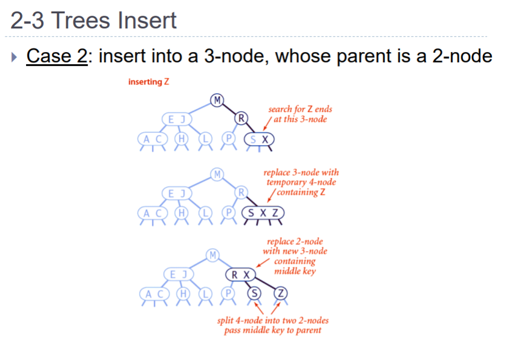
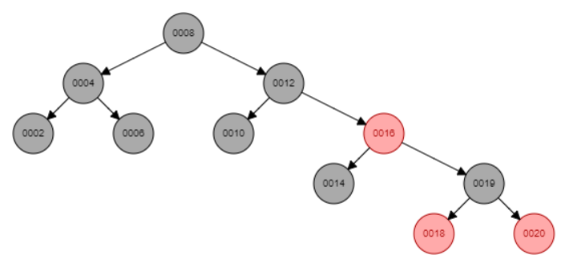

# Examenvragen Gegevensstructuren en algoritmen


## Les 1 Analyse

### Vraag 1

**Gegeven één of andere tabel met probleemgroottes N en uitvoeringstijden (zie bvb. doubling experiment). Wat kan je besluiten ivm het gedrag van dit specifieke algoritme?**

Het volgende kan 1 van die voorbeelden tabellen zijn:


Op de moment heb ik echt geen idee, later nog op terugkomen


### Vraag 2

**Leg het verschil uit tussen grote-O en tilde-notatie om het stijgingsgedrag van functies te karakteriseren.**

De tilde-notatie gebruiken we als we een simple approximatie willen doen van een complexe functie. De termen met een lagere orde laten we dus vallen.

Vb: $x^3 + x^2 + x$ wordt dan $x^3$

De Big Oh/grote-O notatie geeft ons de worst case scenario m.a.w de upper bound.


### Vraag 3

**(*Augustus 2021*) Een algoritme heeft een tijdscomplexiteit ~c.n^3^. Stel dat we een computer aankopen die 10-maal zo snel is als onze huidige computer. Een hoeveel groter probleem (probleemgrootte n) kunnen we nu oplossen**
**met hetzelfde algoritme binnen dezelfde rekentijd?**

Dit staat in het boek *Algorithms 4 by Robert Sedgewick op p193-194 een beetje uitgelegd als mijn uitleg niet voldoende zou zijn.

Als een computer x keer sneller is dan de oude dan kan je de runtime verbeteren met een factor x.

Dus als je computer er ~c.n^3^ over doet en dan 10x sneller wordt. Dan gaat de nieuwe tijdscomplexiteit er zo uitzien

=> ~c.(10n)^3^

Als we dan de eerste tijdscomplexiteit delen door het tweede dan krijgen we:

$(c*n^3)/(c*(10n)^3) = 1000$ 

We kunnen dus een probleem oplossen dat 1000x groter is.


### Vraag 4

**(*Augustus 2021*) Veronderstel dat de uitvoeringstijd van een algoritme met een probleemgrootte n gelijk aan 1000, 2000, 3000, 4000 respectievelijk 5, 21, 44 en 82 seconden is. Wat is de geschatte uitvoeringstijd voor een probleemgrootte n = 5000?**

Ik heb hier een berekening gedaan op basis van de slides [(les01)-analysis.pdf](https://p.cygnus.cc.kuleuven.be/bbcswebdav/pid-32517447-dt-content-rid-320242234_2/xid-320242234_2), slide 15. Geen idee of het juist is maar het lijkt in lijn te liggen met de vorige waarden.

**Eerste punt invullen:**

$log_25 = b.log_21000 + c$

**Tweede punt invullen:**

$log_21 = b.log_22000 + c$

**Gelijkstellen en uitrekenen:**

=> $log_25 - b.log_21000 + c = log_25 - b.log_21000 + c$

=> $log_25 - log_221 = b.log_21000 - b.log_22000$

=> $log_2(5/21) = b.log(1/2)$

=> $b=(log_2(5/21))/(log_2(1/2))$

=> $b = 2,070389327$

**b gebruiken om c uit te rekenen**

=> $log_25 = 2,070389327.log_21000+c$

=> $c = log_25 - 2,070389327.log_2(1000)$

=> $c = -18,3112317$


=> $T(N) = 2^{-18,3112317}.N^{2.070389327}$ 

**Nieuw punt invullen (5000,y)**

=> $T(N) =2^{-18,3112317}.5000^{2.070389327}$

=> $T(N) = 140$


Als we de uitgekomen functie plotten op de calculator komen de punten ongeveer overeen.


Niet de meeste accurate maar dat komt wss door de kommagetallen.


### Vraag 5

**(*Augustus 2021*) Stel dat de tijdscomplexiteit van Algoritme X heeft een tijdscomplexiteit ~c.n^2 (waarbij n een maat is voor de probleemgrootte). Voor algoritme Y, dat hetzelfde probleem oplost als algoritme X, is de**
**tijdscomplexiteit ~d.n^3. Geef twee valabele redenen waarom een programmeur toch zou kunnen kiezen voor algoritme Y i.p.v. algoritme X om het bewuste probleem op te lossen.**

Op de moment niet echt een idee? Misschien voor hele kleine N?


## Les 2 Selection Sort, Insertion Sort, Merge Sort

### Vraag 1

**Bewijs dat log~2~(n!) ~ n.log~2~(n)**

Dit is Stirling's benadering.

Nu vraagt ge u waarschijnlijk af, wat is dat nou die Stirling's benadering. Wel dus als je een faculteit wilt berekenen is dat best makkelijk voor kleine getallen maar eenmaal naar de grote getallen wordt dat best lastig. Dus was heeft Stirling gedaan, een formule gemaakt die het een stuk simpler maakt:

​		***Stirling’s formula:*** $n! ≈ √ (2πn).(n/e)^{±n}$


**Nu het bewijs:**

=> $log_2(n!)$
$n! = e^{ln(n!)}\space invullen$

=> $log_2(e)ln(n!)$

 => $log_2(e)[ln(n) + ln(n - 1) ... ln(2) ln(1)]$

**Som van natuurlijke logaritmes benaderen we door integraal:**

$ ln(n) + ln(n - 1) ... ln(2) ln(1) ≈ \int_1^nln(x)dx$ 

=> $\int_1^xln(x)dx$

=> $[xln(x)-x]_1^n$

=>  $nln(n)-n+1$

**En dus:**

=> $log_2(e)ln(n!)$

$≈ log2(𝑒)[𝑛ln(𝑛) −𝑛 + 1]$

$log_bx=log_ba⋅log_ax$ gebruiken

=> $𝑛log_2(𝑛) − 𝑛 log_2(𝑒) + log_2(𝑒)$

=> $nlog_2(n)- 1.443n+1443$

**==>**  $log_2(n!)~nlog_2(n)$

Bewezen!


### Vraag 2

**Toon aan dat een sorteeralgoritme, dat gebruik maakt van onderlinge vergelijkingen van elementen, steeds minstens log~2~(n!) vergelijkingen zal nodig hebben om algemeen een rij van n elementen te sorteren.**

De slides zeggen:


log~2~(n!) is eigenlijk n.log~2~(n), hebben we gezien in de vorige vraag.

A sorting algorithm using at most *h* comparisons on all inputs corresponds to a tree of height at most *h*. Such a tree has at most 2^h^ leaves. On the other hand, each permutation of 1,…,N must land at a different leaf, and so there must be at least N! leaves. Putting these together, we deduce that 2^h^≥N! and so h≥log~2~N!=Ω(NlogN) (using Stirling's approximation). So every sorting algorithm must use at least log~2~N!=Ω(NlogN) comparisons in the worst case (on some inputs it can use less).


**Het boek legt dit ook zeer uitgebreid en goed uit op p280.**

slides vanaf slide 28


### Vraag 3

**(*Examenvraag Juni 2020)***

1. **Hoeveel vergelijkingen tussen elementen heeft MergeSort maximaal nodig om een array van 6 elementen te sorteren? Hoeveel voor een array van 9 elementen? (geef enkel de aantallen)**

2. De slides zeggen dat mergesort nlog~2~n vergelijkingen doet. 

3. Dus voor een array van 6 elementen. 

4. => $6log_26=15.5097$
   => 16 vergelijkingen

5. Dus voor een array van 9 elementen

6. => $9log_29 =28.5293250129807$

7. => 29 vergelijkingen

8. 

9. **Stel dat ik bovenstaande wil berekenen voor om het even welk aantal elementen, m.a.w. ik zou willen weten hoeveel vergelijkingen tussen elementen MergeSort maximaal nodig heeft om een array van n elementen te sorteren. Ontwikkel een efficiënt algoritme om dit aantal te berekenen. Je hoeft enkel het aantal te berekenen, niet MergeSort zelf uit te voeren. Bespreek de algemene aanpak van je algoritme, geef pseudocode, en bespreek tevens de tijdscomplexiteit.**
   ***Opmerking: deze vraag veronderstelt ook kennis die in latere lessen aan bod zal komen ...***

### 		TODO


### Vraag 4

**(*Examenvraag Juni 2021*) Stel dat we een array van lengte 2n hebben, die bestaat uit de eerste n even positieve gehele getallen in oplopende volgorde, gevolgd door de eerste n oneven getallen, maar in aflopende volgorde. Bijvoorbeeld voor n = 5 is de array gelijk aan [0, 2, 4, 6, 8, 9, 7, 5, 3, 1]. Hoeveel vergelijkingen i.f.v. n hebben de respectievelijke sorteeralgoritmes [Selection, Insertion, Merge, Quick] nodig om dergelijke array te sorteren? Gebruik ~notatie, en geef ook een verklaring. Let op: n is de lengte van de halve array!**

Ik denk dat gewoon hun formules mogen gebruiken

**MergeSort:** weer nlog~2~n dus

=> $10log_210$

=> **33.219280948874**

**SelectionSort:** n.(n-1)/2 normaal maar we moeten de tilde notatie gebruiken dus ->  ~ n^2^/2

=> 10^2^/2

=> 50

**InsertionSort: **Half of elements to the left of the pivot are larger: ~n^2^/4

=> 10^2^/4

=> 25

**QuickSort:**TODO


## Les 3 & 4: Quicksort

### Vraag 1 

**(*Examenvraag Juni 2020*) Toon aan dat QuickSort een gemiddelde tijdscomplexiteit heeft ~1.39.n.log2(n). Verklaar duidelijk alle stappen in de redenering.**

Er zijn 2 aanpakken ma ik ga 1 geven die ik het simpelste vind.

**Aanpak 1**

Partitionering voor n elementen vraagt n+1 vergelijkingen (Cfr.Houre partitionering)

Verwacht aantal vergelijkingen nodig om n elementen met QS te sorteren:


$C(n) = (𝑛 + 1) + 1/n[𝐶(0) + 𝐶(𝑛 − 1)] + 1/𝑛  [𝐶(1) + 𝐶(𝑛 − 2)]+. . . + 1/n[𝐶(𝑛 − 1) + 𝐶(0)]$

​       	$= (n+1) + 2/n(c(0)+C(1)+C(2)...+C(n-1))$

En dus:
$nC(n)=n(n+1)+2(C(0)+C(1)+C(2)...+C(n-1))$

Vermits dit geldt voor alle waarden van n, geldt het ook voor n-1:

$(n-1)C(n-1) = (n-1)n+2(C(0)+C(1)+C(2)...+C(n-2))$

Om de lange som weg te werken, trekken we beide vorige vergelijkingen van elkaar af:

$𝑛C(𝑛) − (𝑛 − 1)𝐶(𝑛 − 1) = 𝑛(𝑛 + 1) − (𝑛 − 1)𝑛 + 2𝐶(𝑛 − 1)$

Herschrijven geeft:

$\frac{C(n)}{(n+1)}= \frac{2}{n+1}+\frac{C(n-1)}{n}$

​	Dit is een recursieve uitdrukking, die we gemakkelijk kunnen expanderen. We weten ook dat C(1) = 0 en C(2)=1, wat een stopconditie geeft voor de expansie.

$\frac{C(n)}{n+1}=\frac{2}{n+1}+\frac{2}{n}+\frac{2}{n-1}+\frac{2}{n-2}+...+\frac{2}{3}$

of ook:

$C(n)=2(n+1)(\frac{1}{n+1}+\frac{1}{n}+\frac{1}{n-1}+\frac{1}{n-2}+...+\frac{1}{3})$

Net zoals bij de benadering van Stirling, benaderen we de som door een integraal.

$(\frac{1}{n+1}+\frac{1}{n}+\frac{1}{n-1}+\frac{1}{n-2}+...+\frac{1}{3}) ≈ \int_2^{n+1}\frac{1}{x}dx $

=$[ln(x)]_2^{n+1}$

=$ln(n+1) - ln(2)$


Daarom kunnen we de integraal ook over een minder groot domein nemen, waardoor we 1 term verhuizen naar de lagere orde termen. Uiteindelijk maakt dit niet zoveel uit, vermist we enkel interesse hebben in de snelst stijgende term.

$(\frac{1}{n+1}+\frac{1}{n}+\frac{1}{n-1}+\frac{1}{n-2}+...+\frac{1}{3}) ≈ \int_2^{n}\frac{1}{x}dx + \frac{1}{n+1} $

= $[ln(x)]_2^{n+1} + \frac{1}{n+1}$

= $ln(n) - ln(2) + \frac{1}{n+1}$

Waaruit dan volgt:

$C(n) = 2(n+1)(ln(n)-ln(2) + \frac{1}{n+1})$

= $2nln(n)+...$

= $2nln(2)log_2n+...$

= $1.39nlog_2n+...$

~$1.39nlog_2n$

Algemene opmerking: sommigen zijn misschien verontrust door het “losjes” omspringen met het benaderen van de eindige som door een integraal, en een domein te kiezen zoals het ons uitkomt, maar andere benaderingen leveren dezelfde snelst stijgende term op, wat voldoende is voor de ~notatie.

### Vraag 2

**Indien we Quicksort zouden implementeren met 2 pivots (en 3 partities), hoe zou de tijdscomplexiteit zich gedragen? Let op: dit is niet hetzelfde als een 3-way Quicksort waarbij 1 van de partities enkel elementen bevat die gelijk zijn aan de pivot.**

Heel goeie vraag. Waarschijnlijk sneller, anders zouden ze de vraag niet stellen maar vraag me niet waarom : )


### Vraag 3

***(Examenvraag september 2016*) De worst-case tijdscomplexiteit van QuickSort is ~n^2^, indien men telkens voor elke partitionering, het kleinste dan wel het grootste element als pivot kiest. Men kan echter stellen dat QuickSort vrij vergevingsgezind is, en dat, zelfs al we toevallig enkele malen een slechte pivot kiezen gedurende de hele sortering, we toch een linearitmisch verloop van de rekentijd kunnen verwachten. Verklaar!**

We spreken hierover de tilde notatie van de tijdscomplexiteit. Dit betekent dus dat we niet geven om elementen met een kleinere orde.


Als we dan eenmaal een slechte split hebben, worden er n-1 aantal vergelijkingen toegevoegd. Als we dan naar de grote getallen gaan is deze n verwaarloosbaar. Zelfs een paar splits zijn ok. Daarom kunnen we toch nog een linearitmisch verloop van de rekentijd verwachten.


### Vraag 4

**(*Examenvraag September 2020*) Bij recursieve sorteeralgoritmen zoals MergeSort of QuickSort wordt de nog te behandelen deelrij vaak telkens in 2 delen gesplitst. Nochtans kan men zich eenvoudig inbeelden dat men de recursieve opsplitsing in 3 of 4 zelfs meer delen uitvoert (in geval van Quicksort vraagt dit dan meerdere pivots, bij MergeSort een merge-operatie van meerdere deelrijen). Is het over het algemeen een goed idee om recursieve sorteeralgoritmes zoals MergeSort en QuickSort (of eventueel anderen) in meer dan 2 delen op te splitsen? Waarom wel? Waarom niet? Wat zijn voor- en nadelen?**


**Quicksort**

Bij quicksort is er al een versie die het splits in 3 delen, namelijk 3 way partitioning. Dit is voordelig bij lijsten met veel duplicates omdat de middelste lijst alle elementen bevat die gelijk zijn aan de pivot.

Nog een voordeel dat voor kan kloppen is dat wanneer je splitst in 3 of meer delen en voor elk van deze delen een pivot kiest, de impact van een slechte pivot veel kleiner is. Nu zeg ik dit maar kan zijn dat ik de vraag fout heb begrepen en dit niet is wat ze bedoelen.

**MergeSort**

Hier kon ik niet direct iets voor vinden maar stackoverflow heeft hier wel een goed antwoord op.

In een normale merge, deelt ge de array door 2 tot je diepte van log~2~n bereikt en dan begin je te mergen. Elke merge van 2 arrays van grootte m neemt ook 2m operaties.

**Dit geeft ons de volgende formule(tijdscomplexiteit):**

```
n/2 * 2 + n/4 * 4 + ... 1 * n = n * log2n
```

Als je dan ipv een normale merge een three-way merge doet:

- De diepte is nu log~3~n
- Tijdens de merge moet je nu de minimum vinden van 3 getallen ipv 2.

**Dit betekent dat de formule er nu zo gaat uitzien:**

```
n/3 * 2*3 + n/9 * 2*9 + ... 1 * 2*n = 2 * n * log3n
```

Het is maal 2 omdat het minimum vinden van 3 elementen bestaat uit 2 operaties.

Asymptotische zijn deze beide Θ(nlogn) maar eenmaal naar de grootte getallen gaat dit wel een verschil geeven.


Voor de uitleg in het engels en nog een mooi voorbeeld wanneer een n-way merge sort handig kan zijn

https://stackoverflow.com/questions/14713468/why-should-we-use-n-way-merge-what-are-its-advantages-over-2-way-merge


## Les 5: Sorteren in lineaire tijd

### Vraag 1

Het antwoord op deze vraag is te vinden op p341 in het boek.

**Een aantal sorteeralgoritmes hebben de eigenschap "stabiel" te zijn.**

- **Wat wordt hiermee bedoeld?**

  Een sorteer methode is stabiel als de relatieve orde van gelijke keys in de array behouden wordt. Deze zin zegt wss weinig dus nu een voorbeeld voor wat duidelijkheid. Stel je hebt een internet commerce applicatie waar we een grote hoeveelheid events met een locatie en timestamps verwerken. Nu steken we deze in een array wanneer deze aankomen want dan zijn ze gesorteerd op de timestamp want de laatste timestamp is de laatste in de array. Als we deze lijst nu zouden sorteren op locatie gaan we zien dat bij een stabiel sorting method de timestamps nog correct staat per locatie en bij een instabiele sorting method niet. Hieronder een afbeelding ter verduidelijking.

  

- **Welke sorteeralgoritmes die we behandeld hebben in de lessen zijn stabiel?**

  **Stabiel:** insertion sort, merge sort

  **Niet-stabiel:** selection sort, quick sort

- **Waarom is stabiliteit een belangrijke eigenschap van een sorteeralgoritme?**

  Dit is enkel belangrijk als je er een nut voor hebt zoals bij het voorbeeld hierboven. Nog een voorbeeld van stackoverflow: *We are asked to sort "by last name, then by first". We could first sort (stable or unstable) by the first name, then stable sort by the last name. After these sorts, the list is primarily sorted by the last name. However, where last names are the same, the first names are sorted.*

  You can't stack unstable sorts in the same fashion.

  https://stackoverflow.com/questions/1517793/what-is-stability-in-sorting-algorithms-and-why-is-it-important

- **Kan een niet-stabiel sorteeralgoritme steeds stabiel gemaakt worden?**

  Ja maar niet zonder een serieuze extra hoeveelheid tijd of ruimte. Dit betekent dat de meeste programmers dus voor algoritmes gaan gaan die uit zichzelf stabiliteit garanderen.


### Vraag 2

**Hoe zou je counting sort kunnen wijzigen zodat het ook zou werken met data die geen positieve integers zijn? Bvb ook negatieve integers behandelen? Of ook getallen met decimale fracties (1.5, 2.5, 3.5, ... ?). Welke voorwaarden moeten er gelden voor de te sorteren data?**

Voor de negatieve integers zouden we de array, die we gebruiken om de hoeveelheid van dezelfde keys te tellen, kunnen opschuiven zodat het laagste getal op 0 staat en dan vandaar verder rekenen.

Voor decimale fracties kan je all getallen maal dezelfde bepaalde hoeveelheid doen zodat je een integer krijgt en dan op een normale manier kan sorteren.

is dit juist? Philly zeg het mij, amen.


### Vraag 3

**(*Examenvraag Juni 2020)* Leg uit: BucketSort. Wat is de kans dat we bij het BucketSort algoritme in de slechtst mogelijke situatie m.b.t. tijdscomplexiteit belanden?**

BucketSort is een sort waarbij elementen van een array in verschillende buckets gestoken worden, dit is meestal op basis van 1 of andere categorie. Daarna kunnen deze buckets op zichzelf gesorteerd worden door een ander algoritme of weer opnieuw gesorteerd in nieuwe buckets.

Geen idee wat de kans is, Phil. TODO


### Vraag 4

**(Examenvraag September 2020)** Op welke manier werkt het Least-Significant-Digit (LSD) sorteeralgoritme? Bespreek tevens de tijdscomplexiteit. 

LSD sort of Radix sort is een gebaseerd op counting sort. Het werkt als volgt; We nemen voor alle getallen het meest rechts gelegen getal, we sorteren dan op deze keys. Dan schuiven we 1 op naar rechts en sorteren op deze keys. Omdat counting sort stabiel is blijven deze getallen met dezelfde key in dezelfde volgorde, is dit niet het geval dan werkt LSD sort niet. Het sorteren op de keys blijven we toepassen tot we het grootste getal volledig behandeld hebben. Als we een getal hebben dat op een bepaalde plek geen cijfer meer heeft dan wordt daar simpelweg een 0 gezet, zoals hieronder.


De tijdscomplexiteit van LSD sort kan heel goed zijn.


Hierboven zien we probleemgrootte n, max grootte van de getallen d = 3 en base = 10(0-9)(dit kan ook binair of hexadecimaal).

Voor Counting sort eenmaal toe te passen hebben we een complexiteit van O(n+b). Voor elke d > 1 moeten we counting sort nog is toepassen dus dat betekent dat de complexiteit verandert naar O(d(n+b)).

Afhangend van bepaalde inputs kan LSD of radix sort het dus beter doen dan quick sort of merge sort.


## Les 6: Priority Queues & Balanced Trees

### Vraag 1

**Stel dat we ternaire heaps (t.t.z. een heap met 3 kinderen per knoop) zouden gebruiken voor heapsort. Op welke manier zou dit de tijdscomplexiteit beïnvloeden?**

Volgens wikipedia is het moeilijker om te programmeren maar doet een constant getal minder swaps en vergelijking operaties. Dit is omdat elke sift-down step in een ternaire heap 3 vergelijkingen en 1 swap vraagt, terwijl een binaire heap 2 vergelijkingen en 1 swap vraagt. Twee levels in een ternaire heap doet 3^2^ = 9 elementen, het doet dus meer met dezelfde hoeveelheid vergelijkingen als 3 levels in een binaire heap, die maar 2^3^ = 8 elementen doet. Dit is interessant maar de toegevoegde complexiteit is de weinige toevoeging aan de efficiëntie blijkbaar niet waard. (Bottom-up heapsort doet blijkbaar beter dan beide)


### Vraag 2

**Gegeven de array [1,2,3,4,5,6,7,8,9]. Indien men de elementen van deze array op de overeenkomstige posities van een heap plaatst, staat het element 1 in de wortel van de heap, en het element 9 op de laatste positie van de heap. Deze heap is uiteraard niet geldig m.b.t. de plaatsing van de waarden van de elementen. Schets de structuur van de heap nadat men de heap in de juiste toestand heeft gebracht (t.t.z. net vóór de extractie van het eerste wortelelement voor de sortering begint in heapsort).**


(ik denk zoiets?)


### Vraag 3

**Becommentarieer de volgende uitspraak: “Heapsort kan gebruikt worden i.p.v. Counting Sort (key-indexed sorting), als de basis voor Least Significant Digit (LSD) sortering.”**

This would not work at all because heapsort is not stable at all which breaks the functionality of LSD.


### Vraag 4

**(toegevoegd 4 april 2022) Wat is de tijdscomplexiteit van Heapsort indien de te sorteren array reeds gesorteerd zou zijn vooraleer men Heapsort toepast? Wat indien de array omgekeerd gesorteerd zou zijn?**

De tijdscomplexiteit van heapsort van een array met lengte n dat al gesorteerd is in stijgende orde is $O(nlog(n))$ omdat zelfs al is het gesorteerd wordt de array nog steeds getransformeerd en dan gesorteerd.

De tijdscomplexiteit van heapsort van een array met lengte n dat al gesorteerd is in dalende orde is $O(nlog(n))$ omdat zelfs al wordt de boom gebouwd in lineare tijd, elke keer dat het max element verwijderd wordt en de heapify methode gecalled wordt, gaat het over de hele boom gaan.

In conclusie, de volgorde van de elementen in de array maakt niet veel verschil voor de tijdscomplexiteit. Daarom is het volgende het geval:


### Vraag 5

**(toegevoegd 4 april 2022) Hier vind je de array-representatie van een heap:
i  0  1  2  3  4  5  6  7  8  9  10  11
a[i]  -  A  C  D  F  H  X  Y  K  G  S  R
Vul hieronder de nieuwe toestand van de array in, na toevoeging van de waarde B:
i  0  1  2  3  4  5  6  7  8  9  10  11  12
a[i]  - **A C B F H D Y K G S R X

Dit is wat ik ben uitgekomen en heb het proberen het te testen hier: https://www.cs.usfca.edu/~galles/JavascriptVisual/Heap.html

**Vul hieronder de nieuwe toestand van de array in, na verwijdering van het minimum uit de originele heap (dus zonder de toevoeging van B te hebben uitgevoerd):
i  0  1  2  3  4  5  6  7  8  9  10
a[i] ** C D F H X Y K G S R


### Vraag 6

**(*Examen juni 2015, vraag 8 - zie vorige examens voor volledige opgave*) Bewerkingen analyseren op een binaire heap.**

TODO


### Vraag 7

**(Examen september 2016, vraag 7 - zie vorige examens voor volledige opgave) (Young-tabel). Dit is een mooie illustratie hoe heaps niet noodzakelijk in boomstructuren moeten voorgesteld worden, maar bvb. ook een matrix-vorm mogelijk is.**

TODO


### Vraag 8

**(*Examenvraag juni 2020*) Geef een bespreking van de insert- operaties in een 2-3 boom.**

Er is heel wat te bespreken wat er zijn verschillende soorten cases bij de insert van een 2-3boom.

**Case 1: insert into a 2-node**

Als we een nieuw element toevoegen en we zien dat het element nog niet in de heap zit dan zoeken we naar de plek dat die zou moeten zitten. En we voegen die daar toe. Als deze plek een 2-node plek is dan maken we er een 3-node plek van en voegen het element toe op de correct plaats. zie afbeelding.


**Case 2: insert into a 3-node, whose parent is a 2-node**

Moeilijk om uit te leggen met woorden dus zie afbeelding.



**Case 3: insert into a 3-node, whose parent is a 3-node**

hetzelfde hier


## Les 7: Rood-Zwart Bomen en Tries

### Vraag 1

**a) Teken de Rood-Zwart boom (Left Leaning Red Black Tree, kleinere waarden links, grotere waarden rechts), die het resultaat is van de volgende elementen (in deze volgorde) in een initieel lege boom toe te voegen: 4 - 2 - 8 - 6 - 12 - 10 - 16 - 14 - 20 - 18. Geef duidelijk de waarden per knoop + de kleur van de verbindingen weer.**


Ik raad aan dat je de volledige animatie bekijkt op de volgende site want het is toch niet zo simpel als het er uitziet. 

https://www.cs.usfca.edu/~galles/visualization/RedBlack.html

**b) Voeg nu de waarde 19 toe aan deze boom. Teken duidelijk alle transformaties (rotaties + kleurenwisselingen) die worden uitgevoerd om de boom terug in een geldige toestand te brengen.**

Stap 1:


Stap 2:


Stap 3:


Stap 4:



## Les 8: Stacks, Queues & Hash Tabellen

### Vraag 1

**Vorige examens hebben vaak een rekenoefening i.v.m. hashtabellen. Zie bvb. vraag 2 van het examen juni 2020.**

TODO


### Vraag 2

**(*Examenvraag Juni 2021*) Bespreek linear probing om collisions in hash-tabellen op te lossen.**

Collision: 2 keys hash to the same index

2 ways to deal with collisions:

- Separate chaining
- Linear probing

Linear probing is heel simpel. Als we een collision tegenkomen dan gaan we simpel weg opschuiven naar een hogere index waar nog geen element is. Het enige probleem hier is dat de cost van onze operatie kan stijgen door clustering. Clustering heb je wanneer er al veel elementen exact naast elkaar staan zoals hieronder.


Als je dan een element toevoegt en de hash mapt uit op iets in de cluster moet je helemaal naar het einde van de cluster.

**Verwijderen van een element**

2 opties

- Zet een 'grafzerk' op de verwijderde entry "marked as deleted"
- of rehash alle items in de cluser na de gedelete item. 


### Vraag 3

**(*Examenvraag Juni 2021*) Bespreek de tijdscomplexiteit voor het toevoegen van elementen aan een stack, gebruik makende van de array-implementatie, en waarbij de array telkens verdubbeld wordt in grootte als de stack vol zit.**

O(n)

https://stackoverflow.com/questions/23980115/time-complexity-of-dynamic-array-via-repeated-doubling

Deze stackoverflow post geeft wat extra info.


## Les 9: Greedy algoritmen

### Vraag 1

**Wat is de algemene aanpak van greedy algoritmen? Vergelijk met Dynamic Programming.**

Definitie volgens google voor dynamic programming: ***Dynamic Programming (DP) is** **an algorithmic technique for solving an optimization problem by breaking it down into simpler subproblems and utilizing the fact that the optimal solution to the overall problem depends upon the optimal solution to its subproblems**.*


Greedy Algoritme:

***Make the choice that seems best now. We will get a solution but not necessarily the best solution. A (best) solution can be reached in making small steps; should not be dependent on future steps still to make.***


Het verschil is dus duidelijk. DP  gaat ons de optimale oplossing geven door voor elk subprobleem de optimale oplossing te geven maar dit kan ten kosten gaan van andere dingen zoals tijd, geheugen, etc... Greedy Algoritme daarentegen gaat ons op een efficiënte manier een oplossing geven maar dit is niet gegarandeerd de beste.


### Vraag 2

**Wat bedoelen we met "optimale substructuren"? Opwelke manier kan dit ons helpen om algoritmen te ontwikkelen?**

Wanneer we een probleem moet oplossen, moeten we eerst de subproblemen oplossen, dus de problemen waar het grote probleem uitbestaat. Als we dan de optimale oplossing zoeken voor het grote probleem, moeten we eerst de optimale oplossing voor de subproblemen vinden. Dit noemen we de optimale substructuren.


### Vraag 3

Tom scott video over huffman coding voor snelle refresher:

https://www.youtube.com/watch?v=JsTptu56GM8

**Gegeven één of andere string, stel de Huffman coderingsboom op voor deze string.**

Nemen de string: Representation

Eerst frequentie tabel opstellen

| letter | frequentie |
| ------ | ---------- |
| r      | 2          |
| e      | 3          |
| p      | 1          |
| s      | 1          |
| t      | 2          |
| a      | 1          |
| i      | 1          |
| o      | 1          |
| n      | 2          |


https://www.csfieldguide.org.nz/en/interactives/huffman-tree/


### Vraag 4

**Hoe ziet de Huffman codering er uit indien de frequentie van characters zich verhoudt tot de Fibonnaci getallen?**


Als je een Huffman boom construeert met gewichten evenredig aan de Fibonacci reeksen (exclusief 0):

1, 1, 2, 3, 5, 8, 13, 21, ...

Dan zult u zien dat de resulterende boom maximaal unbalanced is: elk intern knooppunt heeft minstens één leaf. Bijgevolg zullen de knopen met het label "1" een zeer grote diepte hebben: als we de eerste d+1 Fibonacci termen in de boom opnemen, dan zullen de 1 knopen diepte d hebben.


### Vraag 5

Bewijs poep, TODO


### Vraag 6

**Wat is de tijdscomplexiteit om een string van lengte N, die bestaat uit R verschillende characters, te coderen met Huffman codering?**

Ik vind hier nogal weinig over terug en ze spreken nooit over een distinctie met R verschillende characters. Volgens stackoverflow komt het neer op $O(nlogn)$.

Pas dit aan als ge iets beters vindt : )


### Vraag 7

**Stel dat we een Huffman-codering gebruiken voor een string die bestaat uit de karakters {A, B, C, D}. Geef voor elk van onderstaande Huffman-coderingen aan of ze al dan niet mogelijk kunnen voorkomen. Indien ja, wat kan je afleiden i.v.m. frequenties waarbij de karakters in de string voorkomen? Indien nee, waarom niet?**

- **{A, B, C, D} worden respectievelijk gecodeerd als {0, 10, 111, 110}**

  Ja dit kan en de frequentie gaat er ongeveer zo uitzien: 
  A > B > C > D

- **{A, B, C, D} worden respectievelijk gecodeerd als {0, 10, 101, 111}**

  Ik denk niet dat dit mogelijk is omdat dit niet voldoet aan de manier waarop de huffman tree wordt opgebouwd.

- **{A, B, C, D} worden respectievelijk gecodeerd als {11, 01, 10, 00}**

  Dit is mogelijk wanneer A, B, C, D allemaal dezelfde waarde hebben.


### Vraag 8

**(*Examenvraag Juni 2021*) Bespreek Huffman-codering: principes, constructie, ... Illustreer met voorbeelden indien nodig.**

Huffman-codering is het meeste efficiënte lossless compressie algoritme als we enkel kijken naar het voorkomen van letters.

Het algoritme zelf uitleggen is best wel lastig dus ik ga dat later doen maar Tom Scott zijn video bij vraag 3 legt dit perfect uit.

Ik weet niet wat ik nog moet zeggen dus, TODO


### Vraag 9

**Leg uit: algoritme van Prim/Kruskal. Zou je dit algoritme beschouwen als een greedy algoritme (argumenteer), dan wel als een dynamisch (dynamische algoritmen komen aan bod in een volgende les) algoritme (argumenteer), beide (argumenteer), of geen van beide (argumenteer).**

**Prim's algoritme:**

Uitleg: https://www.youtube.com/watch?v=cplfcGZmX7I

Greedy omdat het tijdens het uitvoeren altijd gaat kiezen voor het pad met het kleinste getal. 


**Kruskal's Algoritme:**

Uitleg: https://www.youtube.com/watch?v=71UQH7Pr9kU

Greedy omdat het tijdens het uitvoeren altijd gaat kiezen voor de verbinding met het kleinste getal


## Les 10: Dynamic Programming

### Vraag 1

**Zou je het algoritme van Dijkstra beschouwen als een dynamisch algoritme, dan wel een greedy algoritme, of beide? Verklaar? (niet relevant indien grafenalgoritmen niet gezien zijn).**

Het is beide omdat je hier ook altijd kiest voor het kortste pad zoals bij greedy maar je update de afstanden ook met waarden die je eerder berekent hebt.


### Vraag 2

**Beschouw een schaakbord met n x n vakjes, met vakje (1,1) in de linkerbenedenhoek, en vakje (n,n) in de rechterbovenhoek. Op elk vakje liggen een aantal graankorrels (> 0). Stel dat je een pad moet volgen, startende op (0,0), en eindigend op (n,n), waarbij je telkens een vakje naar rechts of naar boven mag bewegen (niet naar links of beneden), en waarbij je ondertussen alle graankorrels verzamelt in de vakjes waar je passeert (inclusief begin- en eindvakje).**

**Ontwikkel een efficiënt algoritme dat berekent wat het maximaal aantal graankorrels is dat je kan verzamelen door dergelijk pad te volgen.**

**Beschrijf eerst de algemene aanpak, geef pseudocode, alsook de tijdscomplexiteit.**

Ik zou gaan voor een algoritme gebaseert op dijkstra's algoritme maar ipv dat het algoritme kiest voor de laagste waarde, neemt die de grootste waarde.


unvisited nodes: {(0,0), (1,0), (0,1), (1,1), (2,0), (0,2), (1,2), (2,1)}

Als we gaan van node (0,0) naar node (2,2) zoeken we de weg die ons het grootste getal geeft.

**Pseudo code**


Iets gelijkaardigs aan dit maar dan voor de grootste waardes.

**Tijdscomplexiteit:**

Dijkstra's shortest path algorithm is `O(ElogV)` where:

- `V` is the number of vertices
- `E` is the total number of edges

### Vraag 3

**(*Examenvraag Juni 2021*) De Longest Repeating Subsequence (LRS) van een gegeven string is de langste subsequentie (let op: een subsequentie is niet hetzelfde als een substring) die meer dan éénmaal, en zonder overlappingen, in de gegeven string voorkomt. Voorbeeld: voor de string “BBAEACDD” is AD een subsequentie die meer dan éénmaal en zonder overlapping voorkomt: “BBAEACDD”, maar ze is niet de langste. De subsequentie BAD is de langste herhalende subsequentie: “BBAEACDD”. De 2 verschillende voorkomens van de subsequentie zijn telkens met onder- en overlijning aangegeven.**
**Ontwikkel een efficiënt algoritme om de lengte van de LRS van een gegeven string te berekenen. Je hoeft enkel de lengte als resultaat te berekenen, niet de LRS zelf. Bespreek de algemene aanpak van je algoritme, geef pseudocode, en bespreek tevens de tijdscomplexiteit.**

TODO


### Vraag 4

**(*Examenvraag Augustus 2021*) Leg uit wat de algemene aanpak is van “dynamic programming”. Illustreer met 2 relevante voorbeelden waarom dynamic programming voor die voorbeelden een goede aanpak is.**

De algemene aanpak van dynamic programming is het aanpakken van een probleem door het op te delen in subproblemen en dan de optimale oplossing voor de subproblemen te zoeken.

Voorbeelden: