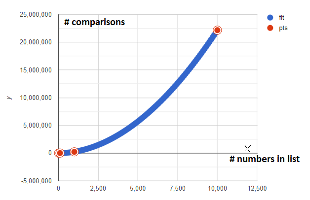

# Insertion Sort

**Datapunten:**

| # getallen | # vergelijkingen |
| ---------- | ---------------- |
| 10         | 14               |
| 100        | 2344             |
| 1000       | 226 238          |
| 10 000     | 22 186 614       |

**Insertion sort performance**

Worst-case: $O(n^2)$

Average-case: $O(n^2)$

Best-case: $O(n)$

**Ons geval**

We zien dat onze algoritme het heel goed doet voor een insertion sort maar dat het probleem van insertion sort bij een grote input niet kunnen vermijden. Al van 10 000 getallen duurt het een paar seconden om het te sorteren en zien we ook dat de vergelijkingen de hoogte in schieten. Als we deze functie op een grafiek gaan zetten zien we ook dat we een logaritmische schaling handig zou zijn.

In ons experiment hebben we gemiddeld $\frac{1}{4}n^2$ vergelijkingen wat overeenkomt met de analyse gegeven in de les. Ik denk dat de lagere orde daarom achterwege gelaten mogen worden.
