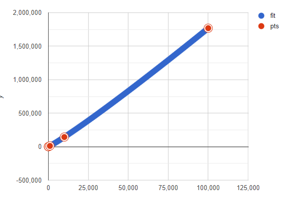

# MergeSort

**Datapunten:**

| # getallen | # vergelijkingen |
| ---------- | ---------------- |
| 10         | 43               |
| 100        | 771              |
| 1000       | 10 975           |
| 10 000     | 143 615          |
| 100 000    | 1 768 927        |

**Mergesort performance**

Worst-case: $O(n*log(n))$

Average-case: $O(n*log(n))$

Best-case: $O(n*log(n))$

**Ons geval**

Mijn bevindingen komen overeen met het theoretisch model in de les, wat ik ook in het algorithm gooi, de resultaten zijn altijd ongeveer hetzelfde, namelijk heel efficient op bij een grote input en minder bij de kleine. Om de exact getallen te vinden die we hebben gezien in les is het aangeraden om de lagere orde termen er bij te nemen. Welke waarden er worden gebruikt in het algoritme lijken geen invloed te hebben op de snelheid wat ik verrassend vind.
