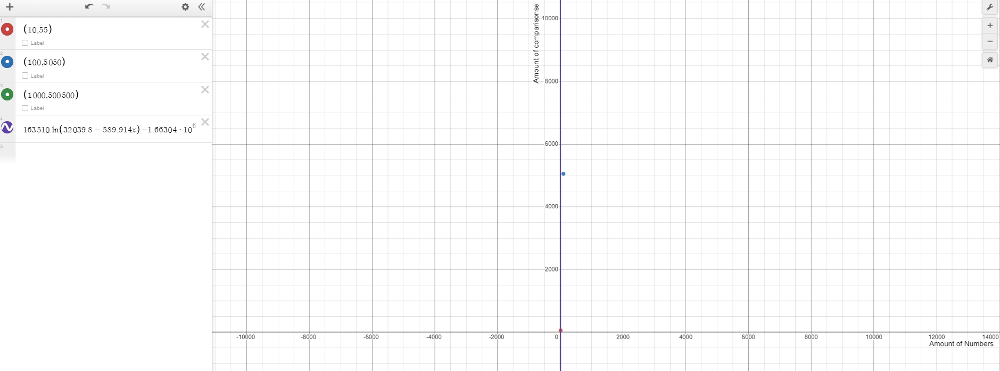

# Selection sort

**Datapunten:**

| # getallen | # vergelijkingen |
| ---------- | ---------------- |
| 10         | 55               |
| 100        | 5050             |
| 1000       | 500500           |

Aangezien de grafiek enorm snel stijgt door een zeer niet optimaal selectionsort algoritme lijkt logaritmisch hier het beste. Het is duidelijk dat er exponentieel meer vergelijkingen worden uitgevoerd voor elk getal meer dat gesorteerd moet worden.

We weten dat selectionsort het heel slechte doet op lange arrays en dit zien we in de resultaten. Ik geloof dat er ergens iets fout gaat in de implementatie of telling van de vergelijkingen want we komen nooit in de buurt van de worst case. Hopelijk kan ik de beste manier vinden in de komende oefeningen.

