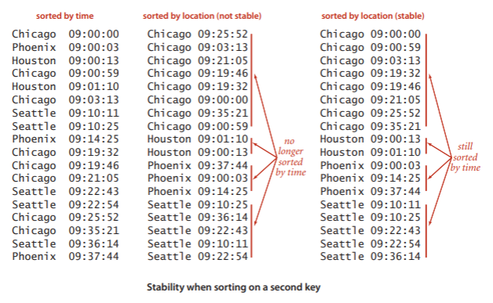
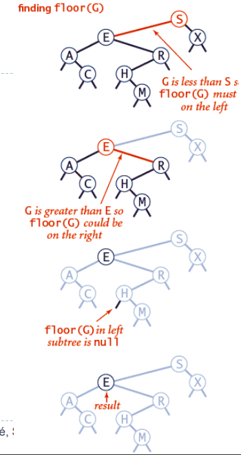
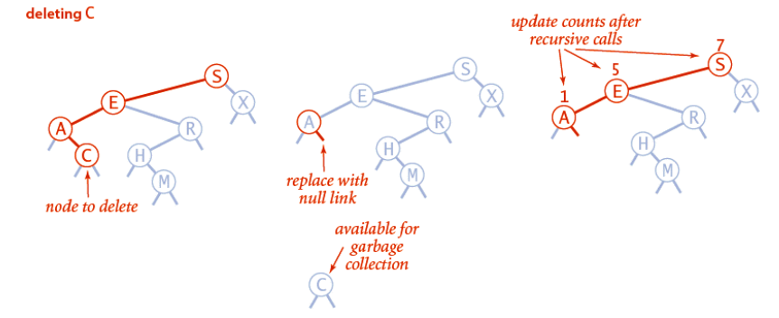
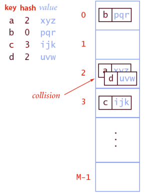
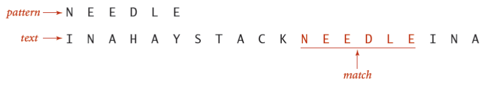

# Gegevensstructuren en Algoritmen

## Les 1: analyse en algoritmen

### Asymptotische analyse

| Notation  | provides                  | example       | shorthand for                                | used to                   |
| --------- | ------------------------- | ------------- | -------------------------------------------- | ------------------------- |
| Tilde     | leading term              | ~ 10N^2^      | 10N^2^ 10N^2^+22NlogN                   | provide approximate model |
| Big Theta | Asymptotic growth rate    | $\theta(N^2)$ | (1/2)N^2^ 10N^2^ 5N^2^ +22NlogN+3N | classify algorithms       |
| Big Oh    | $\Theta(N^2)$ and smaller | O(N^2^)       | 10N^2^ 100N                             | develop upper bounds      |
| Big Omega | $\Theta(N^2)$ and larger  | $\Omega(N^2)$ | (1/2)N^2^ N^5^ N^3^+22NlogN + 3N   | develop lower bounds      |

### Grafiek complexiteit

## Les 2: Sorting Algorithms

### Selection Sort

#### **How does it work?**

Selection sort is one of the simpelst algorithms out there. It finds the smallest element in the unsorted array and moves it to the beginning of the array. The bounds for the unsorted array move so the sorted part is excluded from the next search for the smallest element.

**Time complexity:**

$O(n^2)$

Since the algorithm just finds the smallest element every time, the fact that an array might already be partially ordered will not make a difference.

### Insertion sort

#### How does it work?

This algorithm is in place so we do not need extra space. We work from left to right and compare each element to the element to the left of it. If the element is smaller we swap them, if it is not we move on to the next element and consider that part sorted.

**Time Complexity**

$O(n^2)$ but it can perform better than selection sort in some cases because it has an $O(n)$ best-case time complexity when the array is already sort.

### Partially sorted arrays

What happens when most elements are near their final positions?

- Selection sort: No effect, still **~ n^2^/2**
- Insertion sort: elements move only a few places: **~c.n**

On the basis of this mergesort was created.

### Merge Sort

#### **How does it work**

Quicksort is a divide and conquer algorithm. It works by dividing the input array in two halves, sorting each half recursively and then merging the sorted halves back together

**Time Complexity**

$O(n^*log_2n)$ but it does require additional memory to store subarrays during recursion

**Merge Sort improvements**

- Switch to insertion sort for small arrays because mergesort has too much overhead for small arrays
- Use same aux array each time

### How fast can sorting algorithms go

**Comparison sorts:**

**Any comparison sort needs at least ~n.logn comparisons**

Thus merge sort is asymptotically optimal!

**Non-comparison sorts, in linear (~n) time:**

- Counting sort
- Radix sort
- Bucket sort

### Lower bound for comparison sorting

All possible permutations of n elements can be made into a tree. For example, here is a compare tree for N = 3:

As you can see all the possible permutations is atleast equal to **N!** because there are N! different permutation of N distinct keys.

The max amount of leaves a tree can have is 2^h^ with h being it's height. Which means:

​								$N!\leq$ **number of leaves** $\leq 2^h$

The value of h is precisely the worst-case numbers of compares, so we can take the logarithm (base 2) of both sides of this equation and conclude that the number of compares used by any algorithm must be at least **log(N!)**. The approximation 

**The worst-case number of comparisons is the height of the tree.**

TODO

1. Toon aan dat een sorteeralgoritme, dat gebruik maakt van onderlinge vergelijkingen van elementen, steeds minstens log2(n!) vergelijkingen zal nodig hebben om algemeen een rij van n elementen te sorteren.

### Search problems (similar problem)

Minimal log(n+1)comparisons needed

-> Best search algorithms **~log(n)**

### Benadering van Stirling

**Bewijs:**

Omzetten naar natuurlijk logaritme maakt benaderen van som naar integraal mogelijk

$log_2(n!)=log_2(e)ln(n!)$

​				$=log_2(e)[ln(n) + ln(n-1)+...+ln(2)+ln(1)]$

Som van natuurlijk logaritme benaderen we door een integraal

$[ln(n) + ln(n-1)+...+ln(2)+ln(1)] \approx \int^n_1ln(x)dx$

$\int^n_1ln(x)dx = [xln(x)-x]^n_1$

​					  $= n.ln(n)-n+1$

En dus:

​	$log_2(n!) =log_2(e)ln(n!)$

​					$\approx log_2(e)[n.ln(n)-n+1]$

​					$=nlog_2(n) - nlog_2(e)+log_2(e)$

​					$=nlog_2(n) - 1.443n + 1.443$

=> $log_2(n!)\sim n.log_2(n)$

## Les 3 & 4 Quicksort

### Quick Sort

Most widely used sorting algorithm:

- \~1.39nlog~2~(n) comparisons on average 

Mergesort:

- ​	Recurse first (trivial), then merge (do real work)

Quicksort:

- Partition first (do real work), then recurse (trivial)

#### How it does work?

Like MergeSort, QuickSort is a Divide and conquer algorithm. It picks an element as pivot and partitions the given array around the picket pivot. Elements less than or equal go to the left of the pivot and elements greater than go to the right. When that is done it picks a new pivot in left partition and does the same thing again untill there is only one element left in each partition.

#### Normal variant of Quicksort

Take a pivot and create 2 arrays, left and right. All elements smaller than or equal to we will put in the array left, all elements greather than we will put in the right array. Then we concatenate left + pivot + right. 

=> pretty bad performance

#### Hoare Variant

We shuffle the starting array and then take the first element as the pivot. This variant is inplace which means we do not create extra arrays.

We go through the array with 2 indexes one starting from the left and the other starting from the right. The left index will start going through the array until it finds an element bigger than the pivot. After that our right index will start to move to the left until it finds an element smaller than the pivot. When both have found an element we switch the 2 elements. We keep this going until both pivots meet. We stop here because the array is now sorted for this pivot, we switch the last element of the smaller elements with the pivot to get the pivot in the correct position. We then restart the algorithm on everything that was smaller than the pivot and everything that was greater than the pivot, continuing until the array is sorted.

#### Lomuto Variant

We shuffle the starting array and this time pick the last element. This variant is also inplace.

Again we will have two indeces but this time our first index will be the index of the last element smaller than our pivot while our second index is the index going through the array from left to right.

When an element is bigger than the pivot we will just leave it, if it is smaller than the pivot we switch it with the first index + 1 so a[i+1]. We continue this until our j index hits the end of the array. Where out pivot is then switched with first element of the subarray with the bigger elements.

#### **Performance**

**Best Case:**

- Split is always balanced
- Partitioning takes n comparisons

=> **\~nlog~2~n**

**Worst Case:**

- 0 elements in one subarray and (n-1) elements in the other subarray
- E.g. array already sorted and first or last element is chosen as pivot.

=> **n^2^/2**

**Average Case:**

As long as Quicksort splits in proportions of n, behavior is \~𝑐nlog~2~.
c is determined by splitting fraction

**=> \~1.39nlog~2~n element compares**

**Quicksort can recover from bad splits**

After bad split, nlog~2~n behavior is resumed

- Extra cost ~n (lower order term)
- one bad split is ok, perhaps a few bad splits are ok as well

#### Quicksort optimizations

- Cuttoff to insertion sort for small number of elements
- Median of 3 values for pivot
  - Better probability of splitting roughly in half
- Many similar values in array
  - 3-way partitioning (less, equal, greater)

#### Summary of performance

**Average case**

- \~1.39nlog~2~n
- More compares than mergesort but often faster than mergesort in practice because of less exchanges

**Random shuffle**

- Probabilistic guarantee against worst case

**Worst case**

- \~n^2^/2 but this is so unlikely that you'll win the lottery first : )

**Many textbook implementations go quadratic if array …**

- is sorted or reverse sorted
- has many duplicates

#### Quicksort Complexiteit Bewijs

=>**\~1.39nlog~2~n**

**Aanpak 1:**

**Veronderstelling 1:** partitionering voor n elementen vraagt n+1 vergelijkingen

$C(n)=(n+1)+\frac{1}n(C(0)+C(n-1))+\frac{1}n(C(1)+C(n-2))+...+\frac{1}n(C(n-1)+C(0))$

​		   $=(n+1)+\frac{2}n(C(0)+C(1)+C(2)...+C(n-1))$

En dus:

$nC(n)=n(n+1)+2(C(0)+C(1)+C(2)...+C(n-1))$

Vermits dit geldt voor alle waarden van n, geldt het ook voor n-1:

$(n-1)C(n-1)=(n-1)n+2(C(0)+C(1)+C(2)...+C(n-2))$

Om lange som weg te werken, trekken we beide vorige vergelijkingen van elkaar af:

$nC(n)-(n-1)C(n-1)=n(n+1)-(n-1)n+2C(n-1)$

Herschrijven geeft:

$\frac{C(n)}{n+1}=\frac{2}{n+1}+\frac{C(n-1)}{n}$

Dit is een recursieve uitdrukking, die we gemakkelijk kunnen expanderen. We weten ook dat C(1)=0 en C(2)=1, wat een stopconditie geeft voor de expansie.

$\frac{C(n)}{n+1}=\frac{2}{n+1}+\frac{2}n+\frac{2}{n-1}+\frac{2}{n-1}+...+\frac{2}3$

Benaderen de som door een integraal:

TODO rest van bewijs

## Les 5: Sorteren in lineaire tijd

### Can we sort in linear time?

Comparison-based sorts can do no better than \~nlog~2~n but non-comparison based can.

### Bucket Sort

#### How does it work?

Bucket sort is een sorteer algoritme that elements verdeelt over buckets. De elementen in een bucket komen overeen met een bepaalde variable bv, E = 5 en de bucket krijgt alle elementen die tussen 3 en 5 liggen. Als er onderling in de bucket nog gesorteerd moet worden dan gebruiken we een andere algoritme, bijvoorbeeld mergesort.

Hieronder een voorbeeld met letters:

#### Performance

**Worst Case:**

alles in 1 bucket -> useless

**Best Case:**

n/k elementen in elke bucket. Omwille van het vorige krijgen we dus **k** sorting problemen met **n/k** grootte + **~n** om de elementen in de buckets te plaatsen

**Average Case:**

Ga er vanuit dat je een uniforme random input hebt. Dit resulteer in ongeveer even grote buckets.

**How many buckets?**

- Assume \~c.n.log~2~(n) sorting algorithm in each bucket
- Average/best case:\~k.c.(n/k).log~2~(n/k)=\~c.n.log~2~(n/k)
  - if k is a constant (e.g 5) -> \~c.n.log~2~(n)
  - if k is proportional to n, then log~2~(n/k)is constant ~c'.n

**How should you sort each bucket?**

- Maybe not needed? Perhaps the buckets "are" the sort
  - e.g. sort Belgian citizens by age ranges
- Hopefully only a few elements per bucket: insertion sort
- Sometimes many elements in a bucket: quicksort or mergesort

#### Tradeoffs

- Only works well for evenly distributed inputs
- Requires **~n** extra space
  - Array of k buckets (k proportional to n)
  - Each bucket contains linked list/array of elements

### Counting Sort

#### How does it work?

Counting sort werkt in een paar simpele stappen

1. Tel het aantal voorkomens van elke sleutel in de input-array
2. Bereken de startpositie van elke key in de output array op basis van de cumulatieve telling van het aantal keys kleiner dan die sleutel
3. Kopieer de elementen van de input-array naar de output-array en plaats elk element op de juiste positie op basis van zijn key en startpositie van die sleutel in de uitvoerarray.

**Voorbeeld:**

Sorteer de volgende array: [3, 1, 4, 1, 5, 9, 2, 6, 5]

We tellen het aantal voorkomens van elke sleutel:

- 1: 2
- 2: 1
- 3: 1
- 4: 1
- 5: 2
- 6: 1
- 9: 1

Bereken de startpositie van elke sleutel in de uitvoerarray:

- 1: 0
- 2: 2
- 3: 3
- 4: 4
- 5: 5
- 6: 7
- 9: 8

Kopieer de elementen van de inputarray naar de outputarray

1. - [1, 1, 2, 3, 4, 5, 5, 6, 9]

#### Performance

Uses **8N+3R+1 array accesses** to sort **N** records whose keys are integers between **0 and R-1**

Key-indexed counting uses extra space proportional to N+R

=> $O(r+n)$

With r being the value of the largest number.

### Stable and In-place

#### Stable

**Een aantal sorteeralgoritmes hebben de eigenschap "stabiel" te zijn.**

- **Wat wordt hiermee bedoeld?**

  Een sorteer methode is stabiel als de relatieve orde van gelijke keys in de array behouden wordt. Deze zin zegt wss weinig dus nu een voorbeeld voor wat duidelijkheid. Stel je hebt een internet commerce applicatie waar we een grote hoeveelheid events met een locatie en timestamps verwerken. Nu steken we deze in een array wanneer deze aankomen want dan zijn ze gesorteerd op de timestamp want de laatste timestamp is de laatste in de array. Als we deze lijst nu zouden sorteren op locatie gaan we zien dat bij een stabiel sorting method de timestamps nog correct staat per locatie en bij een instabiele sorting method niet. Hieronder een afbeelding ter verduidelijking.

  

- **Welke sorteeralgoritmes die we behandeld hebben in de lessen zijn stabiel?**

  **Stabiel:** insertion sort, merge sort

  **Niet-stabiel:** selection sort, quick sort

- **Waarom is stabiliteit een belangrijke eigenschap van een sorteeralgoritme?**

  Dit is enkel belangrijk als je er een nut voor hebt zoals bij het voorbeeld hierboven. Nog een voorbeeld van stackoverflow: *We are asked to sort "by last name, then by first". We could first sort (stable or unstable) by the first name, then stable sort by the last name. After these sorts, the list is primarily sorted by the last name. However, where last names are the same, the first names are sorted.*

  You can't stack unstable sorts in the same fashion.

  https://stackoverflow.com/questions/1517793/what-is-stability-in-sorting-algorithms-and-why-is-it-important

- **Kan een niet-stabiel sorteeralgoritme steeds stabiel gemaakt worden?**

  Ja maar niet zonder een serieuze extra hoeveelheid tijd of ruimte. Dit betekent dat de meeste programmers dus voor algoritmes gaan die uit zichzelf stabiliteit garanderen.

##### Stabiele Algoritmes

- Bubble Sort
- Insertion Sort
- Merge Sort
- Counting sort

##### 

#### In-place

Een in-place algoritme is een algoritme dat geen extra ruimte nodig heeft om te sorteren en de output van het algoritme staat op dezelfde plek als de start array. Een klein beetje ruimte gebruiken voor wat variables is wel okay.

##### In-place algoritmes

- Bubble Sort
- Selection Sort
- Insertion Sort
- Heap Sort
- Quick Sort

### LSD(Least significant digit) (radix) sort

#### How does it work?

LSD sort of Radix sort is een gebaseerd op counting sort. Het werkt als volgt; We nemen voor alle getallen het meest rechts gelegen getal, we sorteren dan op deze keys. Dan schuiven we 1 op naar links en sorteren op deze keys. Omdat counting sort stabiel is blijven deze getallen met dezelfde key in dezelfde volgorde, is dit niet het geval dan werkt LSD sort niet. Het sorteren op de keys blijven we toepassen tot we het grootste getal volledig behandeld hebben. Als we een getal hebben dat op een bepaalde plek geen cijfer meer heeft dan wordt daar simpelweg een 0 gezet, zoals hieronder.

#### Performance

De tijdscomplexiteit van LSD sort kan heel goed zijn.

Hierboven zien we probleemgrootte n, max grootte van de getallen d = 3 en base = 10(0-9)(dit kan ook binair of hexadecimaal).

Voor Counting sort eenmaal toe te passen hebben we een complexiteit van $O(n+b)$. Voor elke d > 1 moeten we counting sort nog is toepassen dus dat betekent dat de complexiteit verandert naar $O(d(n+b))$.

Afhangend van bepaalde inputs kan LSD of radix sort het dus beter doen dan quick sort of merge sort.

De compares zijn meestal niet wat het vertraagt maar de array accesses. Dus we gaan dit gebruiken om de complexiteit uit te drukken
**~7WN + 3WR array accesses**

### MSD (Most significant digit) (radix) Sort

Dit is hetzelfde als LSD maar werkt van rechts naar links, dus deze begint met het grootste getal.

#### Advantages over LSD

MSD moet vaak maar net genoeg characters bekijken om te sorteren, dus niet allemaal wat efficientie verhoogt.

De hoeveelheid van de karakters die bekeken worden voor de sort hangen van de keys. Dit kan dus sublinear zijn zoals hierboven.

- N random strings
- R-character alphabet

=> $N.log_RN$ characters bekeken on average

### 3-way string (radix) quicksort 

#### How does it work?

Vervang counting sort met quicksort, die doet de afhankelijkheid op R, dus de grote van de set van tekens gebruikt, verdwijnen.

1. partition info <,=, and > compared to pivot
2. Recursively sort same character on < and > partitions
3. Recursively sort next character for = partition

###### 

#### Performance

**Average case:**

\~1.39Nlog~2~N character compares

- Avoids recomparing initial parts of the string
- Adapts to data: uses just "enough" compares
- Sublinear when strings are long

### Key lessons from sorting

**Je kan sorteer probleem op heel veel verschillende manieren aanpakken**

- De beste optie hangt af van je data
- Belangrijk om de average and worse case te analyzeren

**Verdeel en heers**

- Quicksort, Mergesort
- Meest voorkomende klasse van algoritme
- Leidt vaak tot een performantie van $nlog(n)$

**Vele distincte problemen zijn eigenlijk zeer nauw verwant **

- e.g. Convex hull is really just sorting
- Try and convert new problems to known ones

**Gebruik reduceringen om te redeneren over algoritmes**

- e.g. Convex hull lower bound is geweten door te reduceren naar sorteren
- Vaak de enige manier om de lower bounds te bewijzen

## Les 6: Priority Queues & Balanced Trees

### Priority Queues

In essentie zijn dit ordered arrays, grootste of kleinste item eerst -> Priority Queue

Zoals je hier kan zien kunnen de operaties enorm verschillen. Dit lossen we op met een partially ordered array.

### Binary Tree

Een binaire boom is leeg of is een node met links en rechts een binaire boom.

Als deze perfect gebalanceerd is behalve het laatste level

-> Complete tree

De hoogte van een binaire boom met $n$ nodes is $log_2(n)$

### Binary heap

**Heap-ordered binary tree**

- Keys are stored in nodes
- Key is not smaller than children's keys

**Array representation**

- Number nodes up-down, left-right
- No explicit links needed

- Largest key is a[1]
- Use array indices to move through the tree:
  - **Parent** of node $k$ is at $k/2$
  - **Children** of node $k$ are at $2k$ and $2k+1$

#### Promotion in a heap

**Scenario:** 
Node's key is replaced by a **larger** key than its parent's key

1. Exchange key in node with key in parent
2. Repeat until heap order restored

#### Insertion in a heap

1. Add node at last position, then swim it up
2. At most $log_2N$ compares with N elements on the heap

#### How to build a heap? (option 1) Geen uitleg in slides?

**$N$ elements have to be added to the heap**

=> $\sim N.log_2N$

#### Demotion in a heap 

**Scenario:**
Node's key becomes smaller than one (or both) of its children's keys

1. Exchange key in node with key in larger child
2. Repeat until heap order restored
3. At most $2log_2(N)$ compares

#### Delete maximum in a heap

Exchange root with last node, then sink it down

At most $2log_2N$ compares

#### Binary heap overview

| Implementation  | insert | del max | max  |
| --------------- | ------ | ------- | ---- |
| unordered array | 1      | N       | N    |
| ordered array   | N      | 1       | 1    |
| binary heap     | log N  | log N   | 1    |

#### How to build heap? (option 2)

1. $N$ elementen worden in een array geplaatst
   - maar dit is geen geldige heap
2. Loop over alle elementen, je start op $N/2$. Dit is de laatste node met kinderen en ga dan tot positie 1

**Performance**

$2N$ compares, $N$ exchanges

### Multiway heaps

#### Complete $d$-way tree

Ik vind hier geen informatie over TODO

### Heapsort

#### How does it work?

We plaatsen alle elementen in een heap. Omdat we een heap hebben gaat het kleinste of grootste getal (afhankelijk van of het een min/max heap is) in de root staan. Haal het element in de root eruit en plaats deze in een array. Als we alle elementen van de heap hebben behandeld hebben we nu een een gesorteerde array.

#### Performance

2 Steps

1. build the heap
2. extract all elements 1-by-1

=> $\sim 2nlog_2(n) $

### Binary Search Trees (BST)

Een BST is een binaire boom in **symmetrische volgorde **(order), een binaire boom is of:

- Leeg
- Twee disjoint(onsamenhangend) binaire bomen (links en rechts)

#### **Symmetrische volgorde** (Order)

Elke node heeft een key en deze key is:

- Groter dan alle keys in zijn linkse subtree
- kleiner dan alle keys in zijn rechtse subtree

#### BST Search

Return de value die overeenkomt met de gezochte key of null als er zo geen key aanwezig is in de BST.

Deze search is heel simpel eigenlijk, is de key die je zoekt groter dan de root, ga naar rechts. Is de key kleiner ga naar links. Is er geen element meer dan bevat de boom de gezochte key niet. Is de linkse boom niet kleiner en de rechtse niet groter dan heb je de plek gevonden.

#### BST Insert

Als je zoekt naar een key, kan je twee gevallen hebben:

1. Key is in de tree => reset value (Als er geen duplicates worden toegelaten en een update van de current value is nodig) Geen idee waarom dit zou nodig zijn.
2. Key is niet in de tree => voeg toe als nieuwe node

- #compares = 1+depth of node

#### BST Analysis

- Je kan veel verschillende BSTs krijgen voor de zelfde set van keys
- De vorm hangt af van de orde van de insertions

Een leuk experiment bewijst dat als we random keys gebruiken dat onze boom relatief 'flat' gaat blijven.

#### **Performance**

zoek hits in een BST require $\sim 1.39log_2n$ compares, on average.

#### Ordered Operations

**Vind de minimum key in een BST?**

-> Move zover mogelijk naar links

**Vind de maximum key in een BST?**

-> Move zover mogelijk naar rechts

**Floor**

-> vind de grootste key die kleiner of gelijk aan de gegeven key is

**3 gevallen**

1. key == root: floor is the root
2. key < root: floor moet dus in de linker subtree zitten
3. key > root: floor zou in de rechter subtree kunnen zitten als er een key <= onze key is in de subtree, anders is het de root

**Ceiling**

-> vind de kleinste key die groter of gelijk aan de gegeven key is.

**3 gevallen:**

1. root == key: root is ceiling
2. key > root: ceiling zit in de rechter subtree
3. key < root: ceiling kan in de linker subtree als er een key inzit die >= onze key, anders is de root onze ceiling

#### BST Delete

Op een simpele manier, verwijder de node niet echt maar markeer de node met een "tombstone" zodat deze zelf niet kan gevonden worden maar wel future searches en insert kan guiden.

##### BST Delete: minimum

Om de minimum key te verwijderen ga je links blijven gaan tot je een node vindt met de null left link. Vervang deze node door zijn rechtse node. als er geen rechtse node is mag je de node gewoon verwijderen.

##### BST Delete: normal

- **Case 0: key heeft 0 children**
  - Verwijder de key gewoon

- **Case 1: key heeft 1 child**
  - Vervang de node met zijn child node

- **Case 2: key (node t) heeft 2 children**
  - Vind de successor *x* van node *t* met key *k*
  - Verwijder de minimum in *t*'s rechter subtree
  - Zet x op de plek van t

#### BST Summary

#### Probleem met BSTs

BST heeft zeer slechte worst case performance. Het zou ideaal zijn om een perfecte gebalanceerde BST te hebben maar dit is zeer expensive.

**Oplossing:**

- 2-3 tree (aka B-tree)
- red-black tree

### 2-3 Trees

**BST** maar

Laat 1 of 2 keys per node toe

- 2-node: 1 key met 2 children
- 3-node: 2 keys met 3 children

-> Perfect balance

Elk path van de root naar de null link heeft dezelfde lengte

#### Search

Simpel weg de boom afgaan, is het kleiner dan de root ga naar links, is het groter ga naar rechts. Als de root 2 keys heeft dan moet ge nog is checken of die er niet tussenin ligt.

#### Insert

**Case 1: insert into a 2-node**

**Case 2: insert into a 3-node, whose parent is a 2-node**

**Case 3: insert into a 3-node, whose parent is a 3-node **

#### Analysis

Elke pad van de root naar de null-link heeft dezelfde lengte

-> **Worst case: $log_2N$ [all 2-nodes]**

-> **Best case:** $log_3N \approx 0.631log_2N $ **[all 3-nodes]**

Gegarandeerde logaritmische performance for search and insert

## Les 7: Red-Black Trees; Tries

### Red-Black Trees

Represent 2-3 tree as BST

#### **Rules:**

1. No node has 2 red links connectied to it
2. Every path from root to null link has the same number of black links
3. **Red** links go left

1-1 correspondence between a RB-Tree and 2-3 Tree

#### Insertion

Basic strategy: Maintain 1-1 correspondence with 2-3 trees by applying elementary red-black tree operations.

#### Rotations

Left rotation: orient a (temp) right red link to the left

Right rotation: orient a left red link (temp) to the right

#### Color Flip

#### Insertion

**Case 1: insert into 2-node at bottom**

- Doe de standaard BST insert en kleur de nieuwe link rood
- Als de nieuwe link rechts is, roteer links

**Warmup Case 2: insert in tree with exactly 2 nodes**

**Case 2: insert in 3-node**

Height with N nodes is <= $2log_2N$

#### Analysis

### Tries

Hoe organiseer je strings in search trees?

-> Tries (single characters ipv string)

#### Structure

Store characters in nodes. Each node has R children, one for each possible character

#### Search

Follow links corresponding to each character in key. 
**Search hit**: node where search ends has non-null value.

**Search miss:** reach null link or node where search ends has null value

#### Insertion

Volg de overkomstige links naar elk character in de key

-> Als je een null link tegekomt, maak nieuwe node

-> Als je het laatste character van de key tegekomt, zet een value in die node

#### Deletion 

Find the node corresponding to key and set value to null

If node has null value and null links, remove that node (and recur)

#### Performance

**Search hit:**

- Need to examine all *L* characters for equality

**Search miss:**

- Could have mismatch on first character
- Typical case: examine only a few characters
- Average for *N* random keys: $log_RN$
  - R = amount of links possible (for alphabet = 26)

**Bottom line:**

- Fast search hit and even faster search miss, but wasted space

#### Space:

- R null links at each leaf
  - Total number of links between RN and RNw (w = average key length)

### Ternary Search Tries (TST)

Store characters and values in nodes. Each node has 3 children: smaller(left), equal(middle), large(right)

#### Properties of TSTs

Total number of links between 3N and 3Nw (w average key length)

**Search hit:**

- $\sim L +lnN$ character compares (quicksort)

**Search miss:**

- $\sim lnN $ character compares (quicksort)

### Hybrid Trie - TST

Trie for first characters, TST for subsequent characters

## Stacks, Queues & Hash Tables

### Stack

#### Linked list implementation

#### Stack: Linked list performance

**Pop:**

- Constant time

**Push:**

- Constant time

**Pusing/popping N items:**

- Time grows linear with N

**Stack with N items:**

- Memory grows linear with N

#### Array Implementation

Use array s[ ] to store N items on stack.

**push():** add new item at s[N]

**pop():** remove item from s[N-1]

#### Stack: Resizing Arrays

When array is full:

- Make new bigger array
- copy all elements to new array
- New size must not be too big but also not too small

**Option 1:**

Push() on full array: increase size of array by 1
Pop() on full array: decrease size of array by 1

**Option 2:**

Push() on full array: double the size

How to shrink they array?

pop(): half-size the array when array is $\frac{1}2$ full

BUT consider push-pop-pusp-pop... sequence when array is full... each operation would take time proportional to N

-> BETTER: half-size the array when array $\frac{1}4$ full

- Array will be between 25% and 100% full

#### Stack: Array vs Linked List

**Linked-list implementation**

- Every operation takes constant time in the worst case
- Uses extra time and space to deal with the links

**Resizing array implementation**

- Every operation takes constant amortized time
- Less wasted space

**amortized time:** Time complexity when an algorithm has the very bad time complexity only once in a while besides the time complexity that happens most of the time.

### Queue

#### Queue: Linked list implementation

**Dequeue:**

**Enqueue:**

### Hash Tables

We want to store & search **key & value** pairs

**Ordinary arrays**

-> Store value with key k in position a[k]

**Hash table**

- More possible key values than available positions in array
- Hash-function: Mapping of key values to positions in table

How to compute the hash-function?

How to handle collisions?

#### Hash function

Transform key k to an integer between [0, M-1]

- M = size of array / hash-table

Requirements:

- Easy to compute
- Uniform distribution of keys
  - (avoid collisions as much as possible)
- Same keys must produce the same hash value
  - (so we can search or find a previous stored entry..)

Example: phone numbers

- Bad: hash = first 3 digits
- Better: hash = last 3 digits

#### Hash function, modular hashing

**M** = prime number

**key** = positive integer

hash value = **key % M**

Even distribution of keys between 0 and M-1

**What if M is not prime?**

- e.g. keys = base 10
- M = 10^k^ -> only k least significant digits are used

#### Collision

Collision:

- Two keys hash to the same index
- Unless M is very,very,very,very large, collisions will happen

How to deal with collisions efficiently? 2 strategies:

- Separate chaining
- linear probing

#### Separate chaining

In our hashtable we have a space for a key and a value, with separate chaining we are replacing this value with a linked list. Now when when our hash tables calculates the same hash for a key twice we just add it to the linked list.

##### 

Expectation each list has $\alpha=N/M$ elements

M = size of table

N = amount of key value pairs

Typical choice: $\alpha=N/M$ = 4 or 5

=> constant-time operations

##### Resizing?

Goal: average length of list $\alpha=N/M$=constant

Need to rehash all keys when resizing

##### Deleting a key?

#### Linear probing

Store N key-value pairs in a table of size M, M>N

Use empty slots to resovle collisions

- If slot is taken, use next available slot

Linear probing is heel simpel. Als we een collision tegenkomen dan gaan we simpel weg opschuiven naar een hogere index waar nog geen element is. Het enige probleem hier is dat de cost van onze operatie kan stijgen door clustering. Clustering heb je wanneer er al veel elementen exact naast elkaar staan zoals hieronder.

Als je dan een element toevoegt en de hash mapt uit op iets in de cluster moet je helemaal naar het einde van de cluster.

##### Resizing

Goal: load factor $\alpha = N/M <= \frac{1}2$

Double or half the array when needed

**All keys need to be rehashed**

##### Deleting

Simply deleting array entry: does not work

- Put a "tombstone" on deleted entry "marked as deleted"
- Or... rehash all items in cluster after deleted item

#### 

#### Chaining vs Probing

- Separate chaining
  - performance degrades gracefully
  - Clustering is less sensitive to badly-designed hash function
- Linear probing
  - Less wasted space
  - Clustering can be a problem

## Les 9: Greedy Algoritmen

Greedy Algorithm

**General strategy:** Make the choice that seems best now!

**Issues:**

- Is a solution possible by greedily making the best choice?
- Is the generated solution the best possible solution?
  - (perhaps we only need a solution, not necessarily the best solution)

**Needed:**

- Heuristic to decide what the best choice is.
- Detection of when we have reached a solution
- Proof that the greedy algorithm produces an optimal solution

**General notion:**

- A best solution can be reached in making small steps; should not be dependent on future steps still to make

**On a graph**

Finding the maximum of a function by making a step with the steepest gradient

#### Example: Coin Exchange

Suppose you want to count out a certain amount of money, using the fewest possible bills and coins.

A greedy algorithm to do this would be:
At each step, take the largest possible bill or coin that does not overshoot the remaining value

Example: To make 6.39EUR you can choose:

- a 5euro note
- a 1euro coin
- a 20cent coint
- a 10cent coint
- a 5 cent coint
- 4 1cent coins

For most coins and bills systems, the greedy algorithm always gives the optimum solution

**Counterexample:**

Fictional monetary system, "quatloos":
1-quatloo, 7-quatloo, and 10-quatloo coins

Using a greedy algorith, to count 15 quatloos, you would get:

- a 10-quatloo piece
- 5 1-quatloo pieces
- -> this requires 6 coins

Better solution: 2 7-quatloo pieces and 1 1-quatloo piece

-> This only requires three coins

=> The greedy algorithm for this problem results in a solution, but not the best solution.

#### Optimal substructure

**Optimal solution to the problem contains optimal solutions to subproblems.**

How to discover optimal substructures?

- Solution consist of making a choice, that choice leads to subproblems
- Assumption: choice to be made leads to optimal solution
- Show that optimal solution to subproblems leads to optimal solution to problem

-> Greedy Algorithm: make a greedy choice, then solve resulting subproblem

- We can assembly a global optimal solution by making a locally optimal (greedy) choice

#### Run-Length Encoding

Use 4-bit counts to represent alternating runs of 0s and 1s

- 15 0s, then 7 1s, then 7 0s, then 11 1s
- 

#### Variable length coding

all the different kinds of way to encode characters a bit

- ASCIIl 7bits per character (127 characters)
- ISO-8859-1: 8bits per character (256 characters)
- Unicode: 16bits per character (64k characters)
- But: most documents contain fewer than 64k distinct characters

**UTF-8** use fewer bits to represent common characters

#### Huffman Coding

Huffman coding is eigenlijk gewoon dat we characters gaan coderen afhankelijk van de tekst die we moeten compresseren. Als een character vaak voorkomt gaan deze een kleinere hoeveel bits gebruiken.

Tree representation voor prefix-free codes:

Prefix-free codes: Geen enkele code is een prefix van een andere code.
E.g. if **E=101, no other character's code can start with 101**

#### Graphs

Graph: set of certices connected pairwise by edges

## Les 10: Dynamic Programming

**Optimal substructure**

- Optimal solution to the problem contains optimal solutions to subproblems.

**Dynamic Progamming**

- Solve subproblems first, combine their optimal solutions into bigger optimal solution
- Usually starts from recursive relations

### Dynamic Programming: basic idea

Problem can be subdivided in subproblems

- Optimal solution to subproblems results in optimal solution for the problem

**Optimization**

Many subproblems share the same subsubproblems thus we store the results of the sub...subproblems in a look-up table, and re-use the results.

By re-using those solutions, the complexity for finding a solution can significantly reduced.

### Longest Common Subsequence (LCS)

**Example application:**

Human genes are coded by 4 bases:

Adenine (A), Thymine (T), Guanine (G), Cytosine (C)

Suppose we isolate a gene in a new organism:

 A A C A G T T A C C

**Predict function by comparing to genes in a known organism:**

T A A G G T C A

How similar are  A A C A G T T A C C and T A A G G T C A?

**Definition subsequence **

A subsequence of a string is **a sequence that can be derived from the given string by deleting zero or more elements without changing the order of the remaining elements**.

### Optimal binary search trees?

## Les 11: String Matching

### Substring Search

GOAL: Find pattern of length M in a text of length N

- Usually M << N

#### Applications

Look for certain phrases in email traffic .. electronic surveillance / spam filters

- Page Scraping
- Computer Forensics

#### Brute force

##### Worst case

Brute-force algorithm can be slow if text and pattern are repetitive

**Worst case:** $\sim M*N$ character comparisons

### 

### Knuth-Morris-Pratt (KMP)

#### Analysis

**KMP** accesses no more than M + N chars

- M for constructing DFA
- N for actuals search

**KMP** constructs dfa[][] in time and space proportional to R*M

- R = size of alphabet

#### 

### Boyer-Moore

**Intuition:**

- Scan characters in pattern from right to left
- Can skip M text chars when finding char not in the pattern
- Can skill les than M when finding char which belong to the pattern

#### Analysis

$\sim N/M$ character compares

- (characters in pattern < characters in alphabet)

Worst-case: $\sim M*N$

### Rabin-Karp