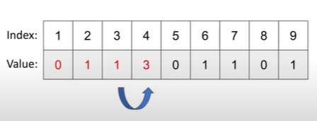
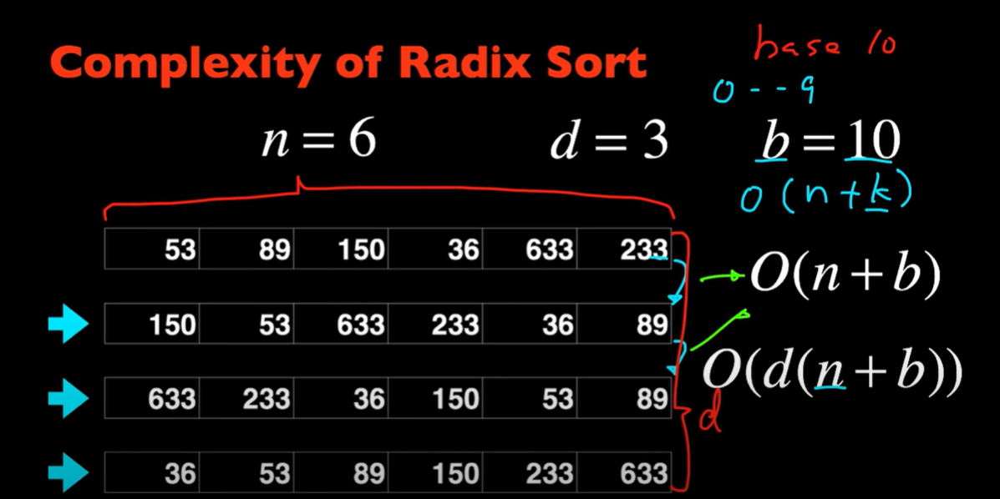

# Gegevensstructuren en Algoritmen

## Les 1: analyse en algoritmen

### Asymptotische analyse

| Notation  | provides                  | example       | shorthand for                                | used to                   |
| --------- | ------------------------- | ------------- | -------------------------------------------- | ------------------------- |
| Tilde     | leading term              | ~ 10N^2^      | 10N^2^ 10N^2^+22NlogN                   | provide approximate model |
| Big Theta | Asymptotic growth rate    | $\theta(N^2)$ | (1/2)N^2^ 10N^2^ 5N^2^ +22NlogN+3N | classify algorithms       |
| Big Oh    | $\Theta(N^2)$ and smaller | O(N^2^)       | 10N^2^ 100N                             | develop upper bounds      |
| Big Omega | $\Theta(N^2)$ and larger  | $\Omega(N^2)$ | (1/2)N^2^ N^5^ N^3^+22NlogN + 3N   | develop lower bounds      |

### Grafiek complexiteit

## Les 2: Sorting Algorithms

### Selection Sort

#### **How does it work?**

The selection sort algorithm sorts an array by repeatedly finding the minimum element from unsorted part and putting it at the beginning. The algorithm maintains two subarrays in a given array.

	1.	The subarray which is already sorted
	1.	Remaining subarray which is unsorted. 

In every iteration of selection sort, the minimum element from the unsorted subarray is picked and moved to the sorted subarray. 

#### **Performance**

- Comparisons:

  - (n-1)+(n-2)+... + 1 = n(n-1)/2  **~ n^2^/2**

- Exchanges:

  - 1+1+...+1 = n-1 **~ n**

  

### Insertion sort

#### How does it work?

Insertion sort is a simple sorting algorithm that works similar to the way you sort playing cards in your hands. The array is virtually split into a sorted and an unsorted part. Values from the unsorted part are picked and placed at the correct position in the sorted part.

- Good for partially sorted arrays and small arrays.

#### Performance

- Best case
  - All elements to the left of i are smaller: 
    - Comparisons :**~n**
    - Exchanges: 0
- Worst case
  - All elements to the left of i are larger: 
    - Comparisons: **~n^2^/2**
    - Exchanges: **~n^2^/2**
- Average case
  - Half of the elements to the left of i are larger: 
    - Comparisons: **~n^2^/4**
    - Exchanges: **~n^2^/4**
    - 

### Partially sorted arrays

What happens when most elements are near their final positions?

- Selection sort: No effect, still **~ n^2^/2**
- Insertion sort: elements move only a few places: **~c.n**

On the basis of this mergesort was created.

### Merge Sort

#### **How does it work**

Quicksort is a divide and conquer algorithm. It divides the input array into two halves, calls itself for the two halves, then it merges the two sorted halves. 

#### Performance

~2k data moves and ~k compares to merge 2 arrays of length k/2

- Comparisons: **\~n.log~2~n**
- Exchanges: **\~n.log~2~n**
- But **~n** extra space required

Average/worst cases are asymptotically faster than insertion sort

Best case is asymptotically slower than insertion sort.

### How fast can sorting algorithms go

**Comparison sorts:**

**Any comparison sort needs at least ~n.logn comparisons**

Thus merge sort is asymptotically optimal!

**Non-comparison sorts, in linear (~n) time:**

- Counting sort
- Radix sort
- Bucket sort

### Lower bound for comparison sorting

All possible permutations of n elements can be made into a tree. For example, here is a compare tree for N = 3:

As you can see all the possible permutations is atleast equal to **N!** because there are N! different permutation of N distinct keys.

The max amount of leaves a tree can have is 2^h^ with h being it's height. Which means:

​								$N!\leq$ **number of leaves** $\leq 2^h$

The value of h is precisely the worst-case numbers of compares, so we can take the logarithm (base 2) of both sides of this equation and conclude that the number of compares used by any algorithm must be at least **log(N!)**. The approximation 

**The worst-case number of comparisons is the height of the tree.**

TODO

1. Toon aan dat een sorteeralgoritme, dat gebruik maakt van onderlinge vergelijkingen van elementen, steeds minstens log2(n!) vergelijkingen zal nodig hebben om algemeen een rij van n elementen te sorteren.

### Search problems (similar problem)

Minimal log(n+1)comparisons needed

-> Best search algorithms **~log(n)**

### Benadering van Stirling

**Bewijs:**

Omzetten naar natuurlijk logaritme maakt benaderen van som naar integraal mogelijk

$log_2(n!)=log_2(e)ln(n!)$

​				$=log_2(e)[ln(n) + ln(n-1)+...+ln(2)+ln(1)]$

Som van natuurlijk logaritme benaderen we door een integraal

$[ln(n) + ln(n-1)+...+ln(2)+ln(1)] \approx \int^n_1ln(x)dx$

$\int^n_1ln(x)dx = [xln(x)-x]^n_1$

​					  $= n.ln(n)-n+1$

En dus:

​	$log_2(n!) =log_2(e)ln(n!)$

​					$\approx log_2(e)[n.ln(n)-n+1]$

​					$=nlog_2(n) - nlog_2(e)+log_2(e)$

​					$=nlog_2(n) - 1.443n + 1.443$

=> $log_2(n!)~n.log_2(n)$

## Les 3&4 Quicksort

### Quick Sort

Most widely used sorting algorithm:

- \~1.39nlog~2~(n) comparisons on average 

Mergesort:

- ​	Recurse first (trivial), then merge (do real work)

Quicksort:

- Partition first (do real work), then recurse (trivial)

#### How it does work?

Like MergeSort, QuickSort is a Divide and conquer algorithm. It picks an element as pivot and partitions the given array around the picket pivot. Elements less than or equal go to the left of the pivot and elements greater than go to the right. When that is done it picks a new pivot in left partition and does the same thing again untill there is only one element left in each partition.

#### **Performance**

**Best Case:**

- Split is always balanced
- Partitioning takes n comparisons

=> **\~nlog~2~n**

**Worst Case:**

- 0 elements in one subarray and (n-1) elements in the other subarray
- E.g. array already sorted and first or last element is chosen as pivot.

=> **n^2^/2**

**Average Case:**

As long as Quicksort splits in proportions of n, behavior is \~𝑐nlog~2~.
c is determined by splitting fraction

=> \~1.39nlog~2~n element compares

**Quicksort can recover from bad splits**

After bad split, nlog~2~n behavior is resumed

- Extra cost ~n (lower order term)
- one bad split is ok, perhaps a few bad splits are ok as well

#### Quicksort optimizations

- Cuttoff to insertion sort for small number of elements
- Median of 3 values for pivot
  - Better probability of splitting roughly in half
- Many similar values in array
  - 3-way partitioning (less, equal, greater)

#### Summary of performance

**Average case**

- \~1.39nlog~2~n
- More compares than mergesort but often faster than mergesort in practice because of less exchanges

**Random shuffle**

- Probabilistic guarantee against worst case

**Worst case**

- \~n^2^/2 but this is so unlikely that you'll win the lottery first : )

**Many textbook implementations go quadratic if array …**

- is sorted or reverse sorted
- has many duplicates

#### Quicksort Complexiteit Bewijs

=>**\~1.39nlog~2~n**

**Aanpak 1:**

**Veronderstelling 1:** partitionering voor n elementen vraagt n+1 vergelijkingen

$C(n)=(n+1)+\frac{1}n(C(0)+C(n-1))+\frac{1}n(C(1)+C(n-2))+...+\frac{1}n(C(n-1)+C(0))$

​		   $=(n+1)+\frac{2}n(C(0)+C(1)+C(2)...+C(n-1))$

En dus:

$nC(n)=n(n+1)+2(C(0)+C(1)+C(2)...+C(n-1))$

Vermits dit geldt voor alle waarden van n, geldt het ook voor n-1:

$(n-1)C(n-1)=(n-1)n+2(C(0)+C(1)+C(2)...+C(n-2))$

Om lange som weg te werken, trekken we beide vorige vergelijkingen van elkaar af:

$nC(n)-(n-1)C(n-1)=n(n+1)-(n-1)n+2C(n-1)$

Herschrijven geeft:

$\frac{C(n)}{n+1}=\frac{2}{n+1}+\frac{C(n-1)}{n}$

Dit is een recursieve uitdrukking, die we gemakkelijk kunnen expanderen. We weten ook dat C(1)=0 en C(2)=1, wat een stopconditie geeft voor de expansie.

$\frac{C(n)}{n+1}=\frac{2}{n+1}+\frac{2}n+\frac{2}{n-1}+\frac{2}{n-1}+...+\frac{2}3$

Benaderen de som door een integraal:

TODO rest van bewijs

## Les 5: Sorteren in lineaire tijd

### Can we sort in linear time?

Comparison-based sorts can do no better than \~nlog~2~n but non-comparison based can.

### Bucket Sort

#### How does it work?

Bucket sort is een sorteer algoritme that elements verdeelt over buckets. De elementen in een bucket komen overeen met een bepaalde variable bv, E = 5 en de bucket krijgt alle elementen die tussen 3 en 5 liggen. Als er onderling in de bucket nog gesorteerd moet worden dan gebruiken we een andere algoritme, bijvoorbeeld mergesort.

Hieronder een voorbeeld met letters:

#### Performance

**Worst Case:**

alles in 1 bucket -> waardeloos

**Best Case:**

n/k elementen in elke bucket. Omwille van het vorige krijgen we dus **k** sorting problemen met **n/k** grootte + **~n** om de elementen in de buckets te plaatsen

**Average Case:**

Ga er vanuit dat je een uniforme random input hebt. Dit resulteer in ongeveer even grote buckets.

**How many buckets?**

- Assume \~c.n.log~2~(n) sorting algorithm in each bucket
- Average/best case:\~k.c.(n/k).log~2~(n/k)=\~c.n.log~2~(n/k)
  - if k is a constant (e.g 5) -> \~c.n.log~2~(n)
  - if k is proportional to n, then log~2~(n/k)is constant ~c'.n

**How should you sort each bucket?**

- Maybe not needed? Perhaps the buckets "are" the sort
  - e.g. sort Belgian citizens by age ranges
- Hopefully only a few elements per bucket: insertion sort
- Sometimes many elements in a bucket: quicksort or mergesort

#### Tradeoffs

- Only works well for evenly distributed inputs
- Requires **~n** extra space
  - Array of k buckets (k proportional to n)
  - Each bucket contains linked list/array of elements

### Counting Sort

#### How does it work?

Counting sort werkt in verschillende stappen simpele stappen

- **Stap 1**

  We maken een nieuwe array die de lengte heeft van het grootste getal in de array die gesorteerd moet worden.

  

- **Stap 2**

  We gaan elk element af van de array en plaatsen op de corresponderende index het getal 1, als we een duplicaat tegenkomen doen we telkens +1 op die index.

  

- **Stap 3**

  We gaan over de nieuw gemaakt array en tellen bij elke index de value van de vorige index bij.

  

​															$\downarrow$

​			

- **Stap 4**

  We maken een nieuwe array met de lengte van de originele array en gaan dan over elk element van de originele array. We nemen een element en kijken dan in de value-array welke waarde daar staat. Deze waarde komt overeen met de index van waar het element moet staat in de 3de array. Als we het element op de correcte plaats hebben gezet gaan we de waarde in de value-array decrementeren zolang die niet op 0 staat. Als die value niet 0 is gaat er dus nog een duplicaat zijn die op een 1-lagere index gaat gezet worden.

- **Stap 5**

  Als alles gedaan is hebben we nu een mooie gesorteerde array.

#### Performance

Uses **8N+3R+1 array accesses** to sort **N** records whose keys are integers between **0 and R-1**

Key-indexed counting uses extra space proportional to N+R

=> $O(r+n)$

With r being the value of the largest number.

### Stable and In-place

#### Stable

**Een aantal sorteeralgoritmes hebben de eigenschap "stabiel" te zijn.**

- **Wat wordt hiermee bedoeld?**

  Een sorteer methode is stabiel als de relatieve orde van gelijke keys in de array behouden wordt. Deze zin zegt wss weinig dus nu een voorbeeld voor wat duidelijkheid. Stel je hebt een internet commerce applicatie waar we een grote hoeveelheid events met een locatie en timestamps verwerken. Nu steken we deze in een array wanneer deze aankomen want dan zijn ze gesorteerd op de timestamp want de laatste timestamp is de laatste in de array. Als we deze lijst nu zouden sorteren op locatie gaan we zien dat bij een stabiel sorting method de timestamps nog correct staat per locatie en bij een instabiele sorting method niet. Hieronder een afbeelding ter verduidelijking.

  

- **Welke sorteeralgoritmes die we behandeld hebben in de lessen zijn stabiel?**

  **Stabiel:** insertion sort, merge sort

  **Niet-stabiel:** selection sort, quick sort

- **Waarom is stabiliteit een belangrijke eigenschap van een sorteeralgoritme?**

  Dit is enkel belangrijk als je er een nut voor hebt zoals bij het voorbeeld hierboven. Nog een voorbeeld van stackoverflow: *We are asked to sort "by last name, then by first". We could first sort (stable or unstable) by the first name, then stable sort by the last name. After these sorts, the list is primarily sorted by the last name. However, where last names are the same, the first names are sorted.*

  You can't stack unstable sorts in the same fashion.

  https://stackoverflow.com/questions/1517793/what-is-stability-in-sorting-algorithms-and-why-is-it-important

- **Kan een niet-stabiel sorteeralgoritme steeds stabiel gemaakt worden?**

  Ja maar niet zonder een serieuze extra hoeveelheid tijd of ruimte. Dit betekent dat de meeste programmers dus voor algoritmes gaan die uit zichzelf stabiliteit garanderen.

##### Stabiele Algoritmes

- Bubble Sort
- Insertion Sort
- Merge Sort
- Counting sort

##### 

#### In-place

Een in-place algoritme is een algoritme dat geen extra ruimte nodig heeft om te sorteren en de output van het algoritme staat op dezelfde plek als de start array. Een klein beetje ruimte gebruiken voor wat variables is wel okay.

##### In-place algoritmes

- Bubble Sort
- Selection Sort
- Insertion Sort
- Heap Sort
- Quick Sort

### LSD(Least significant digit) (radix) sort

#### How does it work?

LSD sort of Radix sort is een gebaseerd op counting sort. Het werkt als volgt; We nemen voor alle getallen het meest rechts gelegen getal, we sorteren dan op deze keys. Dan schuiven we 1 op naar links en sorteren op deze keys. Omdat counting sort stabiel is blijven deze getallen met dezelfde key in dezelfde volgorde, is dit niet het geval dan werkt LSD sort niet. Het sorteren op de keys blijven we toepassen tot we het grootste getal volledig behandeld hebben. Als we een getal hebben dat op een bepaalde plek geen cijfer meer heeft dan wordt daar simpelweg een 0 gezet, zoals hieronder.

#### Performance

De tijdscomplexiteit van LSD sort kan heel goed zijn.

Hierboven zien we probleemgrootte n, max grootte van de getallen d = 3 en base = 10(0-9)(dit kan ook binair of hexadecimaal).

Voor Counting sort eenmaal toe te passen hebben we een complexiteit van $O(n+b)$. Voor elke d > 1 moeten we counting sort nog is toepassen dus dat betekent dat de complexiteit verandert naar $O(d(n+b))$.

Afhangend van bepaalde inputs kan LSD of radix sort het dus beter doen dan quick sort of merge sort.

### MSD (Most significant digit) (radix) Sort

Dit is hetzelfde als LSD maar werkt van rechts naar links, dus deze begint met het grootste getal.

#### Advantages over LSD

MSD moet vaak maar net genoeg characters bekijken om te sorteren, dus niet allemaal wat efficientie verhoogt.

De hoeveelheid van de karakters die bekeken worden voor de sort hangen van de keys. Dit kan dus sublinear zijn zoals hierboven.

- N random strings
- R-character alphabet

=> $N.log_RN$ characters bekeken on average

### 3-way string (radix) quicksort 

#### How does it work?

Vervang couting sort met quicksort, die doet de afhankelijkheid op R, dus de grote van de set van tekens gebruikt, verdwijnen.

1. partition info <,=, and > compared to pivot
2. Recursively sort same character on < and > partitions
3. Recursively sort next character for = partition

###### 

#### Performance

**Average case:**

\~1.39Nlog~2~N character compares

- Avoids recomparing initial parts of the string
- Adapts to data: uses just "enough" compares
- Sublinear when strings are long

### Key lessons from sorting

**Je kan sorteer probleem om heel veel verschillende manieren aanpakken**

- De beste optie hangt af van je data
- Belangrijk om de average and worse case te analyzeren

**Verdeel en heers**

- Quicksort, Mergesort
- Meest voorkomende klasse van algoritme
- Leidt vaak tot een performantie van $nlog(n)$

**Vele distincte problemen zijn eigenlijk zeer nauw verwant **

- e.g. Convex hull is really just sorting
- Try and convert new problems to known ones

**Gebruik reduceringen om te redeneren over algoritmes**

- e.g. Convex hull lower bound is geweten door te reduceren naar sorteren
- Vaak de enige manier om de lower bounds te bewijzen

## Les 6: Priority Queues & Balanced Trees

### Priority Queues

Zoals je hier kan zien kunnen de operaties enorm verschillen. Dit lossen we op met een partially ordered array.

### Binary Tree

Een binaire boom is leeg of is een node met links en rechts een binaire boom.

Als deze perfect gebalanceert is behalve het laatste level

-> Complete tree

De hoogte van een binaire boom met $n$ nodes is $log_2(n)$

### Binary heap

**Heap-ordered binary tree**

- Keys are stored in nodes
- Key is not smaller than children's keys

**Array representation**

- Number nodes up-down, left-right
- No explicit links needed

- Largest key is a[1]
- Use array indices to move through the tree:
  - **Parent** of node $k$ is at $k/2$
  - **Children** of node $k$ are at $2k$ and $2k+1$

#### Promotion in a heap

**Scenario:** 
Node's key is replaced by a **larger** key than its parent's key

1. Exchange key in node with key in parent
2. Repeat until heap order restored

#### Insertion in a heap

1. Add node at last position, then swim it up
2. At most $log_2N$ compares with N elements on the heap

#### How to build a heap? (option 1) Geen uitleg in slides?

**$N$ elements have to be added to the heap**

=> $\sim N.log_2N$

#### Demotion in a heap 

**Scenario:**
Node's key becomes smaller than one (or both) of its children's keys

1. Exchange key in node with key in larger child
2. Repeat until heap order restored
3. At most $2log_2(N)$ compares

#### Delete maximum in a heap

Exchange root with last node, then sink it down

At most $2log_2N$ compares

#### Binary heap overview

| Implementation  | insert | del max | max  |
| --------------- | ------ | ------- | ---- |
| unordered array | 1      | N       | N    |
| ordered array   | N      | 1       | 1    |
| binary heap     | log N  | log N   | 1    |

#### How to build heap? (option 2)

1. $N$ elementen worden in een array geplaatst
   - maar dit is geen geldige heap
2. Loop over alle elementen, je start op $N/2$. Dit is de laatste node met kinderen en ga dan tot positie 1

**Performance**

$2N$ compares, $N$ exchanges

### Multiway heaps

#### Complete $d$-way tree

Ik vind hier geen informatie over TODO

### Heapsort

#### How does it work?

We plaatsen alle elementen in een heap. Omdat we een heap hebben gaat het kleinste of grootste getal (afhankelijk van of het een min/max heap is) in de root staan. Haal het element in de root eruit en plaats deze in een array. Als we alle elementen van de heap hebben behandeld hebben we nu een een gesorteerde array.