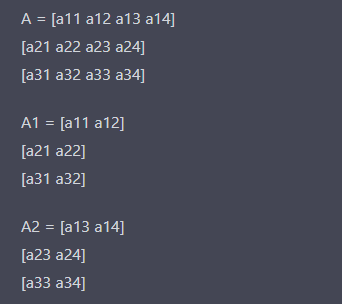
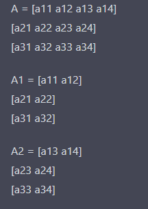
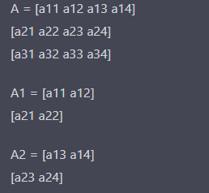
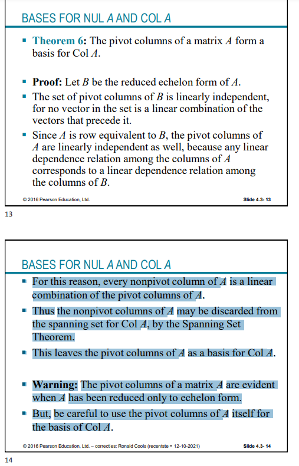

# Lineaire Algebra oefening assistentie

## Oefenbundel 1 (Les 1 2 3)

#### **Consistentie**

 Een stelsel is consistent als de matrix 1 of meerdere oplossing heeft. De uitgebreide matrix B
$$
\left(
\begin{array}{cc|c}
3 & 6 & 1\\
0 & 0 & 2\\
\end{array}
\right)
$$
Is inconsistent want 0x~1~ + 0x~2~ = 2 is niet mogelijk. De matrix B heeft dus geen oplossing.

#### **Span**

De span van vectoren is de verzameling van alle lineaire combinaties van die vectoren. Als je een matrix A (bestaande uit de kolomvectoren
 $a_1,a_2,a_3$) hebt dan is de kolomruimte ($Col(A)$) gelijk aan de span {${a_1,a_2,a_3}$}

**Extra info**

Als je een span hebt van 2 vectoren (v~1~, v~2~) en een derde vector (v~3~) ligt in die span dan kan je die v~3~ schrijven als een lineaire combinatie van v~1~ en v~2~

**Inverteerbaar (invertible)**

Een matrix is inverteerbaar als het aan de volgende voorwaarde voldoet:

- De matrix is vierkant m.a.w. eveneel kolommen als rijen
- De determinant van de matrix mag niet 0 zijn
- De matrix mag geen rijen hebben met alleen maar nullen

Als een matrix inverteerbaar is dan heeft deze een inverse matrix

#### **Lineaire Combinatie**

Gegeven de matrix multiplicatie van matrix A en B
$$
\left(
\begin{array}{cc}
a_1 & a_2 \\
a_3 & a_4 \\
\end{array}
\right)
.
\left(
\begin{array}{cc}
b_1 & b_2 \\
b_3 & b_4 \\
\end{array}
\right)
=
\left(
\begin{array}{cc}
a_1.b_1+a_2.b_3 & a_1.b_2+a_2.b_4 \\
a_3.b_1+a_4.b_3 & a_3.b_2+a_4.b_4 \\
\end{array}
\right)
$$
Zoals je kan zien hier zijn de kolommen van de matrix AB lineaire combinaties van de rijen van B want

$(b_1,b_2) + (b_3,b_4) = (b_1+b_3, b_2+b_4)$

want hetzelfde is als hieronder (buiten de scalar). Wat we hieronder hebben is recht uit de matrix AB hierboven gehaald.

$(a_1.b_1+a_2.b_3 , a_1.b_2+a_2.b_4)$

#### Echelon vorm

Een vierkante matrix is in echelon vorm als

- Alle niet-nul rijen zijn boven elke rij met alleen maar nullen staan
- Elke leidende entry van een rij is een kolom rechts van de leidende entry van de rij erboven
- Alle entries in een kolom onder leidende entry zijn nul.

**Gereduceerd echelon vorm**

Als het dan ook nog is voldoet aan de volgende voorwaarde dan is het in gereduceerd echelon vorm

- De leading entry in elke niet nul-rij is 1
- Elke leidende 1 is de enige niet nul entry in zijn kolom

Elke matrix heeft maar 1 gereduceerd echelon matrix

#### Homogeen

Een systeem van lineaire vergelijking is homogeen als het geschreven kan worden als $Ax=0$ waar A een $m\times n$ matrix is and 0 de zero vector. Zo een systeem $Ax=0$ heeft altijd een oplossing, namelijk $x=0$.

Dit noemen we de **triviale oplossing**. De vraag is of er een **nontriviale oplossing bestaat**.

De homogene vergelijking $Ax=0$ heeft een niet-triviale oplossing als en slechts als de vergelijking 1 vrije variable heeft.

#### Parametrische vector vorm

De oplossingsverzameling van $Ax=0$ (homogeen) kunnen we schrijven als $x=tv$ met $v$ een vector

We kunnen de oplossingsverzameling van $Ax=b$ schrijven in parametrische vector vorm en de algemene formule van dit ziet er zo uit: $x=p+tv$

Als de vergelijking $Ax=b$ consistent is voor een gegeven $b$ en $p$ is gelijk aan de oplossing. Dan is de oplossingsverzameling voor $Ax=b$ de verzameling van alle vectoren van de vorm $w=p+v_h$, waar $v_h$ gelijk is aan een oplossing van de homogene vergelijking $Ax=0$

#### Factorisaties

Een factorisatie van een matrix A is een vergelijking dat A uitdrukt als een product van 2 of meer matrices.

##### LU factorisatie

- **L** is een **l**ower triangular matrix met alleen maar 1 op de diagonaal

- **U** is de echelon vorm van A

Het algoritme voor LU factorisatie:

1. Reduceer a naar de echelon vorm U
2. Plaats de entries in L

De enige operatie die je mag doen is:

​	(Vervanging) Vervang een rij door de som van zichzelf en een veelvoud van een andere rij.

#### Inverse

Een $n\times n$ matrix $A$ is invertible als er een $n \times n$ matric $C$ bestaat zodat

​		$CA =I$ en $AC = I$

waar $I$ de identiteitsmatrix is

De inverse van een $2\times 2$ matrix kan berekend worden door de volgende formule:

$A^{-1} = \frac{1}{ad-bc} \begin{bmatrix}d &-b\\-c & a \end{bmatrix}$

Als $ad-bc=0$ dan is A niet inverseerbaar aangezien we dit ook gebruiken in de berekening van de determinant kunnen we zeggen dat een **matrix alleen een inverse heeft als $det(a) \ne0$**

**Eigenschappen:**

- $(A^{-1})^{-1}= A$
- $(AB)^{-1} = B^{-1}A^{-1}$
- $(A^T)^{-1}=(A^{-1})^T$

#### Partitionering

We kunnen matrices ook partitioneren. Dit wilt zeggen dat we een matrix gaan opdelen in kleinere submatrices. Er zijn 3 opties:

1. **Rij partitionering:** Hier gaan we een matrix A opspliten in 2 of meer matrices die telkens 1 of meer rijen bevat van onze originele matrix.
   - 
2. **Kolom partitionering:** Hier gaan we een matrix A opsplitsen in 2 of meer matrices die telkens 1 of meer kolommen bevat van onze originele matrix
   - 
3. **Block partitionering:** Hier gaan we de matrix A opsplitsen in kleinere matrices die telkens een vierkante blok bevatten van de matrix
   - 

Dit kan handig zijn voor het berekenen van de inverse van een matrix.

Hier wat formules voor het berekenen van de determinant van een block partitionering (blok matrix). 
Als A B C D matrices zijn dan:

$$det \left(\begin{array}{cc}A & 0\\C & D\\\end{array}\right) = det(A)det(D) = det \left(\begin{array}{cc}A & B\\0 & D\\\end{array}\right)$$

#### Transpose

Gegeven een $m\times n$ matrix A, dan is the transpose de $n \times m$ matrix, genoteerd door A^T^, waarvan de kolommen gevormd worden door de overeenkomstige rijen van A

**Eigenschappen:**

- $(A^T)^T$ = A
- $(A+B)^T=A^T+B^T$
- Voor elke scalar $r,(rA)^T=rA^T$
- $(AB)^T=B^TA^T$

De transpose van een product van matrices is gelijk aan het product van de transpose in omgekeerd volgorde: $(AB)^T=B^TA^T$ 

#### Belangrijk voor examen:

- Vraag over inverse maar je mag het niet expliciet berekenen met rijreducties etc. Kijk dan of je het kan partitioneren. Vraag 13 in oefenbundel 1 is een goed voorbeeld
- 

## Oefenbundel 2

#### Basis

#### Lineaire Transformatie

**Definitie:** Een lineaire transformatie T van een vector ruimte V in een vector ruimte W is een regel die elke vector x in V een unieke vector T(x) in W toewijst zodat:

1. T(u+v) = T(u) + T(v) voor alle u , v in V
2. T(*c*u) = *c*T(u) voor alle u in V en alle scalars *c*

#### Determinant

De determinant van een matrix A is de schaal factor van de matrix. Afhankelijk van welke dimensie kan dit het volume of oppervlak zijn die de matrix spant.

**Eigenschappen:**

- De determinant van een matrix is gelijk aan het product van zijn eigenvalues
- De determinant van een matrix is gelijk aan het volume van de parallellogram  die men krijgt door de kolommen van de matrix
- De determinant van een diagonaal matrix is gelijk aan het product van zijn diagonale entries
- De determinant van een (lower of upper) triangular matrix is gelijk aan het product van zijn diagonale entries.
- De determinant van een matrix is gelijk aan de determinant van zijn transpose
- $Det(A+B) \ne Det(A) + Det(B)$
- $Det(AB) = Det(A)Det(B)$

#### Row Space

Als A een $m \times x$ matrix is, dan heeft elke rij van A n entries en dus kan deze geïdentificeerd worden met een vector in $\R ^n$

De set van alle lineaire combinaties van de rij vectors noemen we de **row space** van A en noteren we met **Row A**

- Elke rij heeft $n$ entries dus is Row A een subspace van $\R^n$
- Aangezien de rijen van A geïdentificeerd worden met de kolommen van A^T^, we kunnen ook schrijven **Col A^T** in plaats van **Row A**

Als 2 matrices A en B rij-equivalent zijn dan zijn hun row spaces hetzelfde. Als B in echelon vorm dan vormen de niet-nul rijen van B een basis voor de row space van A en van B

#### Coördinaat Vector

De coördinaat vector [x]~B~ van een vector x ten opzichte van een gegeven basis B = {b~1~,.., b~n~} is een representatie van de vector x in termen van de basis B. 

Om deze coordinaat vector [x]~b~ te vinden, drukken we x uit als een **lineaire combinatie** van de vectoren van de basis B. Met andere woorden, we schrijven x als de som van de scalaire veelvouden van de vectors in basis B.

**Voorbeeld:**

Gegeven de vectoren: 
$$
x = 	 \left(\begin{bmatrix}8 \\ -9 \\ 6\end{bmatrix}\right), b_1=\left(\begin{bmatrix}1 \\ -1 \\ -3\end{bmatrix}\right), b_2=\left(\begin{bmatrix}-3 \\ 4 \\ 9\end{bmatrix}\right), b_3=\left(\begin{bmatrix}2 \\ -2 \\ 4\end{bmatrix}\right)
$$
Zoek de coordinaatvector $[x]_b$ van $x$ relatief ten opzichte van de basis B = ${b_1,...,b_3}$
$$
\left(
\begin{array}{ccc|c}
1 & -3 & 2 & 8\\
-1 & 4 & -2 &-9\\
-3 & 9 & 4 &6
\end{array}
\right) \widetilde\ \left(
\begin{array}{ccc|c}
1 & -3 & 2 & 8\\
0 & 1 & 0 &-1\\
0 & 0 & 10 &30
\end{array}
\right)  
$$
$C_1 -3C_2+2C_3=8 => C_1=-1$

$C_2=-1$

$C_3=3$

Thus:

$$[x]_b = 	 \left(\begin{bmatrix}8 \\ -9 \\ 6\end{bmatrix}\right)$$

#### Change of basis (Verandering van basis)

#### Rang

De rang van een matrix is gelijk aan de dimensie van $ColA$. $ColA$ is gelijk aan het aantal pivotkolommen. 

Gegeven een ($m × n$) matrix $A$ en een inverteerbare ($m × m$) matrix $P$, dan is de rang van $PA$ gelijk aan de rang van $A$

#### Rij-operaties

**De null space** van een matrix blijft hetzelfde wanneer we rij-operaties uitvoeren op deze matrix. Rij-operaties veranderen. Rij-operaties veranderen de hoeveelheid vrije variabelen in een matrix niet dus blijft de null space hetzelfde.

**De column space** van een matrix blijft niet hetzelfde wanneer we rij-operaties uitvoeren op de matrix. Rij-operaties veranderen de entries in de matrix, wat de lineaire combinaties van de kolommen kan veranderen.

**De row space** van een matrix blijft hetzelfde omdat we de rijen alleen scalen of dingen gaan bijtellen. Dus een matrix en zijn echelon vorm hebben dezelfde 

#### Belangrijk voor examen:

- De determinant van een matrix is gelijk aan de determinant van de transpose van die matrix
- Als $A$ en $B$, $n\times n$ matrices zijn dan is $det(AB)=det(A)det(B)$
- Als de determinant van een vierkante matrix 0 is dan is deze niet inverteerbaar
- Vraag 8 oefenbundel bekijken
- Vraag 19 herbekijken (d!!!)
- Quiz me again vraag a nog is bekijken