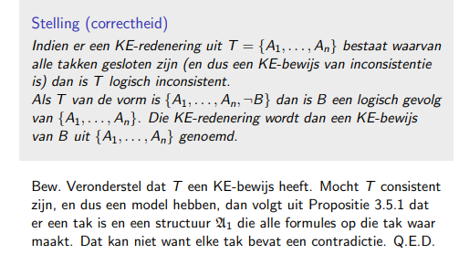
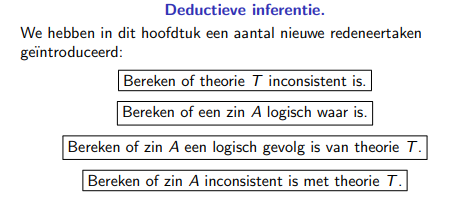

# Logica Definities

### Definities en bewijzen om te kennen

Logische zin

Waarheid van een logische zin

Logisch waar

Consistent

Logisch gevolg

Generalisatiepropositie

Vervangpropositie

wetten van de morgan

bewijsopdracht 1

inferenties

correctheid van KE-bewijs

volledigheid van KE-bewijs

### Commands

$\newcommand{\A}{\mathfrak{A}}$

$\newcommand{\B}{\mathfrak{B}}$

$\newcommand{\T}{\mathcal {T}}$

### Inductieve definities: hoe werkt dat?

1. Begin met lege verzameling
2. Pas basisregels en inductieve regels toe
3. Totdat alle regels voldaan zijn
4. De volgorde van toepassen van regels maakt geen verschil

### Term

Een term is een string die inductief gedefinieerd wordt als volgt:

- Een 0-voudig functiesymbool c is een term
- Als $t_1,...,t_n$ termen zijn en G een n-voudig functiesymbool, dan is G($t_1,...,t_n$) een term.

### Formule

Een formule is een string die inductief gedefinieerd wordt als volgt:

- Als $t_1,...,t_n$ $n$ termen zijn en $P/n$ een relatiesymbool van ariteit $n$ is, dan is P($t_1,...,t_n$) een formule. We noemen dit een atoom.
- Als $t_1,t_2$ termen zijn, dan is $t_1=t_2$ een formule. Dit noemen we een gelijkheidsatoom.
- Als $A,B$ formules, dan zijn n $(¬A), (A ∧ B), (A ∨ B), (A ⇒ B), (A ⇔ B)$ formules.
- Als x een variable is en $A$ een formule, dan zijn $(∃x : A)$ en $(∀x : A)$ formules.

### Gebonden symbool

Een voorkomen van een symbool $x$ in formule $A$ is gebonden indien het zich bevindt in een deelformule $∃x : B$ of $∀x : B $ van $A$.

Een voorkomen van $x$ in $A$ is vrij indien niet gebonden

### Een logische zin

Een logische zin over het vocabularium $Σ$ is een formule $A$ zodat elk vrij symbool van $A$ behoort tot $Σ$

Een theorie over $Σ$ is een verzameling van zinnen over $Σ$.

### Structuur

Een structuur $\A$ bestaat uit een niet-lege verzameling $D_{\A}$, het domein of universum van $\A$ genaamd, en een toekenning van waarde $\T^{\A}$ aan niet-logische symbolen $\T$:

- De waarde $c^\A$ voor een objectsymbool $c$ is een element uit het domein $D_\A$ 
- De waarde $F^\A$ voor een functie-symbool $F/n$: is een functie $F^\A:D_\A^n \rightarrow D_\A$
- De waarde $P^\A$ voor een predikaatsymbool $P/n$ is een n-voudige relatie $P^\A$ in $D_\A$ (m.a.w. $P^\A \subset D^n_\A$)

We noemen $\T^\A$ de waarde of de interpretatie van $\T$ in $\A$

Een structuur $\A$ interpreteert een term t of logische formula A als elk niet-logisch vrij symbool van t of A een interpretatie heeft in $\A$ 

### Waarheid van een logische zin

We definieren dat formule $A$ waar is in $\A$ (notatie $\A \vDash A)$ door inductie op de structuur van $A$:

- $\A \vDash P(t_1,...,t_2)$ asa $(t_1^\A,...,t_n^\A)  \in P^\A$  (Atoom-regel)
- $\A \vDash t_1 =t_2$ asa $t_1^\A=t_2^\A.$ (=-regel)

### Logisch waar

Een zin $A$ is logisch waar (is een tautologie) als $A$ waar is in alle structuren $\A$ die A interpreteren. Wiskundige notatie: $\vDash A$

### (In)Consistent

Een zin $A$ is logisch consistent als $A$ waar is in minstens 1 structuur

Een zin A is logisch inconsistent of logisch contradictorisch als $A$ onwaar is in elke structuur.

### Logisch gevolg

Zin $B$ is een logisch gevolg van zin $A$ als in elke $\A$ die beide zinnen interpreteert en waarin $A$ waar is, ook $B$ waar. We zeggen ook $A$ impliceert $B$. Wiskundige notatie: $A \vDash B$

### Opmerking

Het wiskundige teken $\vDash$ drie verschillende betekenissen: 

- $\A$ $\vDash$ A betekent “A is waar in structuur $\A$”. 
- $\vDash$ A betekent “A is logisch waar”. 
- A $\vDash$ B betekent “B is een logisch gevolg van A”.

 De betekenis van het symbool moet je halen uit de context. Wees zorgvuldig.

### Generalisatiepropositie

Zij A een logische formula zodat voor elk symbool $P$ in $A$ er een logische formule $B_p$ bestaat. Construeer de formule $A'$ door elk symbool $P$ in $A$ te vervangen door $B_p$. Als $A$ logisch waar is dan is $A'$ logisch waar,

**Bewijs:**

We bewijzen eerst dat voor elke structuur $\A'$ die $A'$ interpreteert een structuur $\A$ bestaat die $A$ interpreteert zodat

$\A \vDash A$ asa $\A' \vDash A'$

Neem een willekeurige structuur $\A'$ die $A'$ interpreteert. Definieer de structuur $\A$ die elk symbool $P$ in $A$ interpreteert als volgt:

$P^\A:=(B_p)^\A$

We bekomen een structuur $\A$ die alle symbolen van $A$ interpreteert

We tonen aan dat $A^\A$ en $A'^{\A'}$ identiek zijn.

We bewijzen dat $A^\A = A'^{\A'}$ door inductie op de grootte van $A$, t.t.z op het aantal connectieven dat $A$ bevat.

*$H(n)$ = "voor elke formule A waarvan de grootte gelijk of kleiner is dan n geldt $A^\A=A'^{\A'}$"*

- Bewijs van $H(0):$ een formule van grootte 0 (of kleiner) is dan van de vorm $P$, een atomische formula. Dan is $A'$ niets anders dan $B_p$. Er geldt per definitie van $\A$ dat $P^\A=B_p^{\A'}$. Dus is $H(0)$ voldaan. 
- Bewijs van de inductiestap: Veronderstel dat de inductiehypothese $H(n)$ geldt. We dienen te bewijzen dat hieruit $H(n+1)$ volgt.

Stel dat de grootte d van $A$ kleiner of gelijk is aan $n+1$ is. 
Ofwel is $d$ strikt kleiner dan $\leq n+1$. Dan is het kleiner dan of gelijk aan $n$, en dan volgt $A^\A=A'^{\A'}$ uit $H(n)$.
Ofwel is $d$ gelijk aan $n+1$. $A$ bevat dus minstens 1 connectief. We maken een gevallenonderscheid.

- Veronderstel $A=B \and C$. $A'$ is van de vorm $B' \and C'$, waarbij $B'$ en $C'$ bekomen worden uit $B$ en $C$ door symbolen $P$ te vervangen door $B_p$. De grootte van $B$ en van $C$ is hoogstens n. Uit de inductiehypothese $H(n)$ volgt dat $B^\A=B'^{\A'}$ en $C^\A=C'^{\A}$. Hieruit volgt dat $(B \and C)^\A = (B' \and C')'^{\A'}$
- De andere gevallen waarbij $A$ van de vorm $\neg B,B \or C, B ⇒C$ of $B⇔C$  is analoog.

Door het principe van bewijs door inductie volgt dat de eigenschap geldt voor formules van elke grootte, dus voor alle formules.

We werken nu het bewijs af uit het ongerijmde. Veronderstel dat $A$ wel en $A'$ niet logisch waar is.

Volgends de definitie van logische waarheid bestaat dus eens structuur $\A'$ waarin $A'$ onwaar is.

Uit de zonet bewezen eigenschap volgt dat er een structuur $\A$ bestaat waarin $A$ onwaar is (in symbolen: $\A \not\vDash A$). Dus is $A$ niet logisch waar. Dit is een contradictie. Q.E.D.

### Vervangpropositie

Zij $A, B$ logisch equivalente formules. Zij $C$ een formule waarin $A$ één of meerdere keren als deelformule voorkomt. Veronderstel dat de formule $C'$ kan bekomen worden door één of meerdere voorkomens van $A$ te vervangen door $B$. Dan geldt dat $C$ en $C'$ logisch equivalent zijn.

Bijna hetzelfde bewijs, met inductie.

### Een voorbeeld (Belangrijk)

chapter 3 slide 95

### Prenex normaalvorm

Een formule $A$ is in prenex-normaalvorm als alle kwantoren buiten/boven alle connectieven staan.

### Correctheid van KE-bewijzen

### Deductieve inferentie

Definitie: Deze redeneervormen noemt men deductief redeneren of kortweg deductie.

### Isomorf

Twee structuren $\A,\B$ van hetzelfde vocabularium $\sum$ zijn **ismorf** asa er een bijectie bestaat van $D_\A$ naar $D_\B$ die de interpretatie van elk symbool bewaart.

**Eigenschap:** In **isomorfe** structuren zijn exact dezelfde formules **waar**.