# SWOP

## GRASP 

**GRASP: General Responsibility Assignment Software Principles and Patterns**

9 general principles in assigning responsibility:

1. Information Expert
2. Creator
3. Controller
4. High Cohesion
5. Low Coupling
6. Polymorphism
7. Pure Fabrication
8. Indirection
9. Protected Variations

I Can Cum (in) Her Legendary Pussy Pie, Indirectly Poggers

-> Mnemonic (ezelsbruggetje)

### Information Expert

Assign a responsibility to the information expert - the class that has the information necessary to fulfil the responsibility.

### Creator

Who creates? (Note that Factory is a common alternate solution)

Assign class B the responsibility  to create an instance of class A if one of these is true:

1. B contains A
2. B aggregates A
3. B has the initializing data for A
4. B records A
5. B closely uses A

### Controller

Who handles a system event?

Assign the responsibility  for handling a system event message to a class representing one of these choices

1. Represents the overall system, device, or a subsystem (facade controller)
2. Represents a use case scenario within which the system event occurs (use-case or session controller)

### High Cohesion

How to keep complexity manageable?

Assign responsibilities so that cohesion remains high

### Low Coupling

How to support low dependency and increased reuse?

Assign responsibilities so that (unnecessary) coupling remains low

### Polymorphism

Who is responsible when behaviour varies by type?

When related alternatives or behaviours vary by type (class), assign responsibility for the behaviour - using polymorphic operations - to the types for which the behaviour varies.

### Pure Fabrication

Who is responsible when you are desperate, and do not want to violate high cohesion and low coupling?

Assign a highly cohesive set of responsibilities to an artificial or convenience "behaviour" class that does not represent a problem domain concept - something made up, in order to support high cohesion, low coupling, and reuse.

### Indirection

How to assign responsibilities to avoid direct coupling?

Assign the responsibility to an intermediate object to mediate between other components or services, so that they are not directly coupled

### Protected Variations

How to assign responsibilities to objects, subsystems and systems so that the variations or instability in these elements do not have an undesirable impact on other elements?

Identify points of predicted variation or instability; assign responsibilities to create a stable "interface" around them.

1. information expert

   - Assign responsibility to the class that has the information to fulfil that responsibility

2. controller

   - Assign responsibility of dealing with a system event to a class that the represents the system or a use case scenario.

3. creator

   - Assign responsibility of creation to a class if
     - B contains A
     - B aggregates A
     - B has the initializing data for A
     - B records A
     - B closely uses A

   

4. high cohesion

   - Assign responsibility so that cohesion remains high and thus reduces complexity

5. low coupling

   - Assign responsibility so that coupling remains low and thus support low dependency and increased reuse

6. polymorphism

   - When behaviours vary by type, assign responsibility to types for which the behaviour varies

7. pure fabrication

   - Assign a cohesive set of responsibilities to a made-up class to support low coupling, high cohesion and reuse

8. protected variations

   - Identify points of predicted instability, assign responsibilities to create a stable "interface" around them

9. Indirection

   - If we want to avoid direct coupling, assign responsibility to an intermediate object to media between components so they are not coupled

## Design Patterns

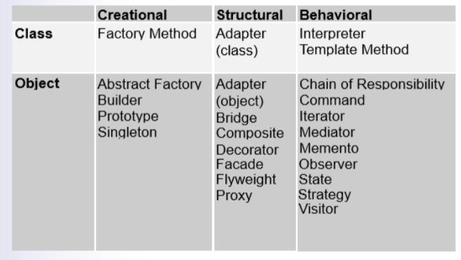

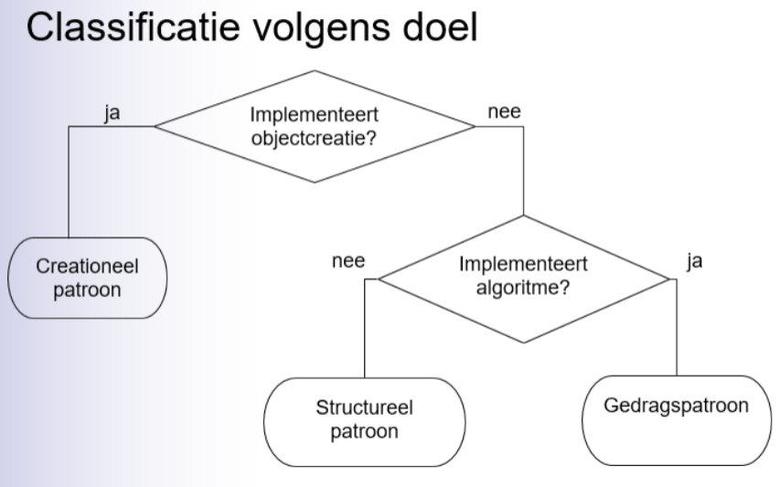

### Observer

Say we have one-to-many relationship between objects such as if one object is modified, its dependent objects are to be notified automatically.

The way the **Observer** pattern tries to solve this, is based on a **subscription** mechanism. So we have **subscribers/observers** and a **subject/publisher**. As can be seen below.

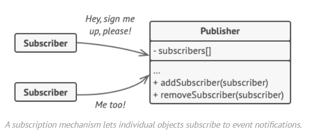

A subscriber/Observer can "subscribe" itself to a publisher and then will be notified every time a change happens. it's crucial that all subscribers implement the **same interface** and that the publisher communicates with them only via that interface. This interface should declare the **notification method** along with a set of parameters that the publisher can use to pass some contextual data along with the notification.

Usually we have a second interface as well, one for the **publishers/subjects**. If they follow the same interface, all of the subscribers will be compatible with all of them.

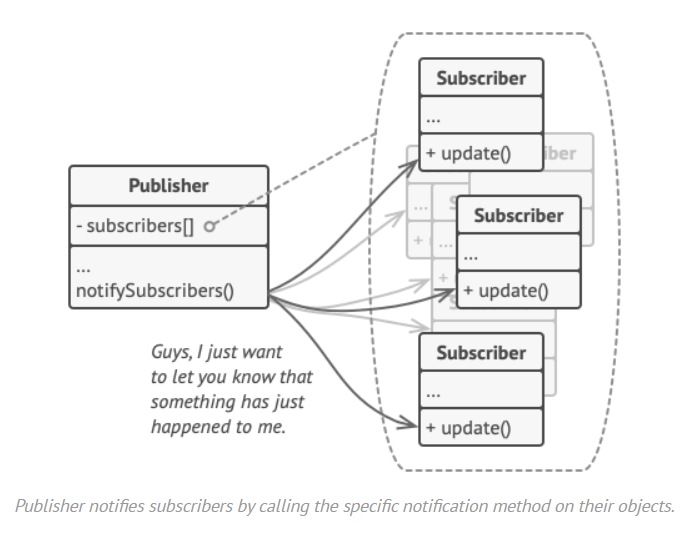

Below you can see what the structure would look like in an UML.

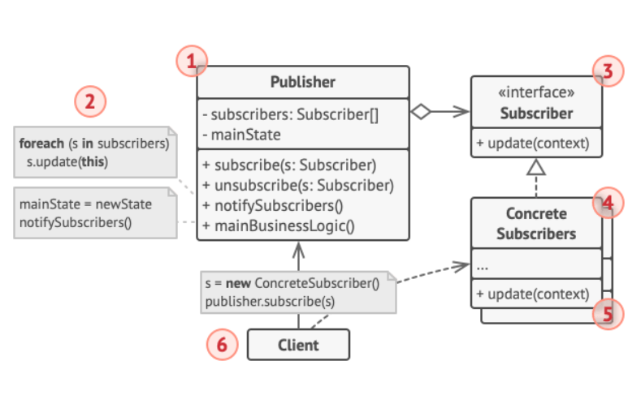

### Composite

**Composite** is a structural design pattern that lets you compose objects into tree structures and then work with these structures as if they were individual objects.

**The problem we are trying to solve:**

For example, imagine that you have two types of objects: `Products` and `Boxes`. A `Box` can contain several `Products` as well as a number of smaller `Boxes`. These little `Boxes` can also hold some `Products` or even smaller `Boxes`, and so on.

Say you decide to create an ordering system that uses these classes. Orders could contain simple products without any wrapping, as well as boxes stuffed with products...and other boxes. How would you determine the total price of such an order?

**Solution**

The Composite pattern suggests that you work with a common interface which declares a method for calculating the total price. Below you can see what this structure would look like in an UML.

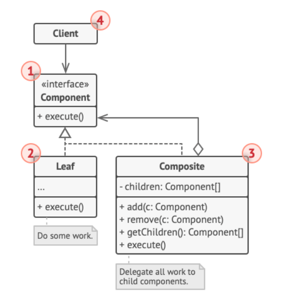

Let's give a concrete example for some clarification. We will work with geometric shapes.

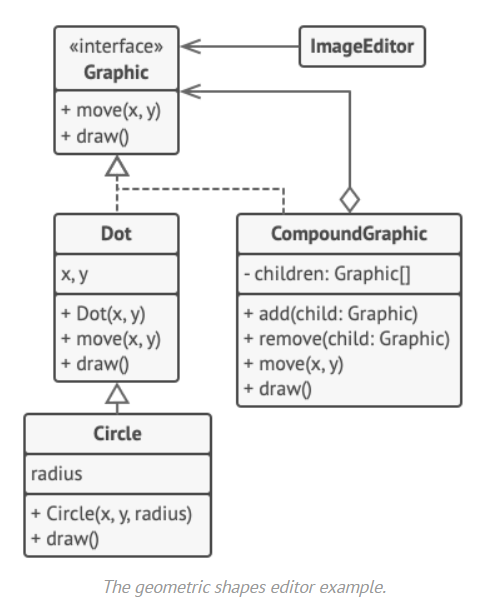

The `CompoundGraphic` class is a container that can comprise any number of sub-shapes, including other compound shapes. A compound shape has the same methods as a simple shape. However, instead of doing something on its own, a compound shape passes the request recursively to all its children and “sums up” the result.

Another good explanation:

https://dotnettutorials.net/lesson/composite-design-pattern/

### Iterator

Iterator is a behavioral design pattern that lets you traverse elements of a collection without exposing its underlying representation (e.g. list, stack, tree, etc..)

**The problem we are trying to solve:**

There should be a way to go through each element of the collection without accessing the same elements over and over. This may sound easy if you have a collection like a list. But how do you sequentially traverse elements of complex data structure such as a tree?

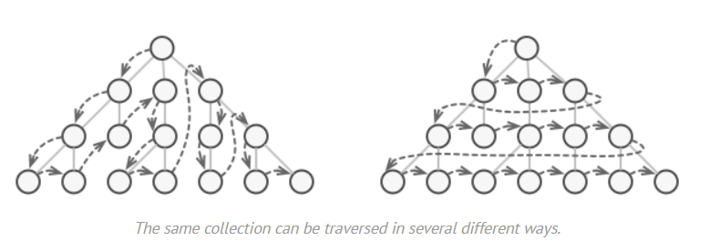

**Solution**

The main idea of the Iterator pattern is to extract the traversal logic/behaviour of a collection into a separate object called an iterator. The structure of the UML would look like something below.

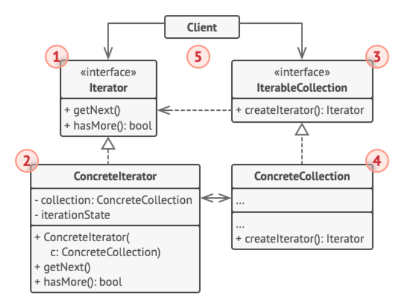

1. The **Iterator interface** declares the operations required for traversing a collection.
2. **Concrete Iterators** implement specific algorithms for traversing a collection. The iterator object should track the traversal progress on its own. This allows several iterators to traverse the same collection independently of each other.
3. The **Collection** interface declares one or multiple methods for getting iterators compatible with the collection.
4. **Concrete Collections** return new instances of a particular concrete iterator class each time the client requests one. 

### Factory

We primarily use the factory to minimize code duplication, by using an interface and being able to add new widgets quickly and easily.

TODO

https://refactoring.guru/design-patterns/factory-method

### Abstract Factory

**The purpose of the Abstract Factory is **to provide an interface for creating families of related objects, without specifying concrete classes**.**

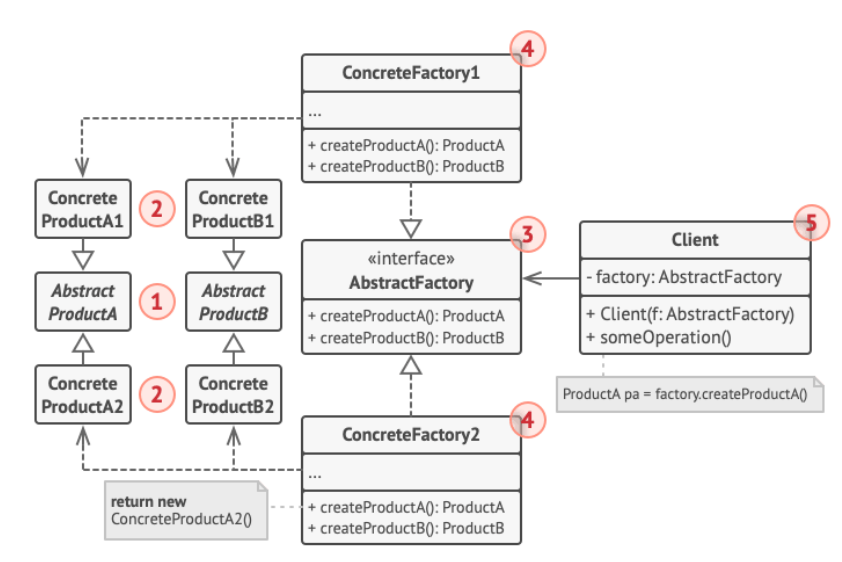

https://sourcemaking.com/design_patterns/abstract_factory/java/1

### Factory Method-Pattern

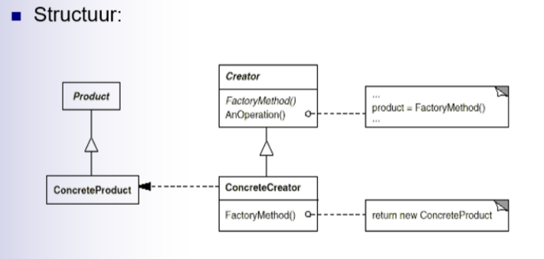

**Doel:** Een interface aanbieden om een object te creeren, zonder de concrete klasse te moeten aangeven

### Strategy-Pattern

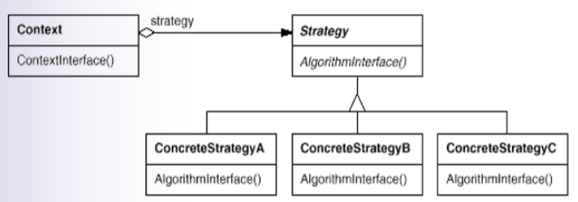

**Strategy** is behavioural design pattern that lets you define a family of algorithms, put each of them into a separate class, and make their object interchangeable

### Decorator

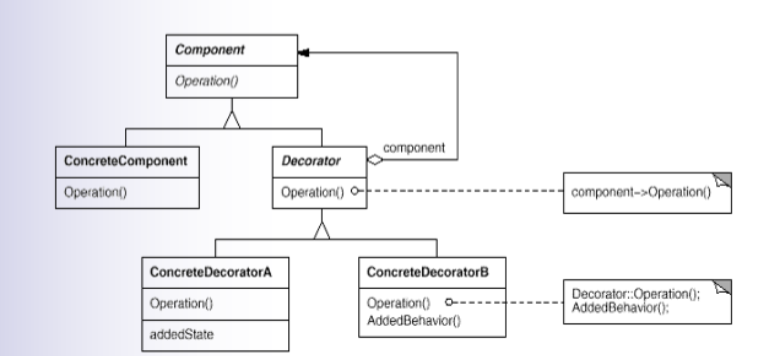

**Goal:** The ability to dynamically add responsibility to individual objects

### Command-Pattern

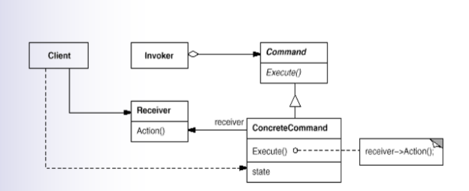

**Goal:** Make operations first-order-objects.

### Visitor-Pattern

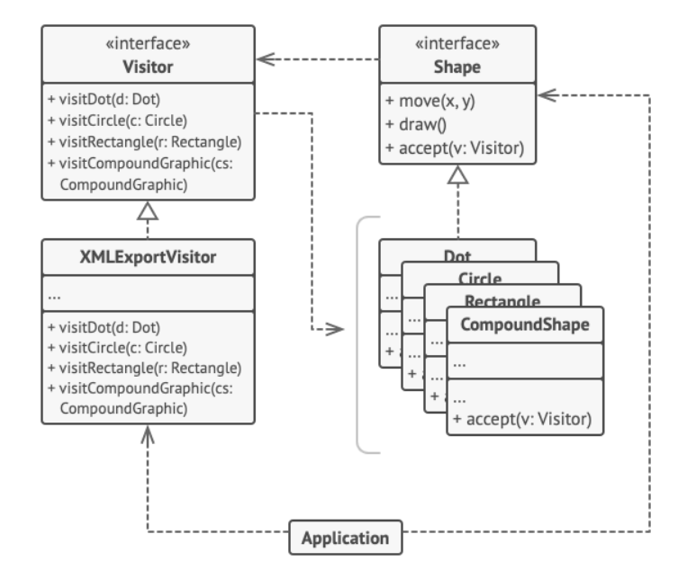

**Goal:** Define operations who have to be executed on components of the structure but not bound to this structure

### Builder-Pattern

**Goal:** Remove the building process of complex objects from its representation to be able to reuse it for other representations

### Prototype-Pattern

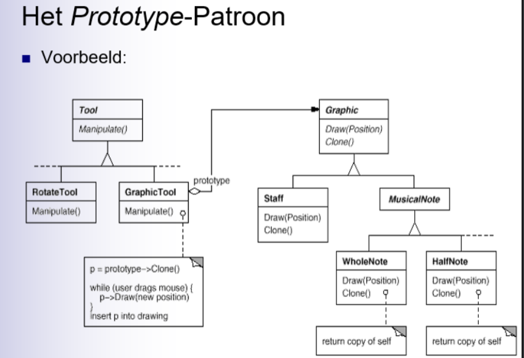

**Goal:** Create objects by cloning prototypes

### Singleton-Pattern

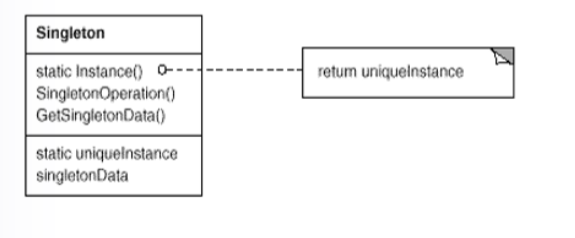

**Goal:** Guarantee that there is only one instance of a certain class

### Chain of responsibility-Pattern

**Goal:** The chain of responsibility, we use when we want to pass a message through several "handlers" who will each to a different kind of check on it, this can be security, encryption, etc... These handlers can also choose not to pass the message on should it not be necessary. All these handlers inherit from the same interface so they all have the same structure.

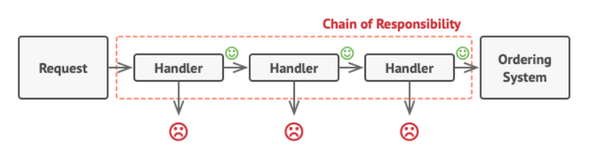

### Mediator-Patroon

**Goal:** Avoid high coupling between a group of objects who closely work together by adding a mediator object.

### Memento-Pattern

**Goal:** Save the state of an object in a point in time so that object can restored to that state.

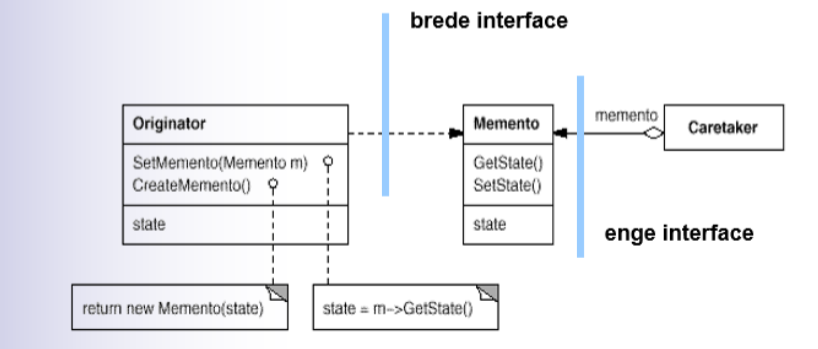

### State-Pattern

**Goal:** modelling state dependent behaviour

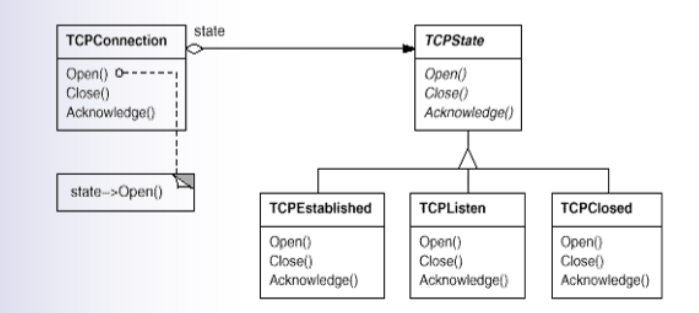

## Powerpoint Stuff

### Pattern: Domain Layer-Presentation Layer

Domeinlaag is verantwoordelijk voor zijn eigen consistency, we moeten de presentatielaag zoveel mogelijk afschermen van de interne details van de domainlaag. Domeinkennis moet ook zoveel mogelijk in de domeinlaag blijven.

De presentatielaag vertaal de ui-input die je krijgt tijdens het runnen van het programma en geeft de gebeurtenis door aan de domeinlaag in de vorm van een functie die deze oproept.

### UML

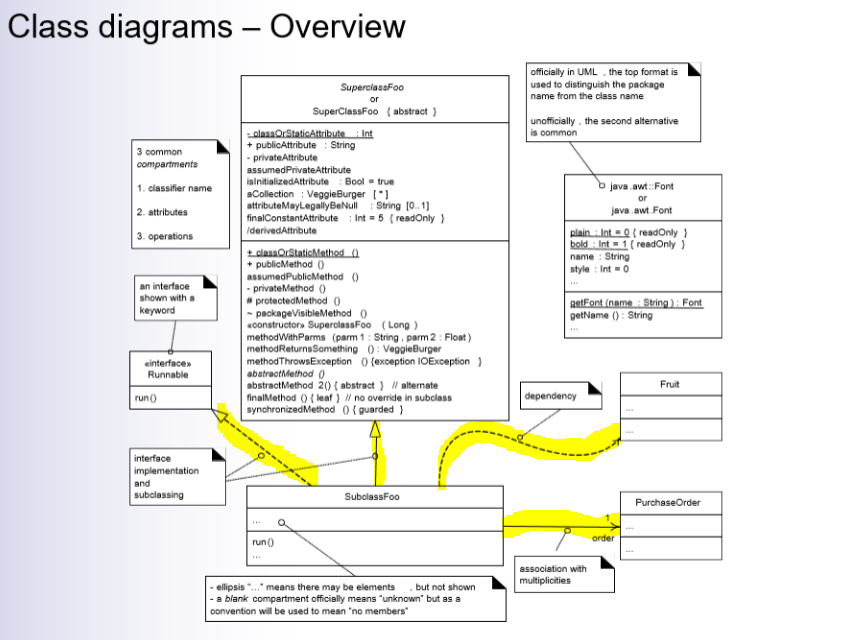

### Question

There is a big difference between a domainmodel and a classdiagram (designmodel). 

**The domain model:** class boxes represent problem domain concepts. Does not have methods nor arrows on the lines.

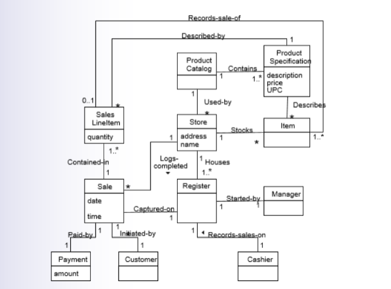

**The design model:** Class diagram show methods and visibility (arrowhead on association).

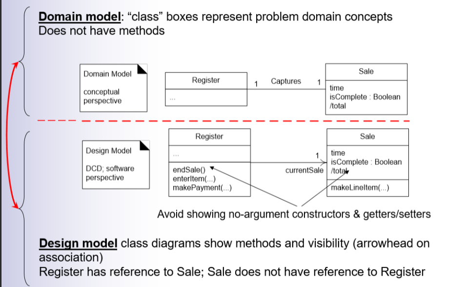

### Generalization/Inheritance

**UML notation**

- Generalization
  - Solid line with open arrow

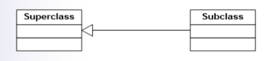

to indicate abstract, use italics

### Dependency relations

**Dependency**

- When a client has knowledge of a provider
- Changes in provider affect client
- Client and provider are "coupled"

-> **NOT** a good thing, leads to brittle design.

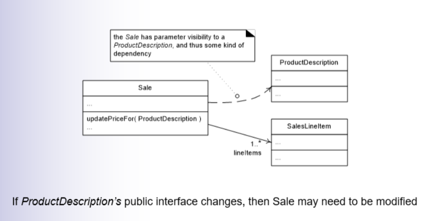

### Composition Associations

Composition means: a part instance (Square) can only be part of one composite (Board) at a time

Composition indicates an existential dependency

### Association Classes

Association class simplifies many-to-many multiplicity

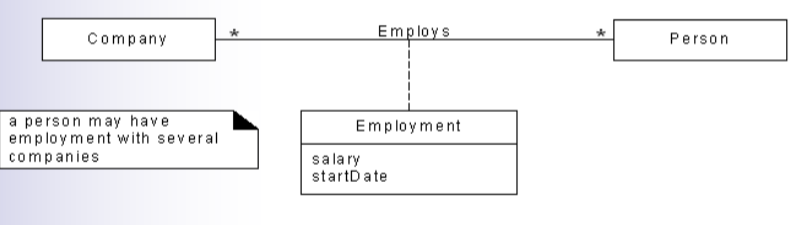

### Relationship between class & sequence diagrams

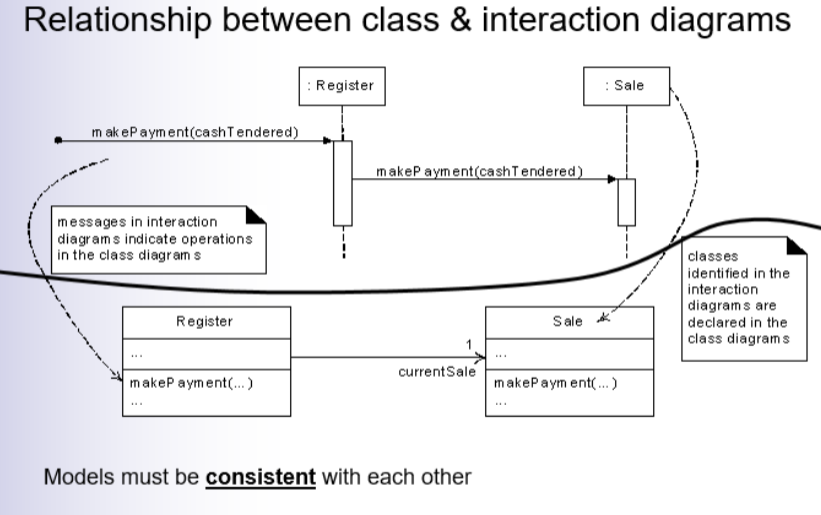

**MODELS MUST BE CONSISTENT WITH EACH OTHER**

### Types of requirements

Categorisatie volgens FURPS+ model

- Functional
- Usability
- Reliability
- Performance
- Supportability
- \+ (implementation e.g. progamming language, interface,...)

### Use cases

Use cases zijn geschreven verhalen over het gebruik van het systeem om een bepaald doel te verwezenlijken. 

**Black box aanpak:** Interne werking van het systeem niet beschrijven, systeem heeft verantwoordelijkheden.

Use case scenario is een specifieke opeenvolging van acties tussen actoren en het systeem.

**Actor**

- Altijd extern aan het systeem
- Bijna altijd een initiator voor een use case

### Classificatie volgens doel (Patterns)

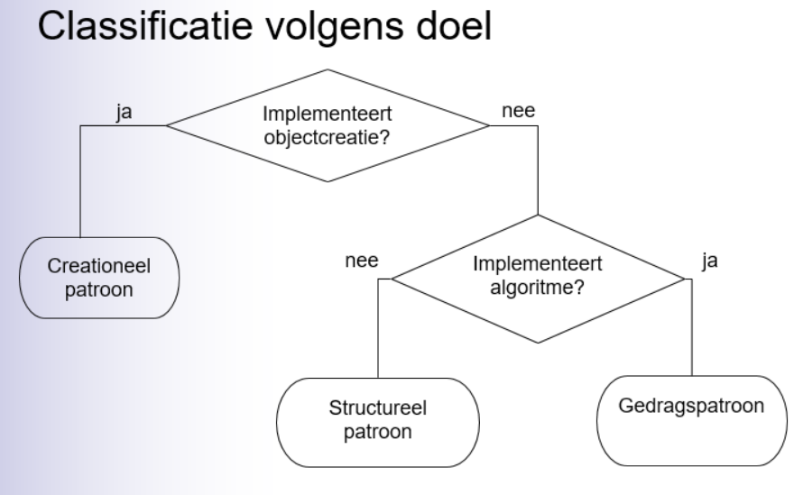